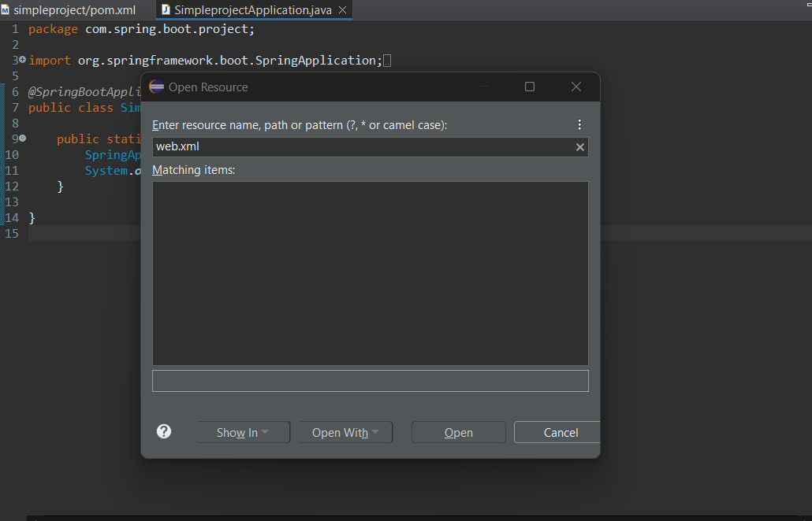
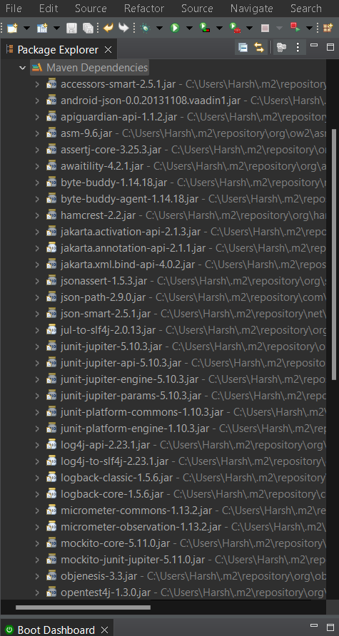
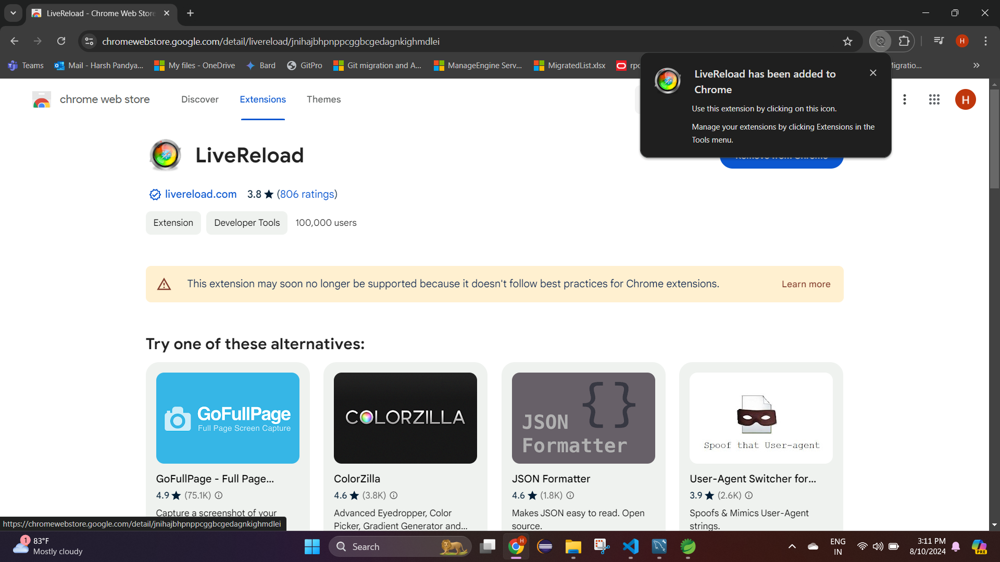

# About SpringBoot
- [Pre-requisite is Spring](https://github.com/codophilic/LearnSpring)
- Spring Framework is powerful, but it can be complex and requires a lot of boilerplate code and configuration to set up a project. Spring Boot was introduced to simplify this process.
- Spring Boot is built on top of the conventional spring framework. So, it provides all the features of spring and is easier to use than spring.
- Lets see what SprintBoot can do which Spring can't

1. Tedious Configuration
   - **Spring**: Requires extensive XML or Java-based configuration.

```
Downloading dependencies
<dependency>
    <groupId>org.springframework</groupId>
    <artifactId>spring-context</artifactId>
    <version>5.3.9</version>
</dependency>
<!-- Other dependencies like Spring MVC, AOP, etc. -->

Configuring web.xml
<web-app>
    <servlet>
        <servlet-name>dispatcher</servlet-name>
        <servlet-class>org.springframework.web.servlet.DispatcherServlet</servlet-class>
        <init-param>
            <param-name>contextConfigLocation</param-name>
            <param-value>/WEB-INF/spring/dispatcher-config.xml</param-value>
        </init-param>
        <load-on-startup>1</load-on-startup>
    </servlet>
    <servlet-mapping>
        <servlet-name>dispatcher</servlet-name>
        <url-pattern>/</url-pattern>
    </servlet-mapping>
</web-app>

Setting up dispatcher configuration (in case of MVC)
<beans xmlns="http://www.springframework.org/schema/beans"
       xmlns:xsi="http://www.w3.org/2001/XMLSchema-instance"
       xsi:schemaLocation="http://www.springframework.org/schema/beans
                           http://www.springframework.org/schema/beans/spring-beans.xsd">
    <bean class="org.springframework.web.servlet.view.InternalResourceViewResolver">
        <property name="prefix" value="/WEB-INF/views/" />
        <property name="suffix" value=".jsp" />
    </bean>
    <!-- More beans and configurations -->
</beans>
```

   - **Spring Boot**: Uses auto-configuration to set up defaults automatically.

```
Downloading the dependencies
<dependency>
    <groupId>org.springframework.boot</groupId>
    <artifactId>spring-boot-starter-web</artifactId>
</dependency>

Get started with logic
@SpringBootApplication
public class MyApplication {
    public static void main(String[] args) {
        SpringApplication.run(MyApplication.class, args);
    }
}
```


2. External Server
  - **Spring:** In spring you when we are building a web application, we require a server and on the server you will run a **war** file. So you need to configure the server like tomcat then you need to deploy your war file on it.
  - **SpringBoot:** In springboot you create a **jar** file , but jar file cannot be run on server, so springboot provides and embedded server apache tomcat. So you don't need to configure server configuration it is already handle by springboot.

3. Database configurations
  - **Spring:** In spring you need to perform manually do database configurations like transaction manager and providing details of database

```
Downloading dependencies
<dependency>
    <groupId>org.springframework.data</groupId>
    <artifactId>spring-data-jpa</artifactId>
    <version>2.5.5</version>
</dependency>
<dependency>
    <groupId>org.hibernate</groupId>
    <artifactId>hibernate-core</artifactId>
    <version>5.4.32.Final</version>
</dependency>
<dependency>
    <groupId>com.h2database</groupId>
    <artifactId>h2</artifactId>
    <version>1.4.200</version>
</dependency>

Database Configuration
@Configuration
@EnableJpaRepositories(basePackages = "com.example.repository")
@EnableTransactionManagement
public class PersistenceConfig {
    @Bean
    public LocalContainerEntityManagerFactoryBean entityManagerFactory() {
        LocalContainerEntityManagerFactoryBean emf = new LocalContainerEntityManagerFactoryBean();
        emf.setDataSource(dataSource());
        emf.setPackagesToScan("com.example.entity");
        JpaVendorAdapter vendorAdapter = new HibernateJpaVendorAdapter();
        emf.setJpaVendorAdapter(vendorAdapter);
        return emf;
    }

    @Bean
    public DataSource dataSource() {
        DriverManagerDataSource dataSource = new DriverManagerDataSource();
        dataSource.setDriverClassName("org.h2.Driver");
        dataSource.setUrl("jdbc:h2:mem:testdb");
        dataSource.setUsername("sa");
        dataSource.setPassword("");
        return dataSource;
    }

    @Bean
    public PlatformTransactionManager transactionManager(EntityManagerFactory emf) {
        JpaTransactionManager transactionManager = new JpaTransactionManager();
        transactionManager.setEntityManagerFactory(emf);
        return transactionManager;
    }
}
```

  - **SpringBoot:** In spring boot just define application properties with db details and download the dependencies.

```
Downloading dependencies
<dependency>
    <groupId>org.springframework.boot</groupId>
    <artifactId>spring-boot-starter-data-jpa</artifactId>
</dependency>
<dependency>
    <groupId>com.h2database</groupId>
    <artifactId>h2</artifactId>
</dependency>

Application Properties
spring.datasource.url=jdbc:h2:mem:testdb
spring.datasource.driver-class-name=org.h2.Driver
spring.datasource.username=sa
spring.datasource.password=
spring.jpa.hibernate.ddl-auto=update

Start writing logics
@SpringBootApplication
public class MyApplication {
    public static void main(String[] args) {
        SpringApplication.run(MyApplication.class, args);
    }
}
```

- Similarly we can do for logging, securities and for other types of configurations where alot of manual tedious configuration which is require when we use spring, is eliminated by springboot. 

- Lets start a simple springboot project. So to initialize any spring project you can refer to the [spring initializer site](https://start.spring.io/)


- When we unzip the project and import it we can see the following dependencies

```
		<dependency>
			<groupId>org.springframework.boot</groupId>
			<artifactId>spring-boot-starter</artifactId>
		</dependency>

		<dependency>
			<groupId>org.springframework.boot</groupId>
			<artifactId>spring-boot-starter-test</artifactId>
			<scope>test</scope>
		</dependency>
```

- We also get a main method which has `@SpringBootApplication` annotation . This annotation can be co-relate with `@Configuration`,`@AutoConfiguration` and `@ComponentScan`. Here we have added an sysout to and run our project.

```
package com.spring.boot.project;

import org.springframework.boot.SpringApplication;
import org.springframework.boot.autoconfigure.SpringBootApplication;

@SpringBootApplication
public class SimpleprojectApplication {

	public static void main(String[] args) {
		SpringApplication.run(SimpleprojectApplication.class, args);
		System.out.println("Spring Project");
	}

}


Output:
  .   ____          _            __ _ _
 /\\ / ___'_ __ _ _(_)_ __  __ _ \ \ \ \
( ( )\___ | '_ | '_| | '_ \/ _` | \ \ \ \
 \\/  ___)| |_)| | | | | || (_| |  ) ) ) )
  '  |____| .__|_| |_|_| |_\__, | / / / /
 =========|_|==============|___/=/_/_/_/

 :: Spring Boot ::                (v3.3.2)

2024-08-07T14:41:50.450+05:30  INFO 20524 --- [simpleproject] [           main] c.s.b.project.SimpleprojectApplication   : Starting SimpleprojectApplication using Java 22.0.1 with PID 20524 (C:\Users\Harsh\Desktop\LearnSpringBoot\simpleproject\simpleproject\target\classes started by Harsh in C:\Users\Harsh\Desktop\LearnSpringBoot\simpleproject\simpleproject)
2024-08-07T14:41:50.454+05:30  INFO 20524 --- [simpleproject] [           main] c.s.b.project.SimpleprojectApplication   : No active profile set, falling back to 1 default profile: "default"
2024-08-07T14:41:51.193+05:30  INFO 20524 --- [simpleproject] [           main] c.s.b.project.SimpleprojectApplication   : Started SimpleprojectApplication in 1.278 seconds (process running for 1.66)
Spring Project
```

## About SpringBootApplication Annotation
- **@SpringBootApplication** is an annotation used to mark the main class of a Spring Boot application. This is the class that will be executed to run your application.
- This single annotation encapsulates three crucial Spring annotations:
	1. **@SpringBootConfiguration**:
		- Indicates that this class can be used by Spring's Inversion of Control (IoC) container as a source of bean definitions.
		- It's similar to the **@Configuration** annotation in a regular Spring application.
	2. **@EnableAutoConfiguration**:
		- Tells Spring Boot to start adding beans based on classpath settings, other beans, and various property settings.
		- For example, if spring-webmvc is on the classpath, this annotation flags the application as a web application and activates key behaviors, like setting up a DispatcherServlet.
	3. **@ComponentScan**:
		- Tells Spring to look for other components, configurations, and services in the specified package, allowing it to find controllers, services, and other components you define.
- Instead of using three separate annotations (@Configuration, @EnableAutoConfiguration, and @ComponentScan), you can just use one.
- Reduces the amount of configuration you need to write, letting you focus on writing the application logic.

- There is no **web.xml** file and not even any spring configuration file mentioned. Spring Boot eliminates the need for traditional web.xml files or extensive Spring configuration files (applicationContext.xml, etc.). Instead, it uses a **convention over configuration** approach, where configurations defaults are automatically applied, significantly reducing the need for boilerplate code.

 

- Thats amazing right!! spring boot automatically does configuration, but if we observed maven dependencies there are unnecessary libraries added.



- So the spring-boot-starter dependencies brings this libraries and due to which whatever structure or libraries springboot provides we need to accept that , thus springboot is an opinionated framework. These starters can include many libraries that you might not specifically need, which leads to some unused or unnecessary dependencies being included in your project.

## Dependency Injection (DI) and IoC Container

- Not sure what is DI and Ioc?, learn [here](https://github.com/codophilic/LearnSpring/blob/main/Spring%20Concepts.md#dependency-injection-di-and-inversion-of-control-iocbean-container)
- Lets inject some objects like we use to do in spring. So here we create a class call coders, here we tell springboot that class coders is my bean, so to specify this we use annotation `@Component`.

```
package com.spring.boot.project;

import org.springframework.stereotype.Component;

@Component
public class Coders {

	public void code() {
		System.out.println("Coding...");
	}
}

```

- We can define dependencies in configuration files (like applicationContext.xml) or through annotations (like `@Component, @Service, @Autowired`). But these dependencies must be present in a container or Ioc (Inversion of Control Container) as it is the core of the Spring Framework. It manages the lifecycle of beans and their dependencies. So where is it?
- In Spring Boot, **SpringApplication.run()** is the method bootstraps (initialize and loading) the application, creating the **ApplicationContext (which is an IoC container)** and loading all the beans and their dependencies.
- The **SpringApplication.run()** method sets up the IoC container, automatically configuring and managing dependencies based on the classpath and configuration properties.

```
package com.spring.boot.project;

import org.springframework.boot.SpringApplication;
import org.springframework.boot.autoconfigure.SpringBootApplication;
import org.springframework.context.ApplicationContext;

@SpringBootApplication
public class SimpleprojectApplication {

	public static void main(String[] args) {
		
		//IOC Container
		ApplicationContext context=SpringApplication.run(SimpleprojectApplication.class, args);
		//Get bean
		Coders coders=context.getBean(Coders.class);
		coders.code();
	}

}

Output:
Coding...
```

## Disadvantage of SpringBoot
- Spring Boot is an opinionated framework. It suggests specific ways to structure your application, handle dependencies, and configure settings. This means you don't have to make as many decisions, and you can get started quickly. However, it also means you might have less flexibility to customize things exactly as you want.
- The auto-configuration can sometimes hide complexities, making it harder to understand what’s happening behind the scenes. This can be problematic when troubleshooting or needing custom configurations.
- The embedded servers and additional layers can increase the memory footprint and disk usage compared to a traditional Spring application that might use a lighter server or more fine-tuned configurations.
- Spring Boot's starter dependencies bundle multiple libraries together, which might include some you don't need, leading to larger application sizes and potentially unused dependencies. Whenever we add dependencies , spring boot download that require dependencies along with interrelated dependencies.
- The embedded server and bundled dependencies might increase memory consumption.
- If your application requires highly customized configurations that deviate significantly from the defaults provided by Spring Boot, achieving this can sometimes be more complex than with a traditional Spring setup.

- While Spring Boot is designed to streamline development and reduce boilerplate, it’s important to consider these potential disadvantages in the context of your specific project requirements. In scenarios where fine-grained control, resource optimization, or legacy compatibility are critical, traditional Spring might offer advantages despite the additional setup complexity.

- Continuing the above example of coders, lets add some dependencies on coders by creating a bug class and **Autowiring** it.

```
package com.spring.boot.project;

import org.springframework.stereotype.Component;

@Component
public class Bugs {

	public void fixBugs() {
		System.out.println("404 Bugs found");
	}
}
```

- So we have updated class of coders and here we are using field injection

```
package com.spring.boot.project;

import org.springframework.beans.factory.annotation.Autowired;
import org.springframework.stereotype.*;

@Component
public class Coders {

	//Instance variable
	@Autowired
	private Bugs bugs; // field injection
	
	public Bugs getBugs() {
		return bugs;
	}

	public void setBugs(Bugs bugs) {
		this.bugs = bugs;
	}

	public void code() {
		System.out.println("Coding...");
	}
}
```

- Post execution of main method, we get the output

```
package com.spring.boot.project;

import org.springframework.boot.SpringApplication;
import org.springframework.boot.autoconfigure.SpringBootApplication;
import org.springframework.context.ApplicationContext;

@SpringBootApplication
public class SimpleprojectApplication {

	public static void main(String[] args) {
		
		//IOC Container
		ApplicationContext context=SpringApplication.run(SimpleprojectApplication.class, args);
		//Get bean
		Coders coders=context.getBean(Coders.class);
		coders.code();
		coders.getBugs().fixBugs();
	}

}

Output:
Coding...
404 Bugs found
```

- Lets define a Error class

```
package com.spring.boot.project;

import org.springframework.stereotype.Component;

@Component
public class Error {

	public void showError() {
		System.out.println("404 Errors found");
	}
}
```

- Lets create an setter injection in Coder class

```
package com.spring.boot.project;

import org.springframework.beans.factory.annotation.Autowired;
import org.springframework.stereotype.*;

@Component
public class Coders {

	//Instance variable
	@Autowired
	private Bugs bugs; // field injection
	
	private Error error;
		
	public Bugs getBugs() {
		return bugs;
	}

	public Error getError() {
		return error;
	}

	/**
	 * Setters Injection
	 */
	@Autowired
	public void setError(Error error) {
		this.error = error;
	}

	public void setBugs(Bugs bugs) {
		this.bugs = bugs;
	}

	public void code() {
		System.out.println("Coding...");
	}
	
}
```

- Post execution of main method

```
package com.spring.boot.project;

import org.springframework.boot.SpringApplication;
import org.springframework.boot.autoconfigure.SpringBootApplication;
import org.springframework.context.ApplicationContext;

@SpringBootApplication
public class SimpleprojectApplication {

	public static void main(String[] args) {
		
		//IOC Container
		ApplicationContext context=SpringApplication.run(SimpleprojectApplication.class, args);
		//Get bean
		Coders coders=context.getBean(Coders.class);
		coders.code();
		coders.getBugs().fixBugs();
		coders.getError().showError();
	}

}

Output:
Coding...
404 Bugs found
404 Errors found
```

- Lets do constructor injection, we will create a class of lines

```
package com.spring.boot.project;

import org.springframework.stereotype.Component;

@Component
public class Lines {

	public void linesOfCodes() {
		System.out.println("1000 lines of codes written, still got error and bugs");
	}
}
```

- Lets update the coders class

```
package com.spring.boot.project;

import org.springframework.beans.factory.annotation.Autowired;
import org.springframework.stereotype.*;

@Component
public class Coders {

	//Instance variable
	@Autowired
	private Bugs bugs; // field injection
	
	private Error error;
	
	private Lines lines;
	
	public Bugs getBugs() {
		return bugs;
	}

	public Error getError() {
		return error;
	}

	/**
	 * Setters Injection
	 */
	@Autowired
	public void setError(Error error) {
		this.error = error;
	}

	public void setBugs(Bugs bugs) {
		this.bugs = bugs;
	}

	public void code() {
		System.out.println("Coding...");
		lines.linesOfCodes(); // Utilizing the method via constructor injection
	}
	
	/**
	 * Constructor Injection
	 */
	@Autowired
	public Coders(Lines lines) {
		this.lines=lines;
	}
	
}
```

- Post execution of main controller

```
package com.spring.boot.project;

import org.springframework.boot.SpringApplication;
import org.springframework.boot.autoconfigure.SpringBootApplication;
import org.springframework.context.ApplicationContext;

@SpringBootApplication
public class SimpleprojectApplication {

	public static void main(String[] args) {
		
		//IOC Container
		ApplicationContext context=SpringApplication.run(SimpleprojectApplication.class, args);
		//Get bean
		Coders coders=context.getBean(Coders.class);
		coders.code();
		coders.getBugs().fixBugs();
		coders.getError().showError();
	}

}

Output:
Coding...
1000 lines of codes written, still got error and bugs
404 Bugs found
404 Errors found
```
## About SpringBoot Devtools

- Whenever you do changes in your springboot application, you need to stop your stop/start your server and reload your browser to see the changes.
- What if there is an automatically restart option available in spring boot which also has LiveReload server option which automatically refresh your browser when files are changed.
- We can use **DevTools** . To use it we need to add dependencies

```
<dependency>
    <groupId>org.springframework.boot</groupId>
    <artifactId>spring-boot-devtools</artifactId>
    <optional>true</optional>
</dependency>
```

- Lets see an example of how devtools automatically restarts the server and reloads the browser, so we create a simple controller method just for demonstration

```
package com.spring.boot.project;

import org.springframework.stereotype.Controller;
import org.springframework.web.bind.annotation.RequestMapping;
import org.springframework.web.bind.annotation.RequestMethod;
import org.springframework.web.bind.annotation.ResponseBody;

@Controller
public class SampleController {

	@RequestMapping(path="/testpage", method=RequestMethod.GET)
	@ResponseBody
	public String requestMethodName() {
		
		return "this is static content";
	}
	
}
```

- Now in VSCode we use to add plugin of LiveServer, so here in springboot to automatically refresh our browser we need to add a [chrome browser extension](https://chromewebstore.google.com/).



- Post running as spring boot app, we can see output

<video controls src="Images/springbootConcepts/20240810-0942-58.3397778.mp4" title="Title"></video>

- If you see , first we need to enable liveReload chrome extension, post that any change the browser automatically gets reloaded.


### What Does DevTools Do?
- **Automatic Restart**: DevTools automatically restarts your Spring Boot application whenever it detects changes in your classpath files. This reduces the need to manually restart your application every time you make a change.
- **LiveReload Integration**: It integrates with LiveReload to automatically refresh your browser when files are changed. This is useful for front-end development.
- **Custom Property Defaults**: DevTools also allows you to override certain properties specifically for development. For example, you might want to use an in-memory database during development but switch to a production database in a live environment.

```
spring.profiles.active=dev
spring.datasource.url=jdbc:h2:mem:testdb
spring.jpa.show-sql=true
```

- **Automatic Disabling of Caching**: During development, you often need to see changes in templates, static resources, or queries immediately. DevTools automatically disables caching for these resources, so you don’t have to clear caches manually.
- **Remote Debugging**: DevTools allows you to enable remote debugging, which lets you restart the application in a remote environment (like a testing server) and have the same development experience as on your local machine.

- Spring Boot DevTools provides several other features.

- Above learnings are implemented [here](https://github.com/codophilic/LearnSpringBoot/tree/main/simpleproject/simpleproject/src/main/java/com/spring/boot/project).
- All the basic concepts of [spring](https://github.com/codophilic/LearnSpring/blob/main/Spring%20Concepts.md#about-spring) is applicable for springboot.
- Lets learn how to [JPA and SpringBoot](https://github.com/codophilic/LearnSpringBoot/blob/main/SpringBoot%20JPA.md#about-springboot-jpa)
- In the above learnings we will be using STS (Spring Tool Suit). STS (Spring Tool Suite) is essentially a preconfigured version of Eclipse specifically tailored for Spring development. STS comes with all the necessary plugins and configurations for Spring development out-of-the-box, saving you time and effort. STS provides advanced features like Spring Boot support, Spring Data JPA support, Spring MVC support, and more, offering a seamless development experience. STS includes templates and wizards to quickly create Spring projects, accelerating development. STS often provides integration with cloud platforms like Cloud Foundry, simplifying deployment.
- This [version of STS is used](https://cdn.spring.io/spring-tools/release/STS4/4.24.0.RELEASE/dist/e4.32/spring-tool-suite-4-4.24.0.RELEASE-e4.32.0-win32.win32.x86_64.self-extracting.jar)


