# About SpringBoot JPA
- Learn about [JPA](https://github.com/codophilic/Learn-Hibernate-ORM/blob/main/Theory.md#jpa-java-persistence-api)
- Lets create a SpringBoot JPA project

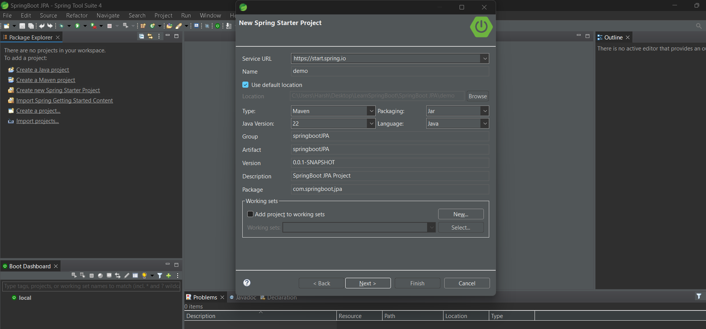 

- Add dependencies JPA and MySQL driver (here we are using MySQL database)

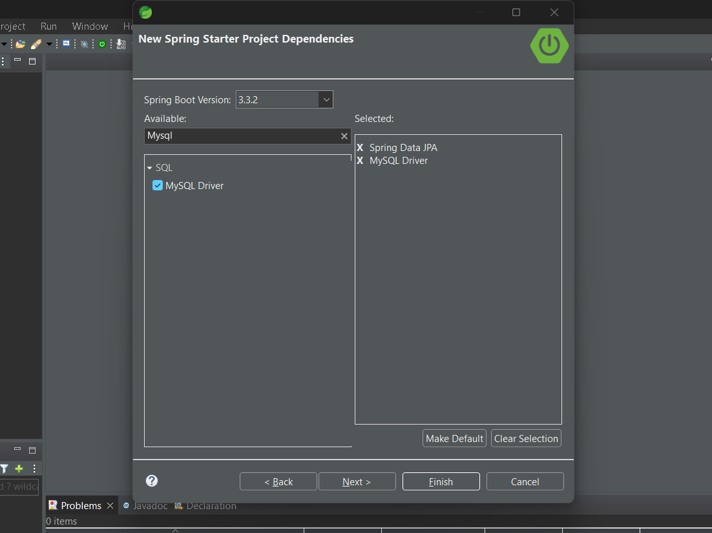

```
		<dependency>
			<groupId>org.springframework.boot</groupId>
			<artifactId>spring-boot-starter-data-jpa</artifactId>
		</dependency>

		<dependency>
			<groupId>com.mysql</groupId>
			<artifactId>mysql-connector-j</artifactId>
			<scope>runtime</scope>
		</dependency>
```

- If you see , JPA is a specification which is implemented by hibernate, when we download `spring-boot-starter-data-jpa` , hibernate libraries are also provided by SpringBoot.

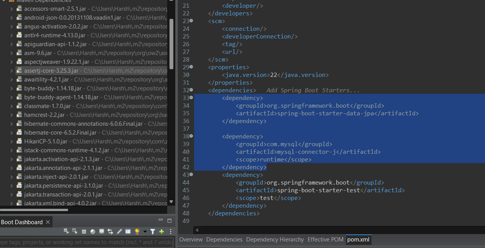

- Lets say we have a customer entity which has id, name and address as its value

```
package com.springboot.jpa.entities;

import jakarta.persistence.*;

@Entity
public class Customer {

	@Id
	@Column(name = "cust_id")
	@GeneratedValue(strategy = GenerationType.AUTO)
	private int id;
	
	@Column(name = "cust_name")
	private String name;
	
	@Column(name = "cust_address")
	private String custAddress;

	public int getId() {
		return id;
	}

	public void setId(int id) {
		this.id = id;
	}

	public String getName() {
		return name;
	}

	public void setName(String name) {
		this.name = name;
	}

	public String getCustAddress() {
		return custAddress;
	}

	public void setCustAddress(String custAddress) {
		this.custAddress = custAddress;
	}

	@Override
	public String toString() {
		return "Customer [id=" + id + ", name=" + name + ", custAddress=" + custAddress + "]";
	}
	
	
}
```

- Lets us set up a DAO Interface which will have CRUD operations with the Customer.

```
package com.springboot.jpa.entities;

import org.springframework.data.repository.CrudRepository;

public interface CustomerDaoInterface extends CrudRepository<Customer, Integer>{

	
}
```

- Hey wait, where is the CRUD operations written for the customer class? this is all hanld by **CrudRepository** interface.
- In Spring Boot, **CrudRepository** is an interface provided by SpringBoot Data JPA that simplifies the implementation of data access layers. It offers generic CRUD (Create, Read, Update, Delete) operations on a repository for a specific entity type, reducing boilerplate code and making data access easier. It integrates seamlessly with Spring Boot, making it easier to work with Spring's features like dependency injection, transactions, and more.
- **CrudRepository** is a generic interface that takes two parameters
    - The entity type the repository will manage (Customer).
    - The type of the entity’s identifier (primary key) (Integer - Wrapper Class).
- It provides several methods to perform basic CRUD operations

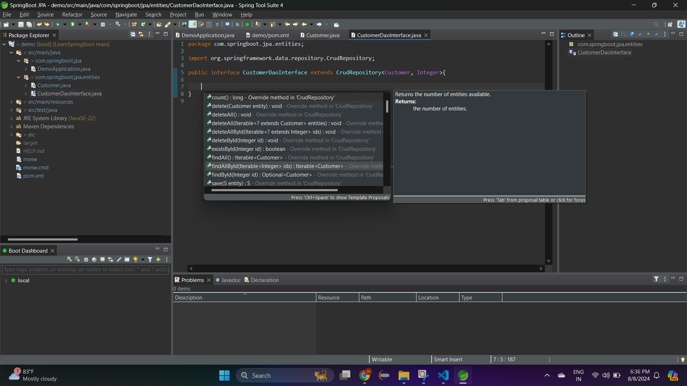 

- Apart from CRUD operations, SpringBoot Data JPA allows you to define custom query methods by simply declaring them in the repository interface. Spring will generate the query based on the method name.

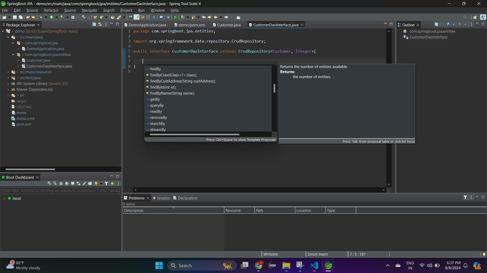 

- **CrudRepository** should be implemented by an interface only. The whole idea is to provide a mechanism to perform CRUD operations without writing boilerplate code. SpringBoot Data JPA will automatically create a concrete class for your repository interface at runtime, so you don’t need to manually implement any methods.

- Now we need to provide DB details to SpringBoot , should we need to create any xml file? absolutely not , spring boot provides **application.properties**.

## What is application.properties?

- In a Spring Boot application, **application.properties** is a file used to configure various settings for your application. It is typically located in the `src/main/resources` directory. This file allows you to set key-value pairs that configure different aspects of your application, such as database settings, server ports, logging levels, customize any configuration and more.
- Spring Boot automatically loads and reads the **application.properties** file at startup. It uses the properties defined in this file to configure various parts of the application. The framework has built-in mechanisms to look for this file in the `src/main/resources` directory or on the classpath.
- Discover all the properties [here](https://docs.spring.io/spring-boot/appendix/application-properties/index.html)
- **application.properties** is a central place for configuring your Spring Boot application. Spring Boot automatically reads this file at startup and uses the properties defined within it to configure various components of your application. The flexibility and simplicity of application.properties make it a powerful tool for managing your application's configuration.


- For SpringBoot JPA we need to specify db details in application.properties.

```
spring.application.name=demo
spring.datasource.url=jdbc:mysql://localhost:3306/springbootjpa
spring.datasource.username=root
spring.datasource.password=Meetpandya40@
spring.datasource.driver-class-name=com.mysql.cj.jdbc.Driver
spring.jpa.database-platform = org.hibernate.dialect.MySQL8Dialect
spring.jpa.generate-ddl=true
spring.jpa.hibernate.ddl-auto = create
```

- If you see STS provides suggestion while performing configuration in application.properties

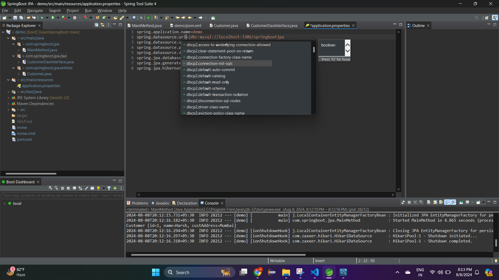

- Now lets perform some CRUD operations using Springboot and JPA. Lets create and fetch users. Below is the MainMethod

```
package com.springboot.jpa;

import java.util.List;
import java.util.Optional;

import org.springframework.boot.SpringApplication;
import org.springframework.boot.autoconfigure.SpringBootApplication;
import org.springframework.context.ApplicationContext;

import com.springboot.jpa.dao.CustomerDaoInterface;
import com.springboot.jpa.entities.Customer;

@SpringBootApplication
public class MainMethod {

	public static void main(String[] args) {
		ApplicationContext context= SpringApplication.run(MainMethod.class, args);
		
		/**
		 * SpringBoot JPA automatically configures bean into IOC container
		 */
		CustomerDaoInterface cdi=context.getBean(CustomerDaoInterface.class);
		
		Customer c=new Customer();
		c.setName("Harsh");
		c.setCustAddress("Mumbai");
		
		/**
		 * Saving a single entity
		 */
		Customer cresult=cdi.save(c);
		System.out.println("Customer details saved: "+cresult.toString());

		Customer c1=new Customer();
		c1.setName("Meet");
		c1.setCustAddress("Delhi");
		
		Customer c2=new Customer();
		c2.setName("Jeet");
		c2.setCustAddress("MP");
		
		/**
		 * Saving multiple entities
		 */
		Iterable<Customer> allCustomers=cdi.saveAll(List.of(c1,c2));
		
		allCustomers.forEach(allcust->{
			System.out.println("Customer details saved: "+allcust.toString());
		});
		
		/**
		 * Fetch by ID
		 */
		Optional<Customer> opt=cdi.findById(3);
		System.out.println("Fetch Customer Details by ID: "+opt.get());
		
		// If ID not found then it returns null
		opt=cdi.findById(4);
		if(!opt.isPresent()) {
			System.out.println("Fetch Customer Details not found for ID 4");
		}
		
		/**
		 * Fetch all user
		 */
		allCustomers=cdi.findAll();
		System.out.println("All Customer Details");
		allCustomers.forEach(allcust->{
			System.out.println(allcust.toString());
		});

	}

}

Output:
Customer details saved: Customer [id=1, name=Harsh, custAddress=Mumbai]
Customer details saved: Customer [id=2, name=Meet, custAddress=Delhi]
Customer details saved: Customer [id=3, name=Jeet, custAddress=MP]
Fetch Customer Details by ID: Customer [id=3, name=Jeet, custAddress=MP]
Fetch Customer Details not found for ID 4
All Customer Details
Customer [id=1, name=Harsh, custAddress=Mumbai]
Customer [id=2, name=Meet, custAddress=Delhi]
Customer [id=3, name=Jeet, custAddress=MP]
```

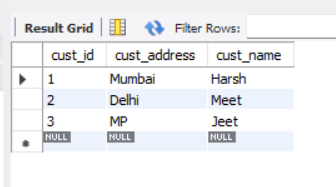

- Lets fetch customer details by address, should we need to write any custom query? nope , jpa provides those methods you only need to add in your interface.

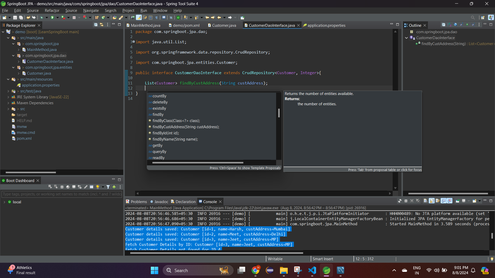 

- Below is the main method

```
package com.springboot.jpa;

import java.util.List;
import java.util.Optional;

import org.springframework.boot.SpringApplication;
import org.springframework.boot.autoconfigure.SpringBootApplication;
import org.springframework.context.ApplicationContext;

import com.springboot.jpa.dao.CustomerDaoInterface;
import com.springboot.jpa.entities.Customer;

@SpringBootApplication
public class MainMethod {

	public static void main(String[] args) {
		ApplicationContext context= SpringApplication.run(MainMethod.class, args);
		
		/**
		 * SpringBoot JPA automatically configures bean into IOC container
		 */
		CustomerDaoInterface cdi=context.getBean(CustomerDaoInterface.class);

		/**
		 * Fetch by address
		 * Here springboot jpa provides a customized inbuild method
		 */
		List<Customer> allCustDetailsForMumbai=cdi.findByCustAddress("Mumbai");
		allCustDetailsForMumbai.forEach(i->{
			System.out.println(i.toString());
		});

	}

}

Output:
Customer [id=1, name=Harsh, custAddress=Mumbai]
```

- Lets check update and delete operations, below is the main method

```
package com.springboot.jpa;

import java.util.List;
import java.util.Optional;

import org.springframework.boot.SpringApplication;
import org.springframework.boot.autoconfigure.SpringBootApplication;
import org.springframework.context.ApplicationContext;

import com.springboot.jpa.dao.CustomerDaoInterface;
import com.springboot.jpa.entities.Customer;

@SpringBootApplication
public class MainMethod {

	public static void main(String[] args) {
		ApplicationContext context= SpringApplication.run(MainMethod.class, args);
		
		/**
		 * SpringBoot JPA automatically configures bean into IOC container
		 */
		CustomerDaoInterface cdi=context.getBean(CustomerDaoInterface.class);
		
		/**
		 * Update Customer details using Id
		 */
		Optional<Customer >opt=cdi.findById(3);
		Customer c3=opt.get();
		c3.setName("Donga");
		cdi.save(c3);
		System.out.println("Updated user details: "+cdi.findById(3).get());
		
		/**
		 * Delete user by ID
		 */
		cdi.deleteById(3);
		System.out.println("Deleted user of ID 3:"+cdi.findById(3).isPresent());
		
		/**
		 * Delete All Users
		 */
		cdi.deleteAll();
		

	}

}

Output:
Updated user details: Customer [id=3, name=Donga, custAddress=MP]
Deleted user of ID 3:false
```

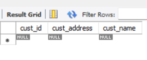

- Thus **CrudRepository** is an interface that provides a set of methods for performing basic CRUD operations on an entity, and it should be used by creating an interface that extends it. SpringBoot handles the implementation details, allowing you to work with data in a simple and efficient way.

- Lets say you want to perform custom queries, there are two ways you can achieve this.

1. Using Derived Query Methods (Method Query Creation)
    -  You define query methods by following a naming convention in your repository interface. When you start typing a method name with find, read, query, or similar keywords, your IDE (like STS) will suggest possible methods based on the entity's attributes.
    - Spring Data JPA automatically interprets the method names and generates the appropriate query behind the scenes.
    - You don't need to write any SQL or JPQL which is used in `@Query` annotation; the query is derived from the method name itself.
    - Here is the reference for other types of [derived queries](https://docs.spring.io/spring-data/jpa/reference/jpa/query-methods.html#jpa.query-methods.query-creation)

<video controls src="Images/springjpa/DerivedCustomQuery.mp4" title="Title"></video>

```
package com.springboot.jpa;

import java.util.List;
import java.util.Optional;

import org.springframework.boot.SpringApplication;
import org.springframework.boot.autoconfigure.SpringBootApplication;
import org.springframework.context.ApplicationContext;

import com.springboot.jpa.dao.CustomerDaoInterface;
import com.springboot.jpa.entities.Customer;

@SpringBootApplication
public class MainMethod {

	public static void main(String[] args) {
		ApplicationContext context= SpringApplication.run(MainMethod.class, args);
		
		/**
		 * SpringBoot JPA automatically configures bean into IOC container
		 */
		CustomerDaoInterface cdi=context.getBean(CustomerDaoInterface.class);
		
		/**
		 * Custom Query
		 */	
		Customer cust1=new Customer();
		cust1.setName("Harsh Pandya");
		cust1.setCustAddress("Mumbai");
		Customer cust2=new Customer();
		cust2.setName("Meet Pandya");
		cust2.setCustAddress("Mumbai");
		Customer cust3=new Customer();
		cust3.setName("Harsh Donga");
		cust3.setCustAddress("Mumbai");
		
		cdi.saveAll(List.of(cust1,cust2,cust3));

		List<Customer> customerfound=cdi.findByNameAndCustAddress("Harsh Pandya", "Mumbai");
		System.out.println("Finding details using method findByNameAndCustAddress()");
		customerfound.forEach(i->{
			System.out.println(i);
		});

	}

}

Output:
Customer [id=4, name=Harsh Pandya, custAddress=Mumbai]
```

2. Using `@Query` annotation
    - The `@Query` annotation in Spring Data JPA is used to define custom database queries directly within your repository interface. It allows you to write JPQL (Java Persistence Query Language, ORM based queries) or native SQL queries, giving you more flexibility to retrieve, update, or delete data that doesn't fit the typical query methods generated by method names.
    - The `@Param` annotation in Spring Data JPA binds the method parameter to the named parameter in the `@Query`. It allows you to pass input values into the query, ensuring that the method argument is correctly mapped to the query parameter.
    - Flexibility: Allows for more complex queries that can't be derived from method names.
    - Control: You have full control over the query's content and execution.
    - Custom Logic: You can incorporate database-specific features or complex joins, aggregations, etc.
    - Below is the CustomerDaoInterface and Main method details

```
package com.springboot.jpa.dao;

import java.util.List;

import org.springframework.data.jpa.repository.Query;
import org.springframework.data.repository.CrudRepository;
import org.springframework.data.repository.query.Param;

import com.springboot.jpa.entities.Customer;

public interface CustomerDaoInterface extends CrudRepository<Customer, Integer>{

	List<Customer> findByCustAddress(String custAddress);
	
	/**
	 * Find data using name as well as customer address
	 */
	List<Customer> findByNameAndCustAddress(String name, String custAddress);
	
	/**
	 * JPQL (Java Persistence Query Language, ORM based queries)
	 */
	@Query("SELECT e FROM Customer e WHERE lower(e.name) = lower(:customer_name) AND lower(e.custAddress) = lower(:customer_address)")
	List<Customer> fetchUsingLowerCaseNameAndAddress(@Param("customer_name") String firstName, @Param("customer_address") String address);

	/**
	 * Native SQL Query or original way to write SQL query
	 */
	@Query(value = "SELECT * from Customer order by cust_id limit 2,1",nativeQuery = true)
	Customer retrieveThirdCustomerOnly();
}


package com.springboot.jpa;

import java.util.List;
import java.util.Optional;

import org.springframework.boot.SpringApplication;
import org.springframework.boot.autoconfigure.SpringBootApplication;
import org.springframework.context.ApplicationContext;

import com.springboot.jpa.dao.CustomerDaoInterface;
import com.springboot.jpa.entities.Customer;

@SpringBootApplication
public class MainMethod {

	public static void main(String[] args) {
		ApplicationContext context= SpringApplication.run(MainMethod.class, args);
		
		/**
		 * SpringBoot JPA automatically configures bean into IOC container
		 */
		CustomerDaoInterface cdi=context.getBean(CustomerDaoInterface.class);
				
		/**
		 * Custom Query
		 */	
		Customer cust1=new Customer();
		cust1.setName("Harsh Pandya");
		cust1.setCustAddress("Mumbai");
		Customer cust2=new Customer();
		cust2.setName("Meet Pandya");
		cust2.setCustAddress("Mumbai");
		Customer cust3=new Customer();
		cust3.setName("Harsh Donga");
		cust3.setCustAddress("Mumbai");
		
		cdi.saveAll(List.of(cust1,cust2,cust3));
		
		/**
		 * JPQL
		 */
		List<Customer> customerfound = cdi.fetchUsingLowerCaseNameAndAddress("Harsh Pandya".toUpperCase(), "Mumbai".toUpperCase());
		System.out.println("Finding details using method fetchUsingLowerCaseNameAndAddress()");
		customerfound.forEach(i->{
			System.out.println(i);
		});

		/**
		 * Native SQL
		 */
		Customer thirdCustomer=cdi.retrieveThirdCustomerOnly();
		System.out.println("Third Customer Details: "+thirdCustomer.toString());
	}

}

Output:
Finding details using method fetchUsingLowerCaseNameAndAddress()
Customer [id=1, name=Harsh Pandya, custAddress=Mumbai]
Third Customer Details: Customer [id=3, name=Harsh Donga, custAddress=Mumbai]
```

- What if you wanna sort the data and fetch data in chunks? is it possible in CrudRepository? yes it can but you need to write native query for it . What if SpringBoot JPA provides you an interface just like CrudRepository which has paging and sorting methods?, yes we have **PagingAndSortingRepository** for it.

>[!Note]
> - In SpringBoot JPA 3.x.x version, PagingAndSortingRepository does not extends CrudRepository.
> - In earlier version of SpringBoot JPA 2.x.x version, PagingAndSortingRepository extends CrudRepository

- Lets create an entity of Employee

```
package com.springboot.jpa.entities;

import jakarta.persistence.*;

@Entity
@Table(name = "employee_data")
public class Employee {

	@Id
	@GeneratedValue(strategy = GenerationType.AUTO)
	@Column(name="emp_id")
	private int id;
	
	private String name;
	
	private double salary;

	public int getId() {
		return id;
	}

	public void setId(int id) {
		this.id = id;
	}

	public String getName() {
		return name;
	}

	public void setName(String name) {
		this.name = name;
	}

	public double getSalary() {
		return salary;
	}

	public void setSalary(double salary) {
		this.salary = salary;
	}

	@Override
	public String toString() {
		return "Employee [id=" + id + ", name=" + name + ", salary=" + salary + "]";
	}
}
```

- Lets create an DAO interface EmployeeDaoInterface and extend PagingAndSortingRepository and CrudRepository.

```
package com.springboot.jpa.dao;

import org.springframework.data.repository.CrudRepository;
import org.springframework.data.repository.PagingAndSortingRepository;

import com.springboot.jpa.entities.Employee;

public interface EmployeeDaoInterface extends PagingAndSortingRepository<Employee, Integer>,CrudRepository<Employee,Integer>{

	
}
```

- Lets say you wanna sort the data using IDs but in descending order

```
package com.springboot.jpa;

import java.util.List;
import java.util.Optional;

import org.springframework.boot.SpringApplication;
import org.springframework.boot.autoconfigure.SpringBootApplication;
import org.springframework.context.ApplicationContext;
import org.springframework.data.domain.Sort;

import com.springboot.jpa.dao.CustomerDaoInterface;
import com.springboot.jpa.dao.EmployeeDaoInterface;
import com.springboot.jpa.entities.Customer;
import com.springboot.jpa.entities.Employee;

@SpringBootApplication
public class MainMethod {

	public static void main(String[] args) {
		ApplicationContext context= SpringApplication.run(MainMethod.class, args);		
		EmployeeDaoInterface edi=context.getBean(EmployeeDaoInterface.class);
		
		/**
		 * Creating Employee details
		 */
		Employee emp1=new Employee();
		emp1.setName("Harsh");
		emp1.setSalary(1200000);
		
		Employee emp2=new Employee();
		emp2.setName("Meet");
		emp2.setSalary(2400000);
		
		/**
		 * Saving data using CrudRepository
		 */
		edi.saveAll(List.of(emp1,emp2));
		
		/**
		 * Sort data by id
		 */
		Sort sort = Sort.by("id").descending();
		Iterable<Employee> sortedEmployesbyId = edi.findAll(sort);		
		sortedEmployesbyId.forEach(i->{
			System.out.println(i.toString());
		});
	}

}

Output:
Employee [id=2, name=Meet, salary=2400000.0]
Employee [id=1, name=Harsh, salary=1200000.0]
```

<details>
<summary>
What is Pagination?
</summary>

- Lets say if you want to retrieve 5 rows out of 100 records in SQL, you can do it using query `SELECT * FROM employee_data ORDER BY emp_id LIMIT 5`

- Lets say if you want to skip first 10 records and fetch 5 records post skipping (11...15), you can do it using `SELECT * FROM employee_data ORDER BY emp_id LIMIT 5 OFFSET 10;`

- Pagination allows you to retrieve a specific "page" of data, e.g., records 5 and 10. LIMIT 5 OFFSET 10 skips the first 10 records and fetches the next 5.

- This improves performance and user experience by loading only a small subset of data at a time.

- Pagination is the process of dividing a large set of data into smaller, more manageable chunks, or "pages." This is especially useful when dealing with large databases where you don't want to load all records at once, which could slow down your application.

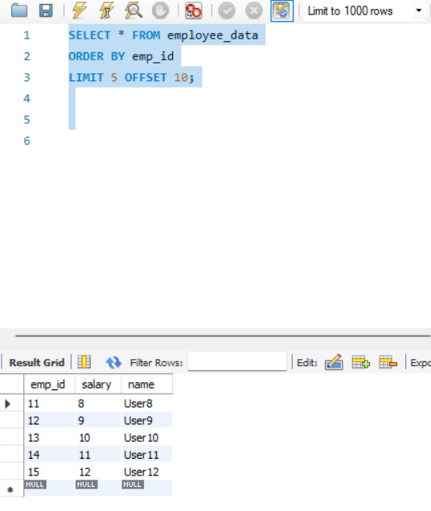

</details>

- Lets implement Paging using SpringBoot JPA, in SpringBoot JPA `PageRequest.of` takes page index number, number of data to be present in it and sorting if required.
- Example for fetching details by skipping first 10 records and fetch 5 records post skipping, it can be done if each page contains 5 records, the first 10 records would be covered by pages 0 and 1 (since 5 records per page * 2 pages = 10 records). To start from the 11th record, you'd be on page 2 (zero-based index).
- Thus `Pageable pageable = PageRequest.of(2, 5, Sort.by("id").ascending());`

```
package com.springboot.jpa;

import java.util.List;
import java.util.Optional;

import org.springframework.boot.SpringApplication;
import org.springframework.boot.autoconfigure.SpringBootApplication;
import org.springframework.context.ApplicationContext;
import org.springframework.data.domain.Page;
import org.springframework.data.domain.PageRequest;
import org.springframework.data.domain.Pageable;
import org.springframework.data.domain.Sort;

import com.springboot.jpa.dao.CustomerDaoInterface;
import com.springboot.jpa.dao.EmployeeDaoInterface;
import com.springboot.jpa.entities.Customer;
import com.springboot.jpa.entities.Employee;

@SpringBootApplication
public class MainMethod {

	public static void main(String[] args) {
		ApplicationContext context= SpringApplication.run(MainMethod.class, args);
		
		EmployeeDaoInterface edi=context.getBean(EmployeeDaoInterface.class);
		
		/**
		 * Creating Employee details
		 */
		Employee emp1=new Employee();
		emp1.setName("Harsh");
		emp1.setSalary(1200000);
		
		Employee emp2=new Employee();
		emp2.setName("Meet");
		emp2.setSalary(2400000);
		
		/**
		 * Saving data using CrudRepository
		 */
		edi.saveAll(List.of(emp1,emp2));
		
		/**
		 * Sort data by id
		 */
		Sort sort = Sort.by("id").descending();
		Iterable<Employee> sortedEmployesbyId = edi.findAll(sort);		
		sortedEmployesbyId.forEach(i->{
			System.out.println(i.toString());
		});
		
		/**
		 * Creating 100 Records
		 */
		for(int i=0;i<101;i++) {
			Employee emp=new Employee();
			emp.setName("User"+i);
			emp.setSalary(i);
			edi.save(emp);
		}
		
		/**
		 * Implementing Pagination for 5 records skipping first 10
		 * 
		 * Set page number 2 (which consist set of 5 records starting from 11-15)
		 */
		Pageable pageable = PageRequest.of(2,5);
		Page<Employee> employeesPage = edi.findAll(pageable);

		List<Employee> employees = employeesPage.getContent();
		System.out.println("Pagination");
		employees.forEach(i->{
			System.out.println(i.toString());
		});
	}

}

Output:
Employee [id=2, name=Meet, salary=2400000.0]
Employee [id=1, name=Harsh, salary=1200000.0]
Pagination
Employee [id=11, name=User8, salary=8.0]
Employee [id=12, name=User9, salary=9.0]
Employee [id=13, name=User10, salary=10.0]
Employee [id=14, name=User11, salary=11.0]
Employee [id=15, name=User12, salary=12.0]
```

- When moving to actual project developing complex queries for multiple DAO interfaces it could be tedious to extend both the interface into your individual dao interface. What if both of this are already present into a single in-build interface? , thats **JpaRepository** interface for you.
- **JpaRepository** extends both **PagingAndSortingRepository** and **CrudRepository**, and it provides additional functionality specifically related to JPA, such as batch operations and flushing the persistence context.

- Lets create an entity of User

```
package com.springboot.jpa.entities;

import jakarta.persistence.*;

@Entity
@Table(name = "user_details")
public class User {

	@Id
	@GeneratedValue(strategy = GenerationType.AUTO)
	@Column(name = "user_id") 
	private int id;
	
	private String name;
	
	private int age;

	public int getId() {
		return id;
	}

	public void setId(int id) {
		this.id = id;
	}

	public String getName() {
		return name;
	}

	public void setName(String name) {
		this.name = name;
	}

	public int getAge() {
		return age;
	}

	public void setAge(int age) {
		this.age = age;
	}

	@Override
	public String toString() {
		return "User [id=" + id + ", name=" + name + ", age=" + age + "]";
	}
	
}
```

- Lets a DAO interface

```
package com.springboot.jpa.dao;

import org.springframework.data.jpa.repository.JpaRepository;

import com.springboot.jpa.entities.User;

public interface UserDaoInterface extends JpaRepository<User,Integer> {
	
}
```

- **Jparepository** provides two method for saving an entity, **save()** and **saveAndFlush()**, whats the difference?

<details>
<summary> What is Flush? difference between Flush and Commit </summary>

- **Flushing** means that the changes you've made in your EntityManager (like inserts, updates, or deletes) are sent to the database. However, these changes are not yet permanently saved in the database; they're just pushed to the database.

- You think of an analogy like writing a letter and putting it into an envelope. You’ve prepared everything, but you haven’t yet mailed it.

- **Committing** is the process of finalizing the transaction. When you commit a transaction, all the changes that have been flushed to the database are permanently saved (persisted) and made visible to other database connections.

- Analogy is mailing the envelope. Now the letter is on its way and cannot be taken back.

- Committing happens at the end of a transaction. If you’re in a transaction, once you commit, it confirms all the changes, and they cannot be undone. Whereas flushing can happen automatically before a query is executed, before a transaction is committed, or manually when you explicitly call `flush()`.

</details>

<br/>

- Lets create a user service layer and see and example of `save`.

```
package com.springboot.jpa.service;

import java.util.List;
import java.util.Optional;

import org.springframework.beans.factory.annotation.Autowired;
import org.springframework.jdbc.core.BeanPropertyRowMapper;
import org.springframework.jdbc.core.JdbcTemplate;
import org.springframework.stereotype.Service;

import com.springboot.jpa.dao.UserDaoInterface;
import com.springboot.jpa.entities.User;

import jakarta.persistence.*;
import jakarta.transaction.Transactional;

@Service
public class UserService {

    @Autowired
    private UserDaoInterface udi;

    @PersistenceContext
    private EntityManager entityManager;
    
	@Autowired
    private JdbcTemplate jdbcTemplate;

    @Transactional
    public void saveAndRetrieveUser() {
        User u = new User();
        u.setName("Harsh");
        u.setAge(24);

        // Save the entity
        udi.save(u);

    	String sqlQuery = "SELECT * FROM user_details WHERE user_id = ?";
    	List<User> customers = jdbcTemplate.query(sqlQuery,new Object[]{1}, new BeanPropertyRowMapper(User.class));
    	
    	if (!customers.isEmpty()) {  
    		  System.out.println("User found with id: " + customers.get(0).getId());  
    		} else {  
    		  System.out.println("User not found when used native query");  
    		}

        /* Attempt to retrieve the entity
         * When we save entity is gets save into persistance context
         * and not into database.
         */
        Optional<User> uget = udi.findById(1);
        if(uget.isPresent()) {
        	System.out.println("User Details found without using native query");
        }else {
        	System.out.println("User Details not found");
        }
        
        entityManager.flush();
    }
}
```

- Post execution of Main Method , we can see when we `save()` and then query the data directly from database, we cannot get it because save stores the data to persistance context of EntityManager.

```
Main Method
		UserService us=context.getBean(UserService.class);
		
		/**
		 * Using Save method
		 */
		us.saveAndRetrieveUser();

Output:
User not found when used native query
User Details found without using native query
```

- The data is gets save post complete execution

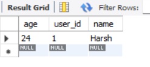 

- Lets see example of SaveAndFlush

```
package com.springboot.jpa.service;

import java.util.List;
import java.util.Optional;

import org.springframework.beans.factory.annotation.Autowired;
import org.springframework.jdbc.core.BeanPropertyRowMapper;
import org.springframework.jdbc.core.JdbcTemplate;
import org.springframework.stereotype.Service;

import com.springboot.jpa.dao.UserDaoInterface;
import com.springboot.jpa.entities.User;

import jakarta.persistence.*;
import jakarta.transaction.Transactional;

@Service
public class UserService {

    @Autowired
    private UserDaoInterface udi;

    @PersistenceContext
    private EntityManager entityManager;
    
	@Autowired
    private JdbcTemplate jdbcTemplate;

    @Transactional
    public void saveAndFlushRetrieveUser() {
        User u = new User();
        u.setName("Meet");
        u.setAge(21);

        // Save the entity
        udi.saveAndFlush(u);

    	String sqlQuery = "SELECT * FROM user_details WHERE user_id = ?";
    	List<User> customers = jdbcTemplate.query(sqlQuery,new Object[]{2}, new BeanPropertyRowMapper(User.class));
    	
    	if (!customers.isEmpty()) {  
    		  System.out.println("User found using native query, id: " + customers.get(0).getId());  
    		} else {  
    		  System.out.println("User not found when used native query");  
    		}

        /* Attempt to retrieve the entity
         * When we save entity is gets save into persistance context
         * and not into database.
         */
        Optional<User> uget = udi.findById(1);
        if(uget.isPresent()) {
        	System.out.println("User Details found without using native query");
        }else {
        	System.out.println("User Details not found");
        }
        
        entityManager.flush();
    }
}
```

- Post execution we can see

```
Main Method
		
		/**
		 * Using SaveAndFlush
		 */
		us.saveAndFlushRetrieveUser();
Output:
User found using native query, id: 0
User Details found without using native query
```	
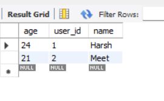

- The difference between save and saveAndFlush in JpaRepository can be understood as follows:
	- save:
		- Operation: Saves the entity to the database but doesn't necessarily flush the changes immediately. Flushing means the changes are written to the database and committed.
		- Retrieving the Value: If you try to retrieve the value immediately after save, it might not reflect the latest state in the database because the changes might not have been flushed yet.
	- saveAndFlush:
		- Operation: Saves the entity to the database and immediately flushes the changes. This means the changes are written to the database and committed right away.
		- Retrieving the Value: If you retrieve the value immediately after saveAndFlush, you'll get the most up-to-date version because the changes have been committed to the database.


- Lets us perform delete operation, lets say we need to delete all the data from the table, we have an `deleteAll()` method for it.
- Adding the below configuration in application.properties

```
spring.jpa.show-sql=true
```

- We are now creating 100 users and delete all the users using `deleteAll()`. First create a method in service layer

```
Service Layer
    public void saveAll(List<User> userList) {
    	udi.saveAll(userList);
    }
    
    public void deleteAllDetails() {
    	udi.deleteAll();
    }
```

- Post execution of main method

```
package com.springboot.jpa;

import java.util.ArrayList;
import java.util.List;
import java.util.Optional;

import org.springframework.boot.SpringApplication;
import org.springframework.boot.autoconfigure.SpringBootApplication;
import org.springframework.context.ApplicationContext;
import org.springframework.data.domain.Page;
import org.springframework.data.domain.PageRequest;
import org.springframework.data.domain.Pageable;
import org.springframework.data.domain.Sort;

import com.springboot.jpa.dao.CustomerDaoInterface;
import com.springboot.jpa.dao.EmployeeDaoInterface;
import com.springboot.jpa.entities.Customer;
import com.springboot.jpa.entities.Employee;
import com.springboot.jpa.entities.User;
import com.springboot.jpa.service.UserService;

@SpringBootApplication
public class MainMethod {

	public static void main(String[] args) {
		ApplicationContext context= SpringApplication.run(MainMethod.class, args);

		UserService us=context.getBean(UserService.class);
		
		/**
		 * Creating 100 users
		 */
		List<User> lsu=new ArrayList<>();
		for(int i=1;i<101;i++) {
			User u=new User();
			u.setAge(i+10);
			u.setName("Test-"+i);
			lsu.add(u);
		}
		
		/**
		 * Save All entities
		 */
		us.saveAll(lsu);
		
		
		/**
		 * Delete all using method deleteAll which generates
		 * multiple queries
		 */
		us.deleteAllDetails();
		
	}
}

Output:
Hibernate: insert into user_details (age,name,user_id) values (?,?,?)
Hibernate: insert into user_details (age,name,user_id) values (?,?,?)
Hibernate: insert into user_details (age,name,user_id) values (?,?,?)
Hibernate: insert into user_details (age,name,user_id) values (?,?,?)
Hibernate: insert into user_details (age,name,user_id) values (?,?,?)
Hibernate: insert into user_details (age,name,user_id) values (?,?,?)
Hibernate: insert into user_details (age,name,user_id) values (?,?,?)
Hibernate: insert into user_details (age,name,user_id) values (?,?,?)
Hibernate: insert into user_details (age,name,user_id) values (?,?,?)
Hibernate: insert into user_details (age,name,user_id) values (?,?,?)
....

Hibernate: delete from user_details where user_id=?
Hibernate: delete from user_details where user_id=?
Hibernate: delete from user_details where user_id=?
Hibernate: delete from user_details where user_id=?
Hibernate: delete from user_details where user_id=?
Hibernate: delete from user_details where user_id=?
Hibernate: delete from user_details where user_id=?
Hibernate: delete from user_details where user_id=?
Hibernate: delete from user_details where user_id=?
```

- If you see `deleteAll()` executes multiple queries, it deletes each row.

```
Service Layer
    public void saveAll(List<User> userList) {
    	udi.saveAll(userList);
    }
    
    public void deleteAllDetailsInBatch() {
    	udi.deleteAllInBatch();
    }
```

- What if, there is a method which executes a single query and delete all the data? - use `deleteAllInBatch()`
- Post execution of main method

```
package com.springboot.jpa;

import java.util.ArrayList;
import java.util.List;
import java.util.Optional;

import org.springframework.boot.SpringApplication;
import org.springframework.boot.autoconfigure.SpringBootApplication;
import org.springframework.context.ApplicationContext;
import org.springframework.data.domain.Page;
import org.springframework.data.domain.PageRequest;
import org.springframework.data.domain.Pageable;
import org.springframework.data.domain.Sort;

import com.springboot.jpa.dao.CustomerDaoInterface;
import com.springboot.jpa.dao.EmployeeDaoInterface;
import com.springboot.jpa.entities.Customer;
import com.springboot.jpa.entities.Employee;
import com.springboot.jpa.entities.User;
import com.springboot.jpa.service.UserService;

@SpringBootApplication
public class MainMethod {

	public static void main(String[] args) {
		ApplicationContext context= SpringApplication.run(MainMethod.class, args);

		UserService us=context.getBean(UserService.class);
		
		/**
		 * Creating 100 users
		 */
		List<User> lsu=new ArrayList<>();
		for(int i=1;i<101;i++) {
			User u=new User();
			u.setAge(i+10);
			u.setName("Test-"+i);
			lsu.add(u);
		}
		
		/**
		 * Save All entities
		 */
		us.saveAll(lsu);
		
		
		/**
		 * Delete All entities in batch operation
		 * this generates only 1 query and deletes all the data.
		 */
		
		us.deleteAllDetailsInBatch();

	}
}

Output:
Hibernate: insert into user_details (age,name,user_id) values (?,?,?)
Hibernate: insert into user_details (age,name,user_id) values (?,?,?)
Hibernate: insert into user_details (age,name,user_id) values (?,?,?)
Hibernate: insert into user_details (age,name,user_id) values (?,?,?)
Hibernate: insert into user_details (age,name,user_id) values (?,?,?)
Hibernate: insert into user_details (age,name,user_id) values (?,?,?)
Hibernate: insert into user_details (age,name,user_id) values (?,?,?)
...
Hibernate: delete u1_0 from user_details u1_0
```

- While **deleteAll** calls delete method iteratively, **deleteAllInBatch** method calls executeUpdate. So, if there are 100 entities to be removed, `deleteAll()` will triggers 100 SQL queries while `deleteAllInBatch()` will trigger just one. This is a very important distinction, performance wise.
- The **deleteAllInBatch** method in JpaRepository does not use a specific batch size by default. Instead, it deletes all the entities in a single batch operation directly at the database level.
- Lets say you wanted to delete all the rows who age are 90+, for that we can we still use `deleteAllInBatch()`
- First we need to create a derived query which will fetch records whos age is greater than equal to 90

```
Dao Layer
package com.springboot.jpa.dao;

import java.util.List;

import org.springframework.data.jpa.repository.JpaRepository;

import com.springboot.jpa.entities.User;

public interface UserDaoInterface extends JpaRepository<User,Integer> {
	
	List<User> findByAgeGreaterThanEqual(int agecriteria);
}


Service Layer
    public void deleteDetailsOfParticularEntities(List<User> entitiesDetails) {
    	udi.deleteAllInBatch(entitiesDetails);
    }
```

- Post execution of main method

```
package com.springboot.jpa;

import java.util.ArrayList;
import java.util.List;
import java.util.Optional;

import org.springframework.boot.SpringApplication;
import org.springframework.boot.autoconfigure.SpringBootApplication;
import org.springframework.context.ApplicationContext;
import org.springframework.data.domain.Page;
import org.springframework.data.domain.PageRequest;
import org.springframework.data.domain.Pageable;
import org.springframework.data.domain.Sort;

import com.springboot.jpa.dao.CustomerDaoInterface;
import com.springboot.jpa.dao.EmployeeDaoInterface;
import com.springboot.jpa.entities.Customer;
import com.springboot.jpa.entities.Employee;
import com.springboot.jpa.entities.User;
import com.springboot.jpa.service.UserService;

@SpringBootApplication
public class MainMethod {

	public static void main(String[] args) {
		ApplicationContext context= SpringApplication.run(MainMethod.class, args);

		UserService us=context.getBean(UserService.class);
		
		/**
		 * Creating 100 users
		 */
		List<User> lsu=new ArrayList<>();
		for(int i=1;i<101;i++) {
			User u=new User();
			u.setAge(i+10);
			u.setName("Test-"+i);
			lsu.add(u);
		}
		
		/**
		 * Save all the users
		 */
		us.saveAll(lsu);
		
		List<User> ageGreaterThanEqual90=us.fetchRecordsOFAgeGreaterThanEqual(90);
		System.out.println("List of records fetch: "+ageGreaterThanEqual90.size());
		
		/**
		 * Delete all the records whos age is greater than equal to 90
		 */
		us.deleteDetailsOfParticularEntities(ageGreaterThanEqual90);
		
	}
}


Output:
Hibernate: insert into user_details (age,name,user_id) values (?,?,?)
Hibernate: insert into user_details (age,name,user_id) values (?,?,?)
Hibernate: insert into user_details (age,name,user_id) values (?,?,?)
Hibernate: insert into user_details (age,name,user_id) values (?,?,?)
Hibernate: insert into user_details (age,name,user_id) values (?,?,?)
Hibernate: insert into user_details (age,name,user_id) values (?,?,?)
Hibernate: insert into user_details (age,name,user_id) values (?,?,?)
Hibernate: insert into user_details (age,name,user_id) values (?,?,?)
Hibernate: insert into user_details (age,name,user_id) values (?,?,?)
...
Hibernate: select u1_0.user_id,u1_0.age,u1_0.name from user_details u1_0 where u1_0.age>=?
List of records fetch: 21
Hibernate: delete u1_0 from user_details u1_0 where u1_0.user_id=? or u1_0.user_id=? or u1_0.user_id=? or u1_0.user_id=? or u1_0.user_id=? or u1_0.user_id=? or u1_0.user_id=? or u1_0.user_id=? or u1_0.user_id=? or u1_0.user_id=? or u1_0.user_id=? or u1_0.user_id=? or u1_0.user_id=? or u1_0.user_id=? or u1_0.user_id=? or u1_0.user_id=? or u1_0.user_id=? or u1_0.user_id=? or u1_0.user_id=? or u1_0.user_id=? or u1_0.user_id=?
```

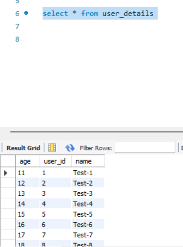

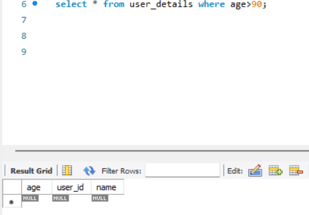 

### Analogy 

- Here, the **ListCrudRepository** and **ListPagingAndSortingRepository** interfaces are specific extensions in the Spring Data JPA module, designed to handle List as a return type for collection queries instead of the standard Iterable.
- **CrudRepository** and **PagingAndSortingRepository** typically return Iterable for collection queries. **ListCrudRepository** and **ListPagingAndSortingRepository** are specialized to return a List directly, which can be more convenient when you need to work with lists specifically.
- If you often find yourself needing to cast or convert an Iterable to a List, using ListCrudRepository or ListPagingAndSortingRepository can save you time and make your code cleaner.
- ListCrudRepository and ListPagingAndSortingRepository primarily provide convenience by returning a List instead of an Iterable. There isn't a big difference in functionality but rather a focus on ease of use and consistency in return types.

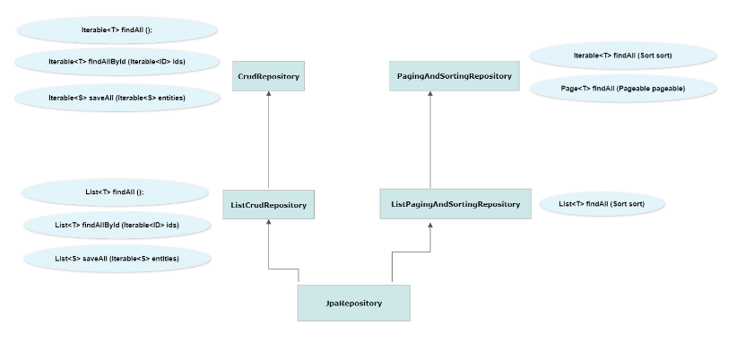

- Above learnings are implemented [here](https://github.com/codophilic/LearnSpringBoot/tree/main/SpringBoot%20JPA/demo/src/main/java/com/springboot/jpa)


