# About SpringBoot MVC
- When we create MVC structure in spring a lot of configuration is required example configuring dispatcher servlet, View Resolver and etc. Check here about [Spring MVC](https://github.com/codophilic/LearnSpring/blob/main/Spring%20MVC.md)
- Lets see how easier we can create MVC structure in SpringBoot. Lets create a simple web project in STS

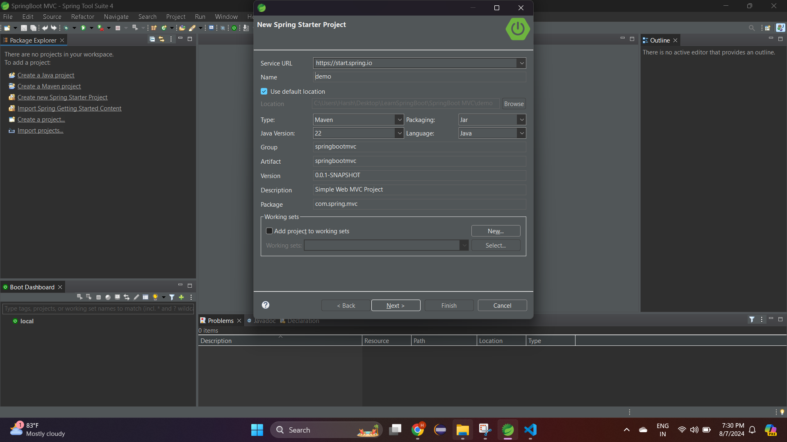

- Select Spring web as the required dependency

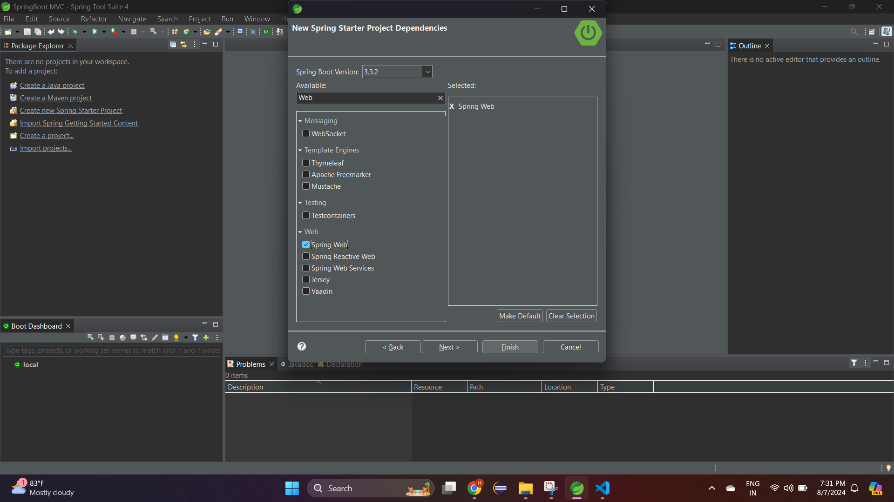

- Click on finish , if you see the dependencies are automatically added in the **pom.xml** file

```
		<dependency>
			<groupId>org.springframework.boot</groupId>
			<artifactId>spring-boot-starter-web</artifactId>
		</dependency>

		<dependency>
			<groupId>org.springframework.boot</groupId>
			<artifactId>spring-boot-starter-test</artifactId>
			<scope>test</scope>
		</dependency>
```

- Below is the main method 

```
package com.spring.mvc;

import org.springframework.boot.SpringApplication;
import org.springframework.boot.autoconfigure.SpringBootApplication;

@SpringBootApplication
public class DemoApplication {

	public static void main(String[] args) {
		SpringApplication.run(DemoApplication.class, args);
	}

}
```
- Lets create controller package and add a MainController class which will be our FrontController

```
package com.spring.mvc.controller;

import org.springframework.stereotype.Controller;
import org.springframework.web.bind.annotation.RequestMapping;

@Controller
public class MainController {

	@RequestMapping("/welcome")
	public String welcomePage() {
		return "welcome";
	}
}
```

- We need to create welcome.jsp file, to create that we need to create manually `webapp/pages` folder under `main`

```
<%@ page language="java" contentType="text/html; charset=UTF-8"
    pageEncoding="UTF-8"%>
<!DOCTYPE html>
<html>
<head>
<meta charset="UTF-8">
<title>Insert title here</title>
</head>
<body>

<h1>Welcome Page</h1>
</body>
</html>
```

- Post execution of main method , we can see the page. To run the project use **Spring Boot App**

```
package com.spring.mvc;

import org.springframework.boot.SpringApplication;
import org.springframework.boot.autoconfigure.SpringBootApplication;

@SpringBootApplication
public class DemoApplication {

	public static void main(String[] args) {
		
		//IoC Container
		SpringApplication.run(DemoApplication.class, args);
	}

}
```

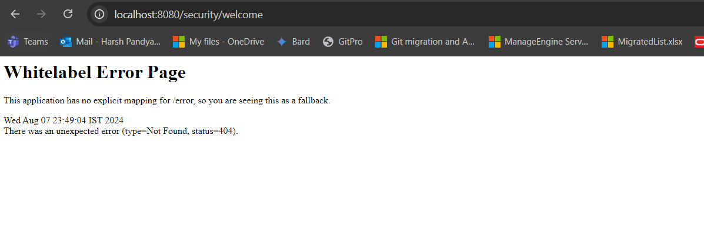

- Wait where is the welcome page? , uptil now we have defined jsp file and controller class but we have not said springboot that all my pages are under **pages** folder with extension as **.jsp**.
- So to do that we have **application.properties** file, where we specify suffix and prefix to resolve the view for ViewResolver.

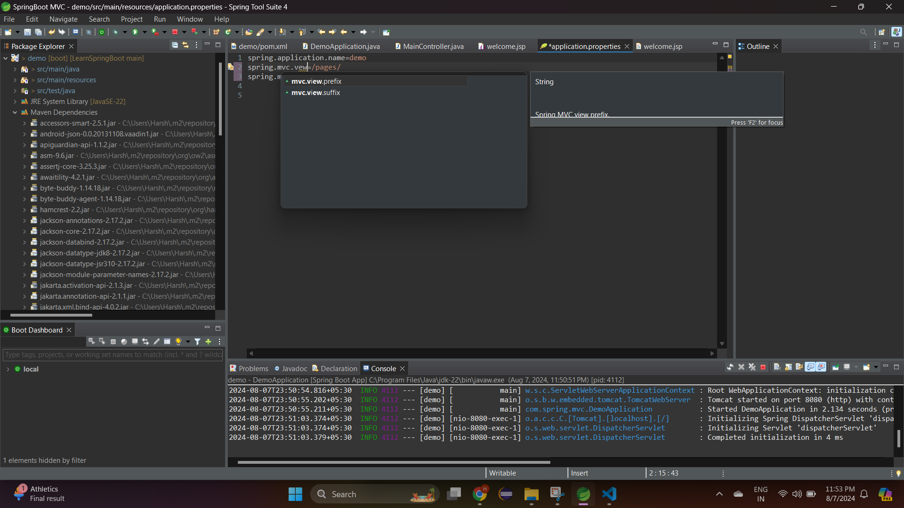 

- If you see STS provides suggestion while performing configuration in application.properties

```
application.properties

spring.application.name=demo
spring.mvc.view.prefix=/pages/
spring.mvc.view.suffix=.jsp
```

- Now if we restart and check again we will get the same page, now what is the issue? if you observe below image when we try to hit the url `http://localhost:8080/welcome` , we can see a file getting downloaded.

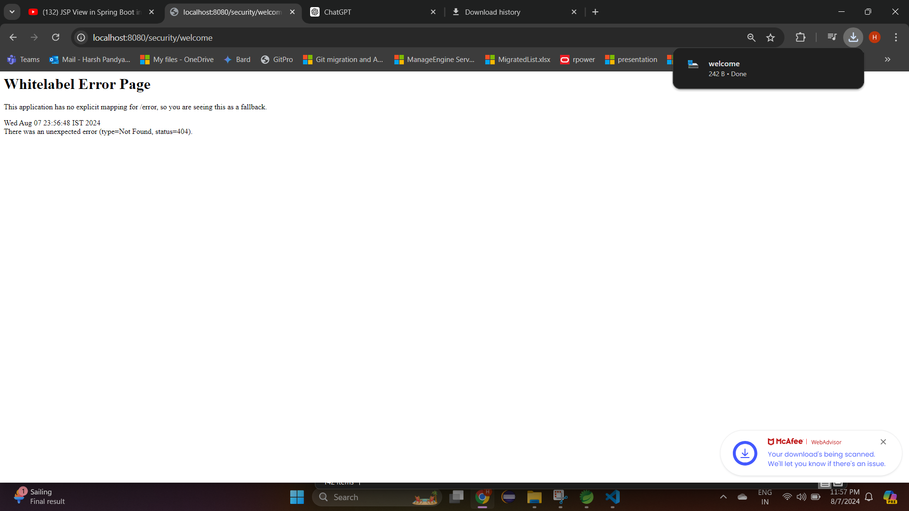

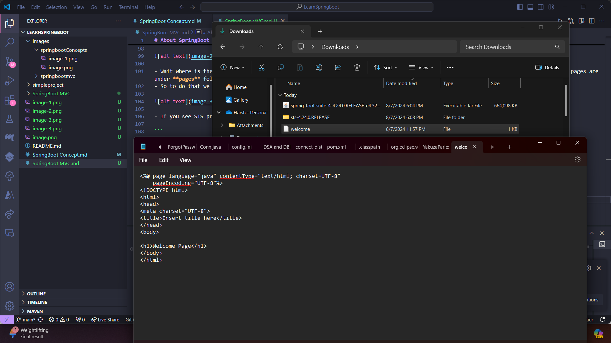 

- Spring Boot includes an embedded Tomcat server by default for serving web applications. However, it does not include JSP support out of the box because the embedded Tomcat does not include the Jasper JSP engine necessary for processing JSP files.
- By adding the `tomcat-embed-jasper` dependency, you include the Jasper engine, which enables JSP support. The embedded Tomcat server can then process and render JSP files.

```
<!-- Tomcat Embed Jasper for JSP support -->
<dependency>
    <groupId>org.apache.tomcat.embed</groupId>
    <artifactId>tomcat-embed-jasper</artifactId>
    <scope>provided</scope>
</dependency>
```

- Post running the main method, we get the page


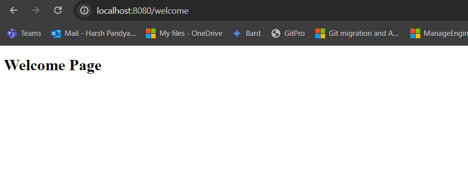 

- Currently the project is running on tomcat port number 8080, lets say if we want to change the port , we can do this in **application.properties**

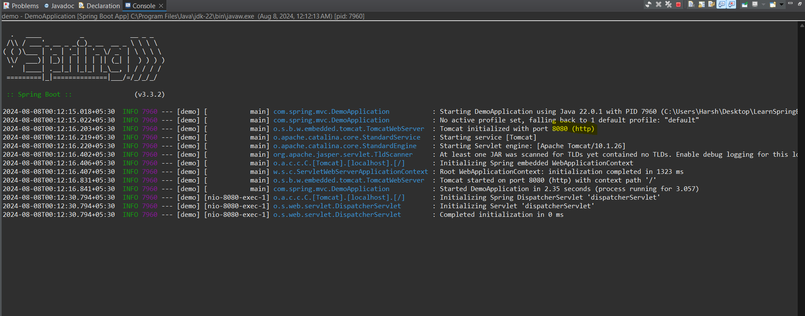

- Configuring port 8081 temporarily

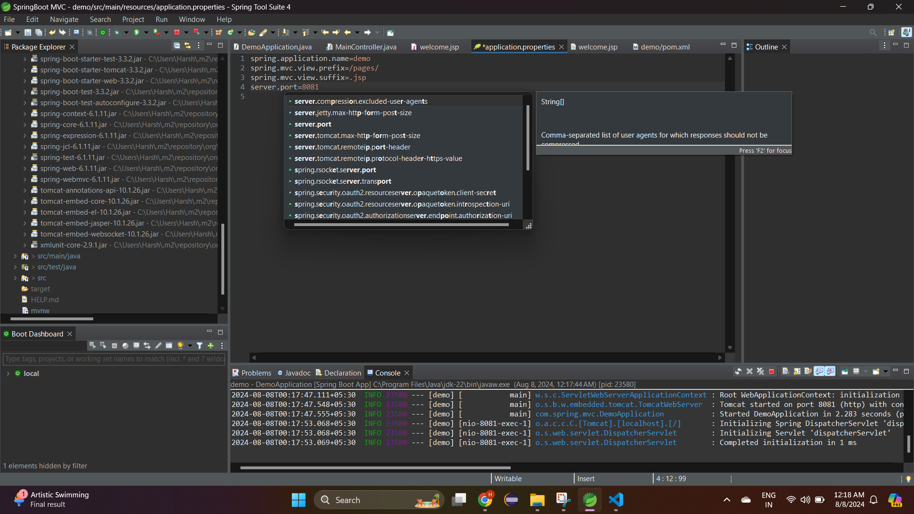

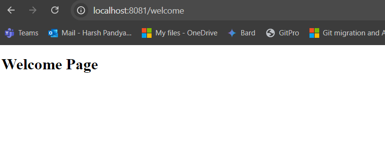 

- Currently we are running this web springboot project in java perspective in STS, there is no server added and also not open in Java EE perspective.

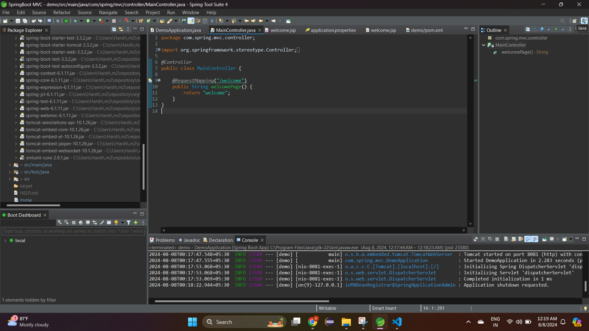

## What is application.properties?

- In a Spring Boot application, **application.properties** is a file used to configure various settings for your application. It is typically located in the `src/main/resources` directory. This file allows you to set key-value pairs that configure different aspects of your application, such as database settings, server ports, logging levels, customize any configuration and more.
- Spring Boot automatically loads and reads the **application.properties** file at startup. It uses the properties defined in this file to configure various parts of the application. The framework has built-in mechanisms to look for this file in the `src/main/resources` directory or on the classpath.
- Discover all the properties [here](https://docs.spring.io/spring-boot/appendix/application-properties/index.html)
- **application.properties** is a central place for configuring your Spring Boot application. Spring Boot automatically reads this file at startup and uses the properties defined within it to configure various components of your application. The flexibility and simplicity of application.properties make it a powerful tool for managing your application's configuration.


- Lets create a server side validation form using SpringBoot MVC, here will be using external css as well as js.
- In Spring Boot, static resources like CSS, JavaScript, and images are typically placed in specific folders under the `src/main/resources/static` directory. The reason for this is rooted in how Spring Boot is configured to serve static content.
- Spring Boot follows the principle of "convention over configuration," meaning it has sensible defaults to reduce the need for additional configuration. By using the static folder, you benefit from this default behavior, making it easier to manage and serve static content.
- Spring Boot automatically maps files in these locations to URLs. This means you don't have to configure anything in your application to serve these files—they are served automatically.
- Keeping your static resources in the static folder ensures that they are separate from your application's logic (Java classes, templates, etc.). This makes the project more organized and easier to manage.
- So we have create two folders and placed `css/style.css` and `js/confirm.js`
```
style.css
body {
    font-family: Arial, sans-serif;
    background: silver;
}

label {
    font-weight: bold;
}

input, button {
    margin: 10px 0;
}

confirm.js
function confirmSubmission() {
    return confirm("Are you sure you want to proceed?");
}
```
- For example, if you have a file style.css located in `src/main/resources/static/css/style.css`, Spring Boot will automatically serve it at the URL `http://localhost:8080/css/style.css`.

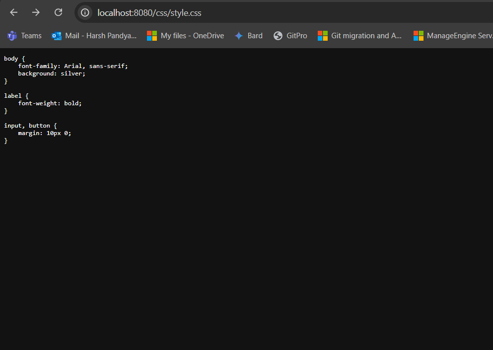 


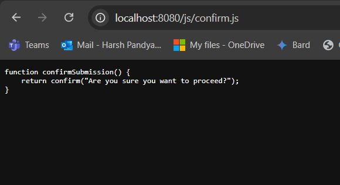

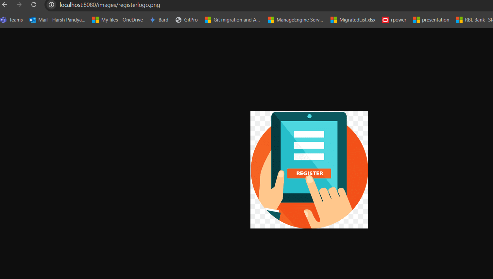 

- To reference these Css, Js and images we need to use thymeleaf

```
<link rel="stylesheet" th:href="@{/css/style.css}">
<script th:src="@{/js/script.js}"></script>

```

- Lets download the dependencies

```
<dependency>
    <groupId>jakarta.validation</groupId>
    <artifactId>jakarta.validation-api</artifactId>
</dependency>

<!-- https://mvnrepository.com/artifact/org.hibernate.validator/hibernate-validator -->
<dependency>
    <groupId>org.hibernate.validator</groupId>
    <artifactId>hibernate-validator</artifactId>
</dependency>
<dependency>
			<groupId>org.springframework.boot</groupId>
			<artifactId>spring-boot-devtools</artifactId>
			<scope>runtime</scope>
			<optional>true</optional>
		</dependency>
```

- Lets create an UserForm class

```
package com.spring.mvc.entities;

import jakarta.validation.constraints.AssertTrue;
import jakarta.validation.constraints.Max;
import jakarta.validation.constraints.NotBlank;
import jakarta.validation.constraints.Pattern;
import jakarta.validation.constraints.Size;

public class UserForm {

	/**
	 * NotBlank - Ensures that the field is not null and that the trimmed length of the string is greater than 0 (i.e., it's not empty).
	 * Size - Validates that the length of the string is within the specified bounds.
	 */
	@NotBlank( message = "User name cannot be empty" )
	@Size(max = 10,min = 3, message = "User name must be between 3 - 10 characters")
    private String name;
	
	@NotBlank(message = "Email ID cannot be blank")
    private String email;
	
	/**
	 * Max - Ensures that the numeric value of the field is less than or equal to the specified maximum.
	 */
	@Max(value = 24, message = "Age cannot be greater than 25")
    private int age;
	
	/**
	 * Pattern - Validates that the string matches the specified regular expression.
	 */
	@Pattern(regexp = "^\\d{10}$" , message = "Invalid phone number")
    private String phoneNumber;
	
	/**
	 * AssertTrue - Ensures that the field is true.
	 */
	@AssertTrue(message = "Accept terms and conditions")
    private boolean termsAccepted;

    // Getters and Setters
    public String getName() {
        return name;
    }

    public void setName(String name) {
        this.name = name;
    }

    public String getEmail() {
        return email;
    }

    public void setEmail(String email) {
        this.email = email;
    }

    public int getAge() {
        return age;
    }

    public void setAge(int age) {
        this.age = age;
    }

    public String getPhoneNumber() {
        return phoneNumber;
    }

    public void setPhoneNumber(String phoneNumber) {
        this.phoneNumber = phoneNumber;
    }

    public boolean isTermsAccepted() {
        return termsAccepted;
    }

    public void setTermsAccepted(boolean termsAccepted) {
        this.termsAccepted = termsAccepted;
    }
}
```

- Hold on, what are these `@NotNull`, `@Size`, `@Pattern` etc.. annotation?. These annotations ensure that the fields in your form are validated according to specific rules when the form is submitted. These annotations are enabled due to `jakarta.validation-api` and `hibernate-validator`.

- Lets create a form and form controller

```
form.html

<!DOCTYPE html>
<html lang="en" xmlns:th="http://www.thymeleaf.org">
<head>
    <meta charset="UTF-8">
    <title>User Form</title>
    <link rel="stylesheet" th:href="@{/css/style.css}">
    <script th:src="@{/js/confirm.js}"></script>
</head>
<body>
    <h1>User Registration Form</h1>
    <!-- Display an image -->
    

    <form th:action="@{/submitForm}" th:object="${storeUserFormDetails}" method="post" onsubmit="return confirmSubmission()">
        <label for="name">Name:</label>
        <input type="text" id="name" th:field="*{name}" >
        <p th:each="e : ${#fields.errors('name')}" th:text="${e}"  style="color:red;"></p>
        <br><br>

        <label for="email">Email:</label>
        <input type="email" id="email" th:field="*{email}" >
        <p th:each="e : ${#fields.errors('email')}" th:text="${e}"  style="color:red;"></p>
        <br><br>

        <label for="age">Age:</label>
        <input type="number" id="age" th:field="*{age}" required>
        <p th:each="e : ${#fields.errors('age')}" th:text="${e}"  style="color:red;"></p>
        <br><br>

        <label for="phoneNumber">Phone Number:</label>
        <input type="text" id="phoneNumber" th:field="*{phoneNumber}" >
        <p th:each="e : ${#fields.errors('phoneNumber')}" th:text="${e}"  style="color:red;"></p>
       	<br><br>

        <label for="termsAccepted">Accept Terms and Conditions:</label>
        <input type="checkbox" id="termsAccepted" th:field="*{termsAccepted}" >
        <p th:each="e : ${#fields.errors('termsAccepted')}" th:text="${e}"  style="color:red;"></p>
        <br><br>

        <button type="submit">Submit</button>
    </form>
</body>
</html>


FormController
package com.spring.mvc.controller;

import org.springframework.stereotype.Controller;
import org.springframework.validation.BindingResult;
import org.springframework.web.bind.annotation.GetMapping;
import org.springframework.web.bind.annotation.ModelAttribute;
import org.springframework.web.bind.annotation.PostMapping;
import org.springframework.web.servlet.ModelAndView;

import com.spring.mvc.entities.UserForm;

import jakarta.validation.Valid;

@Controller
public class FormController {
	

    @GetMapping("/form")
    public ModelAndView showForm() {
    	ModelAndView mav = new ModelAndView();
    	mav.addObject("storeUserFormDetails", new UserForm());
    	mav.setViewName("forms/form");
        return mav;
    }

    @PostMapping("/submitForm")
    public ModelAndView submitForm(@Valid @ModelAttribute("storeUserFormDetails") UserForm userForm, BindingResult formsDetailsResult) {
    	ModelAndView mav = new ModelAndView();
    	
    	if(formsDetailsResult.hasErrors()) {
    		System.out.println("Issue in details"+formsDetailsResult);
    		mav.setViewName("forms/form");
    		return mav;
    	}
    	
    	mav.addObject("user", userForm);
    	mav.setViewName("forms/result");
        return mav;
    }
	
}
```

- Here , we have used `th:object` and `th:field` in the form.html, what is it?, okay before understanding that first check this piece of block of FormController

```
    @GetMapping("/form")
    public ModelAndView showForm() {
    	ModelAndView mav = new ModelAndView();
    	mav.addObject("storeUserFormDetails", new UserForm());
    	mav.setViewName("forms/form");
        return mav;
    }
```

- Here whenever user enters url `/form` it gets redirected to the form.html, now during redirection we have created an object with name **storeUserFormDetails** which has a type of **UserForm** class. This instance or object is initially empty but will be populated with data when the user submits the form, wait how? on submit the data will get into this **storeUserFormDetails** instance?
- Thymeleaf uses this object name using `th:object` and binds the input form values into UserForm instance variables using `th:field` attribute. Look the below piece of code of name input field.

```
form.html
        <label for="name">Name:</label>
        <input type="text" id="name" th:field="*{name}" >
        <p th:each="e : ${#fields.errors('name')}" th:text="${e}"  style="color:red;"></p>
        <br><br>

UserForm.java
	@NotBlank( message = "User name cannot be empty" )
	@Size(max = 10,min = 3, message = "User name must be between 3 - 10 characters")
    private String name;
```

- `th:field="*{name}"` consist of same variable name which is declared in UserForm class `private String name`.
- `th:object="${storeUserFormDetails}"` this binds the form to the storeUserFormDetails object you added to the model in your controller. All form fields within this form will be linked to the corresponding properties of this object.
- `th:field="*{name}"` this binds the input field to the name property of the UserForm class. When the user submits the form, the value entered in this field will be set into the name property of the UserForm object.
- Now when the user clicks on submit button `th:action="@{/submitForm}" method='post'` redirects to **/submitForm** controller.

```
    @PostMapping("/submitForm")
    public ModelAndView submitForm(@Valid @ModelAttribute("storeUserFormDetails") UserForm userForm, BindingResult formsDetailsResult) {
    	ModelAndView mav = new ModelAndView();
    	
    	if(formsDetailsResult.hasErrors()) {
    		System.out.println("Issue in details"+formsDetailsResult);
    		mav.setViewName("forms/form");
    		return mav;
    	}
    	
    	mav.addObject("user", userForm);
    	mav.setViewName("forms/result");
        return mav;
    }
```

- Now when the user clicks on submit button , the object data **storeUserFormDetails** consist of users input form details. Now each property of this details like name, email, phoneNumber, age etc.. are present in the model and can be fetch using `@ModelAttribute`. 
- The `@ModelAttribute` binds the object details into **userForm** variable of **submitForm** method and using `@Valid` annotation the details are validated.
- For example if the name length is greater than 10, then the validation gets fails and the result of these validations are stored in **BindingResult**.
- **BindingResult** are accessible in the model and to display these validation failure result in form, we use the same property name for which the validation got failed. In Thymeleaf, the #fields.errors function is used to retrieve and display validation error messages that are stored in the BindingResult. This expression checks if there are any validation errors associated with the specified form field (`name`). It returns a list of error messages related to that field.`<p th:each="e : ${#fields.errors('name')}" th:text="${e}"  style="color:red;"></p>`.

<video controls src="Images/springbootmvc/20240811-1612-00.4425844.mp4" title="Title"></video>

- Post successful validation it is redirected to result.html

```
<!DOCTYPE html>
<html xmlns:th="http://www.thymeleaf.org">
<head>
    <meta charset="UTF-8">
    <title>Form Submission Result</title>
</head>
<body>
    <h1>Form Submission Result</h1>
    <p>Name: <span th:text="${user.name}"></span></p>
    <p>Email: <span th:text="${user.email}"></span></p>
    <p>Age: <span th:text="${user.age}"></span></p>
    <p>Phone Number: <span th:text="${user.phoneNumber}"></span></p>
    <p>Terms Accepted: <span th:text="${user.termsAccepted ? 'Yes' : 'No'}"></span></p>
</body>
</html>
```

- **Here we are not using service and dao layer, this is a simple form example**.
- Above learnings are implemented [here](https://github.com/codophilic/LearnSpringBoot/tree/main/SpringBoot%20MVC/demo/src/main/java/com/spring/mvc)
- Same can be done without using **SpringBoot** and only using **Spring**.
- Concepts of Spring MVC are applied to SpringBoot as well.
