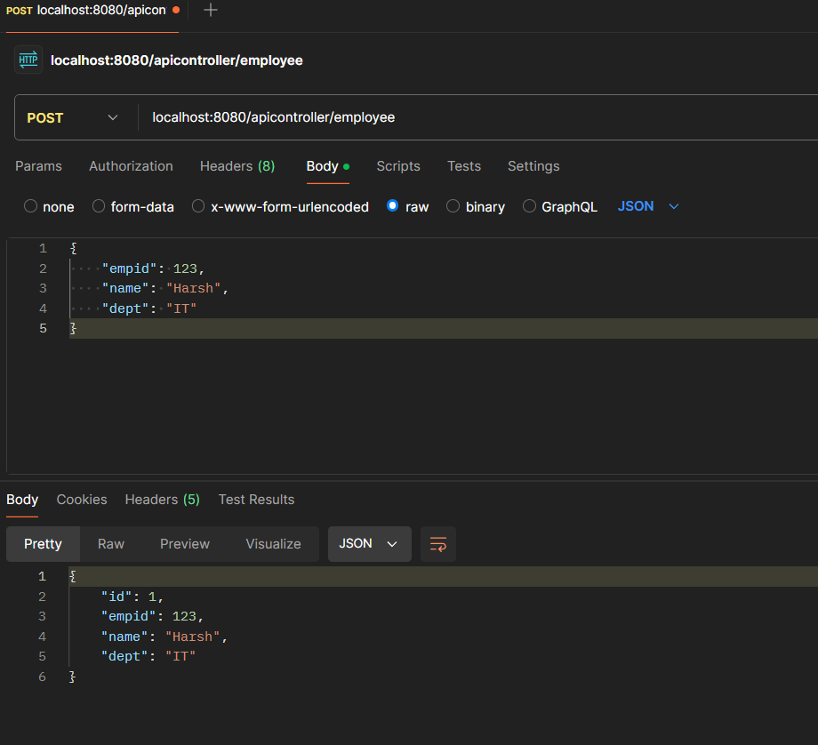
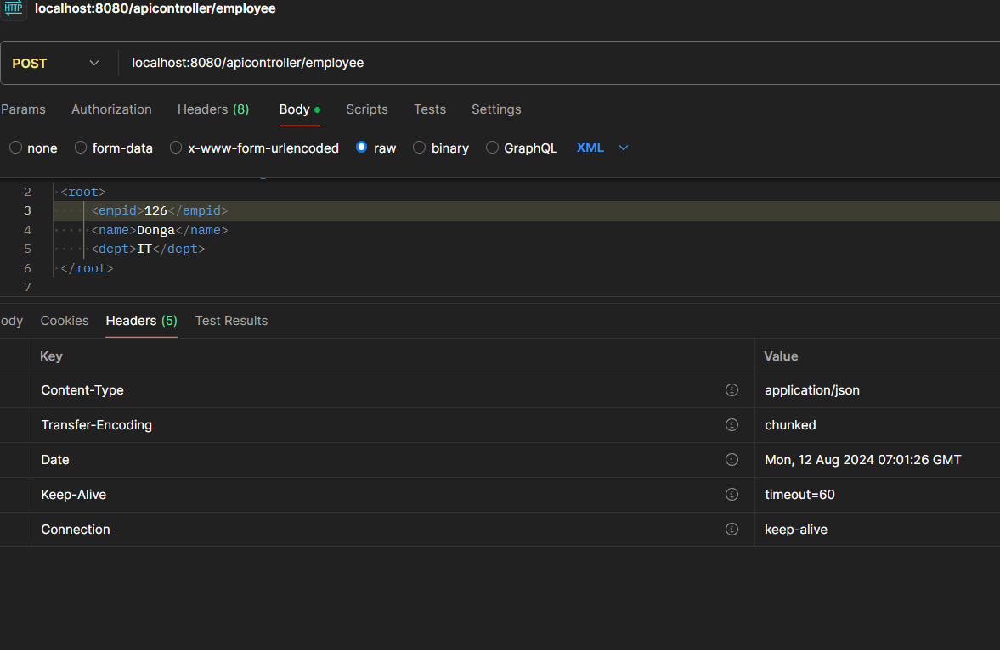
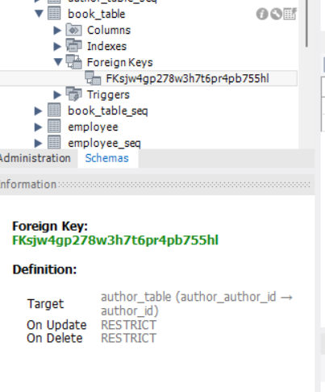

# About REST APIS
- A RESTful (REpresentational State Transfer) (REST) API is an architectural style for an application programming interface that uses HTTP requests to access and use data. That data can be used to GET , PUT , POST and DELETE data types, which refers to reading, updating, creating and deleting operations related to resources.


- APIs can be considered a type of web application, but their role is different. They are more focused on data exchange and enabling interactions between different software systems rather than directly providing a user interface.
- Traditional web applications are designed to deliver web pages (HTML, CSS, JavaScript) that users can interact with via a web browser. They typically involve a frontend (the user interface) and a backend (the server-side logic). When a user interacts with a traditional web application (e.g., by clicking a button), the server processes the request and returns a complete web page or updates a portion of the page.
- An API is essentially the backend part of a web application that exposes certain functionality or data to be consumed by other applications, whether they are web, mobile, or other types of clients. Instead of returning a full web page, an API returns raw data, usually in formats like JSON or XML. This data can be consumed by clients, which then decide how to present or use the data.
- Traditional web applications are user-facing, meaning they are directly interacted with by users through a browser. APIs are typically not directly interacted with by end-users but rather by other software (like a frontend application or another backend service). Web applications return full HTML pages, while APIs return data.

# REST APIS using SpringBoot

- Lets create a simple API and understand about it. To start with the process install the dependencies.


- Post dependencies installation we can see our SpringBoot Application

```
package com.springboot.rest;

import org.springframework.boot.SpringApplication;
import org.springframework.boot.autoconfigure.SpringBootApplication;

@SpringBootApplication
public class RestapiApplication {

	public static void main(String[] args) {
		SpringApplication.run(RestapiApplication.class, args);
	}

}
```

- On browser 

 

- On Postman tool


- Lets create an **ApiController** and execute it

```
package com.springboot.rest.controller;

import org.springframework.stereotype.Controller;
import org.springframework.web.bind.annotation.RequestMapping;
import org.springframework.web.bind.annotation.RequestMethod;
import org.springframework.web.bind.annotation.ResponseBody;

@Controller
public class ApiController {

	@RequestMapping(path="/sample",method = RequestMethod.GET)
	@ResponseBody
	public String sampleMethod() {
		return "This is a sample response";
	}
}
```

- In Spring MVC, when you return a view name (like a JSP or HTML file), Spring looks for that file and renders it as the response. This is typical for web applications where you want to generate HTML pages that are displayed in a browser.
- However, when you're building RESTful web services, you often want to return data (like JSON, XML, or plain text) rather than a view. This is where the `@ResponseBody` annotation comes into play.
- When you annotate a method with `@ResponseBody`, the return value of that method is written directly to the HTTP response body. So instead of trying to render a view, Spring will send the data (like a string, JSON, or XML) directly to the client.
- Spring automatically converts the return value into the appropriate format. For example, if you return an object, Spring can convert it to JSON or XML (depending on your configuration) before sending it to the client. Default it is plain text.

## Spring Boot with REST APIs Flow
- **Client Request**: A client (could be a browser, mobile app, or another server) sends an HTTP request.
- **DispatcherServlet**: Just like in Spring MVC, the request goes to the DispatcherServlet.
- **Controller**: The request is forwarded to a controller method. However, in a REST API, the controller method usually returns data rather than a view name.
- **@ResponseBody**: When the method is annotated with `@ResponseBody`, the return value is automatically serialized (converted) into a format like JSON or XML and written directly to the HTTP response body. There’s no need for a view resolver because no view is being rendered; instead, raw data (like JSON) is returned. Default plain text is return if nothing specified
- **Response**: The serialized data is sent back to the client as the response. This data can be consumed by any client capable of handling JSON or XML.


- So whenever you are creating a new method along with the `@RequestMapping` you need to write `@ResponseBody` multiple times. 
- What if `@Controller` and `@ResponseBody` are combined and you don't need to write it repetitively the `@ResponseBody`? , we have an annotation `@RestController`.

```
package com.springboot.rest.controller;

import org.springframework.stereotype.Controller;
import org.springframework.web.bind.annotation.GetMapping;
import org.springframework.web.bind.annotation.RequestMapping;
import org.springframework.web.bind.annotation.RequestMethod;
import org.springframework.web.bind.annotation.ResponseBody;
import org.springframework.web.bind.annotation.RestController;

//@Controller
@RestController
public class ApiController {

	/*
	 * @RequestMapping(path="/sample",method = RequestMethod.GET)
	 * 
	 * @ResponseBody public String sampleMethod() { return
	 * "This is a sample response"; }
	 */
	
	@GetMapping("/sample")
	public String sampleMethod() {
		return "This is a sample response";
	}
}
```

- `@Controller` annotation is used to define a Spring MVC controller. It is typically used in web applications where the response might be a view (like an HTML page).
- `@RestController` is a specialized version of @Controller. It combines `@Controller` and `@ResponseBody` into one annotation. When you use `@RestController`, every method in the controller automatically behaves as if it were annotated with `@ResponseBody`.
- `@GetMapping` is a shorthand for `@RequestMapping(method = RequestMethod.GET)`. It is more concise and often preferred when defining GET endpoints.

- Lets create a SpringBoot MVC structure using JPA hibernate. First lets install JPA dependencies. Here we will be using MySQL database.

```
<dependency>
			<groupId>org.springframework.boot</groupId>
			<artifactId>spring-boot-starter-data-jpa</artifactId>
		</dependency>

		<dependency>
			<groupId>com.mysql</groupId>
			<artifactId>mysql-connector-j</artifactId>
			<scope>runtime</scope>
		</dependency>
```

- Lets create a simple Employee Class which has employee ID, name, department.

```
package com.springboot.rest.entities;

import jakarta.persistence.*;

@Entity
public class Employee {

	@Id
	@GeneratedValue( strategy = GenerationType.AUTO)
	@Column(name = "unique_id")
	private int id;
	
	@Column(name = "employee_id", unqiue=true)
	private int emp_id;
	
	@Column(name = "employee_name")
	private String name;
	
	@Column(name="employee_department")
	private String dept;

	public int getId() {
		return id;
	}

	public void setId(int id) {
		this.id = id;
	}

	public int getEmp_id() {
		return emp_id;
	}

	public void setEmp_id(int emp_id) {
		this.emp_id = emp_id;
	}

	public String getName() {
		return name;
	}

	public void setName(String name) {
		this.name = name;
	}

	public String getDept() {
		return dept;
	}

	public void setDept(String dept) {
		this.dept = dept;
	}

	@Override
	public String toString() {
		return "Employee [id=" + id + ", emp_id=" + emp_id + ", name=" + name + ", dept=" + dept + "]";
	}
	
	
}
```

- Lets configure details in **application.properties**.

```
spring.application.name=restapi
spring.datasource.url=jdbc:mysql://localhost:3306/springbootmvcrestapi
spring.datasource.username=root
spring.datasource.password=Meetpandya40@
spring.datasource.driver-class-name=com.mysql.cj.jdbc.Driver
spring.jpa.database-platform = org.hibernate.dialect.MySQL8Dialect
spring.jpa.generate-ddl=true
spring.jpa.hibernate.ddl-auto = create
spring.jpa.show-sql=true
```

- Lets create a DAO layer interface which will extends JpaRepository and a service layer class. Autowire service and dao. Lets build up a **GET** and **POST** service.

```
DAO Interface JpaRepository
package com.springboot.rest.dao;


import org.springframework.data.jpa.repository.JpaRepository;
import org.springframework.stereotype.Repository;

import com.springboot.rest.entities.Employee;

@Repository
public interface EmployeeDao extends JpaRepository<Employee, Integer> {

	
	Employee findByEmpid(int empid);
}


Service Layer
package com.springboot.rest.service;

import java.util.List;

import org.springframework.beans.factory.annotation.Autowired;
import org.springframework.stereotype.Service;
import org.springframework.transaction.annotation.Transactional;

import com.springboot.rest.dao.EmployeeDao;
import com.springboot.rest.entities.Employee;

@Service
@Transactional
public class EmployeeService {
	
	@Autowired
	private EmployeeDao employeeDao;

	public EmployeeDao getEmployeeDao() {
		return employeeDao;
	}

	public void setEmployeeDao(EmployeeDao employeeDao) {
		this.employeeDao = employeeDao;
	}
	
	/**
	 * Fetch All Employees
	 */
	public List<Employee> fetchAllEmployees(){
		return employeeDao.findAll();
	}
	
	/**
	 * Fetch Employee using emp_id
	 */
	public Employee fetchEmployeeUsingEmpid(int empid) {
		return employeeDao.findByEmpid(empid);
	}
	
	/**
	 * Creating a new Employee
	 */
	public Employee createEmployeeDetails(Employee emp) {
		return employeeDao.save(emp);
	}

}
```

- Lets create an ApiController class

```
package com.springboot.rest.controller;

import java.util.List;

import org.springframework.beans.factory.annotation.Autowired;
import org.springframework.web.bind.annotation.GetMapping;
import org.springframework.web.bind.annotation.PathVariable;
import org.springframework.web.bind.annotation.PostMapping;
import org.springframework.web.bind.annotation.PutMapping;
import org.springframework.web.bind.annotation.RequestBody;
import org.springframework.web.bind.annotation.RequestMapping;
import org.springframework.web.bind.annotation.RestController;

import com.springboot.rest.entities.Employee;
import com.springboot.rest.service.EmployeeService;

//@Controller
@RestController
@RequestMapping("/apicontroller")
public class ApiController {

	
	@Autowired
	private EmployeeService employeeService;
	
	/**
	 * Fetch All Employees
	 */
	@GetMapping("/allEmployees")
	public List<Employee> fetchAllEmployees(){
		return employeeService.fetchAllEmployees();
	}
	
	/**
	 * Fetch Employee using emp_id
	 */
	@GetMapping("/employee/{empid}")
	public Employee fetchEmployeeUsingEmpid(@PathVariable("empid") int empid) {
		return employeeService.fetchEmployeeUsingEmpid(empid);
	}
	
	/**
	 * Creating a new Employee
	 */
	@PostMapping("/employee")
	public Employee createEmployeeDetails(@RequestBody Employee emp) {
		return employeeService.createEmployeeDetails(emp);
	}

}
```

- Lets hit the url using postman. First lets create an employee using **POST** request.



- On console

```
Hibernate: select next_val as id_val from employee_seq for update
Hibernate: update employee_seq set next_val= ? where next_val=?
Hibernate: insert into employee (employee_department,employee_id,employee_name,unique_id) values (?,?,?,?)
```

- Lets check database.


- Lets create another employee


- Lets fetch all the employees


- Lets fetch particular employee


- Hold on, when we hit url **/sample** we receieved **text/plain** as response, now we are getting json format response? is that we are just passing class?
- In Spring Boot, when a method in a REST controller returns a class object like Employee, Spring Boot automatically converts this object into a JSON response by default. Spring Boot uses the Accept header in the HTTP request to decide the format. If the client does not specify the Accept header, JSON is chosen by default.


- Spring Boot uses **HttpMessageConverters** to automatically convert Java objects to a specific media type (like JSON or XML) and vice versa.
For JSON, Spring Boot uses the Jackson library by default. Jackson is a powerful JSON parser and generator library that Spring Boot configures out of the box.
- If your method returns an object, Spring looks for an appropriate HttpMessageConverter to serialize that object. Since JSON is the default, it uses **MappingJackson2HttpMessageConverter** to convert the object to JSON format.
- What if users sends JSON as well XML format request? how to handle it? - yes we can specify multiple media types
- For XML based media type we need to add the dependencies in pom file

```
<dependency>
  <groupId>com.fasterxml.jackson.dataformat</groupId>
  <artifactId>jackson-dataformat-xml</artifactId>
</dependency>
```

```
	/**
	 * Creating a new Employee
	 */
	@PostMapping( path="/employee", produces = { MediaType.APPLICATION_JSON_VALUE,MediaType.APPLICATION_XML_VALUE })
	public Employee createEmployeeDetails(@RequestBody Employee emp) {
		return employeeService.createEmployeeDetails(emp);
	}
```


- Hey wait, the response is still in Json format, why so? it is because SpringBoot is still providing response in json format. Check the **response headers**





- We are accepting response in json format, how to change it ?, so in postman you need to change the accept parameter media type to xml.

<video controls src="Images/springbootrestapis/20240812-0735-39.4253322.mp4" title="Title"></video>


- When multiple media types are specified in the produces attribute, Spring Boot will choose the first one as the default if the Accept header is not explicitly set by the client.
- The **Accept** header should explicitly specify the desired response format. If it is missing or set to a value that Spring Boot interprets as compatible with XML (or if it's a general wildcard `*/*`), the first format in the produces list (application/json) will be used by springboot.
- Since you have `MediaType.APPLICATION_JSON_VALUE` first in the produces list, Spring Boot is defaulting to XML if it cannot determine the preferred format from the request headers.
- By default, Spring Boot will pick the first media type in the produces list if the Accept header is not specific or is missing.
- Ensure that your client request explicitly includes the correct Accept header if you want a particular response format.
- You can reorder the produces list to prioritize XML over JSON if desired.

- Lemme enter some proper data into the employee table and fetch all those data.


- Lets say you wanna create multiple employees at once, we have `saveAll` dao method, lets create method for it in service layer and in the controller.

```
Service Layer
	/**
	 * Save Multiple Employees
	 */
	public List<Employee> createMultipleEmployeeDetails(List<Employee> emp) {
		return employeeDao.saveAll(emp);
	}

Controller
	/**
	 * Creating a Multiple Employee
	 */
	@PostMapping( path="/multipleEmployee", consumes = { MediaType.APPLICATION_JSON_VALUE,MediaType.APPLICATION_XML_VALUE },  produces = { MediaType.APPLICATION_JSON_VALUE, MediaType.APPLICATION_XML_VALUE })
	public List<Employee> createMultipleEmployeeDetails(@RequestBody List<Employee> emp) {

		return employeeService.createMultipleEmployeeDetails(emp);
	}

Output:
Hibernate: insert into employee (employee_department,employee_id,employee_name,unique_id) values (?,?,?,?)
Hibernate: insert into employee (employee_department,employee_id,employee_name,unique_id) values (?,?,?,?)
Hibernate: insert into employee (employee_department,employee_id,employee_name,unique_id) values (?,?,?,?)
```

- We need to have a nested json structure to send request of multiple employee creation

```
[
    {
        "empid": 104,
        "name": "Jeet",
        "dept": "IT"
    },
    {
        "empid": 105,
        "name": "Jimit",
        "dept": "IT"
    },
    {
        "empid": 106,
        "name": "Gogri",
        "dept": "AI"
    }
]
```


- Uptil now we have fetch and create values into the database, lets perform update and delete. So to update or delete any record we required an unique identifier or id ( In our case, employee id)
- Below is **PUT** method example

```
Service Layer
	/**
	 * Updating existing employee using emp_id
	 */
	public Employee updateEmployeeDetails(int id, Employee updatedEmp) {
		System.out.println(id);
		Employee fetchEmpDetails=employeeDao.findByEmpid(id);
		System.out.println(fetchEmpDetails);
		fetchEmpDetails.setName(updatedEmp.getName());
		fetchEmpDetails.setDept(updatedEmp.getDept());
		return employeeDao.save(fetchEmpDetails);
	}

ApiController
	/**
	 * Updating existing employee using emp_id
	 */
	@PutMapping("/update/{empid}")
	public Employee updateEmployeeDetails(@PathVariable int empid, @RequestBody Employee updateEmp) {
		return employeeService.updateEmployeeDetails(empid,updateEmp);
	}

Output:
101
Hibernate: select e1_0.unique_id,e1_0.employee_department,e1_0.employee_id,e1_0.employee_name from employee e1_0 where e1_0.employee_id=?
Employee [id=1, empid=101, name=Harsh, dept=IT]
Hibernate: update employee set employee_department=?,employee_id=?,employee_name=? where unique_id=?
```


- Below is **DELETE** method example. To delete an employee using employee id we require a derived query method in the dao interface

```
DAO Jpa Interface
package com.springboot.rest.dao;

import org.springframework.data.jpa.repository.JpaRepository;
import org.springframework.stereotype.Repository;

import com.springboot.rest.entities.Employee;

@Repository
public interface EmployeeDao extends JpaRepository<Employee, Integer> {

	Employee findByEmpid(int empid);
	
	void deleteByEmpid(int empid);
}


Service Layer
	/**
	 * Delete single employee using emp_id
	 */
	public void deleteEmployeeDetails(int empid) {
		employeeDao.deleteByEmpid(empid);
	}

ApiController
	/**
	 * Delete single employee using emp_id
	 */
	@DeleteMapping("/delete/{empid}")
	public void deleteExistingEmployee(@PathVariable int empid) {
		employeeService.deleteEmployeeDetails(empid);
	}

Output:
Hibernate: delete from employee where unique_id=?
```


- What if you are updating an employee details and employee id of that is some how not available?


```
Output:

java.lang.NullPointerException: Cannot invoke "com.springboot.rest.entities.Employee.setName(String)" because "fetchEmpDetails" is null
	at com.springboot.rest.service.EmployeeService.updateEmployeeDetails(EmployeeService.java:62) ~[classes/:na]
	at java.base/jdk.internal.reflect.DirectMethodHandleAccessor.invoke(DirectMethodHandleAccessor.java:103) ~[na:na]
	at java.base/java.lang.reflect.Method.invoke(Method.java:580) ~[na:na]
	at org.springframework.aop.support.AopUtils.invokeJoinpointUsingReflection(AopUtils.java:354) ~[spring-aop-6.1.11.jar:6.1.11]
```

- We are getting NullPointerException and that exception is passed in the request which is not a good coding practice , we need to handle such exceptions in our api. How to do it? we can use **ResponseEntity**.
- Lets update the **PUT** method code in Service Layer as well as in ApiController

```
Service layer
	/**
	 * Updating existing employee using emp_id
	 */
	public Employee updateEmployeeDetails(int id, Employee updatedEmp) {
		System.out.println(id);
		Employee fetchEmpDetails=employeeDao.findByEmpid(id);
		if(fetchEmpDetails==null) {
			return null;
		}
		System.out.println(fetchEmpDetails);
		fetchEmpDetails.setName(updatedEmp.getName());
		fetchEmpDetails.setDept(updatedEmp.getDept());
		return employeeDao.save(fetchEmpDetails);
	}

ApiController
	/**
	 * Updating existing employee using emp_id
	 */
	@PutMapping("/update/{empid}")
	public ResponseEntity<Employee> updateEmployeeDetails(@PathVariable int empid, @RequestBody Employee updateEmp) {
		Employee updatedEmp=employeeService.updateEmployeeDetails(empid,updateEmp);
		if(updatedEmp==null) {
			ResponseEntity.notFound().build();
		}
		return ResponseEntity.ok().body(updatedEmp);
		
	}
```


- Hey the content is blank, can we display atleast the null content? 

```
ApiController
	/**
	 * Updating existing employee using emp_id
	 */
	@PutMapping("/update/{empid}")
	public ResponseEntity<Employee> updateEmployeeDetails(@PathVariable int empid, @RequestBody Employee updateEmp) {
		Employee updatedEmp=employeeService.updateEmployeeDetails(empid,updateEmp);
		if(updatedEmp==null) {
			/**
			 * Setting the Status and passing the null value
			 */
			updatedEmp= new Employee();
			updatedEmp.setName("Not Found");
			updatedEmp.setDept("Not Found");
			return ResponseEntity.status(HttpStatus.NOT_FOUND).body(updatedEmp);
		}
		return ResponseEntity.ok().body(updatedEmp);
	}
```


- **ResponseEntity** that allows you to have more control over the HTTP response that your REST API sends to the client. It represents the entire HTTP response, including status code, headers, and body.
- **ResponseEntity** allows you to specify the HTTP status code that should be returned to the client. This is useful for sending appropriate status codes like `201 Created`, `400 Bad Request`, `404 Not Found`, etc., depending on the outcome of the request.
- You can include additional HTTP headers in the response, such as Location for a newly created resource, Cache-Control for caching directives, or any other custom header.
- You can control the response body by passing any object or even no body at all.
- **ResponseEntity** is useful in handling errors and returning proper HTTP responses with error details.

- In Hibernate we have relational-mapping, lets create a book and author entity which will have `@OneToOne` mapping.

```
Book Class
package com.springboot.rest.entities;

import jakarta.persistence.Entity;

import com.fasterxml.jackson.annotation.JsonManagedReference;

import jakarta.persistence.*;

@Entity
@Table(name = "Book_table")
public class Book{
	
	@Id
	@GeneratedValue(strategy = GenerationType.AUTO)
	@Column(name = "book_id")
	private int bookid;

	@Column(name = "book_name")
	private String bookName;
	
	@Column(name = "book_type")
	private String booktype;
	
	@OneToOne(cascade=CascadeType.ALL)
	private Author author;

	public int getBookid() {
		return bookid;
	}

	public void setBookid(int bookid) {
		this.bookid = bookid;
	}

	public String getBookName() {
		return bookName;
	}

	public void setBookName(String bookName) {
		this.bookName = bookName;
	}

	public String getBooktype() {
		return booktype;
	}

	public void setBooktype(String booktype) {
		this.booktype = booktype;
	}

	public Author getAuthor() {
		return author;
	}

	public void setAuthor(Author author) {
		this.author = author;
	}

}


Author Class
package com.springboot.rest.entities;

import jakarta.persistence.*;

@Entity
@Table(name = "author_table")
public class Author {

	@Id
	@GeneratedValue(strategy = GenerationType.AUTO)
	@Column(name = "author_id")
	private int authid;
	
	@Column(name = "author_name")
	private String authName;


	public int getAuthid() {
		return authid;
	}

	public void setAuthid(int authid) {
		this.authid = authid;
	}

	public String getAuthName() {
		return authName;
	}

	public void setAuthName(String authName) {
		this.authName = authName;
	}
	
	
}
```

- Lets create a dao interface using JpaRepository and service layer

```
Dao Interface
package com.springboot.rest.dao;

import org.springframework.data.jpa.repository.JpaRepository;
import org.springframework.stereotype.Repository;

import com.springboot.rest.entities.Book;
import java.util.List;


@Repository
public interface BookDao extends JpaRepository<Book, Integer> {

	Book findByBookid(int bookid);
}

Service layer
package com.springboot.rest.service;

import java.util.Optional;

import org.springframework.beans.factory.annotation.Autowired;
import org.springframework.stereotype.Service;
import org.springframework.transaction.annotation.Transactional;

import com.springboot.rest.dao.BookDao;
import com.springboot.rest.entities.Book;

@Service
@Transactional
public class BookService {

	@Autowired
	private BookDao bookdao;

	public BookDao getBookdao() {
		return bookdao;
	}

	public void setBookdao(BookDao bookdao) {
		this.bookdao = bookdao;
	}
	
	public Book saveBookDetails(Book book) {
		return bookdao.save(book);
	}

	public Book getBookDetails(int bookid) {
		return bookdao.findByBookid(bookid);
	}
}
```

- Below is the ApiController for creating and fetching book details.

```
package com.springboot.rest.controller;

import java.util.List;

import org.springframework.beans.factory.annotation.Autowired;
import org.springframework.web.bind.annotation.DeleteMapping;
import org.springframework.web.bind.annotation.GetMapping;
import org.springframework.web.bind.annotation.PathVariable;
import org.springframework.web.bind.annotation.PostMapping;
import org.springframework.web.bind.annotation.PutMapping;
import org.springframework.web.bind.annotation.RequestBody;
import org.springframework.web.bind.annotation.RequestMapping;
import org.springframework.web.bind.annotation.RestController;
import org.springframework.http.HttpStatus;
import org.springframework.http.MediaType;
import org.springframework.http.ResponseEntity;

import com.springboot.rest.entities.Book;
import com.springboot.rest.entities.Employee;
import com.springboot.rest.service.BookService;
import com.springboot.rest.service.EmployeeService;

//@Controller
@RestController
@RequestMapping("/apicontroller")
public class ApiController {
	
	@Autowired
	private BookService bookservice;

	/**
	 * Create a new book details
	 */
	@PostMapping("/create/book")
	public Book createNewBook(@RequestBody Book book) {
		return bookservice.saveBookDetails(book);
	}
	
	/**
	 * Get particular book details
	 */
	@GetMapping("/get/book/{bookid}")
	public Book getBookDetails(@PathVariable int bookid) {
		return bookservice.getBookDetails(bookid);
	}
	
}

Output:
Hibernate: create table author_table (author_id integer not null, author_name varchar(255), primary key (author_id)) engine=InnoDB
Hibernate: create table author_table_seq (next_val bigint) engine=InnoDB
Hibernate: insert into author_table_seq values ( 1 )
Hibernate: create table book_table (author_author_id integer, book_id integer not null, book_name varchar(255), book_type varchar(255), primary key (book_id)) engine=InnoDB
Hibernate: create table book_table_seq (next_val bigint) engine=InnoDB
Hibernate: insert into book_table_seq values ( 1 )
Hibernate: alter table book_table add constraint UKc8jjhmirjm1eece8s0sr2i2cf unique (author_author_id)
Hibernate: alter table employee add constraint UKmc5x07dj0uft9opsxchp0uwji unique (employee_id)
Hibernate: alter table book_table add constraint FKsjw4gp278w3h7t6pr4pb755hl foreign key (author_author_id) references author_table (author_id)
```


- Here `author_author_id` becomes the foreign key for table `book_table`.




- Lets fetch values 


