# Spring Boot Security - II

- So here we have a spring boot MVC application which has frontend based on HTML & Thymeleaf. 

<video controls src="20240831-1207-25.6853539.mp4" title="Title"></video>

- Here we have images, js, css and webfonts file . These are static files. So it is specified under static folder.


- All the HTML files are present under folder template


- We have different controller

1. Home Page Controller (default page)

```
package com.eazybytes.eazyschool.controller;

import org.springframework.stereotype.Controller;
import org.springframework.ui.Model;
import org.springframework.web.bind.annotation.RequestMapping;

@Controller
public class HomeController {

	/**
	 * Specifying "" or "/" makes home.html default page
	 */
    @RequestMapping(value={"", "/", "home"})
    public String displayHomePage() {
        return "home.html";
    }

}
```

2. Login Controller

```
package com.eazybytes.eazyschool.controller;

import lombok.extern.slf4j.Slf4j;
import org.springframework.stereotype.Controller;
import org.springframework.ui.Model;
import org.springframework.web.bind.annotation.RequestMapping;
import org.springframework.web.bind.annotation.RequestMethod;
import org.springframework.web.bind.annotation.RequestParam;

@Slf4j
@Controller
public class LoginController {

    @RequestMapping(value = "/login", method = {RequestMethod.GET})
    public String displayLoginPage() {
        return "login.html";
    }

}
```

3. Dashboard Controller

```
package com.eazybytes.eazyschool.controller;

import lombok.extern.slf4j.Slf4j;
import org.springframework.security.core.Authentication;
import org.springframework.stereotype.Controller;
import org.springframework.ui.Model;
import org.springframework.web.bind.annotation.RequestMapping;

@Slf4j
@Controller
public class DashboardController {

    @RequestMapping("/dashboard")
    public String displayDashboard(Model model,Authentication authentication) {
        if(null != authentication) {
            model.addAttribute("username", authentication.getName());
            model.addAttribute("roles", authentication.getAuthorities().toString());
        }
        return "dashboard.html";
    }

}
```

4. Holiday Controller

```
package com.eazybytes.eazyschool.controller;

import com.eazybytes.eazyschool.model.Holiday;
import lombok.extern.slf4j.Slf4j;
import org.springframework.stereotype.Controller;
import org.springframework.ui.Model;
import org.springframework.web.bind.annotation.GetMapping;
import org.springframework.web.bind.annotation.PathVariable;
import org.springframework.web.bind.annotation.RequestParam;

import java.util.Arrays;
import java.util.List;
import java.util.stream.Collectors;

@Slf4j
@Controller
public class HolidaysController {

    @GetMapping("/holidays/{display}")
    public String displayHolidays(@PathVariable String display,Model model) {
        if(null != display && display.equals("all")){
            model.addAttribute("festival",true);
            model.addAttribute("federal",true);
        }else if(null != display && display.equals("federal")){
            model.addAttribute("federal",true);
        }else if(null != display && display.equals("festival")){
            model.addAttribute("festival",true);
        }
        List<Holiday> holidays = Arrays.asList(
                new Holiday(" Jan 1 ","New Year's Day", Holiday.Type.FESTIVAL),
                new Holiday(" Oct 31 ","Halloween", Holiday.Type.FESTIVAL),
                new Holiday(" Nov 24 ","Thanksgiving Day", Holiday.Type.FESTIVAL),
                new Holiday(" Dec 25 ","Christmas", Holiday.Type.FESTIVAL),
                new Holiday(" Jan 17 ","Martin Luther King Jr. Day", Holiday.Type.FEDERAL),
                new Holiday(" July 4 ","Independence Day", Holiday.Type.FEDERAL),
                new Holiday(" Sep 5 ","Labor Day", Holiday.Type.FEDERAL),
                new Holiday(" Nov 11 ","Veterans Day", Holiday.Type.FEDERAL)
        );
        Holiday.Type[] types = Holiday.Type.values();
        for (Holiday.Type type : types) {
            model.addAttribute(type.toString(),
                    (holidays.stream().filter(holiday -> holiday.getType().equals(type)).collect(Collectors.toList())));
        }
        return "holidays.html";
    }

}
```

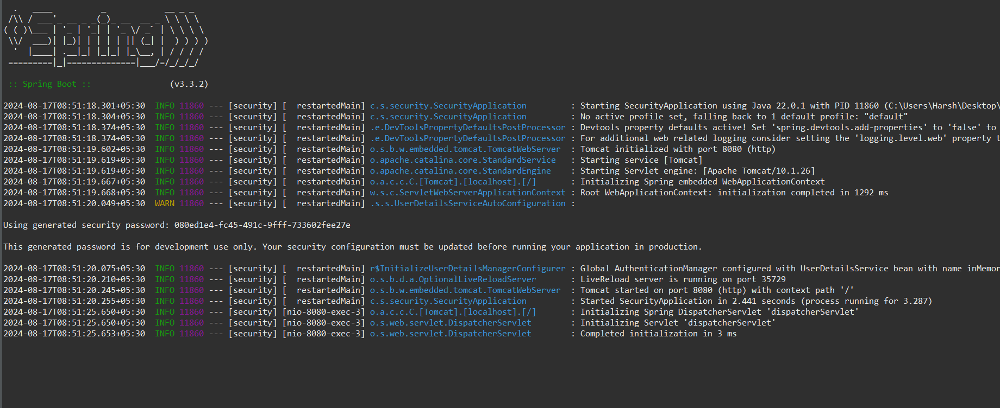


5. Contact Controller


```
package com.eazybytes.eazyschool.controller;

import com.eazybytes.eazyschool.model.Contact;
import com.eazybytes.eazyschool.service.ContactService;
import lombok.extern.slf4j.Slf4j;
import org.springframework.beans.factory.annotation.Autowired;
import org.springframework.stereotype.Controller;
import org.springframework.ui.Model;
import org.springframework.validation.Errors;
import org.springframework.web.bind.annotation.ModelAttribute;
import org.springframework.web.bind.annotation.RequestMapping;
import org.springframework.web.bind.annotation.RequestParam;
import org.springframework.web.context.annotation.RequestScope;
import org.springframework.web.context.annotation.SessionScope;
import org.springframework.web.servlet.ModelAndView;

import jakarta.validation.Valid;

import static org.springframework.web.bind.annotation.RequestMethod.POST;

@Slf4j
@Controller
public class ContactController {

    private final ContactService contactService;

    @Autowired
    public ContactController(ContactService contactService) {
        this.contactService = contactService;
    }

    @RequestMapping("/contact")
    public String displayContactPage(Model model) {
        model.addAttribute("contact", new Contact());
        return "contact.html";
    }


    @RequestMapping(value = "/saveMsg",method = POST)
    public String saveMessage(@Valid @ModelAttribute("contact") Contact contact, Errors errors) {
        if(errors.hasErrors()){
            log.error("Contact form validation failed due to : " + errors.toString());
            return "contact.html";
        }
        contactService.saveMessageDetails(contact);
        contactService.setCounter(contactService.getCounter()+1);
        log.info("Number of times the Contact form is submitted : "+contactService.getCounter());
        return "redirect:/contact";
    }


}
```


- Now to store contact details we would require contact DTO and a service layer.

```
Contact Entity

package com.eazybytes.eazyschool.model;

import lombok.Data;
import org.hibernate.validator.constraints.CreditCardNumber;

import jakarta.validation.constraints.*;

/*
@Data annotation is provided by Lombok library which generates getter, setter,
equals(), hashCode(), toString() methods & Constructor at compile time.
This makes our code short and clean.
* */
@Data
public class Contact {

    /*
    * @NotNull: Checks if a given field is not null but allows empty values & zero elements inside collections.
      @NotEmpty: Checks if a given field is not null and its size/length is greater than zero.
      @NotBlank: Checks if a given field is not null and trimmed length is greater than zero.
    * */
    @NotBlank(message="Name must not be blank")
    @Size(min=3, message="Name must be at least 3 characters long")
    private String name;

    @NotBlank(message="Mobile number must not be blank")
    @Pattern(regexp="(^$|[0-9]{10})",message = "Mobile number must be 10 digits")
    private String mobileNum;

    @NotBlank(message="Email must not be blank")
    @Email(message = "Please provide a valid email address" )
    private String email;

    @NotBlank(message="Subject must not be blank")
    @Size(min=5, message="Subject must be at least 5 characters long")
    private String subject;

    @NotBlank(message="Message must not be blank")
    @Size(min=10, message="Message must be at least 10 characters long")
    private String message;
}


Service Layer

package com.eazybytes.eazyschool.service;

import com.eazybytes.eazyschool.model.Contact;
import lombok.extern.slf4j.Slf4j;
import org.springframework.context.annotation.Scope;
import org.springframework.stereotype.Service;
import org.springframework.web.context.annotation.ApplicationScope;
import org.springframework.web.context.annotation.RequestScope;
import org.springframework.web.context.annotation.SessionScope;

/*
@Slf4j, is a Lombok-provided annotation that will automatically generate an SLF4J
Logger static property in the class at compilation time.
* */
@Slf4j
@Service
// @RequestScope
// @SessionScope
@ApplicationScope
public class ContactService {

    private int counter = 0;

    public ContactService(){
        System.out.println("Contact Service Bean initialized");
    }

    /**
     * Save Contact Details into DB
     * @param contact
     * @return boolean
     */
    public boolean saveMessageDetails(Contact contact){
        boolean isSaved = true;
        //TODO - Need to persist the data into the DB table
        log.info(contact.toString());
        return isSaved;
    }

    public int getCounter() {
        return counter;
    }

    public void setCounter(int counter) {
        this.counter = counter;
    }
}
```

- Currently behind there are no databases involved, its just simple **InMemoryUserDetailsManager**. Below is the project security configuration.

```
package com.eazybytes.eazyschool.config;

import org.springframework.context.annotation.Bean;
import org.springframework.context.annotation.Configuration;
import org.springframework.security.authentication.password.CompromisedPasswordChecker;
import org.springframework.security.config.Customizer;
import org.springframework.security.config.annotation.web.builders.HttpSecurity;
import org.springframework.security.core.userdetails.User;
import org.springframework.security.core.userdetails.UserDetails;
import org.springframework.security.core.userdetails.UserDetailsService;
import org.springframework.security.crypto.factory.PasswordEncoderFactories;
import org.springframework.security.crypto.password.PasswordEncoder;
import org.springframework.security.provisioning.InMemoryUserDetailsManager;
import org.springframework.security.web.SecurityFilterChain;
import org.springframework.security.web.authentication.password.HaveIBeenPwnedRestApiPasswordChecker;

@Configuration
public class ProjectSecurityConfig {

    @Bean
    SecurityFilterChain defaultSecurityFilterChain(HttpSecurity http) throws Exception {

        http.csrf((csrf) -> csrf.disable())
                .authorizeHttpRequests((requests) -> requests.requestMatchers("/dashboard").permitAll()
                        .requestMatchers("/", "/home", "/holidays/**", "/contact", "/saveMsg",
                                "/courses", "/about", "/assets/**").permitAll())
                .formLogin(Customizer.withDefaults())
                .httpBasic(Customizer.withDefaults());

        return http.build();
    }

    @Bean
    public UserDetailsService userDetailsService() {
        UserDetails user = User.withUsername("defaultUserName")
                .password("{noop}codophillic@123").authorities("read").build();
        UserDetails admin = User.withUsername("defaultAdminUser")
                .password("{bcrypt}$2a$12$KU4D4fSOMRYtbUJuFxiI4.jHHEesJ9SJaQj2npyh.6WKIRdoyVA8i") // codophillic@123
                .authorities("admin").build();
        return new InMemoryUserDetailsManager(user, admin);
    }

    @Bean
    public PasswordEncoder passwordEncoder() {
        return PasswordEncoderFactories.createDelegatingPasswordEncoder();
    }

    /**
     * From Spring Security 6.3 version
     *
     * @return
     */
    @Bean
    public CompromisedPasswordChecker compromisedPasswordChecker() {
        return new HaveIBeenPwnedRestApiPasswordChecker();
    }


}
```

- Here since we have assets which consist of static files , so all the urls generated using asset needs to have `permitAll` (`/assets/**`). Similarly for `/holidays/**`.
- So whatever present inside the asset folder we want to be accessible without any security. That's why we have mentioned assets, asterisk, asterisk. That means anything that is coming after the assets path I want to `permitAll`. The same applies for holidays, as well. After the holidays path, if there is any subsequent path, I also want to `permitAll()`.
- Example `/holidays/all` or any sort of url which gets appended as suffix must have `permitAll` .


- Below is the Web MVC Configuration.

```
package com.eazybytes.eazyschool.config;

import org.springframework.context.annotation.Configuration;
import org.springframework.web.servlet.config.annotation.ViewControllerRegistry;
import org.springframework.web.servlet.config.annotation.WebMvcConfigurer;

@Configuration
public class WebConfig implements WebMvcConfigurer {

	/**
	 * Customize Spring MVC configuration.
	 * This method is used to register simple automated controllers pre-configured with a response status 
	 * code or a view to render. By implementing WebMvcConfigurer and overriding this method, 
	 * you can map URLs directly to views without the need for a controller class.
	 * 
	 * Under Controller package we won't have any controller for Courses and About
	 * When a user navigates to the URL /courses, Spring MVC will render the view associated with
	 * the view name "courses". The view name corresponds to a file e.g., courses.html in the 
	 * src/main/resources/templates directory using Thymeleaf.
	 * 
	 * When a user navigates to /about, Spring MVC will render the view associated with the view name "about".
     * This is useful when your html contents are static.
	 */
    @Override
    public void addViewControllers(ViewControllerRegistry registry) {
        registry.addViewController("/courses").setViewName("courses");
        registry.addViewController("/about").setViewName("about");
    }

}
```

- Currently there are no profiles created for this application. We are using **default** profile.
- This was about the required overview of the project. Currently we have been using springboot defaults login page. What if we wanted to customize and add our own?
- We need to customize `formLogin`.

```
    @Bean
    SecurityFilterChain defaultSecurityFilterChain(HttpSecurity http) throws Exception {

        http.csrf((csrf) -> csrf.disable())
                .authorizeHttpRequests((requests) -> requests.requestMatchers("/dashboard").permitAll()
                        .requestMatchers("/", "/home", "/holidays/**", "/contact", "/saveMsg",
                                "/courses", "/about", "/assets/**").permitAll())
                .formLogin(i->i.loginPage("/login"))
                .httpBasic(Customizer.withDefaults());

        return http.build();
    }
```

- Lets run the application and go to the login page


- It says too many re-directs because the problem right now we have is, framework is trying to redirect it to the login page for authentication, but we have not specified that to access login page no authentication is required. By default spring security perform authentication for any page and login itself is the UI for authentication that's why it is again trying to redirect it.
- Provide the url under `permitAll`.


- Lets make `/dashboard` as secured, because user must perform authentication then only dashboard must be accessible.

```
    @Bean
    SecurityFilterChain defaultSecurityFilterChain(HttpSecurity http) throws Exception {

        http.csrf((csrf) -> csrf.disable())
                .authorizeHttpRequests((requests) -> requests.requestMatchers("/dashboard").authenticated()
                        .requestMatchers("/", "/home", "/holidays/**", "/contact", "/saveMsg",
                                "/courses", "/about", "/assets/**","/login").permitAll())
                .formLogin(i->i.loginPage("/login"))
                .httpBasic(Customizer.withDefaults());

        return http.build();
    }
```

<video controls src="20240831-1640-03.4579858.mp4" title="Title"></video>

- So if user tries to access dashboard , he or she will be redirected to login page. Lets try to login on dashboard.


- The user name **defaultAdminUser** is populated using **Authentication** Object inside the dashboard controller

```
public class DashboardController {

    @RequestMapping("/dashboard")
    public String displayDashboard(Model model,Authentication authentication) {
        if(null != authentication) {
            model.addAttribute("username", authentication.getName());
            model.addAttribute("roles", authentication.getAuthorities().toString());
        }
        return "dashboard.html";
    }

}
```

- The name and authorized are set using model and those data are fetched using thymeleaf.

```
<!-- login block -->
<section class="w3l-contact py-5" id="contact">
    <div class="container py-md-5 py-4">
        <div class="title-main text-center mx-auto mb-md-5 mb-4" style="max-width:500px;">
            <h3 class="title-style" th:text="${'Welcome - ' + username}"></h3>
            <p class="" th:text="${'You logged in as - ' + roles}"></p>
        </div>

    </div>
</section>
```

- Lets look the **login.html** which accepts user name and password.

```
                <form action="/login" method="post" class="signin-form">
                    <div class="col-md-8 login-center input-grids">
                        <li class="alert alert-danger" role="alert" th:if="${!#strings.isEmpty(validationMessgeOnHtml)}"
                            th:text="${validationMessgeOnHtml}" />
                        <input type="text" name="username" id="username" placeholder="Username"
                               class="login-input" />
                        <input type="password" name="password" id="password" placeholder="Password"
                               class="login-input" />
                    </div>
                    <div class="col-md-8 login-center text-start">
                        <button class="btn btn-style btn-style-3 text-left">Log In</button>
                        <a class="new-user text-right" href="">New User ?</a>
                    </div>
                </form>
```

- If you see , to accept user name and password we have two fields `name="username"` and `name="password"`. Now during authentication where the values of these parameters get stored? how the authentication happens using html attributes?
- Here we are using default authentication, so **UsernamePasswordAuthenticationFilter** is invoked. This filter consist of two final variables


- The variable values are same as html parameter name values. If we run the application in debug mode we can see the user name , fetch from the request.


- Lets say if we want to customize the name field in html for user name and password.

```
                        <input type="text" name="customerId" id="username" placeholder="Username"
                               class="login-input" />
                        <input type="password" name="custPass" id="password" placeholder="Password"
                               class="login-input" />
```

- In that case, we need to specify that our request attributes will be `customerId` and `custPass` to spring security in project security configuration.

```
    @Bean
    SecurityFilterChain defaultSecurityFilterChain(HttpSecurity http) throws Exception {

        http.csrf((csrf) -> csrf.disable())
                .authorizeHttpRequests((requests) -> requests.requestMatchers("/dashboard").authenticated()
                        .requestMatchers("/", "/home", "/holidays/**", "/contact", "/saveMsg",
                                "/courses", "/about", "/assets/**","/login").permitAll())
                .formLogin(i->i.loginPage("/login").usernameParameter("customerId").passwordParameter("custPass"))
                .httpBasic(Customizer.withDefaults());

        return http.build();
    }
```

- What if the user enters wrong credentials?

<video controls src="20240831-1717-17.1080149.mp4" title="Title"></video>

- If you see the url gets changed to `http://localhost:8080/login?error` but there is nothing notified about that if the user credentails are wrong. How to handle this in a customize form page?
- So we need to configure a default **failureUrl**. To allow everyone (including unauthenticated users) to access the login page, you need to permit access to /login and any related URLs in your Spring Security configuration (`**/login/**`).

```
    @Bean
    SecurityFilterChain defaultSecurityFilterChain(HttpSecurity http) throws Exception {

        http.csrf((csrf) -> csrf.disable())
                .authorizeHttpRequests((requests) -> requests.requestMatchers("/dashboard").authenticated()
                        .requestMatchers("/", "/home", "/holidays/**", "/contact", "/saveMsg",
                                "/courses", "/about", "/assets/**","/login/**").permitAll())
                .formLogin(i->i.loginPage("/login").usernameParameter("customerId").passwordParameter("custPass")
                		.failureUrl("/login?error"))
                .httpBasic(Customizer.withDefaults());

        return http.build();
    }
```

- Now the `error=true` variable needs to be bind with a string variable using `@RequestParam`

```
	/**
	 * @RequestMapping(value = "/login", method = {RequestMethod.GET})
	 *  - This annotation maps HTTP GET requests to the /login URL to this method. 
	 *  It indicates that whenever a GET request is made to /login, this method will be invoked.
	 * @RequestParam(value = "error", required = false) String error
	 *  - @RequestParam is an annotation used to extract query parameters from the URL.
	 *  - value = "error": This specifies that the method parameter error should be bound to the value of the query parameter named error.
	 *  - required = false: This indicates that the error parameter is not mandatory. If the parameter is not present in the URL, 
	 *  					the error variable will be null.
	 *  - Model model: This is an object that holds the model attributes. 
	 *  				You can add attributes to this model that will be accessible in the view (in this case, login.html).
	 */
    @RequestMapping(value = "/login", method = {RequestMethod.GET})
    public String displayLoginPage(@RequestParam(value = "error", required = false) String error,Model model) {
    	String validatonMsg=null;
    	if(null!=error) {
    		
    		validatonMsg="Incorrect Username or Password";
    	}
		model.addAttribute("validationMessgeOnHtml",validatonMsg);
        return "login.html";
    }
```

- We have set a model attribute with name `validationMessgeOnHtml` , now this needs to be fetch on frontend by thymeleaf.

```
                    <div class="col-md-8 login-center input-grids">
                        <li class="alert alert-danger" role="alert" th:if="${!#strings.isEmpty(validationMessgeOnHtml)}"
                            th:text="${validationMessgeOnHtml}" />
                        <input type="text" name="customerId" id="username" placeholder="Username"
                               class="login-input" />
                        <input type="password" name="custPass" id="password" placeholder="Password"
                               class="login-input" />
                    </div>
```


- Lets say you wanna log something incase of a user credentials are valid or invalid, when the click on **LogIn** button, this can be achieved by using **AuthenticationSuccessHandler** and **AuthenticationFailureHandler**.

```
package com.eazybytes.eazyschool.controller;

import java.io.IOException;

import org.springframework.security.core.Authentication;
import org.springframework.security.web.authentication.AuthenticationSuccessHandler;
import org.springframework.stereotype.Component;

import jakarta.servlet.ServletException;
import jakarta.servlet.http.HttpServletRequest;
import jakarta.servlet.http.HttpServletResponse;
import lombok.extern.slf4j.Slf4j;

@Component
@Slf4j
public class DoSomethingWhenUserIsValid implements AuthenticationSuccessHandler{

	/**
	 * This interface is used to define what happens after a user successfully logs in. 
	 * You can customize actions like redirecting the user to a specific page or displaying a success message.
	 */
	@Override
	public void onAuthenticationSuccess(HttpServletRequest request, HttpServletResponse response,
			Authentication authentication) throws IOException, ServletException {
		log.info("User credentials are valid - "+authentication.getName());
		
		/**
		 * The default behavior of Spring Security is to automatically handle redirections or 
		 * forward requests based on predefined settings like loginPage(), failureUrl(), or using default success URLs
		 * in project security configurations.
		 * However, when you provide custom handlers (successHandler and failureHandler), you need to 
		 * explicitly define the actions to take in those handlers because Spring Security expects that you, 
		 * as the developer, want to customize every aspect of the response.
		 * 
		 * By using custom handlers, you override the default handling mechanism of Spring Security. 
		 * Therefore, it's up to you to specify what happens next, including sending a redirect or 
		 * returning a specific response
		 */
		response.sendRedirect("/dashboard");  // Explicitly redirecting to the dashboard page
        // If not specified sendRedirect you will get a blank page
	}

}


package com.eazybytes.eazyschool.controller;

import java.io.IOException;

import org.springframework.security.core.Authentication;
import org.springframework.security.core.AuthenticationException;
import org.springframework.security.web.authentication.AuthenticationFailureHandler;
import org.springframework.stereotype.Component;

import jakarta.servlet.ServletException;
import jakarta.servlet.http.HttpServletRequest;
import jakarta.servlet.http.HttpServletResponse;
import lombok.extern.slf4j.Slf4j;

@Component
@Slf4j
public class DoSomethingWhenUserIsInvalid implements AuthenticationFailureHandler{
	
	public static int attempts=0;
	
	/**
	 * This interface handles login failures. It allows you to define actions when authentication fails, 
	 * such as redirecting to a login page with an error message or logging the failure event.
	 */
	@Override
	public void onAuthenticationFailure(HttpServletRequest request, HttpServletResponse response,
			AuthenticationException exception) throws IOException, ServletException {
		log.warn("User credentials are invalid - "+exception.getMessage()+" Number of attempts -"+attempts);
		attempts+=1;
		response.sendRedirect("/login?error=true");
	}


}
```

- Here for invalid we have initialized a attempt counts, so whenever a user tries to attempts login , if the credentials are invalid we can see the numbers of attempts perform for it.
- Injecting these handlers beans via constructor injection for it in project security configuration.

```
package com.eazybytes.eazyschool.config;

import org.springframework.context.annotation.Bean;
import org.springframework.context.annotation.Configuration;
import org.springframework.security.authentication.password.CompromisedPasswordChecker;
import org.springframework.security.config.Customizer;
import org.springframework.security.config.annotation.web.builders.HttpSecurity;
import org.springframework.security.core.userdetails.User;
import org.springframework.security.core.userdetails.UserDetails;
import org.springframework.security.core.userdetails.UserDetailsService;
import org.springframework.security.crypto.factory.PasswordEncoderFactories;
import org.springframework.security.crypto.password.PasswordEncoder;
import org.springframework.security.provisioning.InMemoryUserDetailsManager;
import org.springframework.security.web.SecurityFilterChain;
import org.springframework.security.web.authentication.password.HaveIBeenPwnedRestApiPasswordChecker;

import com.eazybytes.eazyschool.controller.DoSomethingWhenUserIsInvalid;
import com.eazybytes.eazyschool.controller.DoSomethingWhenUserIsValid;

import lombok.RequiredArgsConstructor;

@Configuration
@RequiredArgsConstructor
public class ProjectSecurityConfig {
	
	private final DoSomethingWhenUserIsInvalid doSomethingWhenUserIsInvalid;
	
	private final DoSomethingWhenUserIsValid doSomethingWhenUserIsValid;

    @Bean
    SecurityFilterChain defaultSecurityFilterChain(HttpSecurity http) throws Exception {

        http.csrf((csrf) -> csrf.disable())
                .authorizeHttpRequests((requests) -> requests.requestMatchers("/dashboard").authenticated()
                        .requestMatchers("/", "/home", "/holidays/**", "/contact", "/saveMsg",
                                "/courses", "/about", "/assets/**","/login/**").permitAll())
                .formLogin(i->i.loginPage("/login").usernameParameter("customerId").passwordParameter("custPass")
                		.failureUrl("/login?error").successHandler(doSomethingWhenUserIsValid)
                		.failureHandler(doSomethingWhenUserIsInvalid)
                		)
                .httpBasic(Customizer.withDefaults());

        return http.build();
    }

    @Bean
    public UserDetailsService userDetailsService() {
        UserDetails user = User.withUsername("defaultUserName")
                .password("{noop}codophillic@123").authorities("read").build();
        UserDetails admin = User.withUsername("defaultAdminUser")
                .password("{bcrypt}$2a$12$KU4D4fSOMRYtbUJuFxiI4.jHHEesJ9SJaQj2npyh.6WKIRdoyVA8i") // codophillic@123
                .authorities("admin").build();
        return new InMemoryUserDetailsManager(user, admin);
    }

    @Bean
    public PasswordEncoder passwordEncoder() {
        return PasswordEncoderFactories.createDelegatingPasswordEncoder();
    }

    /**
     * From Spring Security 6.3 version
     *
     * @return
     */
    @Bean
    public CompromisedPasswordChecker compromisedPasswordChecker() {
        return new HaveIBeenPwnedRestApiPasswordChecker();
    }


}
```

<video controls src="20240831-1826-06.0477170.mp4" title="Title"></video>

- We can see the log entries on the console.
- Can we have our own logout page? - yes, just like the steps we performed for login error process, same steps can be applied for logout.
- In the project security we need to use **logoutSuccessUrl** method.

```
    @Bean
    SecurityFilterChain defaultSecurityFilterChain(HttpSecurity http) throws Exception {

        http.csrf((csrf) -> csrf.disable())
                .authorizeHttpRequests((requests) -> requests.requestMatchers("/dashboard").authenticated()
                        .requestMatchers("/", "/home", "/holidays/**", "/contact", "/saveMsg",
                                "/courses", "/about", "/assets/**","/login/**").permitAll())
                .formLogin(i->i.loginPage("/login").usernameParameter("customerId").passwordParameter("custPass")
                		.failureUrl("/login?error").successHandler(doSomethingWhenUserIsValid)
                		.failureHandler(doSomethingWhenUserIsInvalid)
                		)
                .httpBasic(Customizer.withDefaults());
        
        http.logout(i->i.logoutSuccessUrl("/login?logout=true").invalidateHttpSession(true)
        		.clearAuthentication(true).deleteCookies("JSESSIONID"));

        return http.build();
    }
```

- Login controller

```
    @RequestMapping(value = "/login", method = {RequestMethod.GET})
    public String displayLoginPage(@RequestParam(value = "error", required = false) String error,
    		@RequestParam(value = "logout", required = false) String logout,
    		Model model) {
    	String validatonMsg=null;
    	if(null!=error) {
    		
    		validatonMsg="Incorrect Username or Password";
    	}
    	if(null!=logout) {
    		validatonMsg="You are logout successfully!!!";
    	}
		model.addAttribute("validationMessgeOnHtml",validatonMsg);
        return "login.html";
    }
```


- In Spring Security, when you configure logout functionality using `.logout()` in your security configuration, you are defining how the application should handle user logout operations. While Spring Security provides a default behavior for logout, such as invalidating the session and clearing authentication, it does not automatically perform all tasks unless explicitly configured.
- `.invalidateHttpSession(true)` : Ensures that the current HTTP session is invalidated when the user logs out. This is crucial for ensuring that any data associated with the session (like user-specific data or session-scoped beans) is removed, preventing any unauthorized access.

- `.clearAuthentication(true)` : Clears the authentication object stored in the `SecurityContext` to ensure no user data is retained after logout. This is important for security to make sure there’s no residual authentication information left after the user logs out. 

- `.deleteCookies("JSESSIONID")` : Deletes the specified cookies from the browser. Removing the `JSESSIONID` cookie helps ensure that the session is fully terminated on the client side as well, enhancing security by preventing the reuse of an old session ID.


- Lets say your `/dashboard` url must only be visible when the user with valid credentials login, other user who are anonymous must not able to see the `/dashboard` page. We can achieve this using built-in method provided by thymeleaf for spring security.
- In your **headers.html** add the below namespace

```
xmlns:sec="http://www.thymeleaf.org/thymeleaf-extras-springsecurity6"
```

- For all your re-directing url specify if authentication is required or not 

```
<div sec:authorize="isAnonymous()">
    <!-- Content visible only to anonymous (not logged in) users -->
</div>

<div sec:authorize="isAuthenticated()">
    <!-- Content visible only to authenticated (logged in) users -->
</div>

```

- Thymeleaf with Spring Security provides you to control the visibility of HTML elements based on the authentication status or roles of the user.
- The `sec:authorize` attribute is used to conditionally display or hide parts of the HTML content based on the user's authentication status or roles. `isAnonymous()` this expression returns true if the user is not authenticated (i.e., the user is browsing anonymously or not logged in).
- Thymeleaf with spring security allows you to dynamically display or hide content based on whether the user is logged in or not, and also based on the user's roles and permissions. This is particularly useful for personalizing the user experience and enhancing security by hiding sensitive elements from unauthorized users.

<video controls src="20240831-1915-07.3404230.mp4" title="Title"></video>

**How It Works?**
    - Integration with Spring Security: Thymeleaf, with the help of `thymeleaf-extras-springsecurity6`, integrates with Spring Security to evaluate expressions like `isAnonymous()` and `isAuthenticated()`. It checks the user's current security context to determine their authentication status or roles.
    - Rendering Logic: When Thymeleaf processes the HTML template, it evaluates each `sec:authorize` expression. If the expression evaluates to true, the element and its content are rendered in the final HTML output. If the expression evaluates to false, the element is not included in the output.


## Roles of SecurityContext & SecurityContextHolder


- Whenever the authentication is completed, for later use, the framework is going to store the already authenticated details inside the **SecurityContext**.
- During the authentication process, an Authentication object is going to be created. Inside this Authentication object,
we are going to have details like **Principal**, **Credentials** and **Authorities**.
    - **Principal** is nothing but the name or the username of the authenticated user.
    - **Credentials** is password.
    - **Authorities** is the authorities or the rights associated to the end user.
- This Authentication object, it also have a Boolean variable indicating whether the authentication is successful or not. Once the authentication action is completed, the Spring Security framework, it is going to store the authentication details inside the object of SecurityContext.
- So **SecurityContext is an interface**. There is an implementation class for this interface with the name **SecurityContextImplementation (SecurityContextImpl)**.


- SecurityContext is going to be managed by a class with the name **SecurityContextHolder**. So this holder class is responsible to manage the details inside the SecurityContext. The holder class exposes various methods to clear the SecurityContext, to add new details to the SecurityContext, to update the SecurityContext details.
- So all the CRUD operation related to the SecurityContext along with the other utility methods are present inside the SecurityContextHolder class.

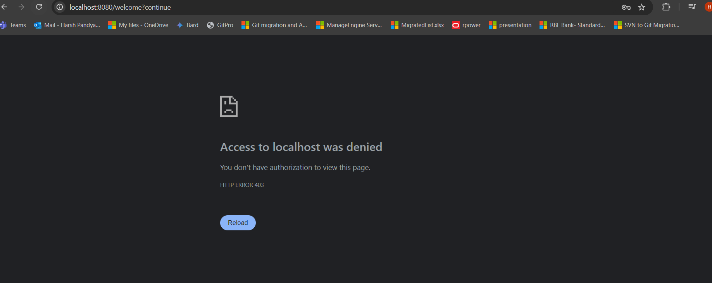

- Spring Security framework is going to leverage this holder class to a great extent whenever it is trying to store or deal with the SecurityContext object.
- We don't have to implement our own SecurityContext or our own SecurityContextHolder, but as a Spring Security developer, you should know about all these important classes and interfaces.
- Interface **SecurityContext**  has methods to retrieve the authentication and to set the authentication details.

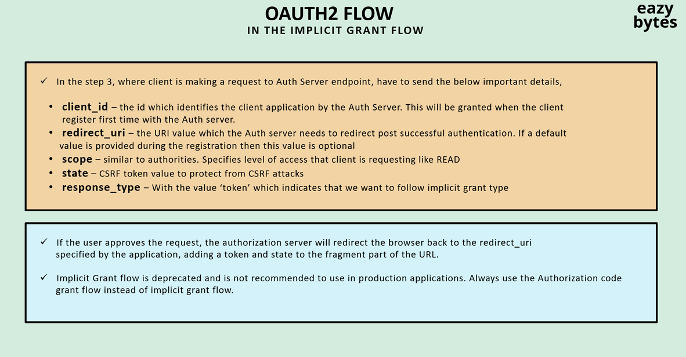

- The SecurityContext object is going to be stored inside the SecurityContextHolder. So whenever you are thinking about the SecurityContextHolder, just think about this locker like how we store valuable information inside a strong locker, very similarly, SecurityContextHolder is like a locker to store the objects of SecurityContext.

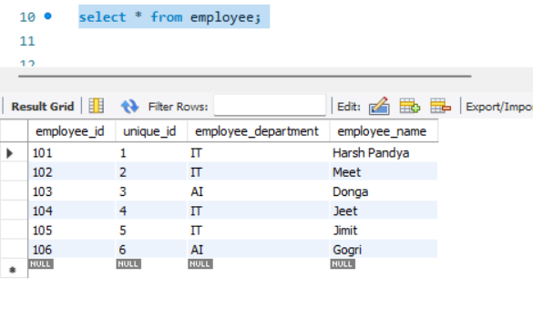

- By default SecurityContextHolder, it is going to store the SecurityContext by using a strategy called **ThreadLocal**. Whenever the SecurityContext details are stored inside a ThreadLocal object, what is going to happen is we don't have to explicitly pass on the SecurityContext object to all the methods that are being invoked as part of the same thread. Anywhere, if you're looking to access the Authentication details or the SecurityContext details, we should be able to easily access them without needing to pass the SecurityContext details to all the methods that are being invoked inside a thread.

### MODE_THREADLOCAL

- So whenever the client is sending a request to the backend application, for each request, there is going to be a new thread. So think like these of 4 request we have all threads like T1, T2, T3, and T4. Each thread may invoke hundreds of different methods during its execution. Think like this T1 is invoking hundred methods. We can't manually pass the SecurityContext object or Authentication object that is stored inside the SecurityContextHolder manually to all these hundred different methods.
- Each of the thread, they're going to have their own ThreadLocal (TH1, TH2, TH3 and TH4). So any objects that are stored inside the ThreadLocal, they're going to be access to all the methods that are going to be invoked as part of the thread journey.
- Apart from ThreadLocal, there are other strategies as well that Spring Security supports. We know by default ThreadLocal is going to be used. So this is that default mode, this **MODE_THREADLOCAL** should work most of the times. We don't have to change this default behavior.

### MODE_INHERITABLETHREADLOCAL

- But for some special scenarios, there are other modes are available. For example, there is a mode with the name **MODE_INHERITABLETHREADLOCAL**. Think like there is a client application, and there is a backend application. So this client application can be your browser. If a user is trying to send a request to the backend application, a thread is going to be created, which is T1, and inside the backend logic, somewhere you might have written some **asynchronous** logic. We have annotations like `@Async` inside the Spring framework. Whenever you are using this annotation on top of a method, the logic inside that method is going to be executed using a separate asynchronous thread. In such scenario, what is going to happen? A new thread is going to be created by your backend method
- So these threads, we can call them as **asynchronous** thread. Let's name this asynchronous thread as T2. Technically, if you see all these threads, they are being processed inside the same request. Whenever an asynchronous thread is going to be created by the Spring framework, all the details available inside this T1, they're going to be copied into the T2 thread, which is an asynchronous thread. This way, the SecurityContext details, they're going to be available to the T2 thread as well. If you're not using this **INHERITABLE** mode, and if you're using the default THREADLOCAL mode,

### MODE_GLOBAL

- Whenever we are using **MODE_GLOBAL** mode, all the threads of the application, they are going to see the same SecurityContext instance or object, which means if your application is having thousands of threads, all these thousand threads, they're going to see the same SecurityContext details.
- This mode is strictly not applicable for the web applications, because inside web applications we know different users, they're going to use your application. It will show the same user details for all the authenticated users in your application.
- you may have question then under which scenarios we need to use is **MODE_GLOBAL** ? Think like you are building a desktop application. So usually desktop applications that are going to be used by a same user inside the same system. So if you have a scenario where you are building the desktop application, which can be used by only one user at a time, then in such scenarios you can use this MODE_GLOBAL strategy.


- let's try to understand how to change the strategy from LOCAL to INHERITTHREADLOCAL, or from LOCAL to GLOBAL based upon your requirements. The very first approach is by using an application property with the property name as `spring.security.strategy`. To this property, you can pass the valueslike INHERITABLETHREADLOCAL and GLOBAL.
- Otherwise, inside your application, you can create a Bean, which is going to set the strategy by invoking the `setStrategyName()` method, which is available inside the SecurityContextHolder.

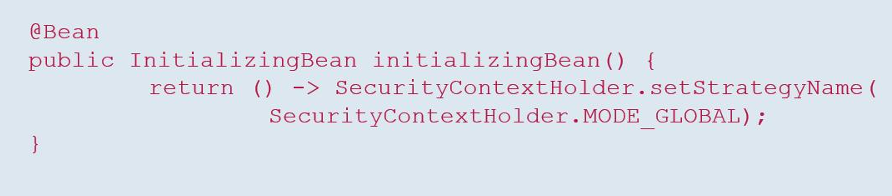

- Load user details into your method

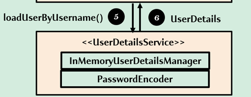

## CORS (Cross-Origin Resource Sharing)

- Lets take an example to understand CORS. Imagine there are two websites:
    - Banking Website: `https://mybank.com`
    - Malicious Website: `https://hacker.com`
- The banking website, `https://mybank.com`, is used by customers to check their bank balance, transfer money, etc. When a user logs in, their browser stores a session cookie that keeps them authenticated. 
- Suppose the banking website allows any website to make requests to it. Below sort of configuration is done on the banking website.

```
Access-Control-Allow-Origin: *
```

- This header means that the server is allowing any domain or website to request its resources, which is dangerous.
- The hacker knows about that the banking website does not have any policy configure and it allows any type of origin or website to share its resources like personal info, account balance , debit card details etc..
- So a user of the banking application which uses the banking website `https://mybank.com` randomly during surfing landed up to the hacker website `https://hacker.com` , The attacker has placed JavaScript code on their site `(hacker.com)` that looks like this

```
fetch("https://mybank.com/api/account-balance", {
  method: "GET",
  credentials: "include"
})
.then(response => response.json())
.then(data => {
  console.log("Account balance:", data.balance);
  // Attacker can use this data for malicious purposes
});
```

- This code is trying to send a request to `https://mybank.com`to fetch the user's bank account balance. When the user loads `https://hacker.com`, the malicious JavaScript code executes in the user’s browser.
- Now using the user details , the hacker will try to access the `https://mybank.com` pretending to be the user and since due to the misconfigured CORS policy (`Access-Control-Allow-Origin: *`), `https://mybank.com `does not reject the request and sends back the user's account balance data in response to hacker unknowingly.
- The response data (user's account balance) is now available to the malicious JavaScript code running on `https://hacker.com`, which logs it or sends it back to the attacker’s server.

- To prevent such an attack, set a specific srigin by configure the CORS policy to only allow trusted domains. For example:

```
Access-Control-Allow-Origin: https://trustedDomain.com
```

- This restricts requests only to the same origin, effectively blocking `https://hacker.com` from accessing the API. Only allow specific HTTP methods (GET, POST, etc.) that are necessary for your application. Restrict the use of potentially dangerous methods like PUT, DELETE, etc., unless absolutely required.

- CORS : CORS is a security feature implemented by web browsers to prevent a web page from making requests to a different domain. This is crucial for security reasons because it stops malicious websites from reading sensitive information from another site. A CORS attack occurs when a malicious website exploits CORS misconfigurations in a web server to steal sensitive data or perform unauthorized actions on behalf of a user. **CORS is not a security threat or a security attack. It is a protection provided by the browser by blocking the communication between the different origins**.


- In Spring Boot Security, there are two main ways to configure CORS (Cross-Origin Resource Sharing)

1. Using the `@CrossOrigin` Annotation: This method is straightforward and useful for simple use cases. You can use the `@CrossOrigin` annotation on individual controllers or methods to enable CORS for specific endpoints. However, it becomes cumbersome when you have multiple controllers or want to manage CORS settings centrally.

```
import org.springframework.web.bind.annotation.CrossOrigin;
import org.springframework.web.bind.annotation.GetMapping;
import org.springframework.web.bind.annotation.RestController;

@RestController
public class MyController {

    @CrossOrigin(origins = "http://allowed-origin.com") // Specify allowed origin
    @GetMapping("/api/data")
    public String getData() {
        return "Data from server";
    }
}
```

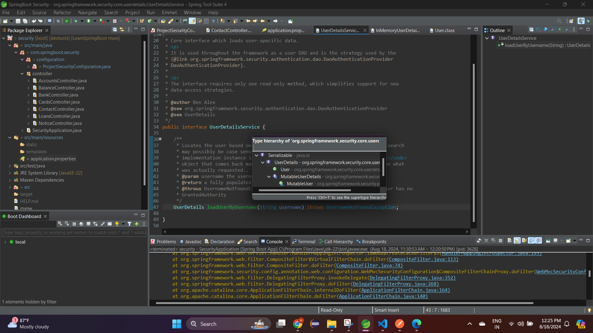


2. Configuring CORS in the **SecurityFilterChain** HTTP Configuration: This approach is more scalable and centralized, allowing you to configure CORS globally for all endpoints or specific patterns using the SecurityFilterChain.


- So whenever you are using spring security inside your application, we can try to invoke the `cors()` method using the **http** parameter. To this `cors()` method, we need to provide the CORS related configurations. **CorsConfigurationSource** is an interface which will be used to provide the CORS related configurations. So using method `configureSource()` we need to pass the object of **CorsConfigurationSource**. Since this is an interface, we can't create the object of this interface. So that's why here, we are trying to define an anonymous class here. Here we are trying override the interface method available, which is `getCorsConfiguration()`.
- Inside this method, we need to define an object of CorsConfiguration. Using this CorsConfiguration object, we need to invoke various methods like `setAllowedOrigins()`, `setAllowedMethods()`, `setAllowedCredentials()`, `setAllowedHeaders()`, and `setMax()`.
- So the very first important method is `setAllowedOrigins()`. So with the help of this setAllowedOrigins(), we are trying to provide the list of origins from where we want to accept the traffic. If you are trying to mention multiple values, you can mention all the multiple origin details by having comma as a separator.
- We can also let the browser to allow the traffic only for some specific http methods. For example, if I want to accept the traffic only for http get methods from a given origin,  we can configure the same under the `setAllowedMethods()`. Whereas if you're looking to accept any kind of http method traffic, you just have to mention **`*`**.
- With the help of `setAllowedCredentials()`, we are letting the browser to send the credentials or any applicable cookies while it is trying to make a request to the backend API.
- Next, with the help of `setAllowedHeaders()` method, we can define what are the list of headers that the backend is fine to accept from the UI application or from the different origin.
- At last,  use the `setMaxAge()` method as well. To this `setMaxAge()` method, we are trying to pass 3600 seconds, which means one hour. So what we are telling to the browser is try to remember all these configurations for one hour. So far, one hour, it is going to cache all these details. So within one hour, if it is trying to make multiple request to the backend API, it is not going to perform the CORS policy related checks multiple times. It is going to do only for the very first time, and it is going to remember all these CORS related configurations up to one hour based upon the `maxAge()` configurations that we have done. In real applications, usually this will be set for 24 hours or for seven days.
- Other way to define CORS configuration is 

```
import org.springframework.context.annotation.Bean;
import org.springframework.context.annotation.Configuration;
import org.springframework.security.config.annotation.web.builders.HttpSecurity;
import org.springframework.security.web.SecurityFilterChain;
import org.springframework.web.cors.CorsConfiguration;
import org.springframework.web.cors.UrlBasedCorsConfigurationSource;
import org.springframework.web.filter.CorsFilter;

import java.util.List;

@Configuration
public class SecurityConfig {

    @Bean
    public SecurityFilterChain securityFilterChain(HttpSecurity http) throws Exception {
        http
            .cors() // Enable CORS support
            .and()
            .authorizeRequests()
                .anyRequest().authenticated() // Require authentication for all requests
            .and()
            .csrf().disable(); // Disable CSRF for simplicity, enable in production

        return http.build();
    }

    @Bean
    public CorsFilter corsFilter() {
        CorsConfiguration corsConfig = new CorsConfiguration();
        corsConfig.setAllowedOrigins(List.of("http://allowed-origin.com")); // Set allowed origins
        corsConfig.setAllowedMethods(List.of("GET", "POST", "PUT", "DELETE")); // Set allowed HTTP methods
        corsConfig.setAllowedHeaders(List.of("Authorization", "Content-Type")); // Set allowed headers
        corsConfig.setAllowCredentials(true); // Allow credentials

        UrlBasedCorsConfigurationSource source = new UrlBasedCorsConfigurationSource();
        source.registerCorsConfiguration("/**", corsConfig); // Apply CORS configuration to all endpoints

        return new CorsFilter(source);
    }
}
```

- By default, Spring Security does not enable CORS (Cross-Origin Resource Sharing) support. This means that if you don’t explicitly configure CORS in your Spring Security configuration or use the `@CrossOrigin` annotation, Spring Security will block any cross-origin HTTP requests.  Without explicit CORS configuration, all cross-origin requests are blocked, and the browser will throw a CORS error like No `Access-Control-Allow-Origin` header is present on the requested resource.
- This default behavior is secure by default. It prevents malicious websites from making unauthorized requests to your application.

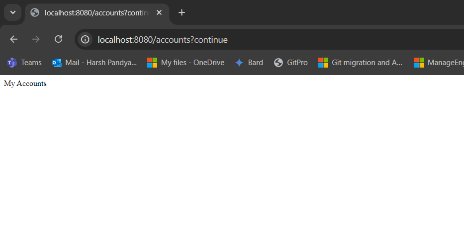


## CSRF (Cross-Site Request Forgery) or Sea Surf or XSRF

- Lets take an example to understand CSRF attack. There are two websites, social media website: `https://socialmedia.com` and malicious website: `https://malicious.com`
- A user logs into their social media account on `https://socialmedia.com`. After logging in, the user is authenticated, and the website sets a session cookie in the user's browser. This cookie is used to authenticate the user on subsequent requests to the website. Browsers are designed to automatically include cookies that belong to a specific domain with any HTTP request sent to that domain. This means if the user visits any page on `https://socialmedia.com`, the browser will automatically include the session cookie that proves the user's authenticated session.
- While browsing, the user visits another website controlled by an attacker, `https://malicious.com`.
- The malicious website has a hidden HTML form or JavaScript code that triggers an unwanted action on `https://socialmedia.com`. For example, the attacker wants to trick the user into posting a message on their social media profile.
- Here is what the hidden form might look like:


```
<!-- Hidden form on the malicious website -->
<form action="https://socialmedia.com/api/postMessage" method="POST">
    <input type="hidden" name="message" value="I hacked this account">
    <input type="submit" value="Submit">
</form>

<!-- JavaScript to auto-submit the form -->
<script>
    document.forms[0].submit(); // Automatically submits the form
</script>
```

- Using the user's browser cookie , the attacker authenticate itself on the social media website using the user browser cookie. As a result, the message "I hacked this account" is posted on the user's social media profile without their consent.

- CSRF is a type of attack that tricks a user into performing actions they didn't intend to do on a web application where they are authenticated. It forces an authenticated user to perform unwanted actions on a web application where they are currently logged in. The attacker tricks the user’s browser into sending a request to the application without the user's knowledge or consent.

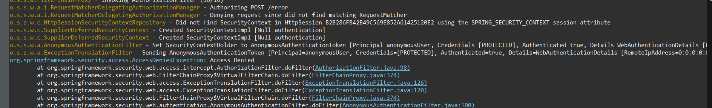

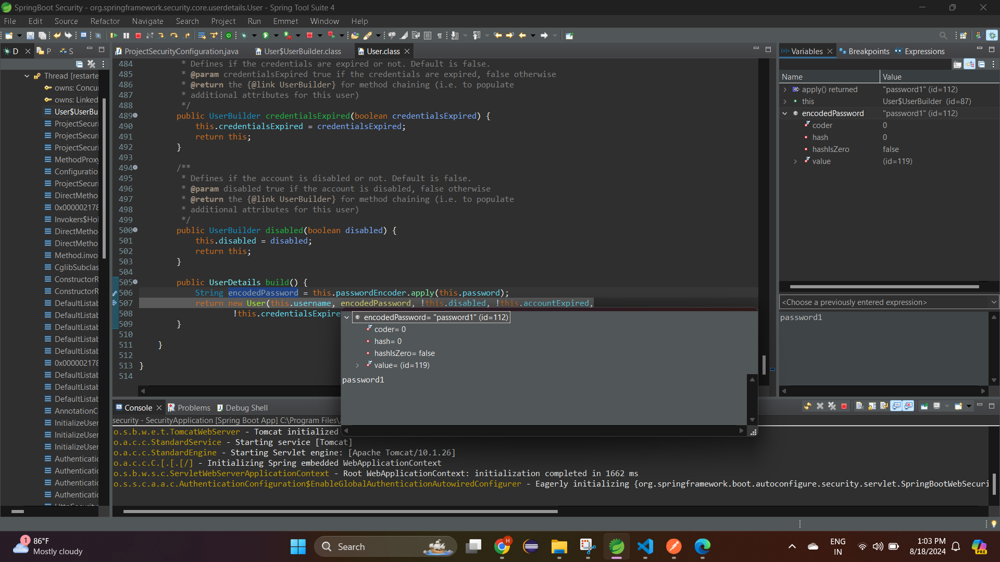

- To Prevent CSRF the most common and effective way to prevent CSRF attacks is by using **CSRF tokens**.

### What is a CSRF Token?

- A CSRF token is a unique, secret value that is generated by the server and sent to the client (user’s browser). This token is tied to the user's session and must be included with any state-changing requests (like POST, PUT, DELETE etc..) to ensure the request is legitimate. 
- A CSRF token should be at least 16 bytes (128 bits) in length. This length provides 2^128 possible combinations, making it highly difficult for an attacker to guess the token. Many modern web frameworks, such as Spring Security, Django, and others, generate CSRF tokens that are typically between 32 and 64 characters in length when represented as a string in hexadecimal or base64 encoding.


#### Where CSRF Tokens Are Stored:

- CSRF tokens are typically stored in one of two places:

1. **Hidden fields in forms**: This is the most common storage method for CSRF tokens. They are included in the HTML of the form as a hidden input.
2. **Cookies**: Sometimes, CSRF tokens are stored in cookies, but the cookie itself is marked as "HttpOnly" and "Secure," which prevents JavaScript running on the page from accessing it.

- Lets see how will CSRF token prevents attack. 
- User logs into `https://socialmedia.com`. The server authenticates the user and sets a session cookie in the user's browser to maintain the session. At the same time, the server generates a unique CSRF token and sends it to the user's browser. This CSRF token is stored either in the session or in a hidden field on forms.
- Every form on `https://socialmedia.com` that performs a state-changing action (e.g., posting a message, changing account details) includes this CSRF token in a hidden field.

```
<form action="/postMessage" method="POST">
    <!-- Include CSRF token as a hidden field -->
    <input type="hidden" name="_csrf" value="uniqueCsrfToken123">
    <textarea name="message" placeholder="What's on your mind?"></textarea>
    <button type="submit">Post</button>
</form>
```

- The user visits `https://malicious.com`, which is controlled by an attacker. The malicious site has a hidden form or script designed to submit a request to `https://socialmedia.com` to perform an unwanted action.
- When the hidden form auto-submits, it sends a POST request to `https://socialmedia.com.` However, this request does not include the correct CSRF token because, the attacker cannot guess the unique, unpredictable CSRF token that was generated and sent by `https://socialmedia.com`. The attacker cannot directly read the CSRF token from the user’s session cookie or from the server-side storage. Browsers prevent sites from accessing cookies or other data set by a different origin (the Same-Origin Policy).
- `https://socialmedia.com` receives the request. The server checks for the CSRF token included in the request. Because the request does not have a valid CSRF token, the server recognizes this as a potential CSRF attack and rejects the request. The malicious action is not performed.

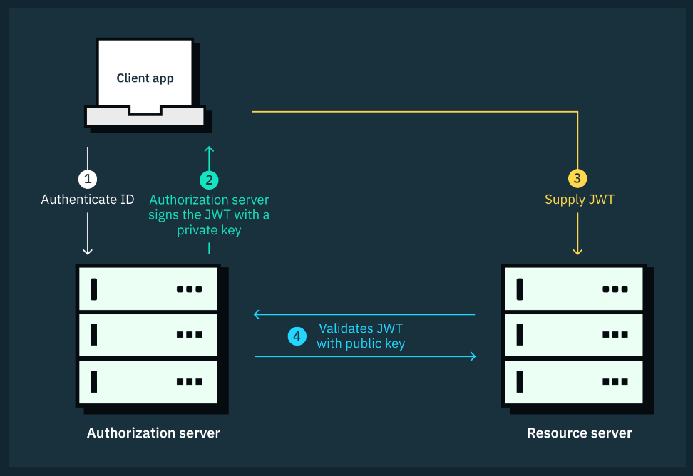

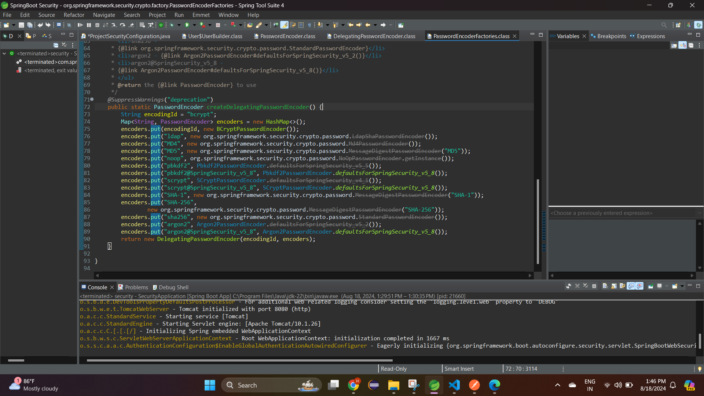

- Spring Security provides built-in CSRF (Cross-Site Request Forgery) protection and enables it by default. This default configuration is designed to help protect web applications from CSRF attacks without requiring additional configuration.

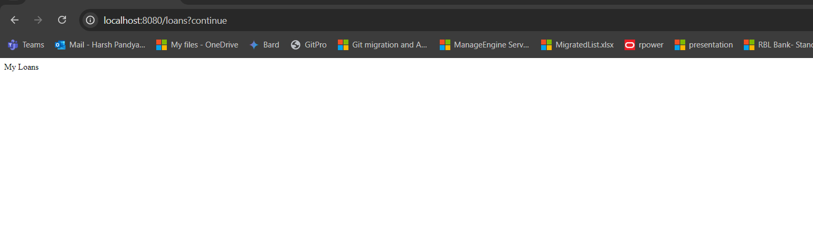


## Filters

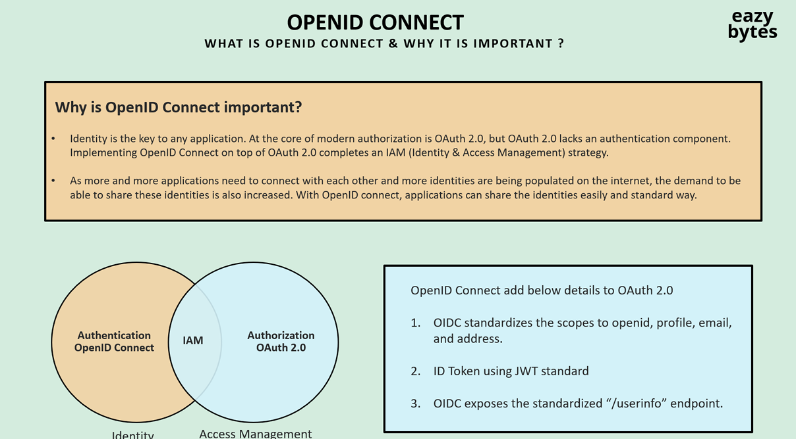

- Using filters inside a servlet-based web application, we should be able to intercept each and every request that is coming towards our web application. By leveraging this feature of filters, Spring Security have built a lot many Spring Security filters.
- So the role of these Spring Security filters is they are going to intercept each and every request coming towards a web application and they're going to examine the request and they're going to perform the authentication, authorization rules or any other checks based upon our configurations inside our web application.
- When a request reaches to an Spring boot web application, which also has Spring Security configurations configured, in these kind of scenarios, the request is going to be intercepted by multiple filters. So inside Spring Security framework, we are going to have multiple filters. It is not like only a single filter is going to handle all the functionality. There'll be more than 20 filters processing your incoming request. The number of filters that are going to be activated for a request is completely dependent on the type of configurations that you have done inside your web application.

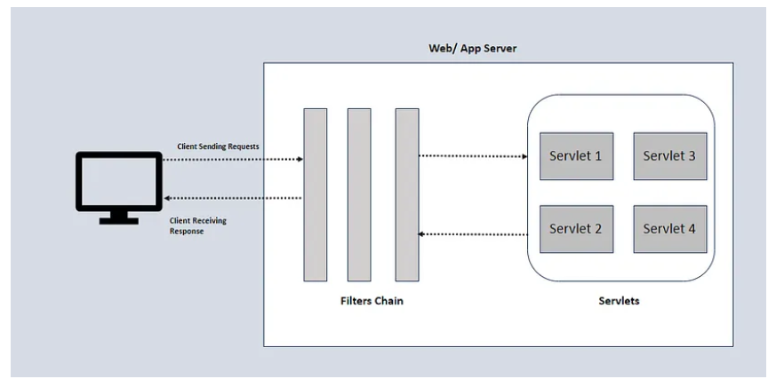

- Inside the Spring Security, they are going to executed in the form of filter chain. So whatever filters that are going to be activated by the Spring Security for a given request, they are all going to be executed in a chain manner. So once the filter one execution is completed, it needs to call the next to filter inside the chain. At last, once all the filters inside the security filter chain are completed, then other normal filters or other normal business logic execution is going to be executed. Inside the Spring boot applications, once all the Spring Security related filters are executed, the request will be forwarded to the DispatcherServlet.
- So DispatcherServlet is going to be responsible to forward the given request to the corresponding controller based upon the MVC path or based upon the rest api that we are trying to invoke.
- Inside the real applications you may have some requirements where you want to inject your own custom filter. Maybe you may have a requirement which needs to be executed after the filter chain. So in this scenario, you need to create your own custom filter, and this custom filter needs to be executed after the filter chain.
- Maybe you want to perform some input validation on the request that you are receiving, or you may want to execute some tracing, auditing or reporting related logic, or you may want to log the client details like what is the IP address  from where the request is being received, or you may want to do some encryption and decryption of the request before Spring Security try to authenticate. So all these kind of requirements can be handled using our own custom filters.
- In all the previous sections, we already saw the inbuilt filters of Spring Security framework, like UsernamePasswordAuthenticationFilter, BasicAuthenticationFilter, DefaultLoginPageGeneratingFilter.
- Lets see how many filters are executed within spring security. To see that first we need to enable debug mode of web security and application properties must have logging level of trace.

```
@Configuration
@RequiredArgsConstructor
@EnableWebSecurity(debug = true)
public class ProjectSecurityConfig {
    ...
}

application.properties
logging.level.org.springframework.security=${SPRING_SECURITY_LOG_LEVEL:TRACE}
```

- Lets run the server and see 

<video controls src="20240903-0302-41.3529500.mp4" title="Title"></video>

- If you see **14** filters were executed. We can also see the list of filters being executed. Once all the filters are executed.

>[!WARNING]
> - This is not recommended in production because it display JSESSSION ID and TOKEN on the console.

- When we create a custom filter it will get populated on the console which inidicates the list of filters executed. Before creating our own custom filter first we need to understand how spring security has constructed these filters.
- When we want to create our own custom filter, there are three important or most commonly used approaches. The very first approaches is you should be implementing an interface with the name, **Filter**.

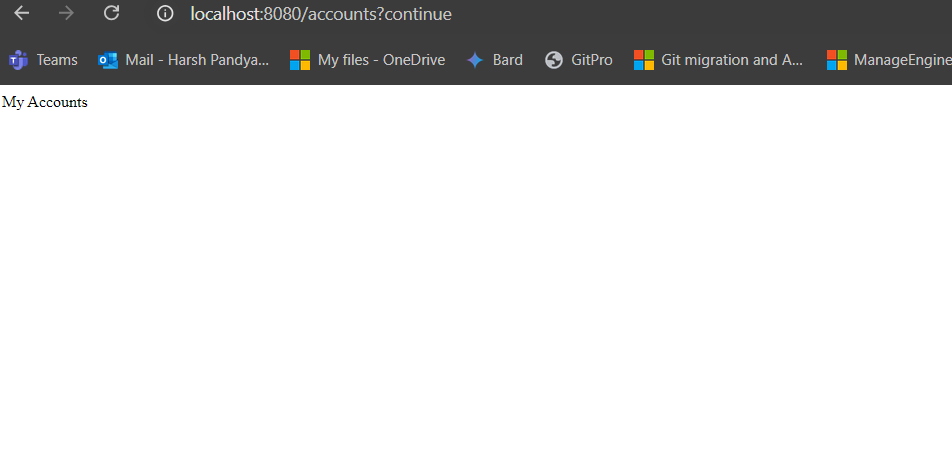

### Filter Interface

- If you try to look for the list of methods available inside this filter interface, there is a single abstract method (**doFilter**) and there are some default methods as well.
- As a developer, whenever you're looking to create your own custom filter, first you need to implement this interface followed by you need to define all your business logic, inside these `doFilter()` override method. So this method, it is going to accept three input parameters. The very first one is **ServletRequest**, which is going to represent your Servlet request that is coming from the client application, followed by **ServletResponse**, which is representing the http response that we are going to send to the client applications. And the third parameter is **FilterChain**. Like we saw before, all the filters inside the Spring Security are inside any Servlet container environment, meaning they're going to be executed in a chain manner.
- Once you are done executing your own business logic inside your own custom filter using these **FilterChain** object, you need to make sure you are invoking the next filter inside the chain. So that's the purpose of this third parameter **FilterChain**. Apart from this abstract method, this Filter interface, it also has couple of default method.
- The very first one is `init()` method. Inside this `init()` method, by default this `init()` method is going to be empty. Similarly, if you look for, `destroy()` also is an empty method. `destroy()` is a method which is going to be invoked by the Servlet Container whenever the Servlet is getting destroyed. So most of the times the Servlets are going to be destroyed during the shutdown process of the web application. So if you have some business logic that needs to be executed during the destroy of the filter, then you can define all such logic.
- In the similar lines, if you're looking to execute some business logic during the initialization of your filter, you can build such logic inside these init filter, usually `init()` method is going to be invoked only during the startup of your web application. In real projects, most of the times inside the `inIt()` method developers they're going to write some logic related to the connecting to your database or connecting to your data source so that these connection details they will be able to use inside that `doFilter()` method and `destroy()` method is going to be in work during the shutdown process of the application. The logic usually returned by the developers inside the destroy is to release any connections or to close any connections with the database or with any other data source. So any cleanup activities that you want to do , you can achieve that by writing logic inside that `destroy()` method.

### GenericFilterBean abstract class

- The second option that you can explore is, **GenericFilterBean**. So there is an abstract class with the name **GenericFilterBean** by extending this **GenericFilterBean**, you should be able to define your own custom filter.

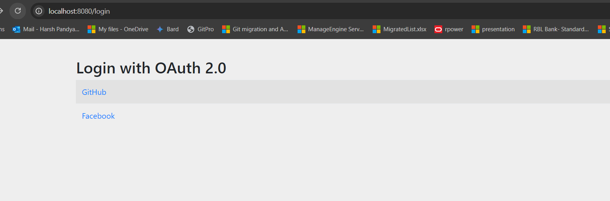

- If you see this abstract class, it is also implementing the filter but what is the difference between the Filter option and the GenericFilterBean option? Whenever you have a requirement that you want to read some servlet related init parameters that are defined inside your deployment descriptor like **web.xml** or if you're looking for an option to read the servlet context details or the environment property details, so in all such scenarios you can leverage **GenericFilterBean** abstract class. If you look for the list of methods available inside this abstract class, there are good amount of methods related to Environment, `FilterConfig()`, `ServletContext()`, so anytime if you're looking for an option to read the ServletInitParameter, ServletContextDetails or EnvironmentDetails in all such scenarios, you can happily use these GenericFilterBean.

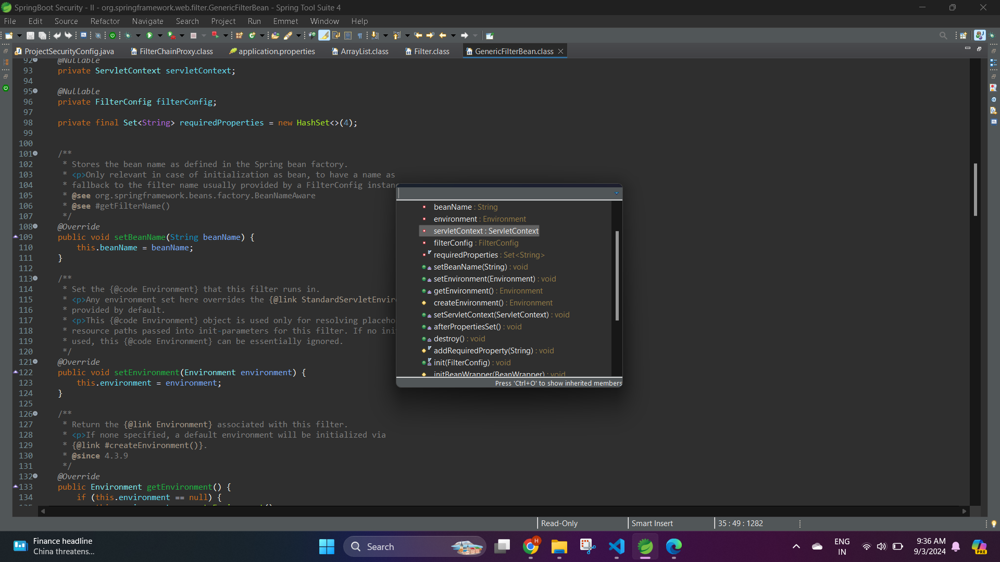

### OncePerRequestFilter abstract class

- Apart from these two approaches, there is one more approach which is an abstract class **OncePerRequestFilter** which extends **GenericFilterBean**. So whenever you define a filter by extending this abstract class in such scenarios the Spring framework, it is going to guarantee you that your filter is going to be executed only once at max for each request. 

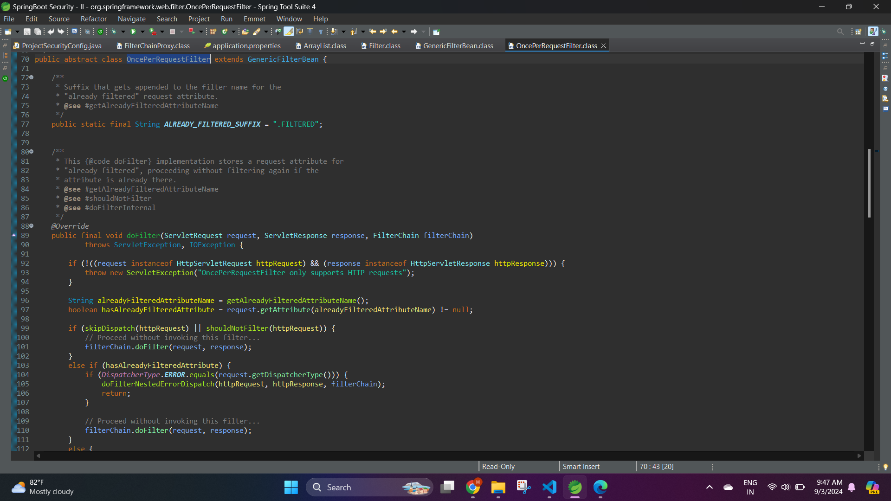

- There will be certain scenarios where the same request can be processed to multiple times inside the servlet container environment. In such scenarios, if you're looking for an option to execute your business logic only once, then this is the class that you need to construct to create your custom filter.
- Inside this class there is a method `doFilter()` as part of this, `doFilter()` the framework team, they have written a logic to make sure that your custom filter is going to be executed only once.
- This **OncePerRequestFilter** it also has other useful methods like `shouldNotFilter()`. This method you can use in the scenarios whenever you want your filter not to be executed under certain scenarios, maybe you may have a requirement that your filter should not be executed for certain MVC parts or for certain rest API parts.
- To create our own custom filter , we need to understand how to place our filter into the filter chain. So there are 3 ways to do so.

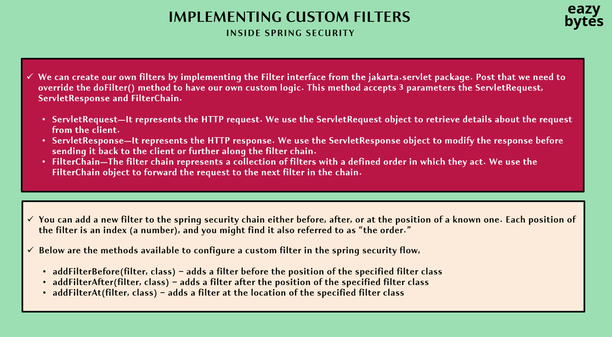

- Adding Custom filter after another filter in Filter chain

```
http.addFilterBefore(new AbcCustomFilter(), UsernamePasswordAuthenticationFilter.class);

In this example, AbcCustomFilter will be added after the UsernamePasswordAuthenticationFilter.
```

- Adding Custom filter before another filter in Filter chain

```
http.addFilterBefore(new AbcCustomFilter(), UsernamePasswordAuthenticationFilter.class);

In the example above, AbcCustomFilter is your custom filter, and it will be added before the UsernamePasswordAuthenticationFilter in the filter chain.
```

- Adding a filter at specific location but its order is not deterministic

```
http.addFilterAt(new AbcCustomFilter(), UsernamePasswordAuthenticationFilter.class);

In the above code, AbcCustomFilter will added before or after the UsernamePasswordAuthenticationFilter. This means UsernamePasswordAuthenticationFilter will present along with AbcCustomFilter, but  execution order cannot be determined.
```

- Lets create our own custom filter, our custom filter **UserIdChecker** will not authenticate the user if the user contains `test` as its user id. So basically before authentication **BasicAuthenticationFilter** we need to add our own filter.
- First lets hit the url `http://localhost:8080/login` using postman and lets see the console.

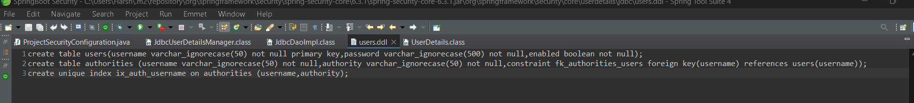

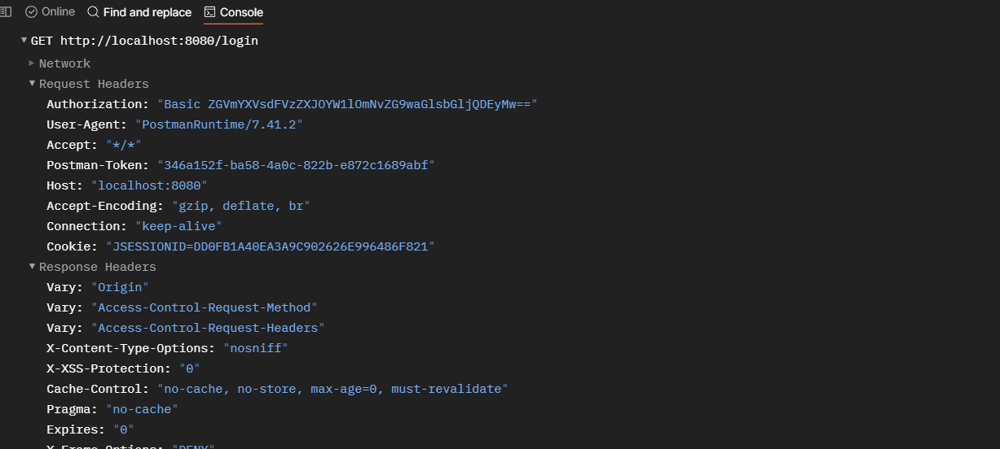

- Now under the request header, there is the authorization field which consist of base64 encoded format of **username:password**.

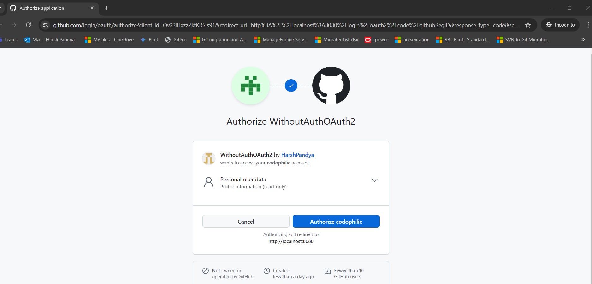

- Now to retrieve this user name and its password, to check the user id, we need to access the request header authorization using **HttpServlet** . Here we will be using **Filter** interface.

```
package com.eazybytes.eazyschool.filter;

import java.io.IOException;
import java.nio.charset.StandardCharsets;
import java.util.Base64;

import org.springframework.http.HttpHeaders;
import org.springframework.security.authentication.BadCredentialsException;
import org.springframework.util.StringUtils;

import jakarta.servlet.Filter;
import jakarta.servlet.FilterChain;
import jakarta.servlet.ServletException;
import jakarta.servlet.ServletRequest;
import jakarta.servlet.ServletResponse;
import jakarta.servlet.http.HttpServletRequest;
import jakarta.servlet.http.HttpServletResponse;

public class UserIDChecker implements Filter {

	@Override
	public void doFilter(ServletRequest request, ServletResponse response, FilterChain chain)
			throws IOException, ServletException {
		
		/**
		 * Converting ServletRequest To HttpServletRequest
		 */
		HttpServletRequest req = (HttpServletRequest) request;
		HttpServletResponse res = (HttpServletResponse) response;
		
		/**
		 * Fetch Authorization key from Headers
		 */
		String authorizationValue=req.getHeader(HttpHeaders.AUTHORIZATION);
		
		/**
		 * "Basic based64_Encoded_Format_Username_Password
		 */
		System.out.println(authorizationValue);
		if(null != authorizationValue) {
			authorizationValue = authorizationValue.trim();
            if(StringUtils.startsWithIgnoreCase(authorizationValue, "Basic ")) {
                byte[] base64Token = authorizationValue.substring(6).getBytes(StandardCharsets.UTF_8);
                byte[] decoded;
                try {
                    decoded = Base64.getDecoder().decode(base64Token);
                    String token = new String(decoded, StandardCharsets.UTF_8); // un:pwd
                    int delim = token.indexOf(":");
                    if(delim== -1) {
                        throw new BadCredentialsException("Invalid basic authentication token");
                    }
                    String userId = token.substring(0,delim);
                    System.out.println("User ID - "+userId);
                    if(userId.toLowerCase().contains("test")) {
                        res.setStatus(HttpServletResponse.SC_BAD_REQUEST);
                        return;
                    }
                } catch (IllegalArgumentException exception) {
                    throw new BadCredentialsException("Failed to decode basic authentication token");
                }
            }
        }
		
		/**
		 * Calling Next Filter chain
		 */
        chain.doFilter(request, response);
	}

}
```

- Lets configure project security

```
    @Bean
    SecurityFilterChain defaultSecurityFilterChain(HttpSecurity http) throws Exception {

        http.csrf((csrf) -> csrf.disable())
                .authorizeHttpRequests((requests) -> requests.requestMatchers("/dashboard").authenticated()
                        .requestMatchers("/", "/home", "/holidays/**", "/contact", "/saveMsg",
                                "/courses", "/about", "/assets/**","/login/**").permitAll())
                .formLogin(i->i.loginPage("/login").usernameParameter("customerId").passwordParameter("custPass")
                		.failureUrl("/login?error").successHandler(doSomethingWhenUserIsValid)
                		.failureHandler(doSomethingWhenUserIsInvalid)
                		)
                .httpBasic(Customizer.withDefaults());
        
        http.logout(i->i.logoutSuccessUrl("/login?logout=true").invalidateHttpSession(true)
        		.clearAuthentication(true).deleteCookies("JSESSIONID"));
        
        /**
         * Check if user id contains 'test'
         */
        http.addFilterBefore(new UserIDChecker(), BasicAuthenticationFilter.class);

        return http.build();
    }
```

- Post running, if user contains **test** as its user id, spring security will throw bad request.

<video controls src="20240904-0436-49.9943335.mp4" title="Title"></video>

- Here we have also tried `addFilterAfter` and we can see in the security filter chain list the ordering of our **UserIDChecker**.
- Lets use `addFilterAt` for a logging class

```
package com.eazybytes.eazyschool.filter;

import java.io.IOException;

import jakarta.servlet.Filter;
import jakarta.servlet.FilterChain;
import jakarta.servlet.ServletException;
import jakarta.servlet.ServletRequest;
import jakarta.servlet.ServletResponse;
import lombok.extern.slf4j.Slf4j;

@Slf4j
public class LoggingFilterAt implements Filter{
	
	
	@Override
	public void doFilter(ServletRequest request, ServletResponse response, FilterChain chain)
			throws IOException, ServletException {
		log.info("Validation is in progress..................");
		
		/**
		 * Calling Next Filter chain
		 */
        chain.doFilter(request, response);
     }

	
}
```

- Configure project security, the logging class may be execute before or after **UsernamePasswordAuthenticationFilter**.

```
    @Bean
    SecurityFilterChain defaultSecurityFilterChain(HttpSecurity http) throws Exception {

        http.csrf((csrf) -> csrf.disable())
                .authorizeHttpRequests((requests) -> requests.requestMatchers("/dashboard").authenticated()
                        .requestMatchers("/", "/home", "/holidays/**", "/contact", "/saveMsg",
                                "/courses", "/about", "/assets/**","/login/**").permitAll())
                .formLogin(i->i.loginPage("/login").usernameParameter("customerId").passwordParameter("custPass")
                		.failureUrl("/login?error").successHandler(doSomethingWhenUserIsValid)
                		.failureHandler(doSomethingWhenUserIsInvalid)
                		)
                .httpBasic(Customizer.withDefaults());
        
        http.logout(i->i.logoutSuccessUrl("/login?logout=true").invalidateHttpSession(true)
        		.clearAuthentication(true).deleteCookies("JSESSIONID"));
        
        /**
         * Check if user id contains 'test'
         */
        http.addFilterAfter(new UserIDChecker(), BasicAuthenticationFilter.class);
        
        /**
         * Logging Filter At
         */
        http.addFilterAt(new LoggingFilterAt(), UsernamePasswordAuthenticationFilter.class);

        return http.build();
    }
```

- Lets run the project.


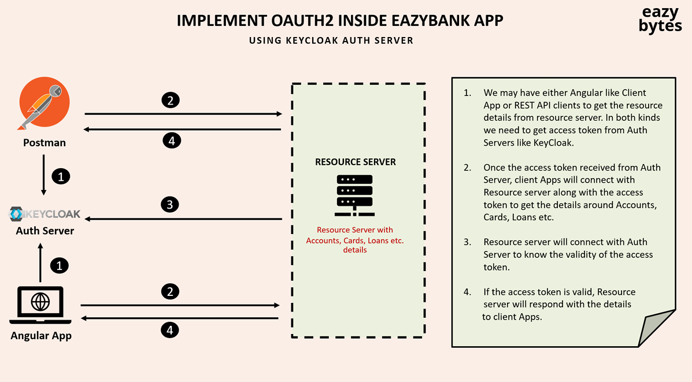

## Token

- In Spring Security, tokens are used to authenticate and authorize users without needing to share sensitive information like passwords repeatedly. Think of a token as a special key that you receive after you prove your identity (by logging in), and you can use this key to access various services without having to prove your identity again every time.

### Types of Token

1. **Opaque Tokens**:
    - **Simple Explanation**: Opaque tokens are like random, secret keys that don't contain any information about the user. When you present this token to a service, the service can't directly understand who you are just by looking at the token. Instead, the service has to check with a central server (like an authorization server) to validate the token and find out who you are.
    - **Analogy**: Imagine you have a membership card with just a number on it. The card itself doesn't tell the store anything about you; the store has to check its database to see what that number corresponds to (who you are and what you can do).

2. **JWT (JSON Web Token) Tokens or JOT Tokens**:
    - **Simple Explanation**: JWT tokens are like passports that contain some of your information, such as your identity and what you’re allowed to do, all packed into the token itself. When you present a JWT token, the service can read the information directly from the token to know who you are and what access you have, without needing to check with a central server every time.
    - **Analogy**: Imagine you have a passport that contains your photo, name, nationality, and visa information. When you show this passport, officials can see directly from the document who you are and what you're allowed to do, without having to look you up in a database.


- Opaque tokens need to be validated by the authorization server every time they are used whereas JWT tokens can be validated directly by the service because they contain all necessary information.
- Opaque tokens are just random strings with no user information whereas JWT tokens contain user information in a structured format (JSON) that is signed to ensure its integrity.

- Inside our web applications whenever we are using Spring Security framework, the Spring Security framework or the backend code, it is giving us two different types of tokens. The very first one is **JSESSIONID** token, and the other one is **XSRF-TOKEN**. So both these tokens, they are going to be stored as cookies inside your browser. Any further requests that you're going to make from your UI application to the backend, these two cookies, they're going to be automatically attached to the request on the backend side.
- The Spring Security framework is going to validate these tokens. So what is the advantage that we're getting with this token? With the help of **JSESSIONID** token, we don't have to send the username and password for every request on the backend server. Also, we don't have to perform the authentication for each and every request. So that's the purpose of **JSESSIONID** token, whereas with the help of **XSRF-TOKEN**, the Spring Security framework is trying to protect us from the CSRF attacks.
- So if you see here, these tokens are very simple tokens. They are just some random String values,but in real applications, you may get requirements to generate the tokens based upon advanced formats like JWT tokens. For critical applications,  you may have requirement to not store the token details inside the browser cookies as well. Inside such applications, you need to transmit the token from UI to backend back into UI continuously for each request, so these kind of techniques we're going to apply inside our web application to make it more secure.
- Inside the software industry in general, two types of token formats are going to be used by the enterprise applications. The two formats are **Opaque Tokens** and **JSON Web Tokens**.

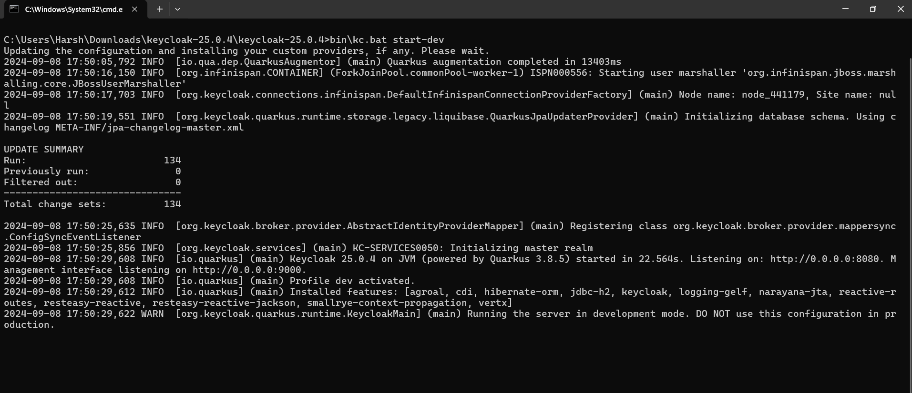


- Tokens are going to be generated during the authentication process. First, the client is going to send a request to the login page, the username and password. So here the client application, it has to submit the actual username and password of the end user. So the backend server, so this can be an authorization server or a normal Spring Boot-based web application. What it is going to do? is it's going to validate the credentials, and if the credentials are correct, it is going to give you a token as a response.
- The token can be Opaque Token or a JWT token. So once the token is generated, the same token has to be sent by the client application to the backend server whenever it want to access a secure API. So if this token is valid, the backend server is going to provide a proper successful response.

### Advantages of Tokens

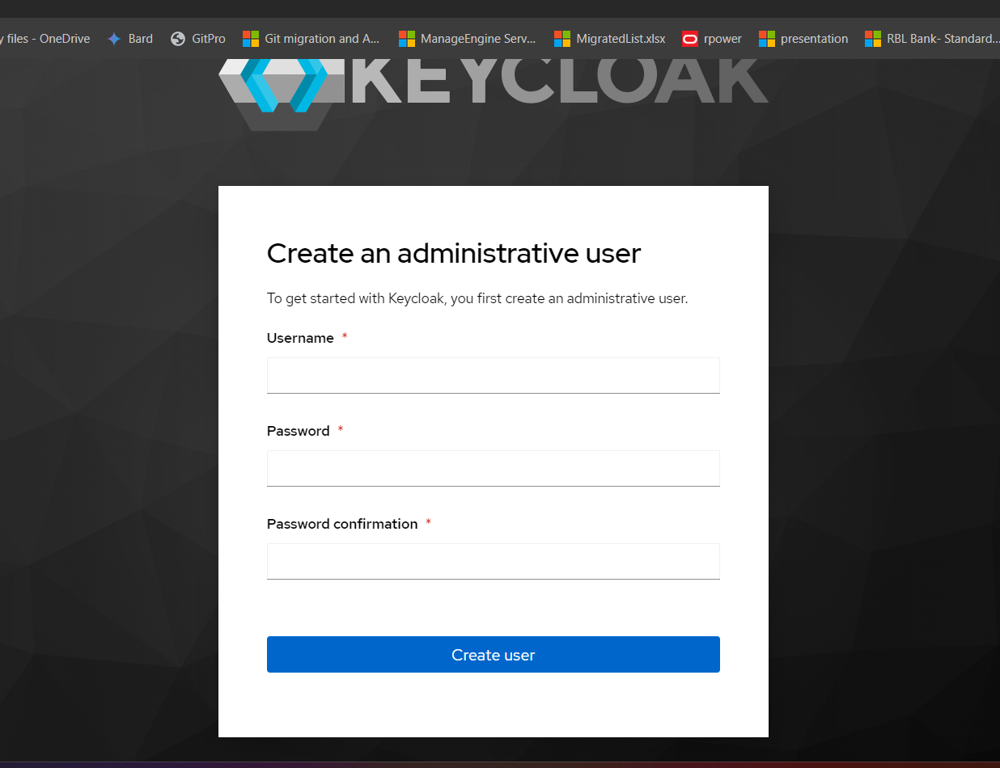


- The very first advantage is, whenever we are using tokens, it is going to provide limited exposure of the user credentials inside the network. What does this mean? The end user is going to share the credentials only once that is during the login operation. For all the remaining requests that the end user is going to make, the credentials are not going to be sent inside the network. Instead, the token is going to travel inside the network. So with this, we have one advantage, which is we are not necessarily exposing the user credentials to the network multiple times. In the scenarios when our an enterprise organization saw a suspicious activity where some hacker stole the tokens, what they can do is they can simply rework or invalidate all the tokens issued by the backend server. So when they invalidate the token, they are not going to actually invalidate the user credentials. So with this, what is going to happen is the end user is never going to be affected due to the data breach. Even if some hacker get holds of all the tokens, the authorization, organization don't have to worry much. They just have to revoke or invalidate all the existing tokens so that the end user, when he's trying to make the request, the login page is going to be displayed where the end user can enter actual credentials. So these are very first advantage around the **Security**.
- The next advantage is around the **Expiration**. Whenever an backend server is issuing an token, it have a flexibility to issue the token with a specific expiration time. The expiration time can be one hour or it can be one day, or it can be one year. So based upon your business requirements. So with this what is going to happen, the tokens automatically, they're going to be expired after a specific time so that even if a hacker get hold of all the tokens, they're going to be useless for him because they might have already expired. Usually for critical applications, the expiration time will be one hour, or sometimes it'll be even 30 minutes as well.
- The next advantage is around the **Self-contained**. This advantage comes into picture, whenever we use Jot tokens. Opaque tokens, we know that they don't have any Self-contained information but coming to the JWT tokens, they have the ability to store the necessary information about the logged in user about their roles and authorities. So from these Self-contained tokens, the client applications who received the token, they should be able to read the user information. They don't have to rely on the backend server or on the authorization server every time to know the end user details. Instead, they can read the token itself to know the user details.
- The next advantage is around the **Reusability**. Let us take a scenario to explain this about this Reusability. Take the scenario of Google. So Google has lot many products under them, like it has maps, it has Gmail, it has photos, it has YouTube. So there are good amount of products under the same company, which is Google or Alphabet. So for all these applications, there is only going to be a single auth server, which is going to issue the tokens. So when an end user logged in into his Gmail account, inside a browser is going to get a token. So this token is going to receive from the auth server. Since this token is already present inside his browser as part of a cookie, what is going to happen is if this end user, if the end user try to access another product of the Google inside the same browser, then the authentication is not going to happen one more time. Instead, the same token will be leveraged by these applications like photos, YouTube, and maps, here the end user only logged in into his account once, and the token that the end user received can be used across applications. So this is where the advantage of Reusability. This concept is also called **Single Sign On (SSO)**.

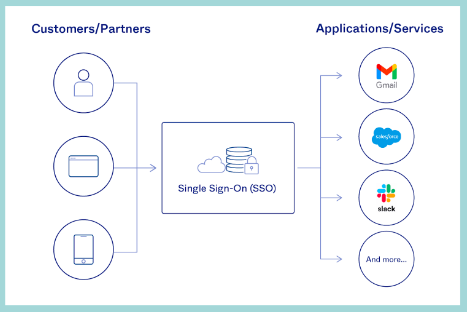


- Your organization may have multiple internal applications. Are you going to log in into all these multiple applications multiple times? Off course not you are only going to log in once, and the same access token can be leveraged by all other applications as well. So this kind of behavior, we call it as **single sign-on**.
- The next advantage is **Cross-Platform compatibility**. The tokens that are going to be generated during the authentication process, they can be used across various platforms and devices. The same token that is issued by your backend server can be used inside web application, mobile applications, and IoT devices as well. 
- And the last and the greatest advantage is, **Statelessness** of the tokens. Whenever we are using tokens, they're going to contain all the information to identify the user, eliminating the need for the session state inside an application. Any user information that is going to be required by an application, since it is already going to be available as part of the Jot tokens, the applications, they don't have to remember the user information. With the help of sessions, with that, your application is going to be capable of becoming **Statelessness**. This Statelessness feature is a mandatory for microservices. So inside microservices, since we are going to have multiple microservices inside an organization, they should be built with the Statelessness. With this Statelessness, what is going to happen is if one microservice, even though it has multiple instances like I1, I2, and I3, the request can go to any of these instances because the microservice is Statelessness. So how the Statelessness is assured? With the help of tokens. So any user information that this microservice instance is looking, it has to read the token and it has to understand the user information.

### JWT Token

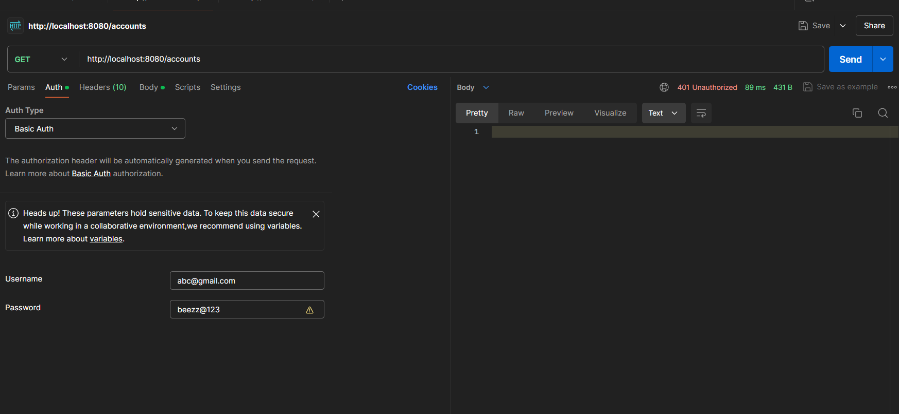

- What is the format of Jot token and how to generate them? The reason why they are called a JSON web token is this token implementation uses the JSON format and designed to use for the web request. These Jot tokens can be used in the scenario of authorization and authentication. Every Jot token, it is going to have three parts separated by a period `.` So here we have given a sample Jot token. Whatever you see highlighted in yellow color, we call it as **header** part. And after the header, there is a period (`.`), which is a separator between the header and **payload**. After this first period, whatever you see highlighted inside the green color, we call that part or component as payload. After the payload, we are again going to have a period (`.`), which is going to act as a separator between components inside the Jot tokens. At last, whatever highlighted in white color we call this component as **signature**. So this signature component is optional, but both the header and payloads are mandatory always.

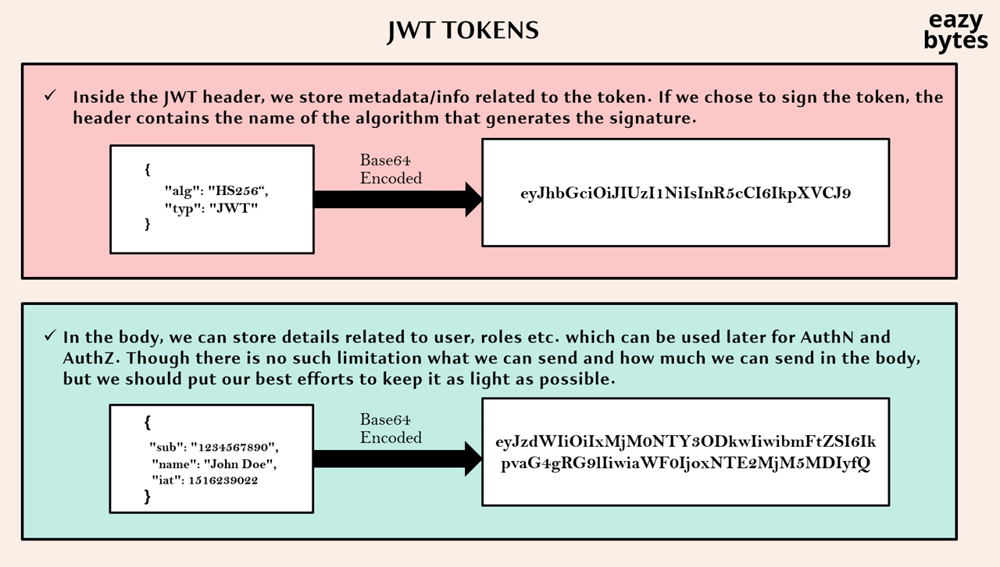

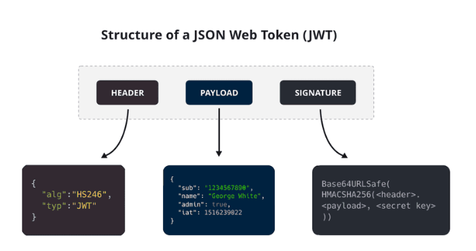

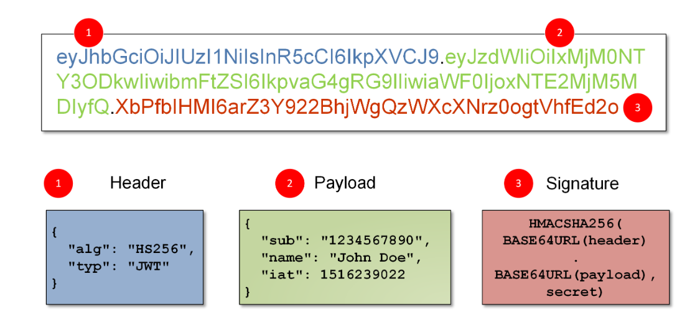

- The very first component that we have is **Jot header**. So inside the header we usually store the metadata information related to the token. When I say metadata information, it will have information like what is the type of the token, what is the algorithm that we have used to derive the signature of the token? So all these kind of meta-related information, they're going to be present inside the header. So if you see here this header is a JSON, it has a key alg, which means algorithm HS256, followed by type. So both of them they have some values, but inside Jot tokens, we are never going to store as plain values inside the token. Instead, these values we are going to encode with the help of Base64, and the output we're going to store inside the Jot token. So that's the purpose of header. So header is always going to have the metadata information about the token itself.
- The next component, which we can call it as body or **payload**, in this component, we can store details related to the user, their roles, which can be used later for the authentication and authorization. Though there is no such limitation on what we can send and how much we can send inside the payload of the Jot token, but we should always put our best efforts to keep this payload component as light as possible. So here you'll be able to see this is the sample payload JSON object. Inside this, we are trying to store lot of user-related information, like subject, name, issued at the time. Similarly, we should be able to store their roles, authorities, their email, phone number details. So whatever needed for our business logic, we should be able to store all such information inside the payload of the Jot token. But don't try to store the password of the end user inside the payload because if you try to store the password of the end user inside the payload body, anyone who has access to your token, they should be able to see the password. The reason is very simple. All your payload data, they're going to be Base64 encoded, and the encoded value they're going to be stored inside the Jot token.

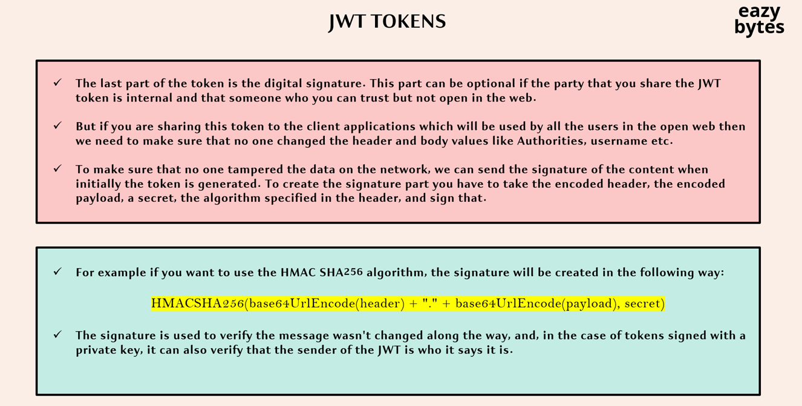

- Let's try to understand the purpose of the last component inside the Jot token, which is signature. In other words, we can call these last part of the token as digital signature. It is completely optional. The purpose of this digital signature is, using this signature only, the applications they're going to identify whether the token value is tampered or not. Whenever someone tampered the token body value or the header value or the signature value itself, it can be easily detected with the help of this digital signature. If you are trying to generate a token for an application which is internal to your organization, and if you're sure that the token is not going to be tampered by the client applications or by your trusted users, in such scenarios, there is no need of digital signature because you have that confidence that no one is going to tamper the tokens inside your own network. But in the scenarios where you are going to generate the tokens for the client applications or for the end users who are going to use your application from the open web, then in such scenarios, you need to make sure that the Jot token also has digital signature.

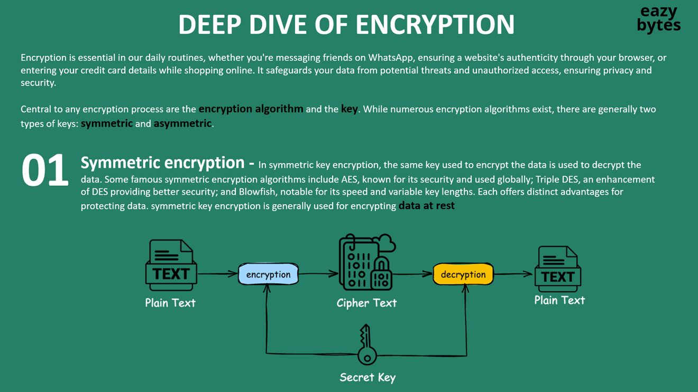

- In order to generate the digital signature from the token, we need to use one of the hashing algorithm. So this **HMACSHA256** is the most commonly-used hashing algorithm. To this hashing algorithm, we need to send the input. So the input is calculated by Base64 URL encoder of the header. So the header is going to be again encoded with the help of Base64 URL encode format only to get signature. Later on, we need to add a period, and at last we should also Base64 URL encode the payload. The next input is the secret value that you want to involve. So this secret value, you need to keep carefully with you. **You should not lose this secret. Usually this secret value is going to be maintained carefully on the backend side**. Using these 3 component we get a signature.

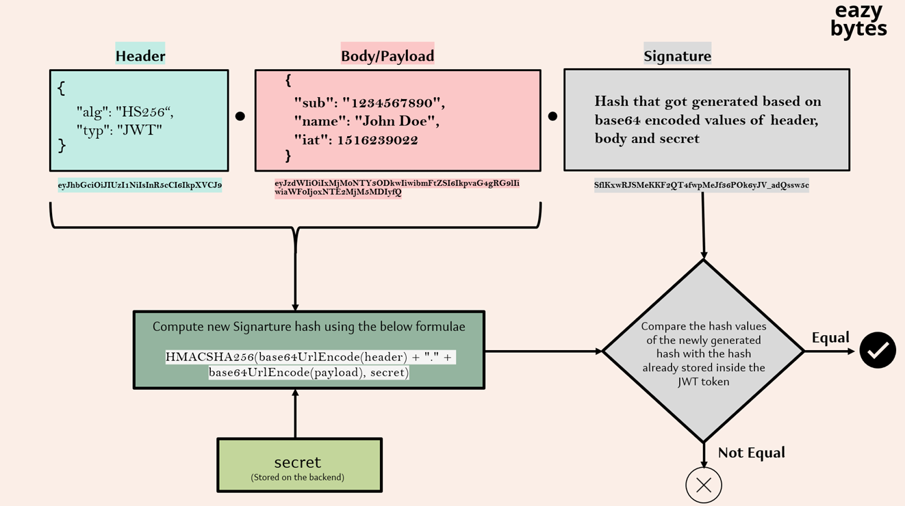

- Let's try to understand how the tampering is possible and how this tampering is going to be detected with the help of digital signature. Let's imagine one of the end user, he's trying to log in from an UI application. So the end user will enter username and password. As soon as we press Enter, the call will go to the backend application. So inside the backend application, we have the logic to generate the Jot token. If this username and password entered by the end user is valid, the backend server, it is going to generate a Jot token, and it is going to have header, payload, and digital signature. We know how the digital signature is going to be generated by the backend. It is going to use an hashing algorithm. And to this hashing algorithm, it is going to provide the Base64 URL encoding of header payload as first input parameter. And the second input parameter is a secret **which is known to the backend server only**.
- Once the Jot token is generated, this is going to be sent as a response to the browser or to the client application. Let's assume inside the payload or inside the body of the Jot token, the role of the end user is mentioned as **user**. Let's assume the end user who logged in into the application, he's a hacker, So what he's going to do? he will check for the Jot token that he has received inside the response. He should be able to tamper the token value. So the tampering that he's going to do is he will try to change the role to admin, which means he's trying to elevate his privileges inside the application. So once the role value is changed, he's going to generate the base64 encoded value of the payload, and the same he's going to update inside the Jot token. So this updated Jot token can be sent backto the backend server for the further request. Maybe inside the second request, the end user might try to the `/admin` path with this role admin, and he will be under the assumption that the backend server is going to give you a proper response, but that is not going to happen? The backend server, which initially generated the token, it is going to validate the token if there is any tampering happen. Since the tampering happened here, it is going to throw an 403 error. 
- To identify the tampering scenario, so if the end user or if the client application, if they try to tamper even a single character inside the payload or inside the header or inside the signature, it is going to be easily detected by the backend application. How it is going to detect this? whenever the backend is receiving the Jot token in the future requests, the backend server it is going to perform the same calculation again. It is going to take the header, payload, and feed as a first input parameter to the same hashing algorithm along with the secret value that is known to the backend server only. If the input of the hashing algorithm is changed by even one character, it is going to get a different hash value as an output. And if the newly-calculated hash value is not matching with the signature value present inside the token itself, then it is going to enter into the not equal scenario. Otherwise, it is going to enter into the equal scenario.
- What if the end user changed the signature itself to match the tampered payload value or tampered header value? So the hacker can't do that because the hacker don't have the secret value. So if someone get this secret value which is being maintained by the backend, they should be able to generate the successful tokens with whatever data that they want. So that's why always securing the secret properly inside your backend application is most important.
- To check practially how JWT token works , refer the website [here](https://jwt.io/)


