# SpringBoot Security III

## OAuth2 (Open Authorization 2.0) - Theory

### What problems does OAuth2 solves?

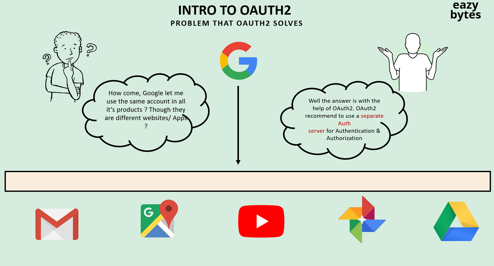

- 100% of the enterprise organizations or enterprise projects, they leverage OAuth2 to implement authentication and authorization inside their applications. Only smaller organizations or some startup organizations or some low-critical applications, they're going to ignore the OAuth2 framework.
- We all use this various Google products. Google has primarily Gmail as a product. They also have Google Maps, YouTube, Google Photo, Google Drive. So similarly, there are many other applications which are developed and maintained by Google or Alphabet. All these applications of Google, they have their own separate code base. They're going to be deployed in different, different servers. But have you anytime wondered how all these Google products, they allow the same credentials as an input? We as an end user, whenever we want to use any Google product, we need to create our own account with the help of Gmail. So the same Gmail credentials you can use to authenticate in all the remaining applications. For example, if you want to use YouTube to see the videos or to upload some videos, we can log in into these YouTube mobile application or web application with the Gmail credentials that we have created previously. The same applies for the remaining Google products.
- So how this is possible is ? behind the scenes, Google as an organization, it is following the OAuth2 standard or OAuth2 framework. So whenever someone is following the OAuth2, it has a separate authorization server. So this separate authorization server, it is responsible for storing the end user credentials, and the same Auth server is also responsible for end user authentication and authorization. So initially, when an end user register into the Gmail account, a separate Auth server will handle the registration process and will store the end user credentials. The same Auth server will be used by all the applications inside Google to authenticate the user and to perform authorization of the end user. This way, we as an end users of Google products, we don't have to create different, different accounts in different products and we don't have to maintain different credentials for different products of Google.
- So the responsibility of this Auth server is, it is going to perform the authentication of the end user and it is going to issue the tokens during the login operation. The same token can be used with the other applications as well. For example, inside one of my browser tab, think like, you have logged in into your Gmail account. With the help of Auth server, you will get a token. Now, this token will be saved somewhere inside your browser. Maybe after a few hours or maybe after few days if you try to open one of the different product of Google like Maps or YouTube or Photos or Drive, it is not going to ask you the credentials again, it is simply going to use the same token that is available inside my browser. And with this token, the authentication and authorization is going to happen without entering any credentials.
- Let's try to take one more scenario and try to understand what are the advantages that we get if you try to maintain a separate Auth server inside an organization.


- Think like, there is a bank application which has multiple websites supporting accounts, loans, and cards. If these bank application, if they're not following the OAuth2 framework, then the bank customers, they have to register and maintain different user profiles in all the three systems. So there is a Loans application, Cards application, and Accounts application. Inside each of these applications, if they have their own authentication and authorization logic, then the end user will end up creating different credentials for different applications, and all these credentials are going to be stored in different storage systems.
- So here, clearly, these people, they're not following the OAuth2 framework inside the bank organization. With these, we are going to have multiple challenges. The very first challenge or drawback is the security-related logic like authentication and authorization, it is getting duplicated in multiple places. Though all these three applications, they have the same logic, it is getting duplicated across different applications. So in future, if there is a requirement change around the authentication and authorization, the same has to be done in all these three places. So this organization has only three applications. Inside microservices environment, we'll have hundreds of microservices. So maintaining all the security-related logic in each of the microservice individually is going to be a cumbersome process.
- The next challenge is, think like, this loan application has issued a token during the login process to the client application. So the same token is not going to make any sense to the other applications. That's other app, they're going to reject that token. They always accept their own credentials, and they're going to issue their own tokens during the authentication and authorization process.
- It is recommended that always try to separate your security-related logic into an Auth server so that your individual applications, they are going to simply have the logic related to the business logic. This way, you are not clubbing the business logic with the security logic.
- OAuth2 framework tries to solve **Delegated Authentication or Authorization** issue.

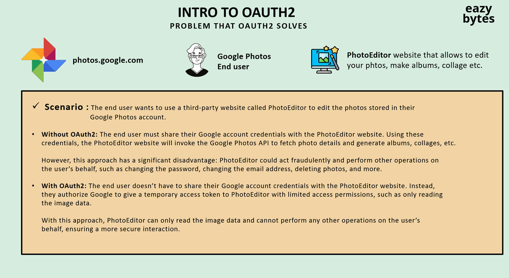

- Think like you are an end user who maintain all your photos inside the Google Photos, and there is a third-party app with the name PhotoEditor. So this PhotoEditor third-party app, it is going to allow you to edit your photos with the help of AI, and it is also going to help you to create albums out of your photos. It is also going to help you to create collage of your photos.
- Since this third-party app is providing all these features, you decided to use this third-party app. So let's try to imagine this scenario without OAuth2. In a very common basic scenario, what you're going to do? You're going to download the photo from your Google Photo. The same you're going to upload into the PhotoEditor for performing some edits because the PhotoEditor has its own credentials for you login process. So this is going to be very cumbersome process.
- So to make your life easy, PhotoEditor, they supports integration with the Google Photos. The PhotoEditor third-party app, it is going to ask the end user to provide his Google Photo credentials. Though sharing the Google credentials directly to this website is a risky option. So the guys who develop this website, if they're good, what they're going to do, they're going to use the credentials of this end user, and with the help of these credentials, they're going to read the photos from the Google Photos website. Once the photos are loaded inside this PhotoEditor application, they're going to perform some editing or creating albums or creating collages. If the guys misuse your credentials, they could delete your photos and perform malicious activity using it on other products. They can perform all the actions that you can perform as an end user inside the Photos website.
- Now, let's try to imagine the same scenario with the OAuth2. So with OAuth2 what is going to happen is, the end user will not share his Google credentials to the third-party application. Instead, OAuth2 going to let Google Photos to issue an temporary access token.Using this temporary access token, the PhotoEditor app, they can only read the photos from the end user Google Photos account. With the access token that is issued by the Google Photos on behalf of the end user, it is only useful to read the images or to load the images. Apart from reading, they can't delete the photos, they can't change the email, they can't change the password. Any other operations will straight away rejected by the Google photos because the access token issued to the third-party app does not have enough privileges.
- So whenever we are using OAuth2, what is happening? The end user delegating the authentication and authorization to the PhotoEditor app to read his photos from the Google Photos. And whenever the end user feel like he no more needed the services of this website, he can easily revoke the permission that he has initially issued to this website by logging into the Google account.

### About OAuth2


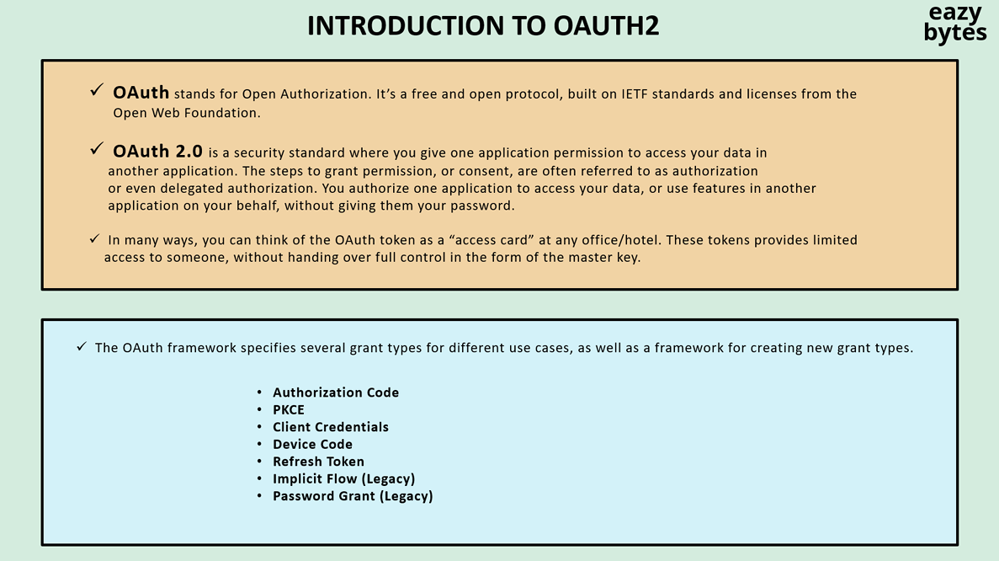

- OAuth2 stands for **Open Authorization**, so whatever number you see, which is 2.0, this represents the current version of OAuth2 framework that is being used by everyone. In short, we can call this OAuth 2.O as OAuth 2.
- Before OAuth 2, there used to be a framework with the name OAuth 1, which is the very first version of OAuth. Since this OAuth 1 has lot many drawbacks, this OAuth 1 is updated with the newer version with the name OAuth 2 by addressing all the latest security standards.
- OAuth 2 is a free and open source protocol that is built by the open source community. When we say OAuth 2, it is a security standard, or it is a protocol, or it is a specification that every organization has to follow whenever they're trying to implement authentication and authorization inside their organization.
- So don't be under the assumption that OAuth is a product or it is a library. With the help of OAuth 2, the open source community, they only declared the standards or rules and regulations that everyone has to follow. By leveraging all these standards, many organizations, they build their own authorization server that follows OAuth 2 framework.
- With the help of OAuth2 framework, we can give one application permission to access your data in another application. We can authorize one application to access our data or features in another application on our behalf via tokens also called access tokens. So this can be achieved without actually giving them our password or credentials (the example of PhotoEditor scenario)
- Whenever an access token is issued to a client application or a third-party application, with the help of that access token, they should be able to read that data of the end user. So with the help of this access token, they should be able to perform only a limited functionality. So this access token is very similar to the access card that we are going to be issued at any office or hotel. So with the help of access card, we should be able to go to our particular floor or our particular desk or our particular room.

>[!IMPORTANT]
> - OAuth 2.0 stands for Open Authorization 2.0, an authorization protocol that allows a website or application to access resources on behalf of a user. It is the industry standard for online authorization. 
> - OAuth 2.0 works by using access tokens to grant temporary access to third parties. These tokens can have an expiration date and can be stored securely by clients


- The beauty of OAuth 2 framework lies inside the grant types that it is going to support.

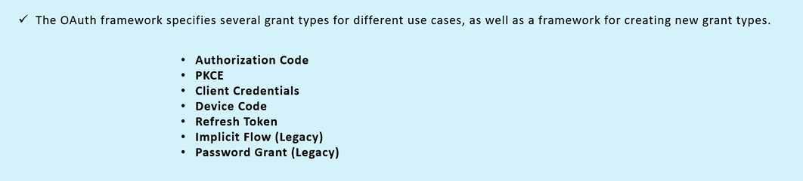

- So based upon the type of application or based upon the scenario that your organization is into, you need to follow one of the grant types that are supported by the OAuth 2 framework. So inside the [OAuth 2](https://oauth.net/2/) specifications , there are clear guidelines explaining about which grant type flow that we need to use under which scenario.
- For example, if an end user is involved during the authentication and authorization process, then we can use either of the **Authorization Code or PKCE** grant type flow based upon the type of our application. If your application is built using the JavaScript frameworks, like, Angular, React, or mobile applications, in such scenarios, you need to use **PKCE**. Otherwise, you can safely use Authorization Code.
- The next grant type flow that we have here is **Client Credentials**. So these Client Credentials, we need to use whenever two different backend applications or two different APIs, they're trying to communicate with each other. So in these scenarios, the end user is not involved.
- Whenever two different devices or IoT applications, if they're trying to communicate with each other, we need to use the **Device Code** grant type flow. 
- Similarly, there is a **Refresh Token** grant type flow that can be used in the scenarios whenever an access token is expired and if you're looking to get a new access token.
- **Implicit flow** is very similar to the Authorization Code grant type flow, but it's a older version of Authorization Code grant type flow, which has some drawbacks. That's why this **Implicit flow** is deprecated right now. The **Password grant** type flow is also a flavor of Authorization Code grant type flow, and this is also deprecated due to its drawbacks.

### OAuth2 Terminology

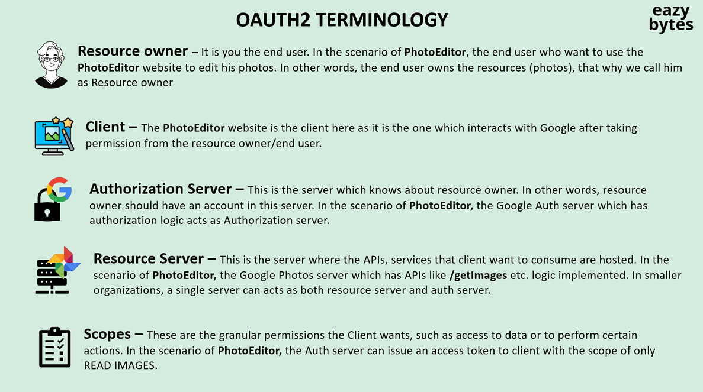


- Lets see about these jargons used in OAuth2 
- In the scenario of PhotoEditor, the Resource Owner refers to the end user who owns the photos inside the Google Photos application. So in the scenario of PhotoEditor, what are the resources that everyone tried to get? The resources are images or photos. So who owns those photos? The end user. That's why we call the end user as **Resource Owner**.
- **Client** is an application which is trying to read the end users resources or the Resource Owner resources. So in the scenario of PhotoEditor, the PhotoEditor application, our website, it is going to be called as client because this is the application which is showing some interest to interact with the Google after taking enough permissions from the Resource Owner or the end user.
- **Authorization Server** so this is the server which knows about the Resource Owner. In other words, the Resource Owner should have an account inside these Authorization Server. In the scenarios of PhotoEditor, we can consider Google Auth server as the Authorization Server because it is going to have all the authorization logic. So always remember auth server which is responsible to store the end user credentials and to perform the authentication and issue the access tokens.
- **Resource Server** this is the server where the resources are going to be stored. If the client application want to read the resources or the images of the end user, the client application needs to reach out to the Resource Server. We are calling this as a Resource Server because this is the server which holds all the resources, and it is going to expose enough APIs and services to the client applications so that they can consume and get all the resources that they want. So in the scenario of PhotoEditor, the PhotoEditor application, it is going to call the `/getimages` API, which is exposed by the Google Photos resource server. So when client application asks for the resources, obviously, the resource server will expect an access token before providing the response. **So how to get the access token?, the client first has to reach out to the authorization server to get the access token. Once the access token is received, using the same access token, it can reach out to the Resource Server to fetch the resources**.
- In smaller organizations, there is a good possibility that a single server can act as both resource server and auth server. As of now, the spring boot application that we have built so far, though, we're not following any OAuth 2 standards, we clubbed all our business logic and security logic into a single application. That's why we can call our spring boot application as both auth server plus Resource Server.
- **Scopes** are the granular permissions the client wants, such as access to data or to perform certain actions. In the scenario of PhotoEditor, the auth server can issue an access token to client with the scope of only reading images. So since the scope is only read images, if the client application trying to invoke the Resource Server to delete an image, then it is going to get an 403 Error because it does not have enough privileges. So these scopes, in other words, we can call it as authorities or roles.

### OAuth2 Flow

- Lets take an example , when we login on LinkedIn we get below page.


- If you see here, we have option to sign up using email or use social login. LinkedIn website is also supporting social login. So what is a social login? Social login is a process where we can quickly sign in into a third party application by entering our social credentials from Google or Apple or Facebook, Twitter, GitHub, LinkedIn. So since all these Google, Apple, or any other social organizations, since they are very big organizations, they have their own authorization servers.
- So whenever we use social login option, what is going to happen? your profile details which are stored inside the Google auth server, they are going to be fetched and given to the LinkedIn. So LinkedIn behind the scenes, what it is going to do is, by taking your profile details from Google or Apple, it is going to create an account for your very quickly.
- So in future, whenever you want to log in into this application, you just have to use the same option, which is sign in with Google. And with that, your authentication is going to be super quick.
- What happens behind the scene? behind the scenes, what LinkedIn is going to do is before it try to enable this button on this website, they will approach to the Google team and express their interest in using social login in the LinkedIn website, and Google team, what they're going to say, they'll say, "Um fine, you just have to create your own details inside my Auth server so that the integration between Auth server and LinkedIn is going to work seamlessly."
- So if you go to the official [documentation](https://developers.google.com/identity/protocols/oauth2) of OAuth 2.0 from Google inside this website, you'll be able to see what are the steps that any organization has to follow if they want to use Google as an auth server inside their websites.

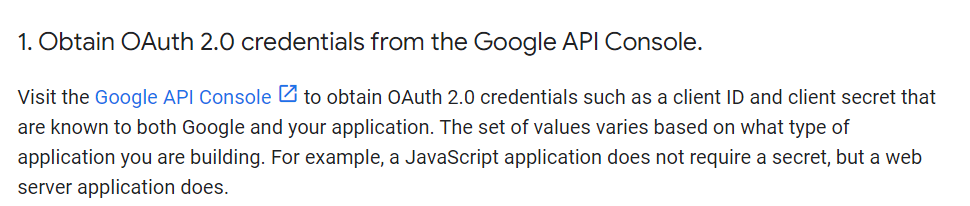

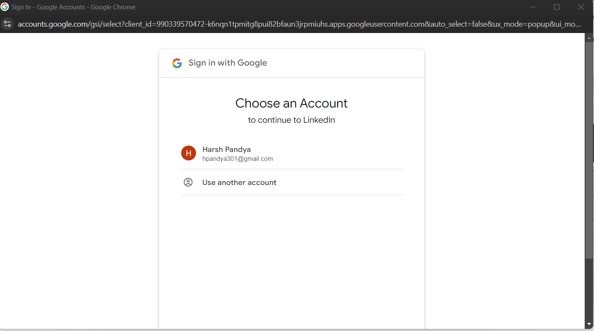

- So first, the organization like LinkedIn, they have to register themselves to get the client ID and their client secret. So these credentials are different from the end user credentials. These client ID and client secret, they're going to be used by the Google Auth server to identify which client application is trying to invoke the authentication or authorization process. Here, the client is going to be LinkedIn, so LinkedIn is going to get its own ID and secret, which it has to use while it is trying to invoke the authentication process here. So here, if you click on the sign in with the Google, it is going to redirect you to the Google login page. You can see the domain, `accounts.google.com`, and here there is a client ID which, so this client ID represents LinkedIn. So based upon this client ID only, Google is trying to give your information that sign in with your Gmail so that you can continue to use LinkedIn. So this LinkedIn information is coming based upon this client ID. As soon as you click Next, google will take your consent which states like **by continuing Google will share my name, email address, language preference, profile picture with the LinkedIn**.
- So here, as soon as you click continue, behind the scenes an access token will be issued by Auth server. The same will be sent back to the LinkedIn, and LinkedIn will land me onto their website.

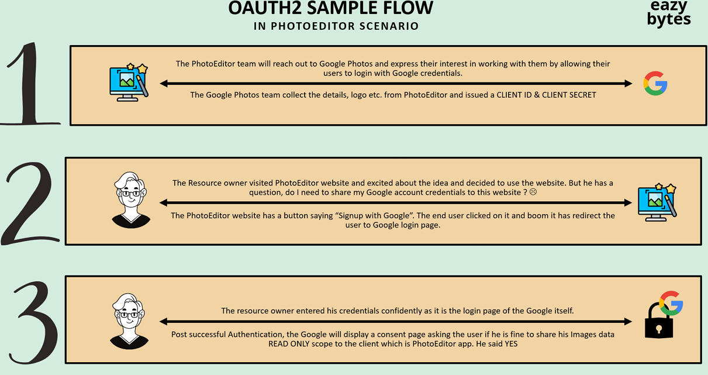

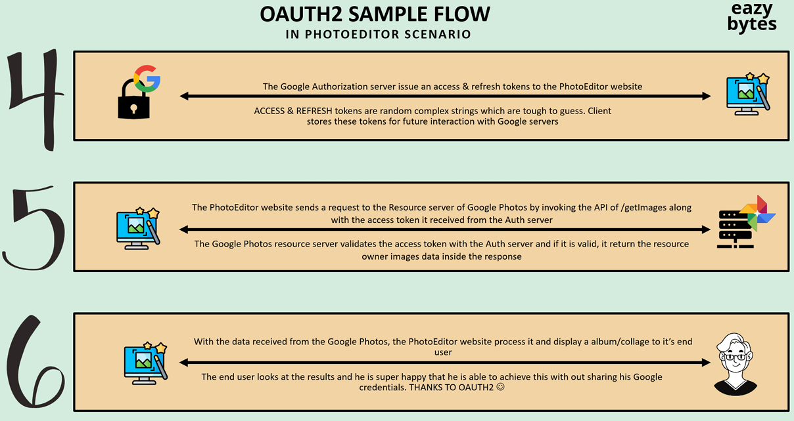


### Grant Type - Authorization Code 


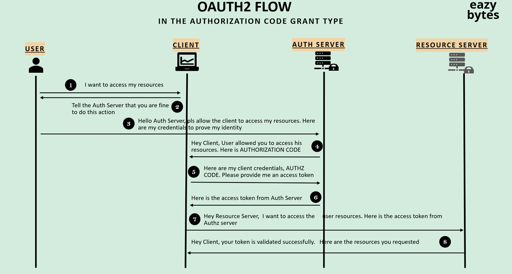


- **Authorization code grant type flow must be used when an end user is involved during the authentication process. If there are no credentials that are going to be entered by end user, then this is not the grant type flow you need to use**.
- Whenever we try to adopt authorization code grant type flow. Inside this grant type flow, There'll be four different components or parties involved. The very first party is end user. End user, in other words, we can also call as Resource Owner. The second component is Client application followed by Auth Server, followed by Resource Server. So this Client application and Resource Server can belong to different organizations, or they can belong to the same organization. Regardless of their relationship, this authorization code grant type flow, it's going to work very similarly.
- In the very first step, the end user or the Resource Owner, he'll go to the Client application, and he'll try to perform some action which indicates that he want to access his resources. So this Client application can be a mobile application or a UI application. Whenever an end user requested a resource to a Client application, the Client application will simply respond to the end user inside the step two saying that, please work with the Auth Server and tell the Auth Server that you are fine me doing an action on your behalf. So how this is going to happen? Simply the Client application is going to redirect the end user to the login page of the Auth Server. 
- Inside the step three, the Resource Owner or the end user is going to tell to the Auth Server, please allow this client to access my resources. But that Auth Server is going to say, hey, I'm fine doing that. But you as an end user are a Resource Owner so first you prove your identity. So how the end user is going to prove his identity? He's going to enter the username and password inside the login page of the Auth Server. If the credentials that are entered inside the step three are valid, as part of the step four, the Auth Server is going to send a response to the client application saying that so-and-so end user seems to be fine to access his resources, so here is your authorization code. **So this is not an access token. This is a temporary authorization code that is going to be issued by the Auth Server to the client application**. So as part of the step three, the end user proved his identity.
- As a next step, the client also has to prove its identity by sharing its client secret. So that's why as part of the step five, what is going to happen is the client application, it is going to send a request saying that, here are my client credentials. When you say client credentials, it will be **client_id** and **client_secret**. So both of them we can together call them as **client credentials**. Along with the client credentials, it should also send the same Authorization Code that it has received as part of step four.
- So by providing all these details, **it is going to request the auth server to issue an access token**. If all the details are valid, as part of the step six, the Auth Server, it is going to issue an access token to the client application. By the time the step six is completed, now the client application has the access token. So now using this access token, it is going to call the Resource Server saying that I want to access so-and-so end user resources, and we know resource server won't be giving the client if its ask directly, that's why the client worked with the Auth server and got an access token, and this is the access token for your reference. So that is what is going to happen as part of step seven. 
- So inside the step eight, the Resource Server is going to validate if the access token is valid or not. If the access token is valid, it is going to send the actual resources requested by the client application as a response. So these resource detail will eventually display to the end user. So this is how the authorization code grant type flow works.
- But how the Resource Server is going to validate the access token is issued by the Auth Server? this token can be issue by any other server right? there is no direct communication between resource and auth server? it is done using **JWT Token**. Inside the JWT tokens, there is a digital signature concept. Using the digital signature concept, one can validate if the token is valid or not by them self without the need of reaching out to the token-issuing component.
- Okay but the client may have other products or pages , now how auth server will which of its pages does the user needs to be landed up? the answer is based on the request format that Client application is going to send to the Auth Server.

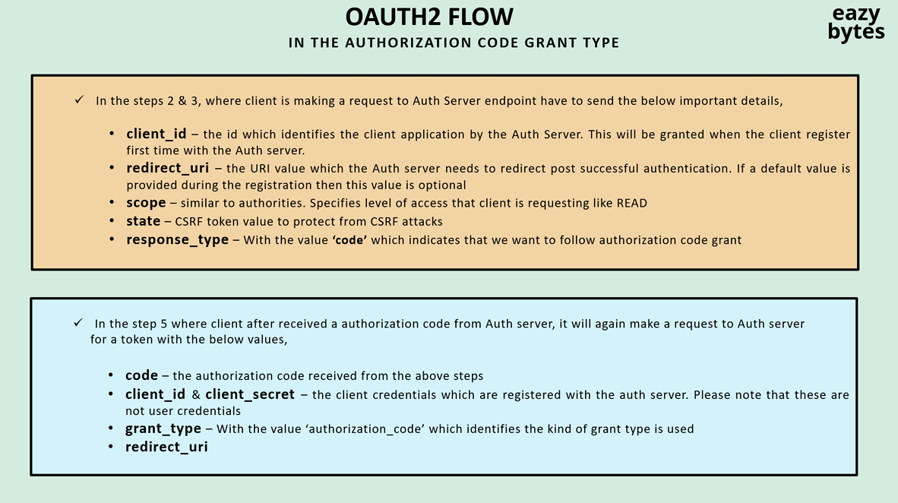

- **As a part of step 2 & 3**, where the end user identity is going to be verified by the Auth Server, what client application it is going to do is, it is going to send the **client_id only**. So using this **client_id**, the Auth Server can identify the details of the client application, and the same details, it is going to show you on the login page of the auth server saying that so-and-so client is trying to access your resources. Are you fine with that? So this kind of consent the Auth Server is going to show based upon this client_id that it received as part of step two and three.
- Apart from client_id, the client application, it is also going to send other details like **redirect_uri**, scope, state, and response_type. The purpose of **redirect_uri** is very simple. Inside these request parameter only, the client application is going to mention what is the URI value that the Auth Server needs to redirect post to end user's successful authentication. And inside the scope, the client application is also going to mention what are the authorities or what are the level of access that the client is looking inside the Resource Server.  For example, if the client is looking for the READ scope. So inside the state request parameter, we are going to send a randomly generated CSRF token value. So this is to protect from the CSRF attacks. At last, inside the **response_type**, the value **code** is going to be mentioned, because as part of the step two and three, the end user identity is going to be verified. If the end user identity is verified, the client application is expecting an **Authorization Code** as its response
- The Auth Server, it is going to redirect the response to the **redirect_uri** with the Authorization Code. Once the Authorization Code is received by the client application, what it is going to do is, **as part of the step five**, it is going to prove its own identity. So that's why this time inside the request, it is going to send both the **client_id** and **client_secret**. Along with these client_id and client_secret, it is going to send the same Authorization Code value that it has received as part of step four. And this time, it should also mention **grant_type** inside the request. The value of **grant_type** should be **Authorization Code**, because we are expecting an access token belongs to an end user. So that's why we need to mention this valid value, which is Authorization Code. Apart from grant_type, it is also going to send the redirect_uri, which is going to have the URI details that Auth Server can be used to redirect the response after issuing an access token. So whatever CSRF token value that we have mentioned initially under this state, it is going to play a very important role to avoid the CSRF attacks.
- If you see the flow, **why in the Authorization Code grant type flow, client is making requests two times**? The very first time it is trying to make a request to get the Authorization Code, followed by another request to get an access token.
- Lets take a demo of it. So on internet there is a [OAuth2 playground](https://www.oauth.com/playground/index.html) available which help you understand the OAuth authorization flows and show each step of the process of obtaining an access token.
- So now first we need to have a client and a user details.

<video controls src="Images/springbootsecurity3/20240907-1658-41.5085194.mp4" title="Title"></video>

- So here we have a user details like email id **muddy-worm@example.com** and password **Inquisitive-Pig-95** and client details like id **YKd9xgF9JEkrUfBwc97fyeMq** and client secret **UzfP3D5v8xNen82j09dW7ofgLm0O61dITG-77YLCCKzeoXIl**. Now this playground directly takes the client credentials just for demonstration, now click on **Back to flows**.

<video controls src="Images/springbootsecurity3/20240907-1702-30.7567721.mp4" title="Title"></video>

- Now in the real time, client will built a authorization url or a request, it consist of below things.

```
&client_id=YKd9xgF9JEkrUfBwc97fyeMq
  &redirect_uri=https://www.oauth.com/playground/authorization-code.html
  &scope=photo+offline_access
  &state=3bVTRpV0nbHf173k
```

- Here instead of CSRF token, a random string is generated for the **state**. If you observe here the **client_secret** is not specified because first the user credentials authentication occurs (**step 3 in the image**).

<video controls src="Images/springbootsecurity3/20240907-1710-07.8788599.mp4" title="Title"></video>

- When we click on **Authorize** , we need to enter the user credentials and the auth server takes our consent. Now if we see the url,

```
https://www.oauth.com/playground/authorization-code.html?state=3bVTRpV0nbHf173k&code=wXh2iNZq7ozeBYhKbzB6W9sItCFVxJZ1ZaXaUOB-LVv9E36H
```

- This consist of **state** value and a authorization code `code=wXh2iNZq7ozeBYhKbzB6W9sItCFVxJZ1ZaXaUOB-LVv9E36H` present in it. You need to first verify that the state parameter matches the value stored in this user's session so that you protect against CSRF attacks. (**step 4 in the image**)
- Now click on **It Matches! Continue**.

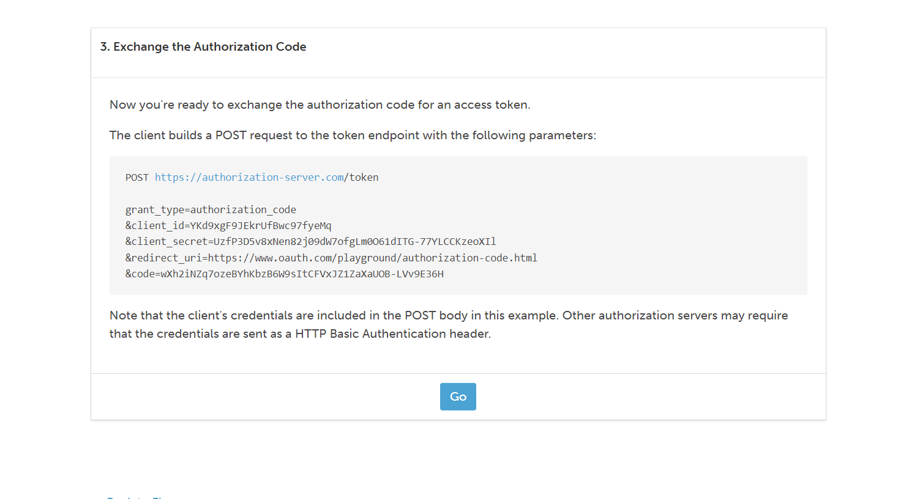

- Now the client is ready for exchange the authorization code for an access token. ( **step 5 in the image**). It prepares a post request which includes **client_secret** and **authorization code**. If you try to send all these details inside the get request as a query param then there won't be any security and there is a good chance that client application may lose their secret. That's why here, we are following the post. ( **step 6 in the image**)

```
POST https://authorization-server.com/token

grant_type=authorization_code
&client_id=YKd9xgF9JEkrUfBwc97fyeMq
&client_secret=UzfP3D5v8xNen82j09dW7ofgLm0O61dITG-77YLCCKzeoXIl
&redirect_uri=https://www.oauth.com/playground/authorization-code.html
&code=wXh2iNZq7ozeBYhKbzB6W9sItCFVxJZ1ZaXaUOB-LVv9E36H
```

- Now when we click on **Go**. We get the token and its expiration time.

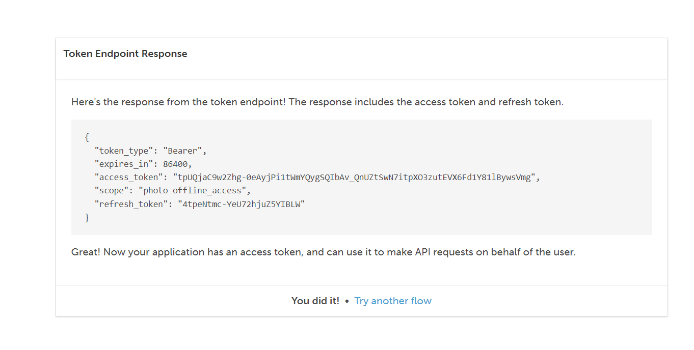

### Grant Type - Implicit Grant (Deprecated)

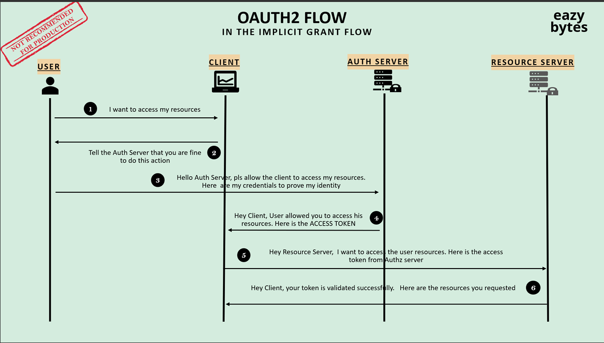


- The flow is similar to authorization code but here when we validate the user credentials, at that time instead of sending the authorization code we sent directly the token. Now this becomes the risk factor, how ?

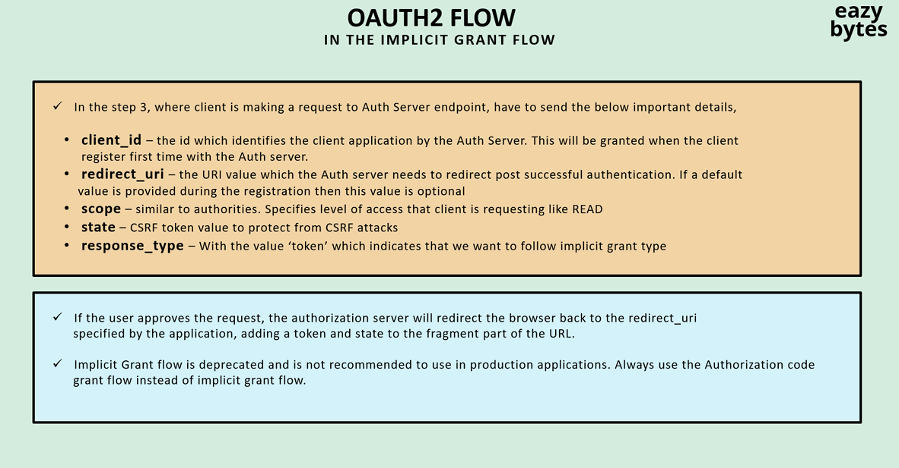

- Here if you see there is no **client_secret** present in the request when the client sents request to auth server. The request type is **Get**. The reason why client secret is not involved is, since this is a GET request, inside the GET request, there is no meaning of sending the client secret. That's why this flow does not support client secret as part of the step three request. And with that what is going to happen? Anyone who knows the client_id, they will be able to mimic as a client application with the auth server, and once the end user entered his credentials, they should be able to get the access token. So since there is no way for the auth server inside this flow to validate the identity of the client application, this is marked as deprecated.
- Apart from these drawback, the other serious drawback is when the auth server is trying to share the access token with the client application, the access token is going to be shared inside the request URL itself because, initially, the request went using GET, so to this GET, as a response, the auth server can only send using GET only since it is going to send the access token inside the GET URL itself, there's a very good chance that anyone who has access to your browser history, they'll be able to steal your access token. Think of a scenario, one of the auth server is issuing an access token with an expiration of seven days.In this scenario, you might have used the access token on day one and you left the computer. If some other user has access to your browser history, they'll be able to easily know what is the access token that auth server sent initially. Using the same access token, there is a good chance that they may misuse it.

### Grant Type - PKCE (Proof Key For Code Exchange)

- PKCE OAuth2 flow is going to work very similar to authorization code grant type flow, but it has some minor differences. In other words, we can call this PKCE as another flavor of authorization code grant type flow. When we are discussing about the authorization code grant type flow, as part of the step five, the client application, they have to share their client credentials. So as part of these client credentials, they need to pass their **client_id** and the **client_secret**. But unfortunately, the client secret can't be saved by the public clients like JavaScript-based applications, single page applications which are built based upon angular reactive framework, mobile applications. Because all the client code, it is going to be built with the help of plain JavaScript and anyone can see the source code inside the browser or by downloading the mobile application installation file. And with that, they'll be able to see the client secret very clearly. That's why for public-facing clients, where they're going to build a code with the help of JavaScript for such applications, instead of following the authorization code grant type flow, they follow **PKCE** grant type flow.

<details>

<summary> Why JavaScript-based applications can't securely use the client secret in the Authorization Code Grant type flow ? </summary>

- The main reason JavaScript-based applications, like single-page applications (SPAs) or mobile applications, can't securely use the client secret in the Authorization Code Grant type flow is due to the nature of these applications being **public clients**.
- **Public Clients**: These are applications that run on the end user's device and cannot securely store secrets. This includes JavaScript-based SPAs, mobile apps, and desktop apps.
- **Confidential Clients**: These are server-based applications that can securely store secrets, such as backend servers where the code is not exposed to the end user.
- In the traditional Authorization Code Grant flow, the client must send its client_id and client_secret to the authorization server to exchange the authorization code for an access token.
- In a JavaScript-based application, the source code is exposed to the end user. This means that if you include the client_secret in your JavaScript code, anyone can view the source code in the browser's developer tools or by inspecting the mobile application package.
- Even if you try to pass it via code, the **client_secret** in your JavaScript code or pass it in some other way, it is still vulnerable to being extracted by anyone with access to the code. JavaScript code running in the browser or mobile app is not secure, and any secret embedded within it can be easily compromised.
- This is why PKCE is recommended for public clients, as it provides a secure way to handle authorization without requiring a client secret.

</details>


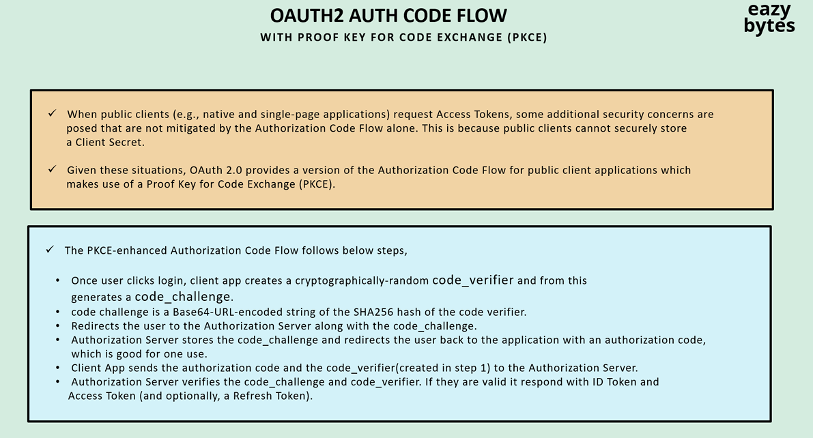


- Since these public clients cannot securely store the client secret, there is a workaround provided inside the OAuth 2.0 to standard with the help of **Proof Key for Code Exchange** flow. So let's try to understand what is going to happen inside the PKCE flow.


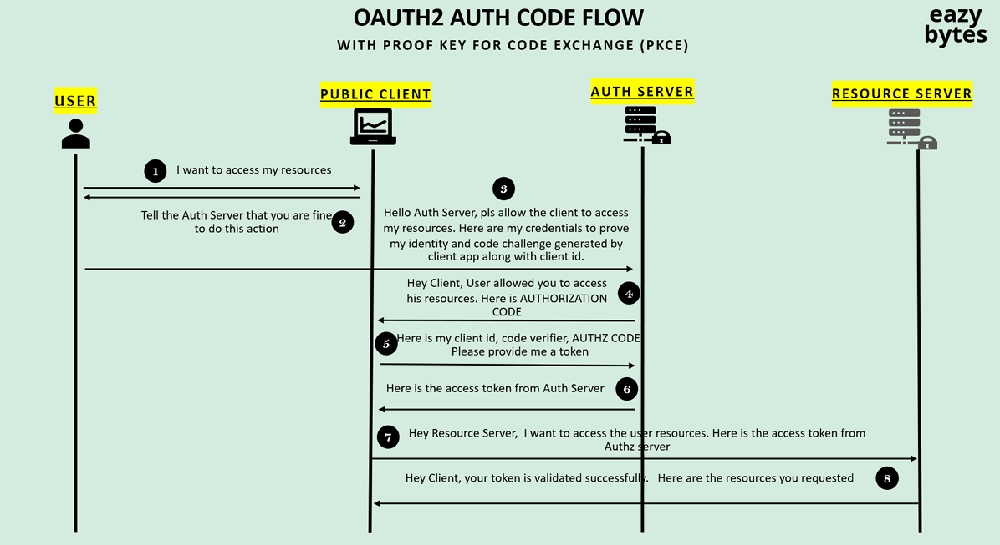


- Whenever an end user clicks on the login button or whenever he tried to initiate an operation inside the client application, then we know the client application, it is going to redirect the end user to the Auth Server login page. So during this redirection, behind the scenes the client application, what it is going to do is it is going to generate two different values.
- One is **code_verifier** and the other one is **code_challenge**. So using this code verifier only, this code challenge is going to be derived. For example, if the code verifier value is 123, using this 123 only, the code challenge is going to be derived by applying the SHA256 hash function. And once the hashing function is completed, it is going to be base Base64-URL-encoded.
- So once that code verifier and code challenge is generated by the client application, during the very first step where it is trying to redirect the end user to the login page of the Auth Server, in this very first step, the client application, it is only going to share the code challenge with the Auth Server. So inside the request parameters, along with the client ID, it is also past the code challenge. This code challenge is going to be saved by the Auth Server behind the scenes.
- So once the end user authentication is successful, we know the Auth Server is going to send back the response to the client application along with the authorization code. So now using this authorization code, the client application has to prove its identity. So how it is going to prove its identity is this time while it is trying to request for the access token, along with the authorization code that it has received, it is also going to send the code verifier that is generated initially in the very first step on the client side.
- Using this code verifier, the Auth Server, it is going to apply the same hashing function on top of this code verifier, and with that whatever initial value that it has received as part of code challenge, it has to be equally same; otherwise the Auth Server is not going to issue the access token.
- This way, Auth Server is making sure that whatever client application that initially initiates the request in the very first step, the same client application has to get the access token.

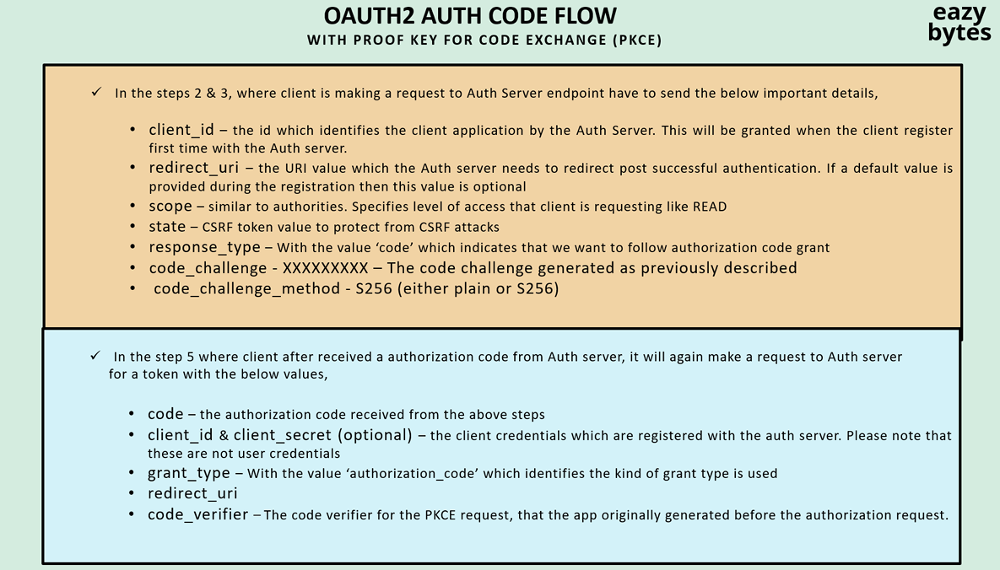

- So here we are passing request two times, again if we pass only request once we will landed up into **implicit grant type**.
- So here you may have a question which is **why code challenge is being shared first followed by code verifier at later point of time**? We know the **code_challenge is a hash representation of code_verifier**. This code challenge or hash value is going to be shared to the Auth Server so that in between, if someone steals this code challenge it is not going to make any sense to them because using this code challenge, they cannot derive the code verifier because it's a hash value. Only the client application which generates this code challenge, they will only know this code verifier plain text value.
- So once all the validations are completed on the Auth Server, it is going to issue an access token, ID token, refresh token, based upon what is being requested by the client application. This way, though there is no client credential involved inside the authentication flow, the Auth Server will make sure that it is issuing an access token to only the original client application who initiates the authentication flow.
- Let's see the demo of this PKCE flow very quickly. Inside this playground website,

<video controls src="Images/springbootsecurity3/20240907-1906-49.9584738.mp4" title="Title"></video>

- In the very first step, the client application, it has to generate the **code_verifier** and the **code_challenge** using SHA256 algorithm and base64 encoding.
- Now the client application generated both code_verifier and code_challenge and it is going to store these details somewhere inside the request.

<video controls src="Images/springbootsecurity3/20240907-1908-38.2811828.mp4" title="Title"></video>

```
https://authorization-server.com/authorize?
  response_type=code
  &client_id=YKd9xgF9JEkrUfBwc97fyeMq
  &redirect_uri=https://www.oauth.com/playground/authorization-code-with-pkce.html
  &scope=photo+offline_access
  &state=fOy0SEuViBp6G8nx
  &code_challenge=GkaL6wD2kvxUQvmumFLQPIfJAKFCk8m-i6W1fRQ-yUc
  &code_challenge_method=S256
```


- Here it is going to send a get request. Inside this get request, the response type, it is going to mention as code client_id and the redirect_uri, scope, state. Coming to the code challenge, it is going to mention whatever code challenge it is calculated here, so the same code challenge it is trying to provide here. And the code challenge method also it has to provide which is SHA256.

<video controls src="Images/springbootsecurity3/20240907-1910-18.2477537.mp4" title="Title"></video>

- Here, once I click on this Log in button, ypu will get a consent, you will approve this consent. And with that, we'll go to the next step where the state parameter we need to validate. So this state parameter protects us from the CSRF attacks and inside the get response, we also receive the authorization code value.

```
?state=fOy0SEuViBp6G8nx&code=5BB1mnrOwStJevdcXmGt3KfNx0SVdKqCNxljO7yPbnapcZ_e
```

- Next time, the client application, it is going to make a POST request to get the access token. So as part of this POST request, it is going to mention the grant type as authorization code. So the grant type value is always going to be the same, regardless whether you're using the traditional authorization code grant type flow or the PKCE flow.

<video controls src="Images/springbootsecurity3/20240907-1912-50.4885824.mp4" title="Title"></video>

```
POST https://authorization-server.com/token

grant_type=authorization_code
&client_id=YKd9xgF9JEkrUfBwc97fyeMq
&client_secret=UzfP3D5v8xNen82j09dW7ofgLm0O61dITG-77YLCCKzeoXIl
&redirect_uri=https://www.oauth.com/playground/authorization-code-with-pkce.html
&code=5BB1mnrOwStJevdcXmGt3KfNx0SVdKqCNxljO7yPbnapcZ_e
&code_verifier=s0hISzySU_1BsO2ROd7cKTb5sjj5J-K1w-9fzJWop6XAJAB2
```

- How Auth Server will identify whether you are trying to use the PKCE flow or whether you're trying to use the authorization code grant type flow or combination of them, is based upon the request that you are going to send. So if the authorization code grant type flow sees the fields like code_verifier, code_request, code_challenge method. So if it sees all such information, then it is a confirmation to the authorization server that you are trying to use the PKCE flow. So after the grant type, we need to mention what is the client ID and the client secret (optional)
- So now using this code verifier,behind the scenes the authorization server, it is going to generate the code challenge by following the same formula that we have used inside the step one. If the initially shared code challenge is matching with the newly calculated code challenge, then only the authorization server is going to issue an access token.

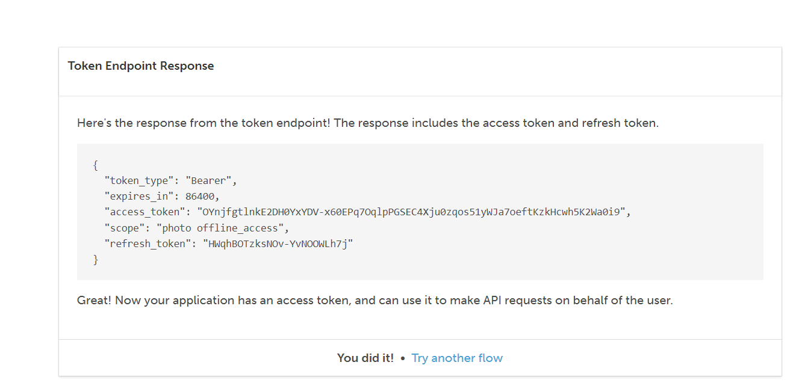


### Grant Type - Password Grant

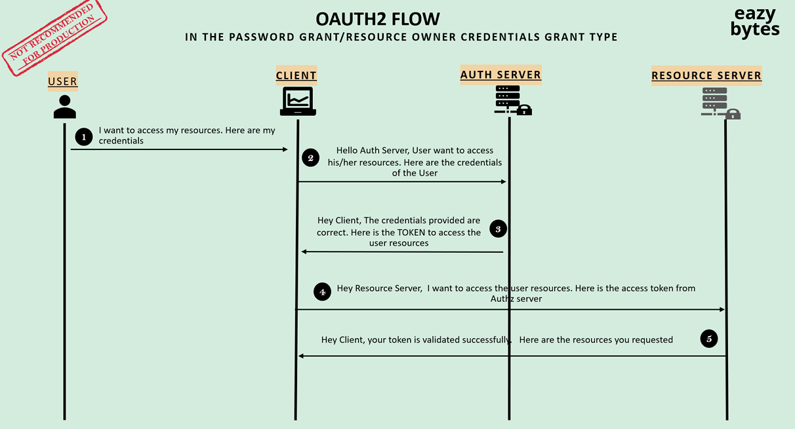


- Password Grant Type Flow, also called as Resource Owner Credentials Grant Type Flow. Inside this flow what is going to happen is that end user is going to hand over his credentials to the client application itself. What is going to happen is the client application, it is going to redirect the end user to the login page of the odd server to enter his credentials. But inside this flow, the client application itself is going to have their own login page where they are going to ask the end user credentials that he's maintaining inside the AUTH server. 
- So once the end user credentials are accepted by this client application, it is going to make a request to the AUTH server with the details of user credentials, client to credentials. 
- So both the client credentials and the end user credentials, it is going to send as part of the request to the AUTH server. If all the credentials are valid as part of the step three,the access token is directly going to be issued to the client application.
- Using this access token, the client application can make a request to the Resource Server. If the access token is valid, the resource server is going to respond with the proper successful response.
- So there is a very good chance that this client application may misuse the end user credentials. So before it is trying to invoke the AUTH server with the end user credential, the client application may store the end user credentials somewhere inside its own database. Since this serious drawback is present inside this Grant Type Flow, this is no more recommended for any production usage but still you will see some organizations using password Grant Type Flow. 
- The reason is this flow is very simple to follow, but whenever someone is following this flow, they'll make sure this client application and this AUTH server, Resource Server, they all belongs to the same organization. So in this kind of setup, there is no chance that this client application can misuse the credentials of the end user because both client and AUTH server belongs to the same organization or the same project.


### Grant Type - Client Credentials

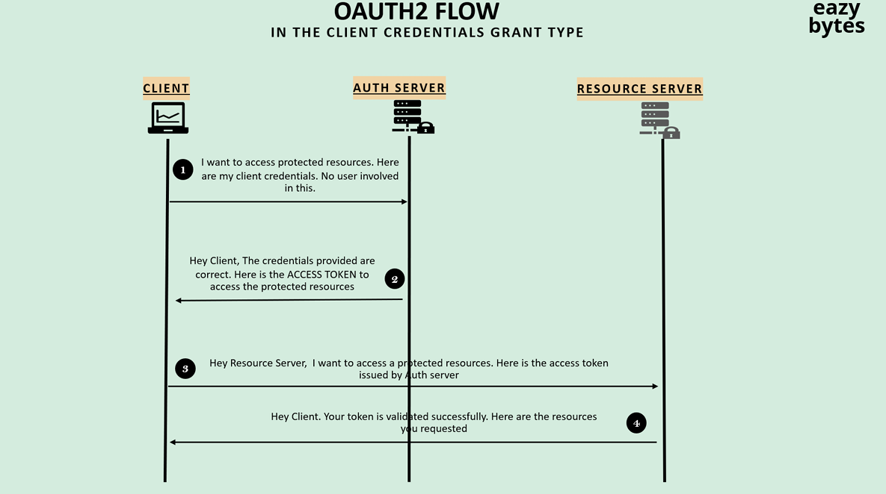


- It is the most commonly used grant type flow inside the microservices environment. We need to use this grant type flow when now there is no end user is involved and when our two backend applications are two different APIs that are trying to communicate with each other. So this Resource Server can be a microservice and this client also can be another microservice, or some other backend application or backend API who are trying to talk with each other.
- But instead of directly allowing them to talk with each other, we are going to enforce security with the help of Client Credentials Grant Type Flow. Behind the scenes, what this client application has to do is it has to register with the auth server and it needs to get its own client credentials.
- So once this step is completed, the client application, it is going to resume client ID and client secret. So these values are going to act as username and password for this client whenever it want to get an token from the auth server.
- The client is going to approach the auth server to provide an access token and inside the request it is also going to mention its client credentials and since there is no user involved inside this, it's not going to share any end user-related details. If the client credentials are valid, the auth server, it is going to issue an access token to the client.
- Now the client, which can be a microservice or a backend API or a backend server, it can invoke another backend server or another backend API or microservice which is the resource server

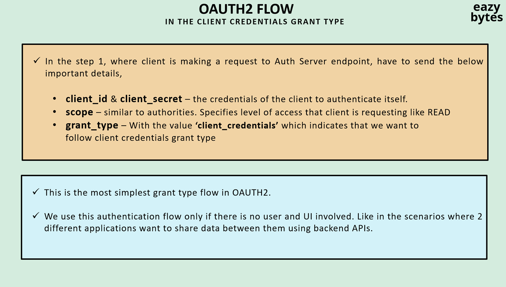


### Grant Type - Refresh Token


- Whenever we are using Authorization Code Grant Type flow or PKCE Grant Type flow, inside the response we get two types of tokens. The very first one is **access_token** and the other one is **refresh_token**. There is a purpose for this **refresh_token**. Using this **refresh_token**, we can use Refresh Grant Type flow. 


- Let's try to understand the flow of this grant type flow by looking at the slides. The Refresh Token Grant Type flow, it is only going to be initiated by the client application behind the scenes without involving the end user. That's why here we have only three components, Client, Auth Server and Resource Server.
- The end user will only be involved in the scenarios where he has to enter his credentials during the initial authentication process. So let's imagine of a scenario where my client application does not know whether a given access token is expired or not. In this scenario, the client application, as usual, it is going to make a request to the Resource Server with the access_token. But this time, the Resource Server, since the access_token is expired, it is going to throw an error, which is 403 forbidden.
- So now my client application, it will reach out to the auth server in a hurry saying that, "Hey, auth server my access_token is expired, I want a new access_token. And here is the refresh_token that you have issued in the initial authentication process."
- If the refresh_token is valid, the auth server, it is going to issue a new access_token and new refresh_token. We also have an option of using the same refresh_token always, but it is advisable to rotate the refresh_token as well where now these Refresh Token Grant Type flow is being invoked.
- Now using the access_token that it has resolved inside the step four, my client application, it is going to make a request to the Resource Server. This time, since the access_token is valid, the Resource Server, it is going to respond with the proper response which can be processed by the client application.


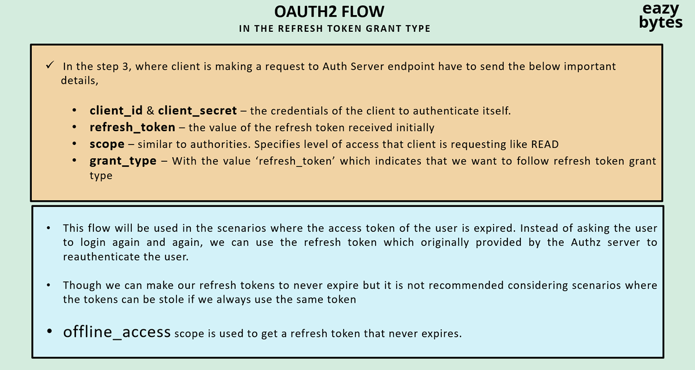

- So what details we are going to send as part of step three, the client application, it is going to send the client_id and client_secret, along with the refresh_token that it has resolved during the initial authentication process. The purpose of the scope you already know, coming to the grant_type. This time we need to mention the value as **refresh_token**.
- So this is an indication to the auth server that Refresh Token Grant Type flow is initiated. With this grant type flow behind the scenes, the auth server, it is going to expect the value under the refresh_token.
- Why can't we make an access_token, which is never going to be expired? So that we can avoid extra complexity around the refresh_token. If we issue an access_token with an unlimited time, then it is going to be as good as end user credentials. So anyone who has this access_token, they'll be able to use these forever because the token is never going to be expired. So to avoid these kind of security related issues, always the access_token, they are going to be issued with a short duration. Most of the times it is going to be issued with 24 hours time, which will work for most of the applications. But if your application is a super critical application, like a bank application, then obviously you can't issue an access_token with an expiration of 24 hours. You need to reduce the time to one hour or 30 minutes based upon your business requirements.
- Then Why can't we make our refresh_token to never expire? though it is possible but it is not recommended considering the scenarios where the refresh tokens can be stolen by some bad users.


### How Resources Server validates the token issue by Auth Server ?

- The Resource Server is going to receive an access token from the client. So there are two different approaches how this Resource Server is going to validate the access token that it has received from the client application.


#### 1. Opaque Token

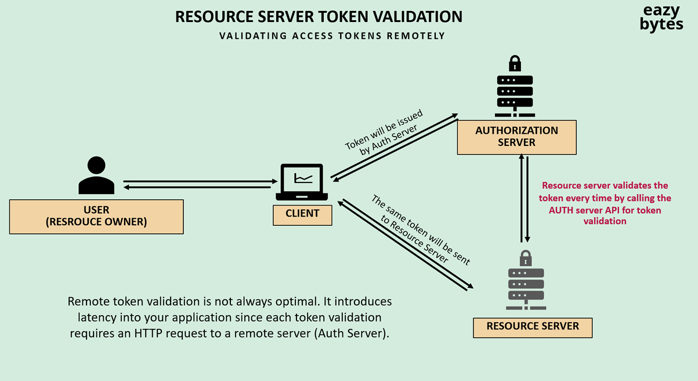

- The very first approach is validating the access tokens remotely. Inside this approach, what is going to happen is whenever the Resource Server, it receives an access token, it will simply send that access token to the Authorization Server to check if the access token is valid or not.
- So inside this approach, always, the Resource Server is going to depend on the Authorization Server by making a API invocation on the auth server to identify if a token is valid or not. Usually, the auth servers, they're going to expose an API with the name `/introspect`. Using these `/introspect` API, the Resource Servers, they can identify whether a given token is valid or not.
- But this approach, it has some drawbacks. The drawback is it always going to introduce latency inside your application, thus bringing some performance issues. Imagine that your Resource Server is receiving thousands of requests from different, different clients with the different, different access tokens.  Before responding to each of the requests, it has to make a network call to the auth server, and if your auth server is taking 200 milliseconds time to respond, then, obviously, these 200 milliseconds is going to be added to your overall request to network latency. That's why most of the organizations, they don't use this approach, but this approach is going to be useful for the organizations where they have some super critical data. Such organizations. they can follow this approach.
- The format of their access token is of type opaque token. So inside the first approach, always, the token has to be in a Opaque format so that the Resource Server can send this Opaque token to the auth server to know more details about the end user and to know whether the Opaque token is valid or not.


#### 2. JWKS (JSON Web Key Set)


<details>

<summary> What is JWKS ?</summary>


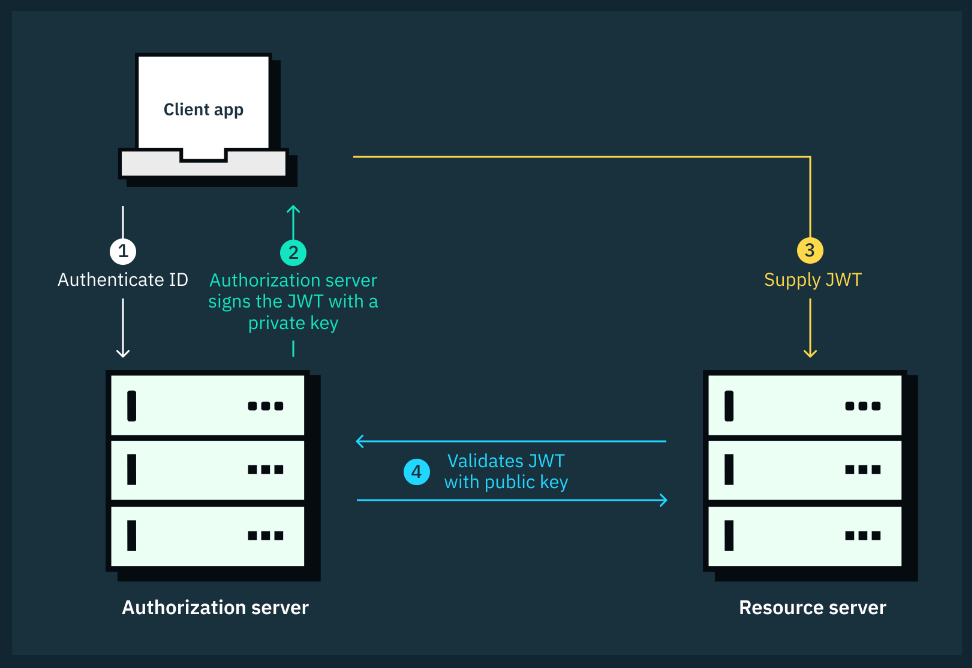

- Imagine a secure service issues JWTs to users, which they use to access another service (like an API).
- The JWTs are signed with a private key that only the service issuer knows.
- The API needs to verify these JWTs to ensure they’re legitimate. However, to do this, the API needs the corresponding public key.
- Instead of hardcoding this public key, the API can fetch it from a JWKS endpoint provided by the service issuer. This endpoint serves the JWKS, which is a collection of public keys that the API can use to verify JWTs. Once its fetch, it can very all the JWT generated by service issuer using the same public key.
- JWKS is closely related to cryptography, particularly in the context of signing and verifying data, but it primarily deals with digital signatures rather than encryption and decryption.
- When a JWT is created, it's often signed using a private key. This signature ensures that the JWT hasn't been tampered with. The recipient of the JWT uses the public key (which is part of the JWKS) to verify that the JWT’s signature is valid. If the signature checks out, it means the JWT is authentic and hasn't been altered.
- Private Key is used to sign the JWT. This key is kept secret by the issuer.
- Public Key is shared openly (often via JWKS endpoint) and used by recipients to verify the JWT’s signature.

#### In JWT we have secret key right? then why JWKS is required because now it involves two more keys which is private and public?

- **The difference between using a secret key in JWT and using public/private keys with JWKS involves the type of cryptographic approach being used, symmetric versus asymmetric cryptography**.

##### Symmetric Cryptography (Secret Key in JWT)

- In symmetric cryptography, the same key is used for both signing the JWT and verifying it. This key is shared between the issuer and the recipient. This approach is simpler and faster, but it requires that both the issuer and recipient have the secret key. If the key is leaked or compromised, anyone with it can **both create and verify** JWTs. If someone unauthorized gains access to the secret key, they can create fake JWTs that appear legitimate because they can sign them with the same key.

##### Asymmetric Cryptography (Public/Private Keys in JWKS)

- Private Key: Used by the issuer to sign the JWT. This key is kept secret and never shared.
- Public Key: Used by anyone (including the recipient) to verify the JWT. The public key is shared openly, often via a JWKS endpoint.
- Use Case: This approach is more secure for situations where multiple services or clients need to verify the JWT. Since only the private key can sign JWTs, and the public key is used only for verification, the risk of key compromise is reduced. The public key can be safely distributed without compromising the security of the JWT.

##### Why Use JWKS (Asymmetric) Instead of a Secret Key (Symmetric)?

- **Security**: In asymmetric cryptography, the private key is never shared, reducing the risk of unauthorized signing. Even if the public key is widely distributed, it cannot be used to create valid JWTs, only to verify them.
- **Scalability**: When you have multiple services or clients that need to verify JWTs, using a public/private key pair is more scalable. The issuer only needs to keep the private key secure, while the public key can be distributed via JWKS to any number of recipients.
- **Decentralized Verification**: Services can independently verify the JWT using the public key from the JWKS without needing to contact the issuer or share a secret key. This is particularly useful in distributed systems where multiple services may need to verify the authenticity of a JWT.

</details>


- The next approach, which is the most commonly used approach, is validating the access tokens locally. In this scenario, the Resource Server, it is going to validate the token locally without making a network call to the Authorization Server.

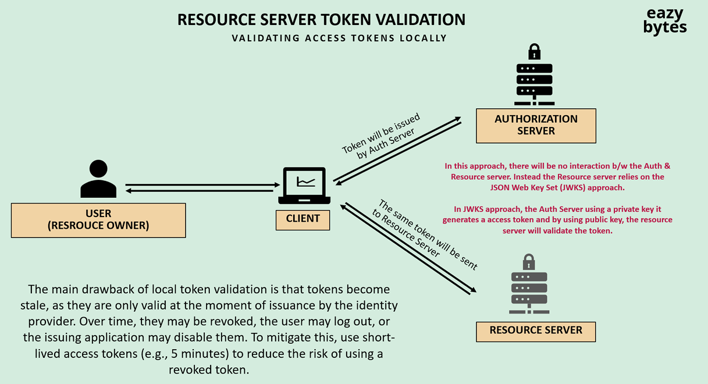


- To make this approach work, we need to follow two rules. The very first rule is the token format should be of type JWT. Since JWTs, they're going to have digital signature to validate locally, but inside the OAuth 2 flow, the secret value is not going to be used. Instead, JWKS approach is going to be followed. 
- So as part of this approach, what is going to happen is Authorization Server, it is going to have a private key. Using this private key, it can issue that tokens. Corresponding to this private key, there will be a public key which the Resource Server has to download during the startup of the application or the resource server can either fetch the public key from the authorization server the first time it needs it or be pre-configured with the public key.
- Using this public key, the Resource Server can validate if the given digital signature of a token is valid or not. So here, there is no secret involved. The auth server will make sure that it is not losing this private key, and this public key can be given to any number of Resource Servers to validate that token by checking that digital signature with the help of this public key.
- The same public key can be used by the Resource Server locally to validate the all tokens issued by the auth server. So this approach has an advantage, which is it is not going to depend on the auth server to validate the tokens. With that, you're not going to have any performance or latency issues. But there is a drawback with this approach.
- Think like the auth server issued an access token with the 24 hours expiration time. So the Resource Server will keep accepting the token for 24 hours. For some reason, within these 24 hours, if the token is stolen or if the token want to be revoked, we need to destory or invalidate that toke before it reaches the resource server, we can't do that because there is no way for the Authorization Server to communicate with the Resource Server to invalidate these token value within 24 hours.
- So that's why to mitigate these drawback or issue, usually, organizations which have some critical applications, they're going to issue the access tokens with a short life, for example, with a five minutes time. So this is going to reduce the risk of using a revoked token.

## Open ID Connect - Theory


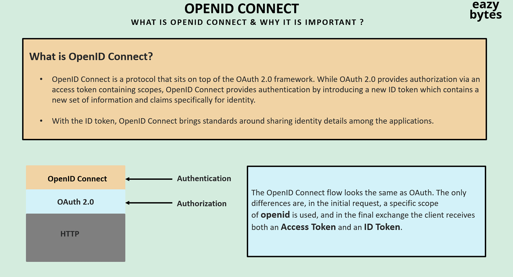

- OpenID Connect is a protocol that sits on top of OAuth 2.0 framework, which means this OpenID Connect just a thin wrapper sitting on top of OAuth 2.0 framework. OAuth 2.0 built on top of the HTTP protocol. On top of the OAuth 2.0, again, there is a thin wrapper or a thin layer built with the name OpenID Connect.
- In other words, we can say this OpenID Connect and OAuth 2.0, they're going to compliment with each other. Without OAuth 2.0, we can't build or use OpenID Connect. And similarly, by having this extra layer on top of OAuth 2.0, OAuth 2.0 also is going to get some advantages and benefits. Both of these work together and not are separate entities.
- **What is the need to build an extra layer on top of the OAuth 2.0 framework when OAuth 2.0 framework is able to solve all our security problems**? Initially, when the OAuth 2.0 framework introduced, it is introduced by considering authorization into picture. So, with the help of OAuth 2.0, what we're trying to do, an end user is going to give an authorization access to a third party application or a two different application to access his or her resource on behalf of himself or herself. So, that's a original intention of authorization. That's why inside the authorization standards or specifications, we have concepts like **scopes**. Using these scopes only, we can control what kind of access that we can give to the third party application.
- Apart from scope, we have access token. Inside this access token only, all the scope details are also going to be maintained by the auth work. With the help of social login, we saw inside the LinkedIn scenarios, there are options for the end user to sign up or to sign in into their website with the help of Google,, Facebook, GitHub, Twitter etc.. But when they started OAuth 2.0 for authentication, they end up having a problem which is whenever the OAuth 2.0 framework is being used by an application, it is only going to have the access token. Inside this access token, we are going to have details around scopes and in some scenarios, it is also going to have some user-related information.
- In certain scenarios, the website, by looking at this access token, they will not be able to understand to whom these access token belongs or to which identity this access token belongs. And to solve this problem, most of the organizations, they used to have some workarounds to identify to which user this access token belongs. And to identify more details about the end user, they used to follow different workaround.
- **And since everyone is going to have their own workarounds, there is no uniform approach inside the OAuth 2.0 framework in sharing the user details or identity details. So, since there is no uniform way of sharing the user details inside the OAuth 2.0 framework, a new small wrapper is built on top of this OAuth 2.0. This wrapper is called OpenID Connect.**
- So, OpenID Connect built by focusing the authentication. So, during the authentication, what is going to happen, we are going to focus on the end user to identify who is the end user. With the OpenID Connect, there is more standard way or there is more uniform way came into picture to know more details about the end user.
- So if you are implementing OpenID connect and wanted to know the end user details irrespective of whatever grant type you are using, in the scope field of your request you need to specify **openid** and your additional information. Inside your request, if you mention the scope as OpenID, with that, the OpenID Connect is going to be enabled. And as a response your authorization server, it is going to issue two types of tokens.
- First one is **access token** and the other one is **ID token**. Off course there is third token which is refresh token as well. The ID token will have the user details like what is the username, what is his email, what is his address details, so, all such details, they're going to come inside this ID token. So, anytime client application has a question around to which end user this access token belongs, they can directly refer to these ID token for the details.
- **This way, the drawbacks of OAuth 2.0 are addressed with the help of OpenID Connect.**


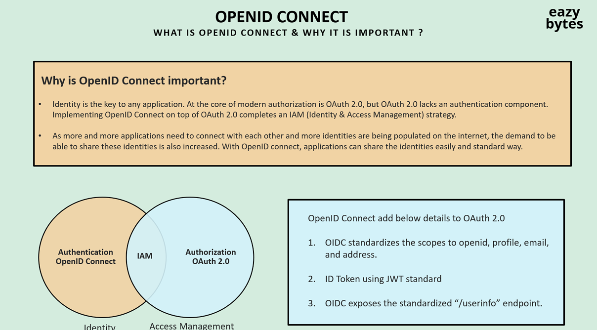

- So, OIDC Connect is the short form of OpenID Connect. This OIDC standardizes the scopes to OpenID profile, email, and address. So, these are the scopes that got introduced as part of OpenID. Whenever someone is trying to mention these scope details inside the request, they're going to get all the user-related information in the form of ID Token. whenever someone is using OpenID Connect in their communication, they're going to get an ID token on top of access token. **This ID token also is going to use the format of JWT tokens**. Any auth server that has been implemented with the help of Open ID Connect, it is also going to expose an REST API with the name **`userinfo`**. At any point of time, if the client application is looking for more details of an end user, it can get those details by invoking these REST API.
- So, with the introduction of OpenID Connect, a new concept came into picture, which is **IAM**. So, identity and access management. So, the OpenID Connect, it is going to help you to identify the end user and it is going to help you in the process of authentication, whereas the OAuth standard or framework is going to help you during the access management and during the authorization process Since we are trying to club both of them, a new concept with the name **IAM** came into picture. So, if you go to any website where they're trying to provide the capabilities of auth server, for example, Keycloak, Okta, AWS Cognito. So, all these products, they're going to highlight about this concept which is identity and access management, which means behind the scenes, they're using both this OpenID Connect and OAuth 2.0 inside the auth server that they're going to provide.

- Lets perform a playground on OAuth2 portal.

<video controls src="Images/springbootsecurity3/20240908-0802-56.9054346.mp4" title="Title"></video>

- So, this is going to look very similar to the Authorization Code Grant Type flow. If you observe here is under the scope, this time, we have scopes like openid, profile, email. So, previously, we used to send only the photos as a scope. So, photos is a scope which is used to access the resources like photos. But coming to the user-related information, the remaining scopes like openid, profile, and email, they're going to help us to reach you the user-related information. So, when you're trying to send multiple scopes here, you need to use this plus operator. So, different auth servers and different organizations that are going to follow different separators. So, here, the separator is plus symbol.

```
https://authorization-server.com/authorize?
  response_type=code
  &client_id=MvzdjZTazjkJOXx95qXT0bR9
  &redirect_uri=https://www.oauth.com/playground/oidc.html
  &scope=openid+profile+email+photos
  &state=C_f4s5QxSWFZupGD
  &nonce=0cCeGqt1KCUNxxw1
```

Now, if your try to click on this Authorize button, it is going to ask your credentials and consent.


<video controls src="Images/springbootsecurity3/20240908-0808-15.1044168.mp4" title="Title"></video>


- The grant type, it is going to be **authorization_code**.

```
?state=C_f4s5QxSWFZupGD&code=4K1uhhL1ebqcHemUHi0hVDFsVBqUibvXuHj0e1d-tx0OwmHW
```

<video controls src="Images/springbootsecurity3/20240908-0810-08.4438416.mp4" title="Title"></video>

```
POST https://authorization-server.com/token

grant_type=authorization_code
&client_id=MvzdjZTazjkJOXx95qXT0bR9
&client_secret=kwlwhXWtMVyiSswwDEGJQr0gZoPYRvnGS3E-qe1VBRwTDup-
&redirect_uri=https://www.oauth.com/playground/oidc.html
&code=4K1uhhL1ebqcHemUHi0hVDFsVBqUibvXuHj0e1d-tx0OwmHW
```


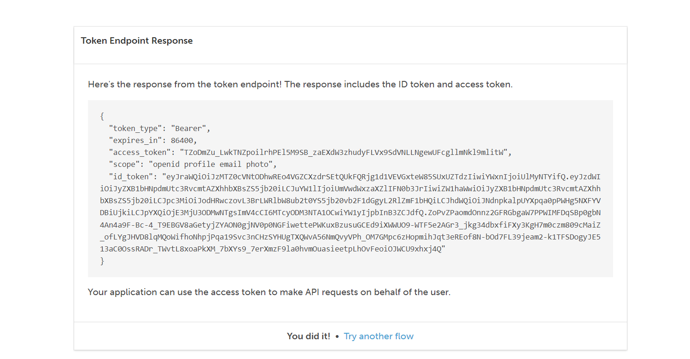

- Now when you click in the Go button you will get an access token as well an ID token. Inside this demo, we're not getting the refresh token. Maybe they might have disabled it, but it is completely possible to get access_token, id_token, refresh_token inside the same response.


## OAuth2 (Open Authorization 2.0) - Implementation

- There are two ways to implement OAuth2, one way is to use social logins where the auth servers is with big organization like GitHub, Meta, Google etc.. and another way is to create your own auth server without any social login.
- In the first approach we are just going to leverage the Auth server belongs to other organizations, and this approach will work only for simple applications like blog applications or some single page applications where they don't have lot of business functionality. In second approach is most likely applicable for real enterprise applications, like a bank application or a insurance application, for all such applications, the organization, they have to build their own Auth server either by leveraging the products inside the market like Keyclock, Okta, or they can build their own Auth server with the help of Spring based Auth server library.

### Without Auth Server

- Lets create a new simple spring boot project, below are the dependencies required for it.

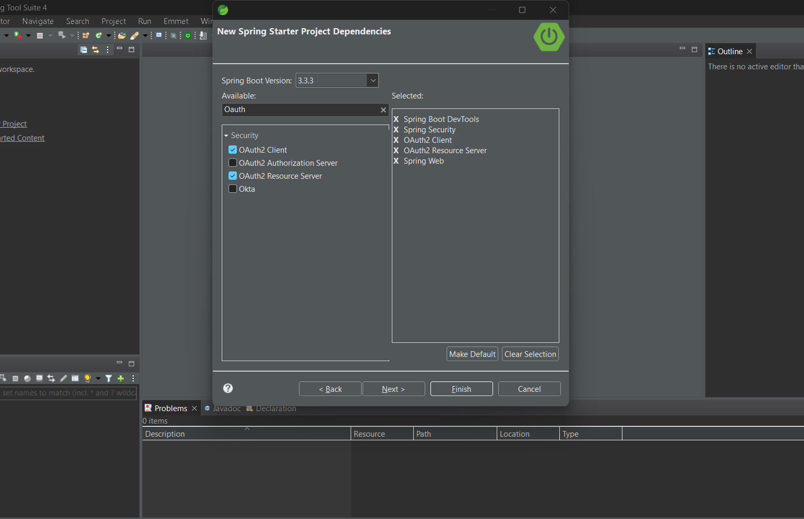


- Here we need to add OAuth2 Client because our Spring Boot application itself is going to act as a both client and the Resource Server. That's why we need to select both OAuth2 Client and OAuth2 Resource Server. Whereas the other dependency that we have which is, OAuth2 Authorization Server, we need to use this when we are trying to build our own Spring Authorization Server.
- Lets add below things under application property file.

```
spring.security.user.name=${SECURITY_USERNAME:defaultUserName}
spring.security.user.password=${SECURITY_PASSWORD:12345}
logging.level.org.springframework.security=${SPRING_SECURITY_LOG_LEVEL:TRACE}
logging.pattern.console = ${LOGPATTERN_CONSOLE:%green(%d{HH:mm:ss.SSS}) %blue(%-5level) %red([%thread]) %yellow(%logger{15}) - %msg%n}
```

- So here we have one user created under property file. Lets create a controller.

```
package com.springboot.securityWithoutAuth.controller;

import org.springframework.web.bind.annotation.RestController;
import org.springframework.web.bind.annotation.GetMapping;

@RestController
public class SampleController {

	
	@GetMapping("/sample")
	public String SamplePage() {
		return "This is a sample page";
	}
}
```

- When we run the project at this point of time, we will get this below

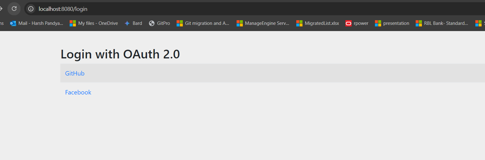

- It seems that OAuth2 is default configured for GitHub and Facebook. But it won't work at this point of time.

>[!NOTE]
> - In the latest versions of Spring Boot Security, specifically from Spring Security 5.x onwards, the OAuth2 client support has been significantly improved and simplified. When you add the OAuth2 client dependencies in your project, Spring Boot auto-configures a lot of the necessary components to enable OAuth2 login with providers like GitHub & Facebook etc.

- Lets create a project security configuration.


```
@Configuration
public class ProjectSecurityConfig {

    @Bean
    SecurityFilterChain defaultSecurityFilterChain(HttpSecurity httpSecurity) throws Exception {
        httpSecurity.authorizeHttpRequests((requests) -> requests.requestMatchers("/sample").authenticated()
                .anyRequest().permitAll())
                .formLogin(Customizer.withDefaults());
        return httpSecurity.build();
    }

}
```

- Now when we run the application we get below page.

<video controls src="Images/springbootsecurity3/20240908-0930-23.4033498.mp4" title="Title"></video>

- Now along with these form login lets implement OAuth2 standards. So inside the project security configuration we need to add `oauth2Login` method.

```
    @Bean
    SecurityFilterChain defaultSecurityFilterChain(HttpSecurity httpSecurity) throws Exception {
        httpSecurity.authorizeHttpRequests((requests) -> requests.requestMatchers("/sample").authenticated()
                .anyRequest().permitAll())
                .formLogin(Customizer.withDefaults())
                .oauth2Login(Customizer.withDefaults());
        return httpSecurity.build();
    }
```

- Since we don't want to customize our OAuth2 login we are using the defaults `withDefaults`. Now we have enabled OAuth2 login but whenever we enable the OAuth 2.0 login, we need to give clue to our Spring Security framework on which authorization server we are trying to use, whether we are using social logins or whether we are trying to use our own auth server. For that we need to add bean of **ClientRegistrationRepository**, this is an interface which has been implemented by **InMemoryClientRegistrationRepository** and **SupplierClientRegistrationRepository**. Most of the times, developers, they're going to use **InMemoryClientRegistrationRepository**. Using these repository class, we are going to store all our authorization server related details in the form of **ClientRegistration** object.

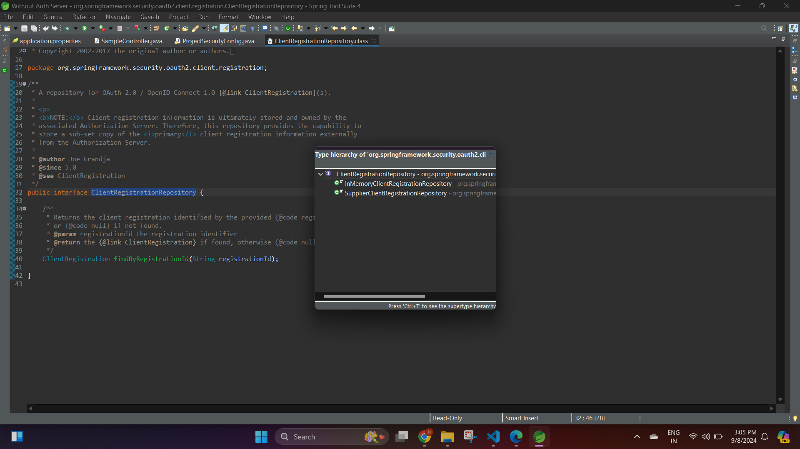


- Lets add this bean in our project security configuration.

```
    @Bean
    SecurityFilterChain defaultSecurityFilterChain(HttpSecurity httpSecurity) throws Exception {
        httpSecurity.authorizeHttpRequests((requests) -> requests.requestMatchers("/sample").authenticated()
                .anyRequest().permitAll())
                .formLogin(Customizer.withDefaults())
                .oauth2Login(Customizer.withDefaults());
        return httpSecurity.build();
    }

    @Bean
    ClientRegistrationRepository clientRegistrationRepository() {

        return new InMemoryClientRegistrationRepository();
    }
```

- But we wanted to use social logins, we need to use other organization auth servers like GitHub, Facebook , Google etc.. So first lets explore one Enum class called **CommonOAuth2Provider**.


- Inside this class, there are good amount of enums with the name **GOOGLE**, **GITHUB**, **FACEBOOK**, and **OKTA**. So for these famous social logins, Spring Security team, they already created **ClientRegistration** object with the details like what is a `scope`, what is a `authorizationUri`, what is a `tokenUri`, what is a `jwkSetUri`, `issuerUri`. So these are all that details usually you need to get from the authorizations aware organization. For example, if you don't have these **CommonOAuth2Provider**, then you need to read the documentation of Google, and you need to understand all these details, like what is the `authorizationUri`, where we need to redirect the client once he click on the login button on the UI. Similarly, there are many other URIs which are required by the OAuth 2.0 flow. So all these URIs, we need to get from the official documentation. To make our job easy, Spring Security, they have created this enum class which has four different enums for Google, GitHub, Facebook, and Okta. 
- So using these enums, we are going to create the objects of **ClientRegistration**. Once the ClientRegistration objects are created, we can try to store them inside these **InMemoryClientRegistrationRepository**.
- Lets update the project security configuration

```
@Configuration
public class ProjectSecurityConfig {

    @Bean
    SecurityFilterChain defaultSecurityFilterChain(HttpSecurity httpSecurity) throws Exception {
        httpSecurity.authorizeHttpRequests((requests) -> requests.requestMatchers("/sample").authenticated()
                .anyRequest().permitAll())
                .formLogin(Customizer.withDefaults())
                .oauth2Login(Customizer.withDefaults());
        return httpSecurity.build();
    }

    @Bean
    ClientRegistrationRepository clientRegistrationRepository() {
        ClientRegistration github = githubClientRegistration();
        return new InMemoryClientRegistrationRepository(github);
    }

 
    private ClientRegistration githubClientRegistration() {
        return CommonOAuth2Provider.GITHUB.getBuilder("github").clientId("")
                .clientSecret("").build();
    }

}
```

- First we need to create a method, based for that particular social login. Each social login will have a method `getBuilder`. To this builder method, we need to provide a name, which is going to act as a registration ID. So in case of GITHUB we have specified `github` as registration ID. So using these registration ID name, the details of GitHub, they're going to be stored inside these **InMemoryClientRegistrationRepository** just for identification purpose when there are multiple auth server details.
- Here for each social login we need to have its own **client_id** and **client_secret**, where do we ge this? you need to respective website and generate the value.
- Below is the flow for getting client ID and secret for GitHub. Here we will use only GitHub as our social login, for other social login you need to perform RnD and get client id and secret for it.

<video controls src="Images/springbootsecurity3/20240908-1013-29.0997060.mp4" title="Title"></video>

- Now we have added client id and client secret, now lets run the application.

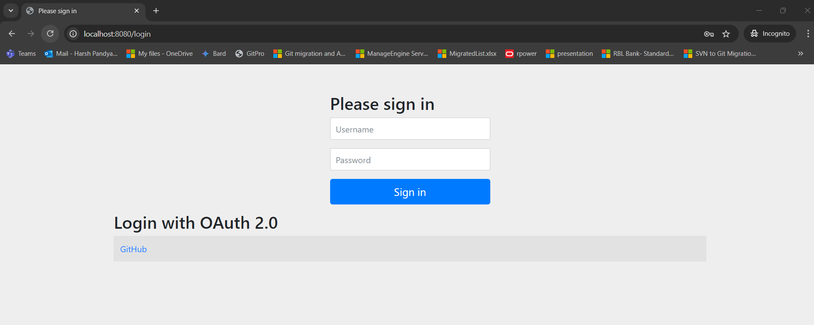

- Lets login via GitHub

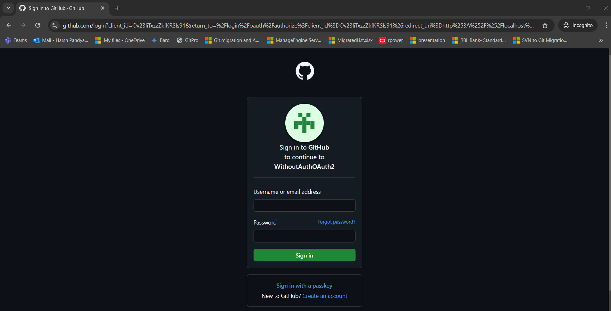

- We have been re-directed towards GitHub page. If you see there will be a client id on the re-directed url `https://github.com/login?client_id=Ov23liTxzzZkfKRSIs91..`
- Post entering credentials, GitHub will take consent from us.

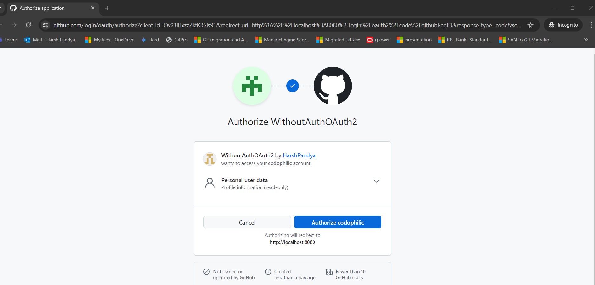

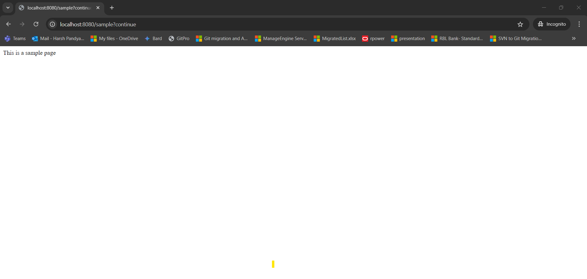

- We got the sample page. Lets say if you wanted to logged whether the user has used social login or normal user name password you can do it using below way

```
@RestController
public class SampleController {

	
	@GetMapping("/sample")
	public String SamplePage(Authentication auth) {
        if(auth instanceof UsernamePasswordAuthenticationToken usernamePasswordAuthenticationToken){
            System.out.println(usernamePasswordAuthenticationToken);
        } else if (auth instanceof OAuth2AuthenticationToken oAuth2AuthenticationToken) {
            System.out.println(oAuth2AuthenticationToken);
        }
		return "This is a sample page";
	}
}
```

- Instead of hardcoding these client credentials , it can be added in the properties file also.

```
spring.security.oauth2.client.registration.github.client-id=${GITHUB_CLIENT_ID:Ov23liCBLLUjii41pS7k}
spring.security.oauth2.client.registration.github.client-secret=${GITHUB_CLIENT_SECRET:9da8734b56aad52d91b268fe6834a8df12447d95}

spring.security.oauth2.client.registration.facebook.client-id=${GITHUB_CLIENT_ID:974042741122392}
spring.security.oauth2.client.registration.facebook.client-secret=${GITHUB_CLIENT_SECRET:36d48c25c1767d58b3101551513d7e1e}
```


### With Auth Server (KeyCloak)

- When we build social login with the help of social logins like GitHub, Facebook, LinkedIn, Twitter, so all these auth servers, they have a very serious drawback or limitation due to which these auth servers, they can't be used inside an enterprise organization. The limitation is we will not have any control on the social login auth servers. We can't create an role or we can't create an authority based upon our business requirements inside these auth servers. Whatever user related information that we are getting from the social logins, we just have to accept them and build our business logic using them.
- So whenever an organization is looking to build an auth server, they will have two options. The very first option is so to build from scratch. The other option is they can leverage the products that are supporting the OAuth 2 and Open ID standards. So these products are like KeyCloak, which is an open source product, and similarly we have Okta. All the cloud providers like AWS, Azure, GCP, they also have products around the OAuth 2 and OpenID Connect. When to build own our auth server and when to buy a built in product? It all depends upon the organization requirements. If an organization has huge manpower and budget and time, then they can build their own auth server from scratch by using libraries like Spring Auth Server. Otherwise, they're going to adopt the readily available products like KeyCloak and Okta.

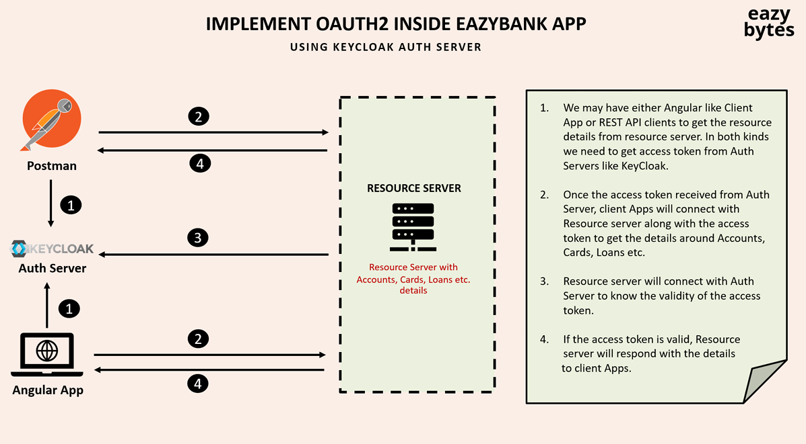

- Here we will use **KeyCloak** as our auth server, our resource server will be our spring boot application, the client will be Postman or the angular UI.
- So our Spring Boot application will have all the end user resources like accounts, loans, cards. Since we want to secure all these end user resources, so the Spring Boot application server, it is going to act as a Resource Server. Now, coming to the auth server, we are not going to have any social login auth servers because they have so many restrictions. We are going to build an auth server with the help of KeyCloak.
- In the very first step, the client applications, they will reach out to the KeyCloak auth server to get an access token. When they're trying to get the access token from the auth server, they can involve end user as well if they're trying to follow the **AuthorizationCode** grant type flow or **PKSE** flow. Otherwise, if they're simply following the **ClientCredentials** grant type flow, they don't have to involve any end user. So once the access token is received from the auth server, these client applications, they're going to send the access token to the Resource Server as part of the request.
- Once the access token is received by spring boot Resource Server, the Resource Server, it is going to validate if the access token is valid or not in the step three. So this validation, it is going to perform by connecting with the auth server, which is KeyCloak in our scenario. If the provided access token is valid, at last, the Resource Server is going to respond with the secured resources.
- The client applications, they're going to receive the response from the Resource Server.
- Lets first install KeyClock, we can do it using docker or download the [zip](https://www.keycloak.org/downloads)

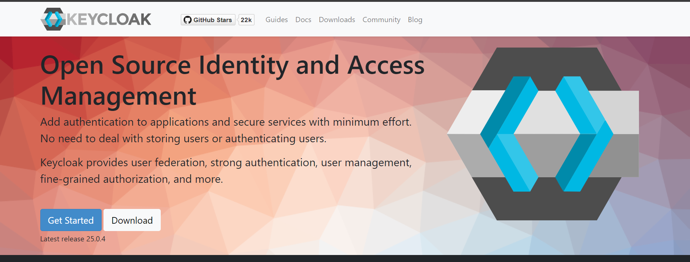

- Unzip the file and run the command `bin\kc.bat start-dev`. KeyClock is started in the development mode at 8080 port (default)

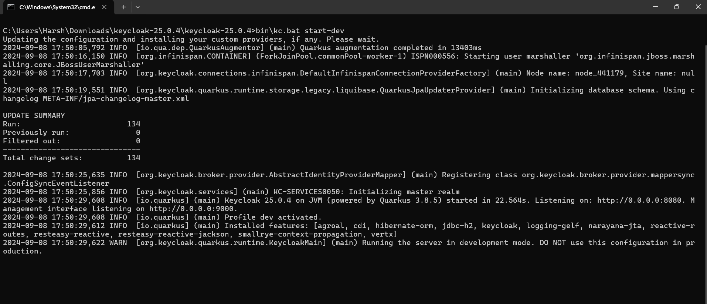

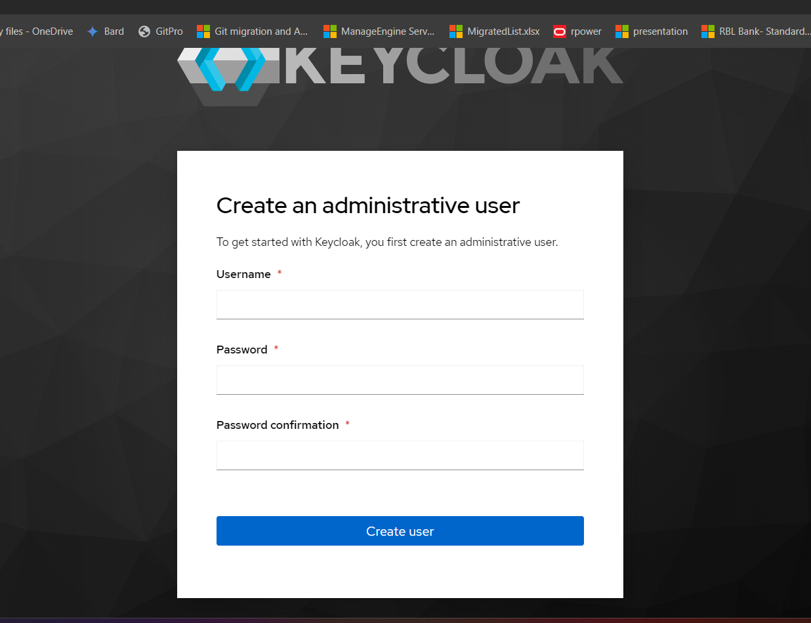

- Create an administrative account and sign in.

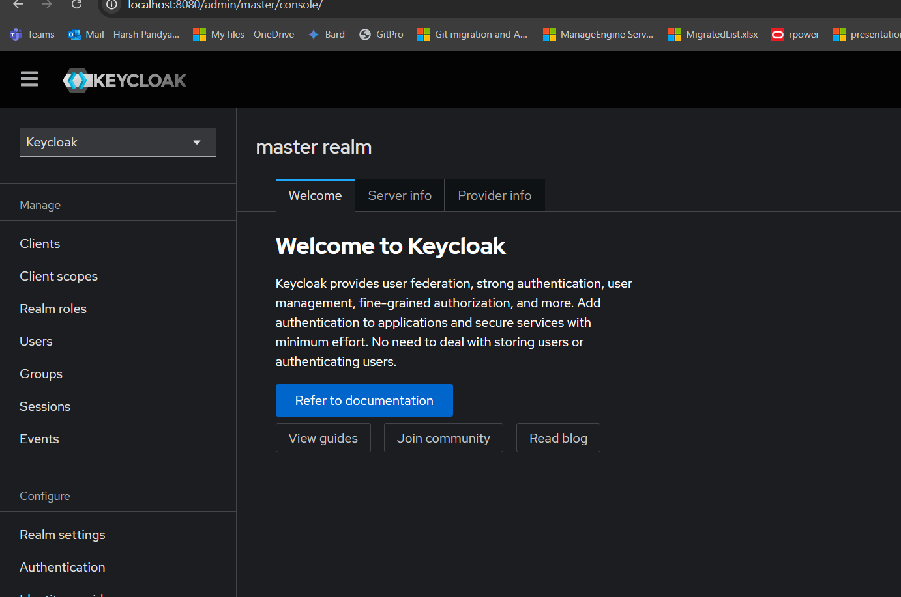

- Lets create our own realm. A realm is a space which is going to manage a set of users, credentials, roles, and groups. This is very similar to the environments. For example, if your organization have environments like dev, QA, production, we are not going to maintain the same users, same credentials across multiple environments. To support these kind of requirements or scenarios, every auth server that is built on top of OAuth 2.0, they're going to have a concept called realm.
- So using the realm, we are going to create a space which is going to handle a specific environment.

<video controls src="Images/springbootsecurity3/20240908-1230-14.0256644.mp4" title="Title"></video>

- Lets build a client credentials grant type flow, So for example, think like there is a third-party application which is interested to talk with my MyOwnAuthServer server and to get some secured details. So whenever this third-party application wants to connect with my Resource Server (spring boot application), first, it needs to register its details inside the auth server. So when this registration happens, the auth server is going to give the client ID and the client secret which can be leveraged by my third-party application to get an access token. The same access token can be sent to the Resource Server, so the Resource Server, once validated with the authorization server about the access token, is going to respond back with the proper response. So here, there is no end user involved.
- So lets register a third party application on our KeyClock server and get the client id and client secret for it.

<video controls src="Images/springbootsecurity3/20240908-1240-32.2969463.mp4" title="Title"></video>

- If you see we need to enabled **Client authentication** because it will authenticate the client id and its secret when the third party provide the request to keyclock with the details.
- Since we are implementing **Client Credentials** grant type we need to disable **Standard flow** (Authorization Code grant type) and **Direct access flow** (Password grant type)
- Lets create a resource server in spring boot application.

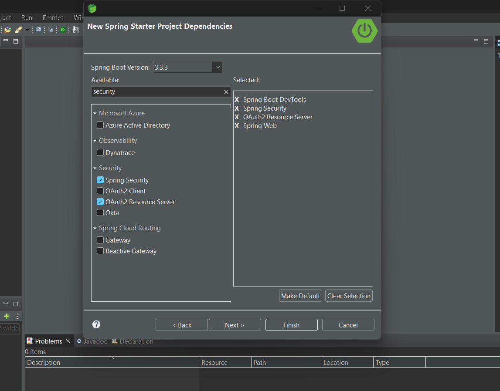

- Lets also leverage the use of MySQL database, so all the user related details and authorities will be store inside the database. So adding database related dependencies and lombok library.


```
		<dependency>
			<groupId>org.springframework.boot</groupId>
			<artifactId>spring-boot-starter-data-jpa</artifactId>
		</dependency>
		<dependency>
			<groupId>org.projectlombok</groupId>
			<artifactId>lombok</artifactId>
			<optional>true</optional>
		</dependency>
		<dependency>
			<groupId>com.mysql</groupId>
			<artifactId>mysql-connector-j</artifactId>
			<scope>runtime</scope>
		</dependency>
```

- Lets define customer, their accounts and their authority entities.

```
Customer Entity

package com.springboot.security.model.entity;

import com.fasterxml.jackson.annotation.JsonIgnore;
import com.fasterxml.jackson.annotation.JsonProperty;
import jakarta.persistence.*;
import lombok.Getter;
import lombok.Setter;

import java.sql.Date;
import java.util.Set;

@Entity
@Getter
@Setter
public class Customer {

    @Id
    @GeneratedValue(strategy = GenerationType.IDENTITY)
    @Column(name = "customer_id")
    private long id;

    private String name;

    private String email;

    @Column(name = "mobile_number")
    private String mobileNumber;

    @JsonProperty(access = JsonProperty.Access.WRITE_ONLY)
    private String pwd;

    private String role;

    @Column(name = "create_dt")
    @JsonIgnore
    private Date createDt;

    @OneToMany(mappedBy = "customer", fetch = FetchType.EAGER)
    @JsonIgnore
    private Set<Authority> authorities;

}


Customer Authority Entity

package com.springboot.security.model.entity;

import jakarta.persistence.*;
import lombok.Getter;
import lombok.Setter;

@Entity
@Getter @Setter
@Table(name="authorities")
public class Authority {

    @Id
    @GeneratedValue(strategy = GenerationType.IDENTITY)
    private long id;

    private String name;

    @ManyToOne
    @JoinColumn(name="customer_id")
    private Customer customer;

}


Customer Account Entity

package com.springboot.security.model.entity;

import jakarta.persistence.Column;
import jakarta.persistence.Entity;
import jakarta.persistence.Id;
import lombok.Getter;
import lombok.Setter;

import java.sql.Date;

@Entity
@Getter @Setter
public class Accounts {

	@Column(name = "customer_id")
	private long customerId;

	@Id
	@Column(name="account_number")
	private long accountNumber;

	@Column(name="account_type")
	private String accountType;

	@Column(name = "branch_address")
	private String branchAddress;

	@Column(name = "create_dt")
	private Date createDt;
	
}
```

- Lets create the repository for customer and their accounts.

```
Accounts Repository

package com.springboot.security.repository;

import org.springframework.data.repository.CrudRepository;
import org.springframework.stereotype.Repository;

import com.springboot.security.model.entity.Accounts;

@Repository
public interface AccountsRepository extends CrudRepository<Accounts, Long> {

    Accounts findByCustomerId(long customerId);

}

Customer Repository

package com.springboot.security.repository;

import org.springframework.data.repository.CrudRepository;
import org.springframework.stereotype.Repository;

import com.springboot.security.model.entity.Customer;

import java.util.Optional;

@Repository
public interface CustomerRepository extends CrudRepository<Customer,Long> {

    Optional<Customer> findByEmail(String email);

}
```

- Here we are not creating the service class , just for demonstration purpose we will directly call all the database related operation using repository.

- Lets first create some controllers.

```
Information Controller (Client Credentials Grant type)

package com.springboot.security.controller;

import org.springframework.web.bind.annotation.GetMapping;
import org.springframework.web.bind.annotation.RestController;

@RestController
public class InformationController {

	@GetMapping("/info")
	public String shareInfo() {
		return "This is just a service which only shares info without any end user dependency";
	}
}


Accounts Controller (Secured)

package com.springboot.security.controller;

import java.util.Optional;

import org.springframework.web.bind.annotation.GetMapping;
import org.springframework.web.bind.annotation.RequestParam;
import org.springframework.web.bind.annotation.RestController;

import com.springboot.security.model.entity.Accounts;
import com.springboot.security.model.entity.Customer;
import com.springboot.security.repository.AccountsRepository;
import com.springboot.security.repository.CustomerRepository;

import lombok.RequiredArgsConstructor;

@RestController
@RequiredArgsConstructor
public class AccountsController {

    private final AccountsRepository accountsRepository;
    private final CustomerRepository customerRepository;

    @GetMapping("/myAccount")
    public Accounts getAccountDetails(@RequestParam String email) {
        Optional<Customer> optionalCustomer = customerRepository.findByEmail(email);
        if (optionalCustomer.isPresent()) {
            Accounts accounts = accountsRepository.findByCustomerId(optionalCustomer.get().getId());
            if (accounts != null) {
                return accounts;
            } else {
                return null;
            }
        } else {
            return null;
        }
    }
	
}


Notice Controller (Public or Unsecured)


package com.springboot.security.controller;

import org.springframework.web.bind.annotation.GetMapping;
import org.springframework.web.bind.annotation.RestController;

@RestController
public class NoticeController {

	@GetMapping("/notices")
	public String getNotice() {
		return "Bank Notice";
	}
}
```

- Here the information controller class, which will give only information acting a microservice for a client.
- Here the in the account controller, we will fetch accounts details for the customer which has a email id. Also here we are not defining any custom authentication method because it will be handle by KeyCloak. Now lets create a class **KeycloakRoleConverter**. The purpose of these class is very simple. We know that right now the responsibility of generating the Access token or JWT tokens is going to be with the key cloak. And inside these JWT Token itself, we are going to have various information related to the end user along with the roles details as well. So key cloak is going to send the roles details inside the access token. Inside the Access token only, we are going to have various information about the end user or about the client application. These details include the username, what is the email of the end user, what is the email of the client application and what are the roles of the client application or what are the roles of the end user.
- So since the access token is going to send the roles information, we need to write an converter, which is going to take the responsibility of extracting the roles information from the access token. And once the roles information is extracted, we need to convert the roles information into the form of simple granted authority. Because Spring's security framework can only understand the roles and authorities information when we present them in the form of granted authority or simple granted authority.
- So here we also need implement interface **Converter**

```
package com.springboot.security.config;

import org.springframework.core.convert.converter.Converter;
import org.springframework.security.core.GrantedAuthority;
import org.springframework.security.core.authority.SimpleGrantedAuthority;
import org.springframework.security.oauth2.jwt.Jwt;

import java.util.ArrayList;
import java.util.Collection;
import java.util.List;
import java.util.Map;
import java.util.stream.Collectors;

public class KeycloakRoleConverter implements Converter<Jwt, Collection<GrantedAuthority>> {

	
    @Override
    public Collection<GrantedAuthority> convert(Jwt source) {
    	

        Map<String, Object> realmAccess = (Map<String, Object>) source.getClaims().get("realm_access");
        if (realmAccess == null || realmAccess.isEmpty()) {
            return new ArrayList<>();
        }
        
        /**
         * Get List of all the authorities in with each role prefix by ROLE_ since spring security
         * expects all roles should be prefix with 'ROLE_'. Each role values is converted into 
         * Simple Granted authority .map(SimpleGrantedAuthority::new)
         */
        Collection<GrantedAuthority> returnValue = ((List<String>) realmAccess.get("roles"))
                .stream().map(roleName -> "ROLE_" + roleName)
                .map(SimpleGrantedAuthority::new)
                .collect(Collectors.toList());
        return returnValue;
    }
}
```

- Lets add our project security configuration.

```
package com.springboot.security.config;

import jakarta.servlet.http.HttpServletRequest;
import org.springframework.beans.factory.annotation.Value;
import org.springframework.context.annotation.Bean;
import org.springframework.context.annotation.Configuration;
import org.springframework.context.annotation.Profile;
import org.springframework.security.config.annotation.web.builders.HttpSecurity;
import org.springframework.security.config.http.SessionCreationPolicy;
import org.springframework.security.oauth2.server.resource.authentication.JwtAuthenticationConverter;
import org.springframework.security.web.SecurityFilterChain;
import org.springframework.security.web.authentication.www.BasicAuthenticationFilter;
import org.springframework.security.web.csrf.CookieCsrfTokenRepository;
import org.springframework.security.web.csrf.CsrfTokenRequestAttributeHandler;
import org.springframework.web.cors.CorsConfiguration;
import org.springframework.web.cors.CorsConfigurationSource;

import java.util.Arrays;
import java.util.Collections;

@Configuration
public class ProjectSecurityConfig {


    @Bean
    SecurityFilterChain defaultSecurityFilterChain(HttpSecurity http) throws Exception {
    	
    	/**
    	 * So using JwtAuthenticationConverter object only, we are going to configure the KeycloakRoleConverter.
    	 * So with the help of these object reference, we are going to invoke a method which is 
    	 * setJwtGrantedAuthoritiesConverter(). So this method is going to responsible to convert the roles
    	 * from the JWT token to the GrantedAuthorities. So to this method, we need to pass the object
    	 * of KeycloakRoleConverter.
    	 */
        JwtAuthenticationConverter jwtAuthenticationConverter = new JwtAuthenticationConverter();
        jwtAuthenticationConverter.setJwtGrantedAuthoritiesConverter(new KeycloakRoleConverter());
        CsrfTokenRequestAttributeHandler csrfTokenRequestAttributeHandler = new CsrfTokenRequestAttributeHandler();
        http.sessionManagement(sessionConfig -> sessionConfig.sessionCreationPolicy(SessionCreationPolicy.STATELESS))
                .cors(corsConfig -> corsConfig.configurationSource(new CorsConfigurationSource() {
                    @Override
                    public CorsConfiguration getCorsConfiguration(HttpServletRequest request) {
                        CorsConfiguration config = new CorsConfiguration();
                        config.setAllowedOrigins(Collections.singletonList("http://localhost:8081"));
                        config.setAllowedMethods(Collections.singletonList("*"));
                        config.setAllowCredentials(true);
                        config.setAllowedHeaders(Collections.singletonList("*"));
                        config.setExposedHeaders(Arrays.asList("Authorization"));
                        config.setMaxAge(3600L);
                        return config;
                    }
                }))
                .csrf(csrfConfig -> csrfConfig.csrfTokenRequestHandler(csrfTokenRequestAttributeHandler)
                        .ignoringRequestMatchers("/contact", "/register")
                        .csrfTokenRepository(CookieCsrfTokenRepository.withHttpOnlyFalse()))
                .requiresChannel(rcc -> rcc.anyRequest().requiresInsecure()) // Only HTTP
                .authorizeHttpRequests((requests) -> requests
                        .requestMatchers("/myAccount").hasRole("USER")
                        .requestMatchers("/myBalance").hasAnyRole("USER", "ADMIN")
                        .requestMatchers("/notices", "/register").permitAll());
        
        /**
         * Since our Spring boot application will act as a Resource Server we need to use the method
         * 'oauth2ResourceServer'. With the help of rsc.jwt() we tell spring security that we will receive a
         * JWT token and not a opaque token, since auth server can sent two types of token.
         */
        http.oauth2ResourceServer(rsc -> rsc.jwt(jwtConfigurer ->
                jwtConfigurer.jwtAuthenticationConverter(jwtAuthenticationConverter)));
        
        /**
         * Since our spring boot server will act like a resource server we don't need to add
         * http.formLogin(Customize.withDefaults());
         */
        return http.build();
    }

}
```

- Now since right now, we are using the JWT tokens as a format of the access tokens, we need to make sure we are configuring below property in application property.

```
spring.security.oauth2.resourceserver.jwt.jwk-set-uri=${JWK_SET_URI:http://localhost:8080/realms/MyOwnAuthServer/protocol/openid-connect/certs}
```

- Wait how i got this url for `jwk-uri`? using KeyCloak Realm setting

<video controls src="Images/springbootsecurity3/20240908-1600-26.4005968.mp4" title="Title"></video>

- Lets open up the `jwk-uri`.

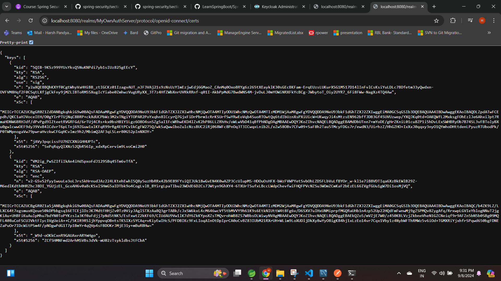

- So if you try to open this URL inside the browser, you will see there are certain keys that are provided by the auth server.  So using these keys, any resource server, they should be able to validate whether the given access token is valid or not. Behind the scenes, like  what is going to happen is always the auth server, while KeyCloak is trying to generate an access token, it is going to digitally sign it with an private key. Whereas anyone who want to validate if the access token is valid or not,
all such parties, they need to take this public key. Using these public keys only, the resource servers or any other applications, they should be able to validate if a given access token is valid or not. So that's the purpose of the certs URL.
- So the same we have configured here. So with this, what is going to happen is during the startup, the spring boot resource server, it is going to download these certificate details or public key details from the auth server. With that, my resource server should be able to validate all the access tokens without connecting to the auth server for each and every request.
- So this OpenID configuration endpoint is a very famous endpoint, and it is a standard that is being followed by all the auth servers inside the industry. Anyone who's building an auth server by following the OAuth 2.0 and OpenID standards, they need to make sure they are exposing all the auth server-related information with the help of this URL. For example, if we are looking for the details of the auth server that is built by the Google, we can simply open the URL which is `accounts.google.com/.well-known/openid-configuration`. So this is going to have similar information, the same kind of information.

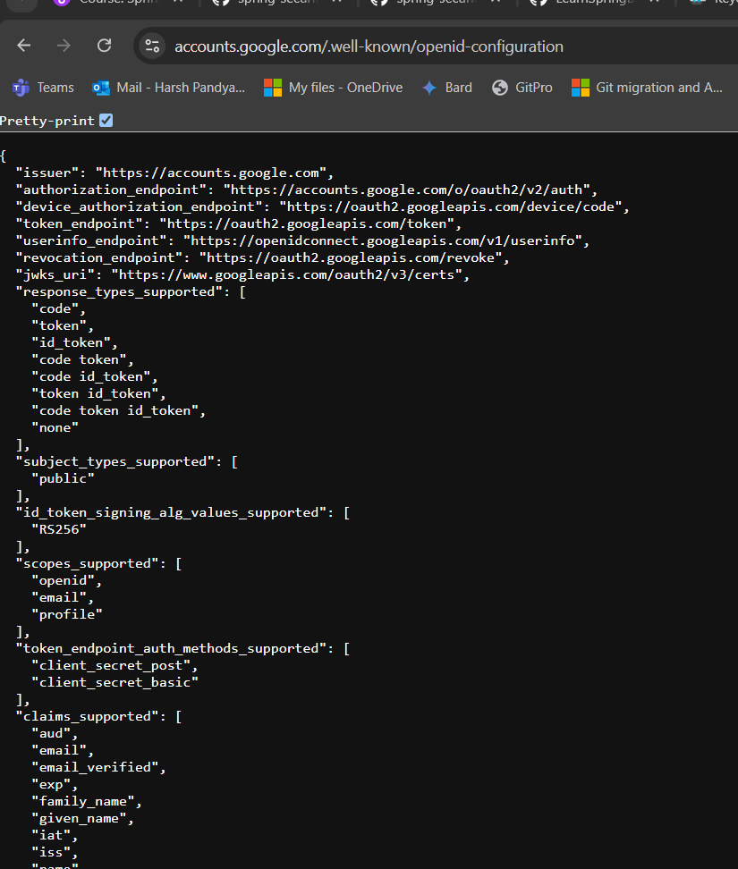

- Lets run our application and hit the `/info` path via postman (client application).

<video controls src="Images/springbootsecurity3/20240908-1649-52.6648147.mp4" title="Title"></video>

- So here if you see we need to add Access Token URL which the endpoint of the authentication server. Since we are testing client credentials grant type , we get the access token post sending client id and client secret, so here manually we enter those data from KeyCloak , we have registered the **thirdpartyid** as our client which is our postman. Now using this token we are able to access the `/info`. Now since we are using postman we need to use **OAuth 2.0** as auth type.


- If you see the video, the default token expiration is 5 minutes. Now when we disable and enable the auto refresh token functionality of postman. We can see our token expire, we can again generate a new token using refresh token grant type.

<video controls src="Images/springbootsecurity3/20240908-1657-18.5322299.mp4" title="Title"></video>

- In the theory of client credentials we learned about the client will sent the post request and in that will be client id , secret and grant type. So in the console when we request for generating a new token we can see that.

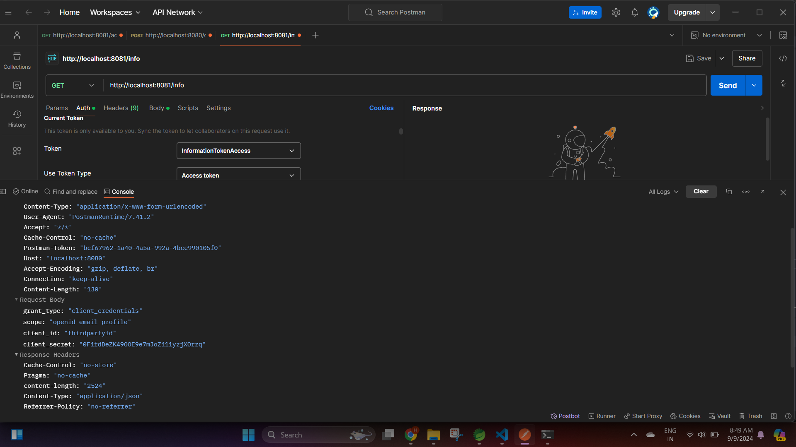

- So our **thirdpartyid** client is used for client credentials grant type flow.
- Let perform Authorization Code grant type. For that lets create a new client. Here postman will use browser to authenticate end user credentials.

<video controls src="Images/springbootsecurity3/20240909-0328-28.5762121.mp4" title="Title"></video>

- Here we selected the checkbox **Standard Flow** because it provides Authorization code grant type OAuth2. In the valid redirect URLs for now, we are going to mention `*`. That means we are fine with any page where the auth server is going to redirect the end user after the authentication is complete. But in real production application, we need to mention a proper URL of your application so that the end user is going to be landed onto these redirect URL once authentication is completed.
- Now lets create a user , since our auth server along with client will also validate user credentials post that it gonna provide token in exchange of authorization code.

<video controls src="Images/springbootsecurity3/20240909-0335-51.7133660.mp4" title="Title"></video>

- Here after entering the user details we also enable this email verified. This gives a confirmation to the keycloak that so and so user email is verified.
- But where is the password for this email id? we need to create it but before creating that we need to enforce that password end user must not be data breach. Just like in spring boot we have a method **HaveIBeenPwnedRestApiPasswordChecker** which checks whether a password could be compromise or not similarly in KeyCloak we can define some policy on the end user password. Without any configuration KeyCloak will accept any kind of password set for the user.
- Lets configure some policies on the end user password.

<video controls src="Images/springbootsecurity3/20240909-0347-01.6464841.mp4" title="Title"></video>

- Here we create a user with name `happy@example.com` and password as `Example@1234`
- So here we have manually create a user, so do we need to create manually one by one going to KeyCloak console? , ofcourse not, KeyCloak provided [Rest APIS](https://www.keycloak.org/docs-api/21.1.1/rest-api/#_users_resource) which can be leverage to add the user from the application registration or sign up page.
- Lets hit the `/myAccounts` to get the account details via postman.

<video controls src="Images/springbootsecurity3/20240909-0436-56.7438840.mp4" title="Title"></video>


- Here we selected **Authorized using browser**. With this checkbox, what is going to happen is whenever we're trying to get an access token with this grant flow, the Postman is going to leverage the browser to ask the end user credentials. Once the end user authentication is successful, this is the URL where the Auth server is going to redirect back to the Postman.
- Now coming to the **Auth URL**, you can get this URL from the well-known Open ID configurations URL. So here we have authorization endpoint. The same you need to mention inside the Postman.
- Still at this point we got 403 error. This is because to access `/myAccount` we require roles for it.

```
                .authorizeHttpRequests((requests) -> requests
                		.requestMatchers("/info").authenticated() // Client Credentials Grant Type
                        .requestMatchers("/myAccount").hasRole("USER")
                        .requestMatchers("/myBalance").hasAnyRole("USER", "ADMIN")
                        .requestMatchers("/notices", "/register").permitAll());
```

- So lets create new role and map that to the **user**, because based on user define role we can access the end point `/myAccount`

<video controls src="Images/springbootsecurity3/20240909-1847-49.4657487.mp4" title="Title"></video>

- So here we create a **Realm Role** and assign that to the user. Post assigning we need to refresh the token to get the new details for the user. In the console you can see the email id is printed


- But still we got a empty response? we got a 200 means we are able to access the path but response is empty because we have not create the user in our database. Lets do that.

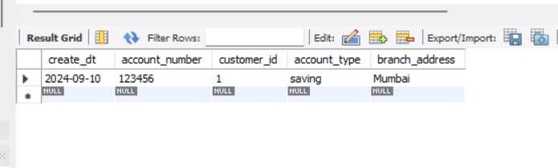

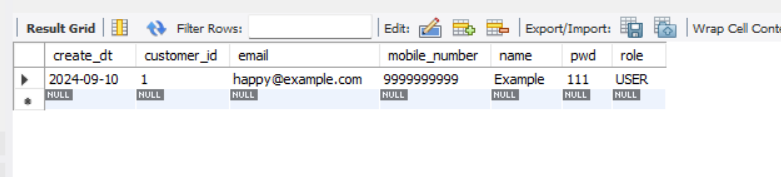

- Lets again hit the api , now we get the proper response.

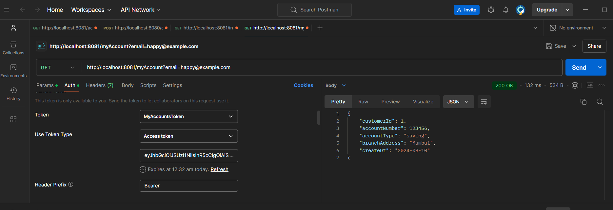

- By default in KeyCloak the access token lifespan is only **5 minutes**, current time is **12:29 AM** and the expiration time is **12:24 AM**.

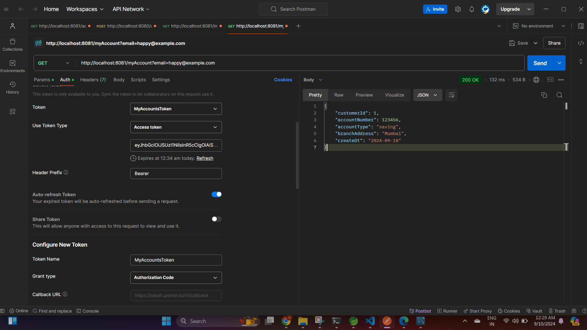

- Lets say you want to create the refresh token for an hour. You can do it inside the KeyCloak.

<video controls src="Images/springbootsecurity3/20240909-1904-42.2335486.mp4" title="Title"></video>

- We can change the [default theme page](https://www.keycloak.org/docs/latest/server_development/#_themes) when the user are being redirected to KeyCloak to enter their credentials and provide consent to access their resources by the client.
- When the Resource server is started up, at the first request it download all the JWT certificates are downloaded by the resource server from the Auth Server using `jwk-set-uri`. With this setup right now, the resource server, it is trying to validate the access tokens locally without having any dependency on the auth server. So if the auth server is shutdown and the token isn't expire, the resource server will still be able to perform authentication.

<video controls src="Images/springbootsecurity3/20240911-0713-35.9396846.mp4" title="Title"></video>


- Lets implement PKCE grant type flow. Whenever the client is not capable of storing the client secret. For example, all JavaScript-based or Angular/React-based applications, they can't store client secret. For all such public facing client applications, we need to use the PKCE Grant Type flow. As part of this flow, a **code_verifier** and a **code_challenge** is going to be generated.
- So first lets create a new client.

<video controls src="Images/springbootsecurity3/20240910-0435-15.2587731.mp4" title="Title"></video>

- Once we make sure that the standard flow is the only flow that is checked inside this page. As an next step, you should also make sure this client authentication is disabled. So by default it is going to be disabled so don't try to enable it. So this is one of the indication to auth server that this client application, it is going to leverage Authorization Code Grant Type flow with the help of PKCE. If you want to combine both the PKCE along with the client credentials, then you need to enable these client authentication.
- Since we disable the client authentication, there is no credentials tab here.
- Under the advance tab , there will be **Proof Key for Code Exchange Code Challenge Method**, here we need to select SHA256. With this we are telling to the auth server that we are going to leverage SH256 hashing function to generate the code challenge from the code verifier.


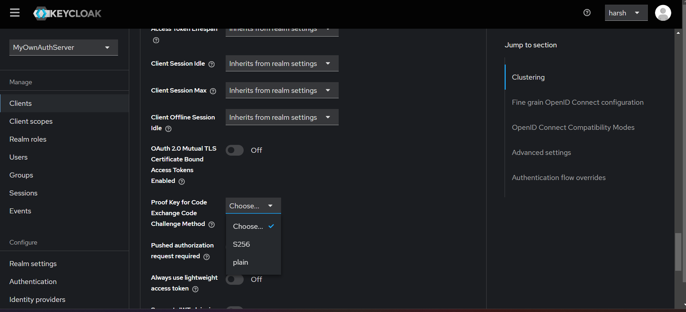

- Using the same end user `happy@example.com`, we can test the PKCE grant type flow using postman.

<video controls src="Images/springbootsecurity3/20240910-0541-53.3428649.mp4" title="Title"></video>

- Since our application.properties has `spring.jpa.hibernate.ddl-auto = create`, the existing user gets deleted. Post creating user details we get the below output.

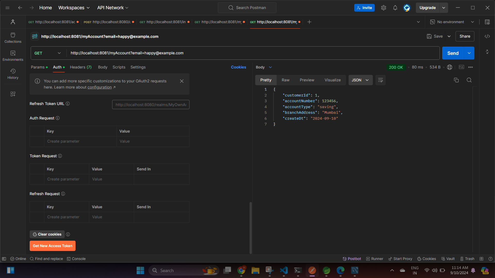

#### MFA (Multi-factor authentication)

##### Need of MFA

- While OAuth2 and OpenID ensure that only authenticated users can access certain resources or applications, they rely primarily on passwords or tokens for authentication. If a password is weak, reused, or compromised (through phishing or other attacks), the user's account could still be at risk.
- Even strong passwords can be stolen through phishing, where attackers trick users into revealing their passwords on fake websites. MFA adds another layer that a phisher would also need to compromise.
- Many users reuse passwords across multiple sites. If one site is breached, attackers could use the stolen credentials to access other accounts. MFA mitigates this risk by requiring an additional verification factor.
- Even with strong passwords, determined attackers might attempt to crack passwords using brute force attacks.
- OAuth and OpenID typically provide single-factor authentication, usually relying on just a password or token. To mitigate the risks associated with this, such as password theft or reuse we require multiple layer or multiple-factor authentication.

##### What is MFA?

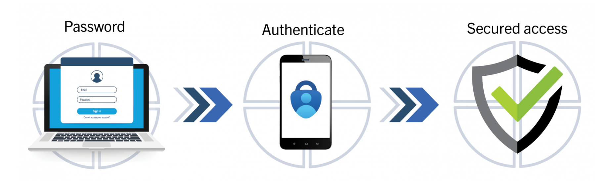

- MFA works in this way because, let’s suppose one of the factors is hacked by the attackers or invalid user, the chances of another factor also getting compromised are pretty low. That is why MFA authentication requires multiple factors, and this is how it provides a higher level of security to consumers’ identity data.
- Lets take an example.
    - **Initial Login (First Factor - Password):**
        - You enter your username and password on the banking site.
        - The site verifies your password. If it’s correct, you proceed to the next step. (First factor authentication)
        - To provide strong security in the initial login we can use OAuth2 and OpenID.
    - **MFA Challenge (Second Factor)**:
        - The site prompts you for a second factor. This could be a code sent to your phone via SMS (OTP), a code generated by an authenticator app, or a fingerprint scan.
        - You enter the code or provide the biometric verification.
    - **Access Granted**:
        - If the second factor is correct, you’re granted access to your account.
        - If the second factor is incorrect or not provided, access is denied, even if the password was correct.

- Multi-factor authentication, as the name suggests, for authentication requires multiple verification information. One of the most common factors that are widely used is OTP-based authentication. OTP or one-time passwords are 4–6 digit codes you will receive via SMS and work as a one-time entry token. It is generated periodically whenever an authentication request is made.
- MFA addresses this by requiring additional forms of verification, making it much harder for attackers to gain unauthorized access, even if they have the password.

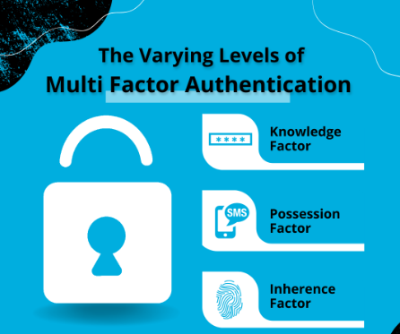

- There are mainly three methods on which MFA authentication heavily relies, and those are:
    - **Things You Know (Knowledge)**:
        - This method could involve something like a password or a security question. In the above example flow, the password you enter at the initial login step falls under this category.
    - **Things You Have (Possession)**:
        - This method involves something you physically possess, like your phone. In the example flow, when a verification code (OTP) is sent to your phone, or when you receive a push notification to approve the login, this is an example of the possession factor.
    - **Things You Are (Inheritance)**:
        - This method uses your inherent characteristics, like fingerprints or facial recognition. If the second factor in the MFA flow were to involve a fingerprint scan or facial recognition, it would be an example of the inheritance factor.

>[!NOTE]
> - "Things You Are" (inheritance) factor is often optional in many MFA setups. Organizations or systems typically require at least two factors, usually "Things You Know" (like a password) and "Things You Have" (like a phone or security token). 
> - The "Things You Are" factor, such as a fingerprint or facial recognition, can be added for even stronger security but is not always mandatory.

##### Drawbacks of MFA

- MFA adds extra steps to the login process, which some users may find inconvenient or frustrating, especially if they need to log in frequently.
- MFA often relies on a physical device (like a phone), and if that device is unavailable (lost, broken, or out of battery), users may face difficulties accessing their accounts.
- For organizations, implementing MFA may involve additional costs for purchasing and maintaining authentication devices, software, and support.

>[!NOTE]
> - Companies like Google and Microsoft offer MFA systems as part of their cloud and security services. While basic MFA features are often included with accounts, advanced options and enterprise-level support typically require a subscription or additional payment.

##### OAuth2 + OpenID + MFA

- So here we will be implement OAuth and OpenID as our single factor authentication and our second factor authentication will be taking code or OTP from authenticator of Microsoft.
- So to enable MFA in KeyCloak follow below steps. Here we will create a new user. Overall process remains same only we have added MFA.

<video controls src="Images/springbootsecurity3/20240910-1110-08.7547607.mp4" title="Title"></video>


<video controls src="Images/springbootsecurity3/20240910-1121-34.7382605.mp4" title="Title"></video>

#### Opaque Token


- Up till now we have use JWT tokens, now to configure opaque token we need to tell the resource server now it will have dependency on auth server to verify the opaque token provided by the client.
- First lets configure application properties to use opaque token

```
#spring.security.oauth2.resourceserver.jwt.jwk-set-uri=${JWK_SET_URI:http://localhost:8080/realms/MyOwnAuthServer/protocol/openid-connect/certs}
spring.security.oauth2.resourceserver.opaquetoken.introspection-uri= ${INTROSPECT_URI:http://localhost:8080/realms/MyOwnAuthServer/protocol/openid-connect/token/introspect}
spring.security.oauth2.resourceserver.opaquetoken.client-id=${INTROSPECT_ID:thirdpartyidOpaqueToken}
spring.security.oauth2.resourceserver.opaquetoken.client-secret=${INTROSPECT_SECRET:FGUu7zYJ6Lma2bRE4cFpkIvc0Lxz8s0j}
```

- Since we are using opaque token we need to change our URI, so we need to give details to the resource server, which endpoint URL that resource server has to call on the auth server whenever it want to validate a given opaque token or a given access token. So those details we are trying to mention with the help of these properties. These details can be taken from Open ID Configuration page.

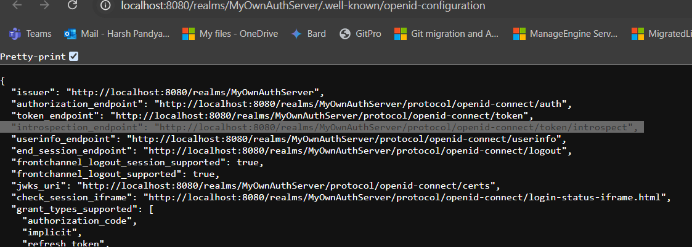

- The client must register with auth server to get its client id and its secret , so here we have create a new client.

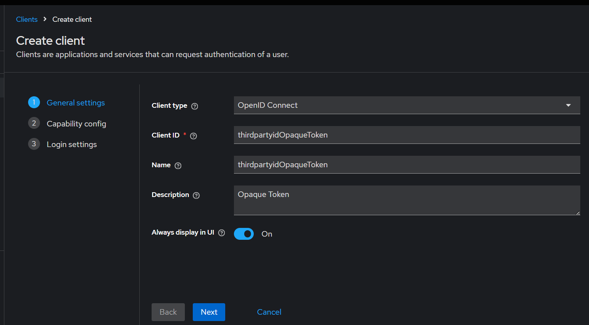

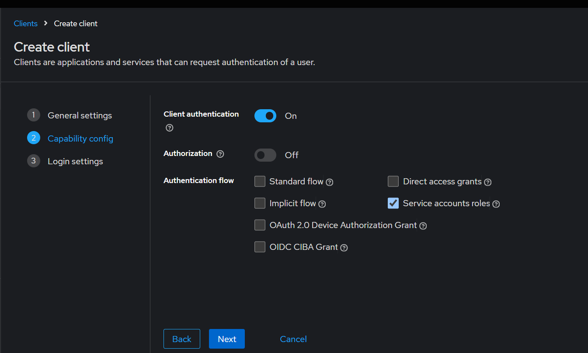

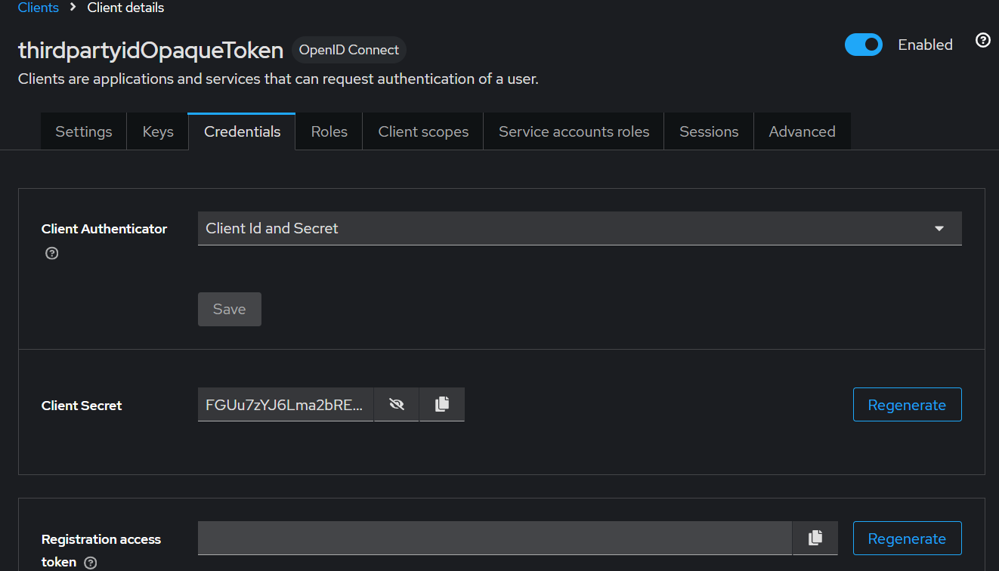

- So the client credentials have been specified in the above application properties.

- Spring security provides and interface with the name **OpaqueTokenAuthenticationConverter**. Lets create a class **KeycloakOpaqueRoleConverter** which will implement this interface.

```
package com.springboot.security.config;

import org.springframework.security.authentication.UsernamePasswordAuthenticationToken;
import org.springframework.security.core.Authentication;
import org.springframework.security.core.GrantedAuthority;
import org.springframework.security.core.authority.SimpleGrantedAuthority;
import org.springframework.security.oauth2.core.OAuth2AuthenticatedPrincipal;
import org.springframework.security.oauth2.server.resource.introspection.OpaqueTokenAuthenticationConverter;

import java.util.Collection;
import java.util.List;
import java.util.Map;
import java.util.stream.Collectors;

public class KeycloakOpaqueRoleConverter implements OpaqueTokenAuthenticationConverter {
    /**
     * @param introspectedToken      the bearer token used to perform token introspection
     * @param authenticatedPrincipal the result of token introspection
     * @return
     */
    @Override
    public Authentication convert(String introspectedToken, OAuth2AuthenticatedPrincipal authenticatedPrincipal) {
        String username = authenticatedPrincipal.getAttribute("preferred_username");
        Map<String, Object> realmAccess = authenticatedPrincipal.getAttribute("realm_access");
        Collection<GrantedAuthority> roles = ((List<String>) realmAccess.get("roles"))
                .stream().map(roleName -> "ROLE_" + roleName)
                .map(SimpleGrantedAuthority::new)
                .collect(Collectors.toList());
        return new UsernamePasswordAuthenticationToken(authenticatedPrincipal.getName(), null,
                roles);
    }
}
```

- So whenever we are implementing this interface, we need to override a method which is `convert()`. So once the resource server is going to validate the access opaque token with the auth server, `convert()` method is going to be invoked. The very first parameter to this method indicates **introspectedtoken**. So this is the same token that a client application sent to the resource server. The same token behind the scenes, the resource server will validate with the auth server by invoking an **introspected URI**.
- So once the introspection is completed, this method is going to be invoked again with the introspectedToken along with the **OAuth2AuthenticatedPrinciple**, **authenticatedPrinciple** is a result of token introspection. So during the token introspection, what is going to happen is the resource server is going to give the token received from the client application to the auth server, the auth server, in turn, it is going to validate the introspected tokenand give more details about the end user, like his username, his roles, all such details we are going to get in the form of **OAuth2AuthenticatedPrinciple** object.
- Using **authenticatedPrinciple** we get an attribute with the name, `preferred_username`, so this is going to provide me the username of the client application, whereas if the end user is involved, we are going to get the username of the end user. And coming to the roles, from the same authenticated principle, we need to get the attribute with the name `realm_access`, so the output from these attribute is going to be a Map object.
- The rest logic remains the same which were written for KeyclockRoleConverter.
- Inside the project security configuration we have specified that to use JWT token. So we need to configure opaque token for it.

```
package com.springboot.security.config;

import jakarta.servlet.http.HttpServletRequest;
import org.springframework.beans.factory.annotation.Value;
import org.springframework.context.annotation.Bean;
import org.springframework.context.annotation.Configuration;
import org.springframework.context.annotation.Profile;
import org.springframework.security.config.annotation.web.builders.HttpSecurity;
import org.springframework.security.config.http.SessionCreationPolicy;
import org.springframework.security.oauth2.server.resource.authentication.JwtAuthenticationConverter;
import org.springframework.security.web.SecurityFilterChain;
import org.springframework.security.web.authentication.www.BasicAuthenticationFilter;
import org.springframework.security.web.csrf.CookieCsrfTokenRepository;
import org.springframework.security.web.csrf.CsrfTokenRequestAttributeHandler;
import org.springframework.web.cors.CorsConfiguration;
import org.springframework.web.cors.CorsConfigurationSource;

import java.util.Arrays;
import java.util.Collections;

@Configuration
public class ProjectSecurityConfig {

	/**
	 * Injecting values from the property fields
	 */
    @Value("${spring.security.oauth2.resourceserver.opaquetoken.introspection-uri}")
    String introspectionUri;

    @Value("${spring.security.oauth2.resourceserver.opaquetoken.client-id}")
    String clientId;

    @Value("${spring.security.oauth2.resourceserver.opaquetoken.client-secret}")
    String clientSecret;

    @Bean
    SecurityFilterChain defaultSecurityFilterChain(HttpSecurity http) throws Exception {
    	
    	/**
    	 * So using JwtAuthenticationConverter object only, we are going to configure the KeycloakRoleConverter.
    	 * So with the help of these object reference, we are going to invoke a method which is 
    	 * setJwtGrantedAuthoritiesConverter(). So this method is going to responsible to convert the roles
    	 * from the JWT token to the GrantedAuthorities. So to this method, we need to pass the object
    	 * of KeycloakRoleConverter.
    	 */
        JwtAuthenticationConverter jwtAuthenticationConverter = new JwtAuthenticationConverter();
        jwtAuthenticationConverter.setJwtGrantedAuthoritiesConverter(new KeycloakRoleConverter());
        CsrfTokenRequestAttributeHandler csrfTokenRequestAttributeHandler = new CsrfTokenRequestAttributeHandler();
        http.sessionManagement(sessionConfig -> sessionConfig.sessionCreationPolicy(SessionCreationPolicy.STATELESS))
                .cors(corsConfig -> corsConfig.configurationSource(new CorsConfigurationSource() {
                    @Override
                    public CorsConfiguration getCorsConfiguration(HttpServletRequest request) {
                        CorsConfiguration config = new CorsConfiguration();
                        config.setAllowedOrigins(Collections.singletonList("http://localhost:8081"));
                        config.setAllowedMethods(Collections.singletonList("*"));
                        config.setAllowCredentials(true);
                        config.setAllowedHeaders(Collections.singletonList("*"));
                        config.setExposedHeaders(Arrays.asList("Authorization"));
                        config.setMaxAge(3600L);
                        return config;
                    }
                }))
                .csrf(csrfConfig -> csrfConfig.csrfTokenRequestHandler(csrfTokenRequestAttributeHandler)
                        .ignoringRequestMatchers("/contact", "/register")
                        .csrfTokenRepository(CookieCsrfTokenRepository.withHttpOnlyFalse()))
                .requiresChannel(rcc -> rcc.anyRequest().requiresInsecure()) // Only HTTP
                .authorizeHttpRequests((requests) -> requests
                		.requestMatchers("/info").authenticated() // Client Credentials Grant Type
                        .requestMatchers("/myAccount").hasRole("USER")
                        .requestMatchers("/myBalance").hasAnyRole("USER", "ADMIN")
                        .requestMatchers("/notices", "/register").permitAll());
        
        /**
         * Since our Spring boot application will act as a Resource Server we need to use the method
         * 'oauth2ResourceServer'. With the help of rsc.jwt() we tell spring security that we will receive a
         * JWT token and not a opaque token, since auth server can sent two types of token.
         */
//        http.oauth2ResourceServer(rsc -> rsc.jwt(jwtConfigurer ->
//                jwtConfigurer.jwtAuthenticationConverter(jwtAuthenticationConverter)));
        
        /**
         * Opaque Token Configuration
         */
        
        http.oauth2ResourceServer(rsc -> rsc.opaqueToken(otc -> otc.authenticationConverter(new KeycloakOpaqueRoleConverter())
                .introspectionUri(this.introspectionUri).introspectionClientCredentials(this.clientId,this.clientSecret)));
        return http.build();
    }

}
```

- Lets test it. So here we are using Auth Code to just issue the token which is of JWT type, behind the scene the spring boot resource server will connect will connect with auth server to validate the issue token. 

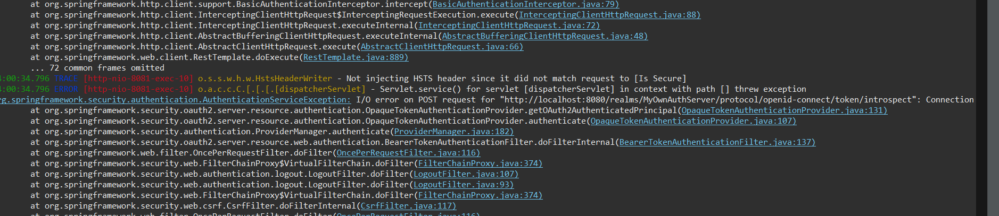

- The format to send the request using Auth Code remains the same. Only we are using token which is of JWT type instead of random generate string.

>[!IMPORTANT]
> - KeyCloak does not support issuing the tokens in the opaque format. Always, it's going to issue the tokens in a JWT format only.
> - Spring Authorization server will issue token in opaque token.
> - We can also built social login using KeyCloak.

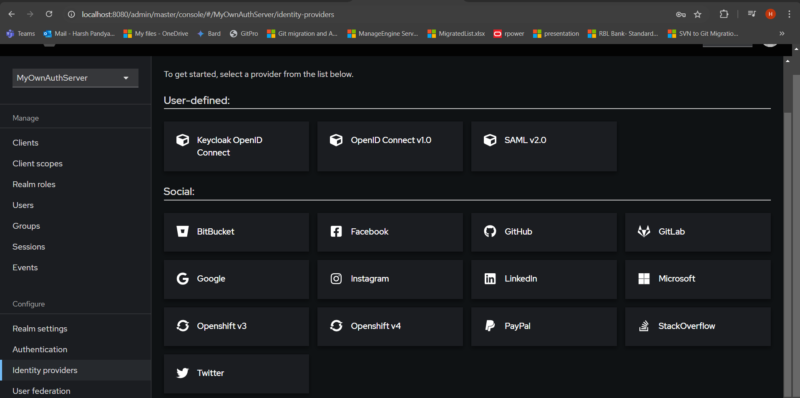


### With Auth Server (Spring Authorization Server) 

- If an organization wanted to create their own authorization server they can use Spring authorization server. It has been introduce in 2023.
- Lets create a new spring boot with the following dependencies.


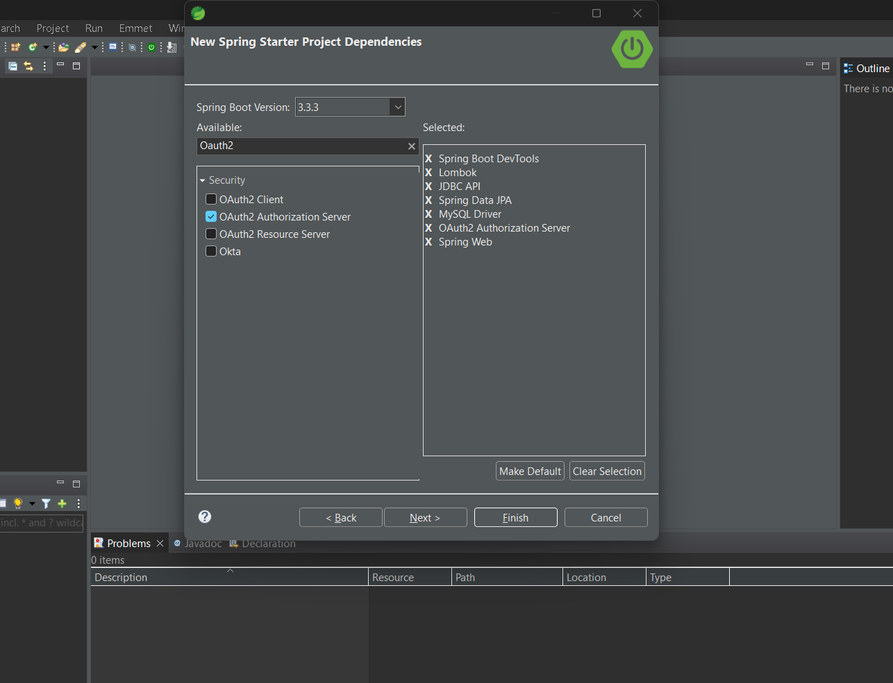

- Lets create a project security config.

```
package com.springboot.security.config;

import com.nimbusds.jose.jwk.JWKSet;
import com.nimbusds.jose.jwk.RSAKey;
import com.nimbusds.jose.jwk.source.ImmutableJWKSet;
import com.nimbusds.jose.jwk.source.JWKSource;
import com.nimbusds.jose.proc.SecurityContext;
import org.springframework.context.annotation.Bean;
import org.springframework.context.annotation.Configuration;
import org.springframework.core.annotation.Order;
import org.springframework.http.MediaType;
import org.springframework.security.authentication.password.CompromisedPasswordChecker;
import org.springframework.security.config.Customizer;
import org.springframework.security.config.annotation.web.builders.HttpSecurity;
import org.springframework.security.config.annotation.web.configuration.EnableWebSecurity;
import org.springframework.security.core.authority.AuthorityUtils;
import org.springframework.security.crypto.factory.PasswordEncoderFactories;
import org.springframework.security.crypto.password.PasswordEncoder;
import org.springframework.security.oauth2.core.AuthorizationGrantType;
import org.springframework.security.oauth2.core.ClientAuthenticationMethod;
import org.springframework.security.oauth2.core.oidc.OidcScopes;
import org.springframework.security.oauth2.jwt.JwtDecoder;
import org.springframework.security.oauth2.server.authorization.OAuth2TokenType;
import org.springframework.security.oauth2.server.authorization.client.InMemoryRegisteredClientRepository;
import org.springframework.security.oauth2.server.authorization.client.RegisteredClient;
import org.springframework.security.oauth2.server.authorization.client.RegisteredClientRepository;
import org.springframework.security.oauth2.server.authorization.config.annotation.web.configuration.OAuth2AuthorizationServerConfiguration;
import org.springframework.security.oauth2.server.authorization.config.annotation.web.configurers.OAuth2AuthorizationServerConfigurer;
import org.springframework.security.oauth2.server.authorization.settings.AuthorizationServerSettings;
import org.springframework.security.oauth2.server.authorization.settings.ClientSettings;
import org.springframework.security.oauth2.server.authorization.settings.OAuth2TokenFormat;
import org.springframework.security.oauth2.server.authorization.settings.TokenSettings;
import org.springframework.security.oauth2.server.authorization.token.JwtEncodingContext;
import org.springframework.security.oauth2.server.authorization.token.OAuth2TokenCustomizer;
import org.springframework.security.web.SecurityFilterChain;
import org.springframework.security.web.authentication.LoginUrlAuthenticationEntryPoint;
import org.springframework.security.web.authentication.password.HaveIBeenPwnedRestApiPasswordChecker;
import org.springframework.security.web.util.matcher.MediaTypeRequestMatcher;

import java.security.KeyPair;
import java.security.KeyPairGenerator;
import java.security.interfaces.RSAPrivateKey;
import java.security.interfaces.RSAPublicKey;
import java.time.Duration;
import java.util.Collections;
import java.util.List;
import java.util.Set;
import java.util.UUID;
import java.util.stream.Collectors;

@Configuration
@EnableWebSecurity
public class ProjectSecurityConfig {

    @Bean
    @Order(1)
    public SecurityFilterChain authorizationServerSecurityFilterChain(HttpSecurity http)
            throws Exception {
    	/**
    	 * Apply some default the configurations related to the authorization server.
    	 */
        OAuth2AuthorizationServerConfiguration.applyDefaultSecurity(http);
        http.getConfigurer(OAuth2AuthorizationServerConfigurer.class)
                .oidc(Customizer.withDefaults());    // Enable OpenID Connect 1.0
        http
                // Redirect to the login page when not authenticated from the
                // authorization endpoint
                .exceptionHandling((exceptions) -> exceptions
                		/**
                		 * With the help of this `defaultAuthenticationEntryPoint()`,
                		 * we're going to redirect the end user to the login page
                		 * whenever exception occurs related to authentication
                		 */
                        .defaultAuthenticationEntryPointFor(
                                new LoginUrlAuthenticationEntryPoint("/login"),
                                new MediaTypeRequestMatcher(MediaType.TEXT_HTML)
                        )
                )
                /**
                 * Convert these authorizations (OAuth2AuthorizationServerConfiguration) server as an OAuth2 resource server
                 * to accept Accept access tokens for User Info and/or Client Registration
                 */
                .oauth2ResourceServer((resourceServer) -> resourceServer
                        .jwt(Customizer.withDefaults()));

        return http.build();
    }

    /**
     * Another bean with the same type is being created,
     * but with the order as two.
     * That means the above bean is going
     * to be created first followed by this bean.
     * 
     * This bean handles web page related security details `.anyRequest().authenticated()`
     * 
     * Why two different beans?
     * - Just to keep authorization server configuration into different area and web mvc path related configuration in different area
     * - In the very first bean, spring is trying to define all the configurations which are specific to the auth server.
     * 	 Whereas coming to the second bean, you can see they're trying to configure these .authenticated() and formLogin().
     *   At the end of the day, the authorization server also, it is also going to expose some secured APIs and secure pages.
     *   So all these pages, since they have to be authenticated properly, and in the case whenever we want to access these pages,
     *   we should be able to access them by entering our credentials with the help of formLogin() approach.
     *   So that's why they tried to create two different beans.
     */
    @Bean
    @Order(2)
    public SecurityFilterChain defaultSecurityFilterChain(HttpSecurity http)
            throws Exception {
        http
                .authorizeHttpRequests((authorize) -> authorize
                        .anyRequest().authenticated()
                )
                // Form login handles the redirect to the login page from the
                // authorization server filter chain
                .formLogin(Customizer.withDefaults());

        return http.build();
    }

    /**
     * Since we don't have admin console just like we had in KeyCloak, so whenever we want to register a client,
     * this is how we need to register. We need to register a client with the help of this registered client class.
     * So inside this class we have so many methods like clientId, clientSecret, what is the type of authentication method,
     * what are the authorization grant type that your client is going to support, redirectUri, scopes.
     * So once the registered client object is created, they're trying to pass the object of this
     * to the InMemoryRegisteredClientRepository.
     * This means all the clients that we are going to configure,
     * they're going to be saved inside the memory of the application.
     * 
     * If you wanna store the client credentials in a database you can use RegisteredClientRepository
     * implementation JdbcRegisteredClientRepository
     */
    @Bean
    public RegisteredClientRepository registeredClientRepository() {
		RegisteredClient oidcClient = RegisteredClient.withId(UUID.randomUUID().toString())
				.clientId("oidc-client")
				.clientSecret("{noop}secret")
				.clientAuthenticationMethod(ClientAuthenticationMethod.CLIENT_SECRET_BASIC)
				.authorizationGrantType(AuthorizationGrantType.AUTHORIZATION_CODE)
				.authorizationGrantType(AuthorizationGrantType.REFRESH_TOKEN)
				.redirectUri("http://127.0.0.1:8080/login/oauth2/code/oidc-client")
				.postLogoutRedirectUri("http://127.0.0.1:8080/")
				.scope(OidcScopes.OPENID)
				.scope(OidcScopes.PROFILE)
				.clientSettings(ClientSettings.builder().requireAuthorizationConsent(true).build())
				.build();
		return new InMemoryRegisteredClientRepository(oidcClient);
    }

    /**
     * Any auth server that is built based upon the OAuth2 standards, behind the scenes, 
     * it's going to generate private and public certificates or keys. So using the private key 
     * or certificate, the auth server, it is going to digitally sign the access tokens, 
     * ID tokens, or any other tokens.
     * 
     * On the resource server side, they should be able to validate these tokens locally by 
     * using the public certificate or public key. So this method or this bean,
     * it is going to take care of generating a public key and a private key during the startup.
     * So it is also going to use the helper method, which is generateRsaKey().
     */
    @Bean
    public JWKSource<SecurityContext> jwkSource() {
        KeyPair keyPair = generateRsaKey();
        RSAPublicKey publicKey = (RSAPublicKey) keyPair.getPublic();
        RSAPrivateKey privateKey = (RSAPrivateKey) keyPair.getPrivate();
        RSAKey rsaKey = new RSAKey.Builder(publicKey)
                .privateKey(privateKey)
                .keyID(UUID.randomUUID().toString())
                .build();
        JWKSet jwkSet = new JWKSet(rsaKey);
        return new ImmutableJWKSet<>(jwkSet);
    }

    /**
     * So this is the helper method which will generate a key pair,
     * which is going to have both the private and the public keys.
     */
    private static KeyPair generateRsaKey() {
        KeyPair keyPair;
        try {
            KeyPairGenerator keyPairGenerator = KeyPairGenerator.getInstance("RSA");
            keyPairGenerator.initialize(2048);
            keyPair = keyPairGenerator.generateKeyPair();
        } catch (Exception ex) {
            throw new IllegalStateException(ex);
        }
        return keyPair;
    }

    /**
     * Inside this method we're trying to configure the bean of JWKSource that got generated here.
     * So with this, what we're trying to tell to the auth server is, so whenever you are trying to generate an access token,
     * please digitally sign it with the help of these JwkSource.
     */
    @Bean
    public JwtDecoder jwtDecoder(JWKSource<SecurityContext> jwkSource) {
        return OAuth2AuthorizationServerConfiguration.jwtDecoder(jwkSource);
    }

    /**
     *  Responsible to configure all the settings inside the authorization server
     */
    @Bean
    public AuthorizationServerSettings authorizationServerSettings() {
        return AuthorizationServerSettings.builder().build();
    }

    @Bean
    public PasswordEncoder passwordEncoder() {
        return PasswordEncoderFactories.createDelegatingPasswordEncoder();
    }

    /**
     * From Spring Security 6.3 version
     *
     * @return
     */
    @Bean
    public CompromisedPasswordChecker compromisedPasswordChecker() {
        return new HaveIBeenPwnedRestApiPasswordChecker();
    }

}
```

- Adding below details in application properties

```
spring.application.name=springauthserver

server.port= ${AS_SERVER_PORT:9000}
logging.level.org.springframework.security=${SPRING_SECURITY_LOG_LEVEL:TRACE}

spring.datasource.url=jdbc:mysql://${DATABASE_HOST:localhost}:${DATABASE_PORT:3306}/${DATABASE_NAME:springbootsecuritykeycloak}
spring.datasource.username=root
spring.datasource.password=Meetpandya40@
spring.jpa.show-sql=${JPA_SHOW_SQL:true}
spring.jpa.properties.hibernate.format_sql=${HIBERNATE_FORMAT_SQL:true}
spring.jpa.hibernate.ddl-auto = update
logging.pattern.console = ${LOGPATTERN_CONSOLE:%green(%d{HH:mm:ss.SSS}) %blue(%-5level) %red([%thread]) %yellow(%logger{15}) - %msg%n}
```

- So lets first create a new client and create client credentials grant type flow.

```
    @Bean
    public RegisteredClientRepository registeredClientRepository() {
    	// Generating a random Unique ID
		RegisteredClient oidcClient = RegisteredClient.withId(UUID.randomUUID().toString())
				.clientId("oidc-client")
				.clientSecret("{noop}secret")
				.clientAuthenticationMethod(ClientAuthenticationMethod.CLIENT_SECRET_BASIC)
				.authorizationGrantType(AuthorizationGrantType.AUTHORIZATION_CODE)
				.authorizationGrantType(AuthorizationGrantType.REFRESH_TOKEN)
				.redirectUri("http://127.0.0.1:8080/login/oauth2/code/oidc-client")
				.postLogoutRedirectUri("http://127.0.0.1:8080/")
				.scope(OidcScopes.OPENID)
				.scope(OidcScopes.PROFILE)
				.clientSettings(ClientSettings.builder().requireAuthorizationConsent(true).build())
				.build();
		RegisteredClient thirdparty = RegisteredClient.withId(UUID.randomUUID().toString())
				.clientId("thirdparty")
				.clientSecret("{noop}arandomgeneratestring") // Can be stored in Bcrypt format as well
				
				/**
				 * How will the client sent its credentials ? in headers or body or in basic http standards?
				 * @CLIENT_SECRET_BASIC -> Basic HTTP Standard
				 */
				.clientAuthenticationMethod(ClientAuthenticationMethod.CLIENT_SECRET_BASIC)
				.authorizationGrantType(AuthorizationGrantType.AUTHORIZATION_CODE)
//				.authorizationGrantType(AuthorizationGrantType.REFRESH_TOKEN) // Not require now
				
				/**
				 * Below details will require when you have UI page.
				 */
//				.redirectUri("http://127.0.0.1:8080/login/oauth2/code/oidc-client")
//				.postLogoutRedirectUri("http://127.0.0.1:8080/")
				
				// Defining scopes
//				.scope(OidcScopes.OPENID) 
//				.scope(OidcScopes.EMAIL)
				
				.scopes(i->i.addAll(List.of(OidcScopes.OPENID,"ADMIN","USER")))
				
				/**
				 * Defining JWT token or self contained token format along with expiration of token.
				 * So using this it will validate the tokens locally
				 */
                .tokenSettings(TokenSettings.builder().accessTokenTimeToLive(Duration.ofMinutes(10))
                        .accessTokenFormat(OAuth2TokenFormat.SELF_CONTAINED).build())
                
                /**
                 * Taking consent from the user when redirected.
                 * So true indicates we need to take consent from the user
                 * whenever authentication is perform
                 * 
                 * Not applicable for Client Credentials grant type
                 */
//				.clientSettings(ClientSettings.builder().requireAuthorizationConsent(true).build())
				.build();
		return new InMemoryRegisteredClientRepository(oidcClient,thirdparty);
    }
```

- Lets run the application and check the well known open id configuration `http://localhost:9000/.well-known/openid-configuration`.


- We have set up the authorization server using spring boot but what about the resource server?, so within the same workspace lets create a resource server using spring.

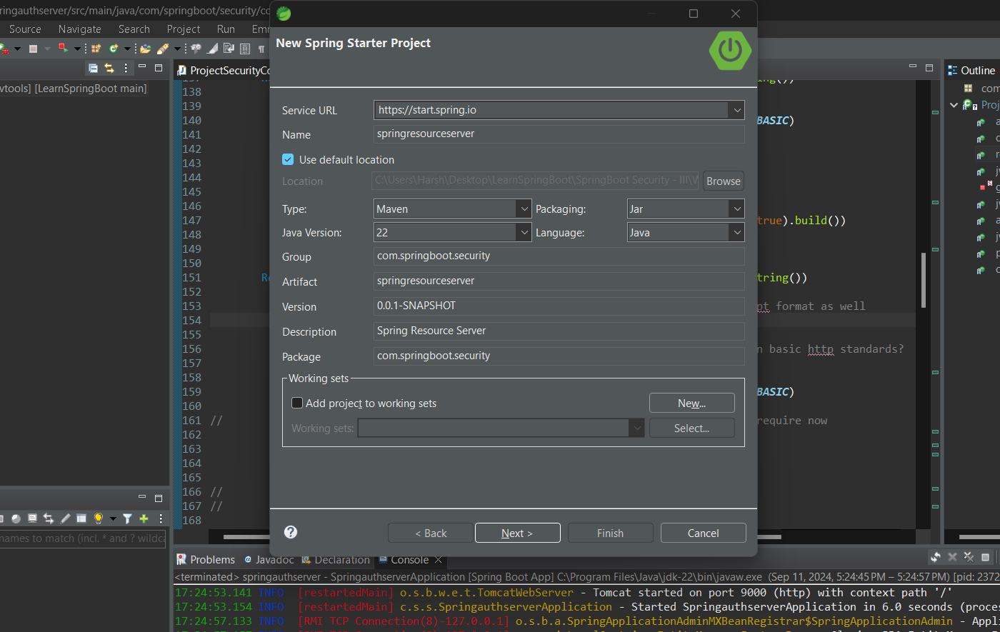

- Adding up dependencies for the resource server.


- Copying the controller, entity and repository methods from KeyCloak project. So that we can use the same set of users.
- Now first we need to change the `jwks-set-uri` in application configuration of our resource spring server to our auth server well know open id configuration provided.

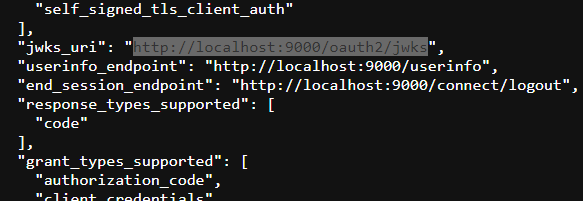


- Resource server application property

```
spring.application.name=springresourceserver
logging.level.org.springframework.security=${SPRING_SECURITY_LOG_LEVEL:TRACE}
logging.pattern.console = ${LOGPATTERN_CONSOLE:%green(%d{HH:mm:ss.SSS}) %blue(%-5level) %red([%thread]) %yellow(%logger{15}) - %msg%n}
server.port=8081
spring.datasource.url=jdbc:mysql://localhost:3306/springbootsecuritykeycloak
spring.datasource.username=root
spring.datasource.password=Meetpandya40@
spring.datasource.driver-class-name=com.mysql.cj.jdbc.Driver
spring.jpa.database-platform = org.hibernate.dialect.MySQL8Dialect
spring.jpa.generate-ddl=true
spring.jpa.hibernate.ddl-auto = update
spring.jpa.show-sql=true


spring.security.oauth2.resourceserver.jwt.jwk-set-uri=${JWK_SET_URI:http://localhost:9000/oauth2/jwks}
```

- Now in the KeyCloak we had **KeycloakRoleConverter** and **KeycloakOpaqueRoleConverter**. So lets rename those file to **SpringAuthRoleConverter** and **SpringAuthOpaqueRoleConverter** based on this update the project security configuration.
- Lets run the both the auth server and resource server in eclipse.

<video controls src="Images/springbootsecurity3/20240911-1235-01.8461953.mp4" title="Title"></video>

- Since we are refering the same MVC path and endpoint which we used in KeyCloak , lets generate a JWT token using postman.

<video controls src="Images/springbootsecurity3/20240911-1256-06.2277791.mp4" title="Title"></video> 


>[!NOTE]
> - Here we are using port number of resource server (8081) and not the authorization server (9000), because we are accessing the endpoint of the resource server.

- Now if you see the roles are in a form of Array list, now in the current code **SpringAuthRoleConverter** we are accepting it in a Map based format.
- Current code

```
    @Override
    public Collection<GrantedAuthority> convert(Jwt source) {
    	
        Map<String, Object> realmAccess = (Map<String, Object>) source.getClaims().get("realm_access");
        if (realmAccess == null || realmAccess.isEmpty()) {
            return new ArrayList<>();
        }
        
        /**
         * Get List of all the authorities in with each role prefix by ROLE_ since spring security
         * expects all roles should be prefix with 'ROLE_'. Each role values is converted into 
         * Simple Granted authority .map(SimpleGrantedAuthority::new)
         */
        Collection<GrantedAuthority> returnValue = ((List<String>) realmAccess.get("roles"))
                .stream().map(roleName -> "ROLE_" + roleName)
                .map(SimpleGrantedAuthority::new)
                .collect(Collectors.toList());
        return returnValue;
    }
```

- Modified Code

```
    @Override
    public Collection<GrantedAuthority> convert(Jwt source) {
    	
        ArrayList<String> roles = (ArrayList<String>) source.getClaims().get("roles");
        if (roles == null || roles.isEmpty()) {
            return new ArrayList<>();
        }
        Collection<GrantedAuthority> returnValue = roles.stream().map(roleName -> "ROLE_" + roleName)
                .map(SimpleGrantedAuthority::new)
                .collect(Collectors.toList());
        return returnValue;
    }
```

- The same can be done for **SpringAuthOpaqueRoleConverter**

```
        ArrayList<String> roles  = authenticatedPrincipal.getAttribute("scope");
        Collection<GrantedAuthority> grantedAuthorities = roles
                .stream().map(roleName -> "ROLE_" + roleName)
                .map(SimpleGrantedAuthority::new)
                .collect(Collectors.toList());
        return new UsernamePasswordAuthenticationToken(authenticatedPrincipal.getName(), null,
                grantedAuthorities);
```

- Lets hit the api now, we will get a success response.

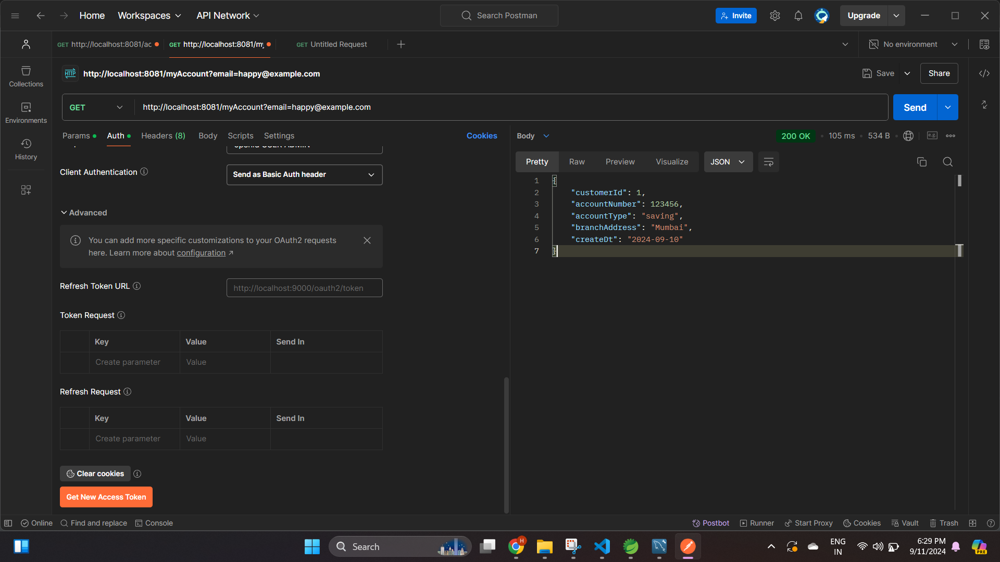

- Thats how we achieve client credentials grant type using spring authorization server.
- Lets say you have a requirement where you wanted to customize your access token generation, you wanna duplicate the scope field and create a new field with roles having same values of scope field. So to customize the token we need to use an interface **OAuth2TokenCustomizer**.

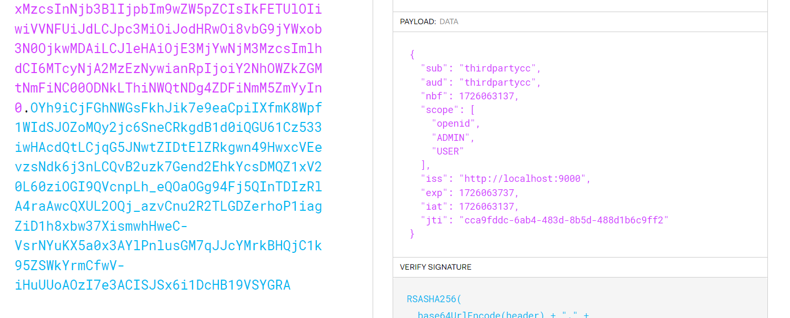


```
/**
     * To customize the tokens awe need to use interface OAuth2TokenCustomizer with a generic type
     * Since right now we are generating the tokens by using the jot format, we 
     * need to mention the class name as `JWTEncodingContext`.
     */
    @Bean
    public OAuth2TokenCustomizer<JwtEncodingContext> jwtTokenCustomizer() {
    	
    	/**
    	 * So all the token values which will be generated will go under this Context object.
    	 * So the framework is going to provide an object of JWTEncodingContext as an input to this lambda expression.
    	 */
        return (context) -> {
        	
        	/**
        	 * Check the token type whether it is ACCESS_TOKEN or REFRESH_TOKEN
        	 */
            if (context.getTokenType().equals(OAuth2TokenType.ACCESS_TOKEN)) {
                context.getClaims().claims((claims) -> {
                	
                	/**
                	 * Checks the Grant type , in case of CLIENT_CREDENTIALS we wanted to duplicate the scope fields
                	 * and add duplicated values inside the roles field.
                	 */
                    if (context.getAuthorizationGrantType().equals(AuthorizationGrantType.CLIENT_CREDENTIALS)) {
                    	
                    	/**
                    	 * So context.getClaims() is going to give me all the claims available inside the Context object or inside an access token.
                    	 * Claims are nothing but all these fields.
                    	 * 
                    	 * {
							  "sub": "thirdpartycc",
							  "aud": "thirdpartycc",
							  "nbf": 1726063137,
							  "scope": [
							    "openid",
							    "ADMIN",
							    "USER"
							  ],
							  "iss": "http://localhost:9000",
							  "exp": 1726063737,
							  "iat": 1726063137,
							  "jti": "cca9fddc-6ab4-483d-8b5d-488d1b6c9ff2"
							}
                    	 */
                        Set<String> roles = context.getClaims().build().getClaim("scope");
                        claims.put("roles", roles);
                    }
                });
            }
        };
    }
```

- Lets run the application and see the new token.

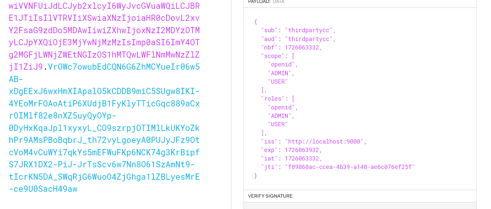

- If you see a new role field which has same values of scope is duplicated. This is how we can customize tokens.
- Lets implement Authorization code and PKCE grant type flow. So for that inside the method **RegisteredClientRepository** we need to register two more clients.

```
	RegisteredClient thirdpartyAC = RegisteredClient.withId(UUID.randomUUID().toString())
				.clientId("thirdpartyac")
				.clientSecret("{noop}arandomgeneratestringac") // Can be stored in Bcrypt format as well
				/**
				 * The auth server will expect these clientId and clientSecret as part of that RequestBody because
				 * we have specified CLIENT_SECRET_POST
				 */
				.clientAuthenticationMethod(ClientAuthenticationMethod.CLIENT_SECRET_POST)
                .clientAuthenticationMethod(ClientAuthenticationMethod.CLIENT_SECRET_BASIC)

				/**
				 * Grant type
				 */
				.authorizationGrantType(AuthorizationGrantType.AUTHORIZATION_CODE)
				
				/**
				 * whenever we are configuring this authorization code, 
				 * we also want to support the Refresh Grant Type flow as well.
				 */
				.authorizationGrantType(AuthorizationGrantType.REFRESH_TOKEN)
				
				/**
				 * We need to invoke a method which is redirectUri(). Usually, in real applications
				 * we want the end user to be redirected to a different page once the authentication is successful.
				 * For example, like a dashboard or a profile page, it can be anything. But since right now,
				 * we are trying to mimic the client application
				 * with the help of postman, what we have to do is we have to mention the URL provided by the postman.
				 */
				.redirectUri("https://oauth.pstmn.io/v1/callback")
				
				/**
				 * ADMIN, USER scopes are not recommended scopes for client , because client requires
				 * access of products like email , or any other profile etc. ADMIN USER scopes are applicable
				 * for user
				 */
                .scope(OidcScopes.OPENID).scope(OidcScopes.EMAIL)
                
                /**
                 * Below lines defines expiration of access token
                 */
                .tokenSettings(TokenSettings.builder().accessTokenTimeToLive(Duration.ofMinutes(10))

                /**
                 * Below lines defines expiration of refresh token, so if any access tokens expires
                 * using refresh token we generate a new access token, so how much time that refresh token should be valid?
                 * so we can define that , also we if the refresh token gets expired so the auth server
                 * must provide a new refresh token or not that can be defined using reuseRefreshTokens() method
                 * when false, with this configuration what is going to happen is, whenever the client application,
                 * it is trying to leverage the Refresh Token Grant Type flow,
                 * it is going to get a new refresh token
                 * every time it provides a previous refresh token.
                 * Otherwise, if you configure this value as true, then always the client application
                 * is going to get the same refresh token value.
                 */
                .refreshTokenTimeToLive(Duration.ofHours(8)).reuseRefreshTokens(false)

                // JWT Token format
                .accessTokenFormat(OAuth2TokenFormat.SELF_CONTAINED).build())
                
                /**
                 * 
                 */
				.build();
		
		RegisteredClient thirdpartyPKCE = RegisteredClient.withId(UUID.randomUUID().toString())
				.clientId("thirdpartypkce")
				.clientSecret("{noop}arandomgeneratestringpkce") // Can be stored in Bcrypt format as well
				// PKEC flow does not have client secret
				.clientAuthenticationMethod(ClientAuthenticationMethod.NONE)
                .clientAuthenticationMethod(ClientAuthenticationMethod.CLIENT_SECRET_BASIC)
				/**
				 * Grant type (Authorization code but without client secret which becomes PKCE)
				 */
				.authorizationGrantType(AuthorizationGrantType.AUTHORIZATION_CODE)
				.authorizationGrantType(AuthorizationGrantType.REFRESH_TOKEN)
				.redirectUri("https://oauth.pstmn.io/v1/callback")
                .scope(OidcScopes.OPENID).scope(OidcScopes.EMAIL)
                .tokenSettings(TokenSettings.builder().accessTokenTimeToLive(Duration.ofMinutes(10))
                .refreshTokenTimeToLive(Duration.ofHours(8)).reuseRefreshTokens(false)
                .accessTokenFormat(OAuth2TokenFormat.SELF_CONTAINED).build())
                /**
                 * if the client is required to provide a proof key challenge 
                 * and verifier when performing the Authorization Code Grant flow.
                 * and default SHA256 algorithm is used
                 */
                .clientSettings(ClientSettings.builder().requireProofKey(true).build())
				.build();		
		
		/**
		 * So the constructor of InMemoryRegisteredClientRepository class, 
		 * it is capable of accepting any number of registered client as an input.
		 */
		return new InMemoryRegisteredClientRepository(oidcClient,thirdpartyCC,thirdpartyAC,thirdpartyPKCE);
```

- So can we run now our application? Nope, because we have configure authentication for client but have not configure authentication for the end user. To do so authentication provider user detail service implementation will help us during the end user authentication process.
- So we need to create user authentication on our authorization server.
- So first we need to copy the model and repository folder from the resource server to authorization server to get the repository and entity set-up. Post that we need to create our own custom authentication provider.

```
package com.springboot.security.config;

import lombok.RequiredArgsConstructor;
import org.springframework.security.authentication.AuthenticationProvider;
import org.springframework.security.authentication.BadCredentialsException;
import org.springframework.security.authentication.UsernamePasswordAuthenticationToken;
import org.springframework.security.core.Authentication;
import org.springframework.security.core.AuthenticationException;
import org.springframework.security.core.userdetails.UserDetails;
import org.springframework.security.core.userdetails.UserDetailsService;
import org.springframework.security.crypto.password.PasswordEncoder;
import org.springframework.stereotype.Component;

@Component
@RequiredArgsConstructor
public class CustomUsernamePwdAuthenticationProvider implements AuthenticationProvider {

    private final UserDetailsService userDetailsService;
    private final PasswordEncoder passwordEncoder;

    @Override
    public Authentication authenticate(Authentication authentication) throws AuthenticationException {
        String username = authentication.getName();
        String pwd = authentication.getCredentials().toString();
        UserDetails userDetails = userDetailsService.loadUserByUsername(username);
        if (passwordEncoder.matches(pwd, userDetails.getPassword())) {
            return new UsernamePasswordAuthenticationToken(username, pwd, userDetails.getAuthorities());
        } else {
            throw new BadCredentialsException("Invalid password!");
        }
    }

    @Override
    public boolean supports(Class<?> authentication) {
        return (UsernamePasswordAuthenticationToken.class.isAssignableFrom(authentication));
    }

}
```

- Service layer

```
package com.springboot.security.config;

import lombok.RequiredArgsConstructor;
import org.springframework.security.core.GrantedAuthority;
import org.springframework.security.core.authority.SimpleGrantedAuthority;
import org.springframework.security.core.userdetails.User;
import org.springframework.security.core.userdetails.UserDetails;
import org.springframework.security.core.userdetails.UserDetailsService;
import org.springframework.security.core.userdetails.UsernameNotFoundException;
import org.springframework.stereotype.Service;

import com.springboot.security.entity.Customer;
import com.springboot.security.repository.CustomerRepository;

import java.util.List;
import java.util.stream.Collectors;

@Service
@RequiredArgsConstructor
public class CustomService implements UserDetailsService {

    private final CustomerRepository customerRepository;

    @Override
    public UserDetails loadUserByUsername(String username) throws UsernameNotFoundException {
        Customer customer = customerRepository.findByEmail(username).orElseThrow(() -> new
                UsernameNotFoundException("User details not found for the user: " + username));
        List<GrantedAuthority> authorities = customer.getAuthorities().stream().map(authority -> new
                SimpleGrantedAuthority(authority.getName())).collect(Collectors.toList());
        return new User(customer.getEmail(), customer.getPwd(), authorities);
    }

}
```

- So we need to add the below configuration to specify authorities under the role.

```
else if (context.getAuthorizationGrantType().equals(AuthorizationGrantType.AUTHORIZATION_CODE)) {
                    	System.out.println(context.getPrincipal().getAuthorities());
                        Set<String> roles = AuthorityUtils.authorityListToSet(context.getPrincipal().getAuthorities())
                                .stream()
                                .map(c -> c.replaceFirst("^ROLE_", ""))
                                .collect(Collectors.collectingAndThen(Collectors.toSet(), Collections::unmodifiableSet));
                        System.out.println("ROLES---------------"+roles);
                        claims.put("roles", roles);
                    }
```

- First update the password for the user inside the database by suffixing `{noop}`. 

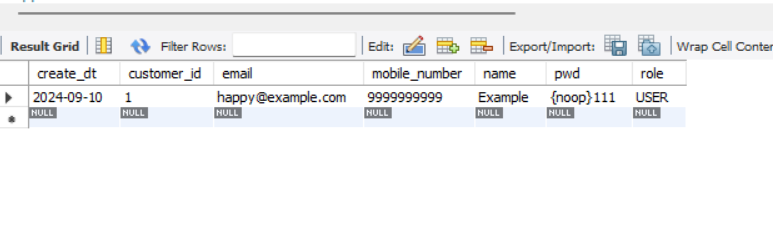

- Now here in Authorization code, we need to have authorities with the user. So to access `/myAccount` resource path, we need to give atleast **ROLE_USER** authority to the end user.

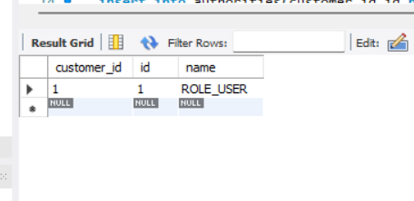

- Lets run both authorization server and resource server.

<video controls src="Images/springbootsecurity3/20240911-1709-40.7906637.mp4" title="Title"></video>

<video controls src="Images/springbootsecurity3/20240911-1703-27.4251481.mp4" title="Title"></video>

- Similarly for PKEC grant type flow

<video controls src="Images/springbootsecurity3/20240911-1721-14.9422076.mp4" title="Title"></video>

- Above learnings are implemented [here](https://github.com/codophilic/LearnSpringBoot/tree/main/SpringBoot%20Security%20-%20III)
- [Repository reference](https://github.com/eazybytes/spring-security)
- [Udemy Course](https://www.udemy.com/share/103RhQ3@3V3KPsLlwCFhWW4RP61LDBWb5p75hkX_A1VRSsgyQlMUPXthRVpozKvXCUf47SFY/)
