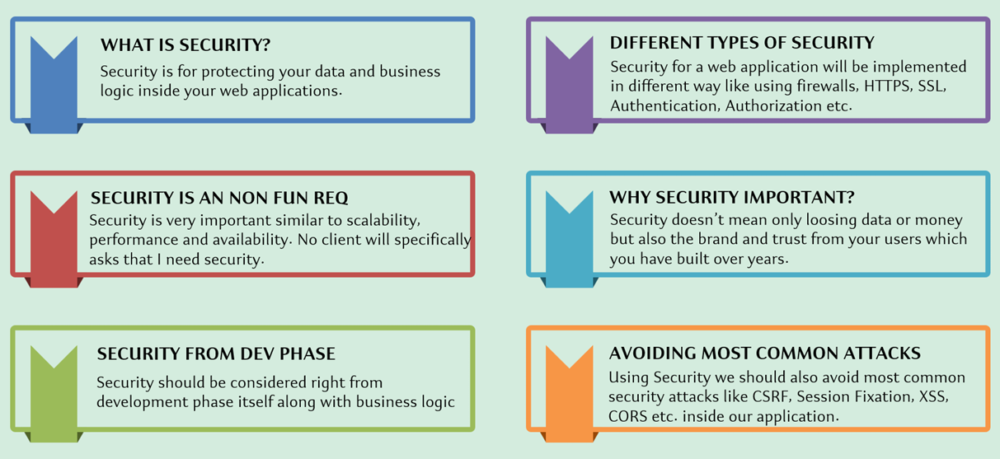
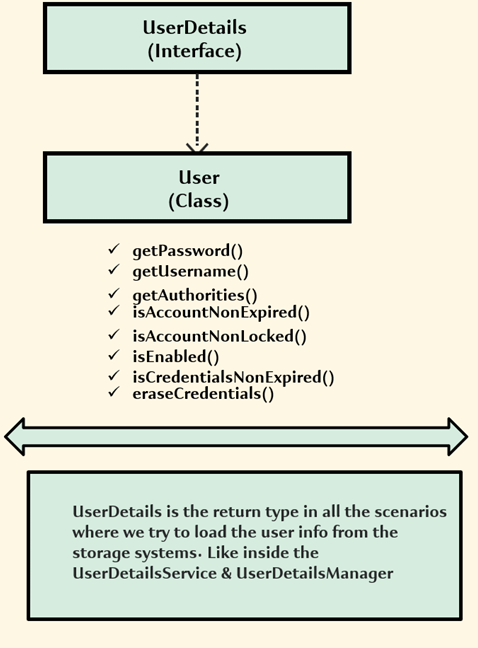
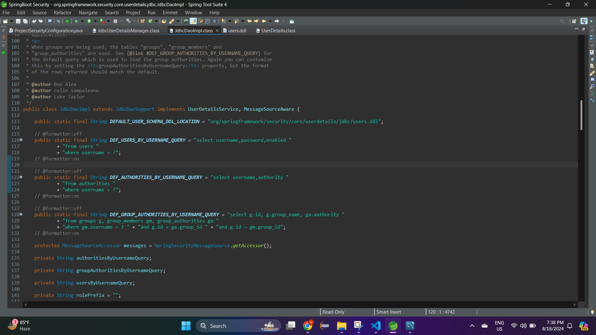

# About SpringBoot Security
- First check about [Spring Security](https://github.com/codophilic/LearnSpring/blob/main/Spring%20Security.md)

# Need of Security




## SpringBoot Security vs Spring Security

- **Spring Security** handles authentication (verifying who you are) and authorization (what you are allowed to do) for your application. It provides tools and configurations to secure your application, such as login mechanisms, role-based access control, and protection against common vulnerabilities.
- **Spring Boot Security** provides default configurations and auto-setup for security using Spring Security. It simplifies the process of securing your application by automatically setting up basic security features, so you don’t have to manually configure everything from scratch. When you create a new Spring Boot application and add Spring Security, it automatically sets up basic security (like requiring a login) without you having to manually configure every detail.
- **Spring Security**: Requires manual setup and configuration of security features. You’ll write and configure security-related code yourself.
- **Spring Boot Security**: Automatically configures security settings for you based on default settings and conventions. You can still customize it further if needed.

- Lets create a simple web springboot bank based project

```
package com.springboot.security.controller;

import org.springframework.web.bind.annotation.RestController;
import org.springframework.web.bind.annotation.GetMapping;


@RestController
public class BankController {

	@GetMapping("/welcome")
	public String getMethodName() {
		return "welcome to the banking application";
	}
	
}
```


- Now lets add Spring Security dependencies in pom file.

```
		<dependency>
			<groupId>org.springframework.boot</groupId>
			<artifactId>spring-boot-starter-security</artifactId>
		</dependency>
```

- Lets again access `/welcome` url.


- Thats weird , we have not created any login page ? how did it appear?, all magic of Spring Boot Security.
- If you add Spring Security to your project without any customization, Spring Boot automatically generates a very basic login page at the `/login` URL. This page includes simple username and password fields.
- What is the user name and password?, initially when we added spring boot security dependencies, the default user name is **user** and the password for the user name is generated on the console.


- Use the user name as **user** and enter the password which is generated in console and try to login.


- By default, Spring Security will assume and protect each and every API and MVC path available inside your project.
- Where is the login page located? how the user name and password is being getting generated? lets see
- **Login Page**: 
    - The default login page provided by Spring Security is generated dynamically at runtime by the Spring Security framework. It is not a static HTML file but is part of the internal implementation of Spring Security which is why you can't find it by searching through your project files.
    - The login page is provided by the **DefaultLoginPageGeneratingFilter** class within the Spring Security framework. This filter is responsible for generating the login page when one is not explicitly defined by the application.
    - Under class **generateLoginPageHtml** you will able to find the html piece of code for the login page.

<video controls src="Images/springbootsecurity/20240817-0344-34.1771385.mp4" title="Title"></video>

- **User name and Password**:
    - User name and Password is present under the class **SecurityProperties**, if you see the user name is fixed which is **user** but the password is getting generated randomly. So whenever you restart your web application, you'll be seeing a different password in the console.

<video controls src="Images/springbootsecurity/20240817-0348-35.2661921.mp4" title="Title"></video>

- Can we customize the user name and password? , of course, in the **application.properties** you can defined your user name and password, but what will the key in the property file? if you see there is a `@ConfigurationProperties(prefix = "spring.security")` above **SecurityProperties**, by using `spring.security.user.name` and `spring.security.user.password`. 

>[!NOTE]
> - Under the Static User class the variable name **name** and **password** are defined , so we are access using static properties.

- Adding both the properties in **application.properties**

```
spring.security.user.name=${SPRINGBOOT_USERNAME:defaultUserName}
spring.security.user.password=${SPRINGBOOT_PASSWORD:password@1234}
```

- Hold on what is this **SPRINGBOOT_USERNAME** and **SPRINGBOOT_PASSWORD**? it is recommended what instead of provided hardcoded values into your properties file, you create an environment variables which makes your application loosely couple with configurations, if configuration or environment variables are not available it will the default value you provided (e.g defaultUserName,password@1234)
- Lets create a system environment variable **SPRINGBOOT_USERNAME**, we won't create **SPRINGBOOT_PASSWORD** and use default password which is `password@1234`. You need to configured that new system environment variable into eclipse and then run it as configuration.


<video controls src="Images/springbootsecurity/20240817-0518-06.8202911.mp4" title="Title"></video>

- If still facing issue with enviroment variables you can add it in the **Run As -> Run Configuration -> Environment -> Select -> (select the variable name)**.


>[!NOTE]
> - If any environment variable is created/deleted or update you need to stop start you eclipse/STS IDE.

- What if it try to login with another tab within the browser? or try to refresh the same page ?

<video controls src="Images/springbootsecurity/20240817-0333-02.9513369.mp4" title="Title"></video>

- Behind the scenes Spring boot security also manages sessions automatically.

- Inpsect your page and go to application , you will a JSESSION ID


- Open a new tab, and go application you will get the same JSESSION ID


- If we edit the JESSION ID, it will tell us to login again.
- The login page has a JSESSIONID value. Behind the scenes, the Spring Security framework, it is going to remember this JSESSIONID value belongs to an unauthenticated user. That's why as a next step, when we try to log in into the application and once the authentication is successful, we are going to get a new JSESSIONID value. For the same, I'm going to enter the username as HarshPandya followed by password@1234 as a password.
- As soon as I click sign in, you'll be able to see this value is going to be changed. So let me click on the sign in button and you can see, we got a new JSESSIONID value.
- Spring Security will map to a successful authenticated session where the authentication details, they're going to be stored and they'll be reloaded and reused every time when I try to access a protected API.
- Spring Security framework, also doing a smart job of not invoking the actual authentication every time. If you try to invoke the actual authentication for each and every request, then definitely it is going to have some performance impact. But by using this JSESSIONID cookie, the Spring Security framework is doing a smart job here.

## Spring Security Internal flow


- Now, let's try to understand the internal flow of Spring Security Framework.
### Step 1

#### End User Request
- In the very first step, some client application, like a browser or it can be a mobile application or it can be a postman,these end users will going to send a request to access our REST API or a MVC path. If they're trying to access a protected API, obviously, the end user, they have to provide their credentials as part of the Request Header or Request Body based upon the configurations
- If the user is trying to access a protected API without mentioning credentials, we know what is going to happen. The Spring Security Framework, it is going to redirect the user to the login page to enter his or her credentials.
- So this job of identifying, if the user is authenticated or not is going to be done by the Spring Security filters.

#### Spring Security Filters

- In Servlets, **filters,  an important role in intercepting each and every request**. Inside the Spring Security Framework also, there are more than 20 different filters intercepting each and every request and handling the scenario specific to them.
- For example, there is a filter inside the Spring Security Framework to identify, if the user is authenticated or not. If the user is not authenticated, the responsibility of that filter is to redirect to the login page. And similarly, there is a filter to detect the CSRF attack.
- As soon as a client send a request to the backend API, which is being secured by a Spring Security Framework, the request is going to be intercepted by the Spring Security filters. Based upon your configurations, 5 or 10 or 15 or 20 filters, they're going to process your request one by one. At any layer, if there is an error, then the end user will get an 401 error or 403 error based upon the exception type.

### Step 2

#### Authentication Object

- If end user provided the proper credentials inside the request when he's trying to access a secured API, the Spring Security filters will populate the **authentication object**.
- The credentials that we receive from the end user, they are going to be in the HTTP request object since we can't forward the same HTTP servlet request object throughout the framework code and throughout the business logic. The very first responsibility of the Spring Security filters is going to be convert the credentials from the HTTP servlet request object to authentication object.

```
Authentication Object
User name="Entered by End User"
User Password="Entered by End User"
IsAuthenticated=false
```

- Inside this authentication object, there'll be fields like username, password and there is also a boolean to identify whether the user is authenticated or not. So initially when these object is created very first time, this `isAuthenticated` boolean value is going to be set as false.
- Apart from that, the username and password, they're also going to be populated like **HarshPandya** is a username in our case and password is going to be **password@1234**. The same authentication object is going to be used by all other components. You can assume this authentication object is a common contract which can be understand by all the components.

### Step 3

#### Authentication Manager

- Inside the Spring Security Framework these authentication object represents an user credentials and it also has an information to identify if the user is authenticated or not. So once the authentication object is populated, the filter will forward the request to the authentication manager.
- This **authentication manager is going to take the responsibility of completing the authentication and conveying the results back to the filters whether the authentication is successful or not**. So this authentication manager will say, "Hey filters, don't worry. You give me the authentication object with the username, password, I'm going to take the responsibility of authenticating the user by taking help from other components (Authentication providers). Once all authentication logic is executed, I'm going to convey you the results."
- The **authentication manager** is an interface.

>[!NOTE]
> - Authentication manager, it is only going to take the responsibility of completing the authentication, but it is not going to do the actual authentication. So in order to perform the actual authentication, this authentication manager, it is going to forward the request to the authentication providers available inside the Spring Security Framework.
> - We can also define our own authentication providers. So a project can have more than one authentication provider.

### Step 4,5,6

#### Authentication Providers

- So the responsibility of Authentication Manager is to check with all the applicable authentication providers to identify whether the authentication is successful or failed. So once these authentication providers receive the authentication object to perform the actual authentication, these authentication providers, they're going to take help from other components **UserDetailsManager/UserDetailsService** and **Password Encoder**.

##### User Details Manager / User Details Service

- The authentication provider loads the authentication object with the help of UserDetailsManager or UserDetailsService implementation classes.
- So once the user details are loaded, the user details will be sent back to the authentication provider. But authentication provider, it won't compare the password provided by the user and what is present inside the storage system like database or inside the memory. It can't do the password comparison by itself. It has to take the help from another component which is **Password Encoder**. 

##### Password Encoder

- So this Password Encoder component is a specialist while dealing with the password comparison. Using these Password Encoder, we can compare the password using plain text or we can store them using the hashing algorithms.
- So since these Password Encoder is a specialist, the authentication provider will ask the Password Encoder to compare the user provided password with the password loaded from the storage system with the help of **UserDetailsManager**. Once the Password Encoder says that, okay, the passwords are matching accordingly, the Authentication Provider conveys back to the authentication manager saying that the authentication is successful.

### Step 7,8

- So how it is going to convey that? this time inside the response, the authentication object, it is going to have the boolean value, which is **isAuthenticated as true**. So based upon this value, authentication manager know whether the authentication is successful or not.
- The same authentication object will send back to the Spring Security filters. So now Spring Security filters, they know whether the authentication is successful or not. Regardless of whether the authentication is successful or not, they're going to store the authentication details in a security context.

### Step 9

#### Security Context

- So Spring Security filters will store these authentication object against a session ID which is created for a given browser. So if the user is trying to access the same protected page from the same browser based upon the given session ID the Spring Security filters, they're going to load the authentication object details from the security context and accordingly, they're going to show either successful message or a error message. So this should also give a confirmation to you qll the actual authentication execution is only going to happen for the very first request because there is no entry for a given session ID inside the security context.
- Once the first request is processed and there is an entry inside the security context for session ID from next time onwards, the security filters, they're not going to invoke the authentication manager. Instead they're going to leverage the details present inside the security context to send the successful response or to send an error response.

### Step 10

- At last, in the step 10, we are going to send a response to the client application.

## Spring Security Internal Flow Implementation

- Before going into the implementation of Spring Security, enabled the logging at trace level by adding below line in **application.properties**

```
logging.level.org.springframework.security=TRACE
```

- This will only trace security related part in spring and log that into the console.
- Lets run the application and see the console.

```
highlighting only selective trace levels..
FilterChainProxy - Trying to match request against DefaultSecurityFilterChain [RequestMatcher=any request, Filters=[org.springframework.security.web.session.DisableEncodeUrlFilter@14832ea7, org.springframework.security.web.context.request.async.WebAsyncManagerIntegrationFilter@250bef5f, org.springframework.security.web.context.SecurityContextHolderFilter@434c346d, org.springframework.security.web.header.HeaderWriterFilter@22f05888, org.springframework.web.filter.CorsFilter@3fb5a66a, org.springframework.security.web.csrf.CsrfFilter@2e096e85, org.springframework.security.web.authentication.logout.LogoutFilter@36a979ea, org.springframework.security.web.authentication.UsernamePasswordAuthenticationFilter@76e563da, org.springframework.security.web.authentication.ui.DefaultLoginPageGeneratingFilter@62ebfbe8, org.springframework.security.web.authentication.ui.DefaultLogoutPageGeneratingFilter@38af0f76, org.springframework.security.web.authentication.www.BasicAuthenticationFilter@1e4b5b3c, org.springframework.security.web.savedrequest.RequestCacheAwareFilter@44f6d66b, org.springframework.security.web.servletapi.SecurityContextHolderAwareRequestFilter@21c48b33, org.springframework.security.web.authentication.AnonymousAuthenticationFilter@35d4f8d2, org.springframework.security.web.access.ExceptionTranslationFilter@f16cf1, org.springframework.security.web.access.intercept.AuthorizationFilter@5eae6b99]] (1/1)
FilterChainProxy - Securing GET /login
FilterChainProxy - Invoking DisableEncodeUrlFilter (1/16)
FilterChainProxy - Invoking WebAsyncManagerIntegrationFilter (2/16)
FilterChainProxy - Invoking SecurityContextHolderFilter (3/16)
FilterChainProxy - Invoking HeaderWriterFilter (4/16)
FilterChainProxy - Invoking CorsFilter (5/16)
```

- If you see there are over 16 filters applied when we hit **/welcome** page. Lets focus in **AuthorizationFilter** class. Under that there is a method **doFilter()** which checks if the request is authorize or not, if not then it throws an exception as 'Access Denied' . This results to generate a login page using **DefaultLogoutPageGeneratingFilter**.
- Here **UsernamePasswordAuthenticationFilter** filter is invoked for authentication which extends an abstract class **AbstractAuthenticationProcessingFilter** in the below flow. 


- Lets create a bank based web application, where there would be tab urls for **Accounts, Balance, Cards, Contact, Loans and Notice**.
- Lets create different controller for these.


- By default all the MVC paths are secured by spring boot, it is not always necessary to secure all the paths e.g for contact & notice pages you don't require any security. How to do this? - first let us understand how all MVC path are secured? so under **SpringBootWebSecurityConfiguration** there is a static block which has a method **defaultSecurityFilterChain**


- `@Configuration` annotation indicates that the class defines beans, which are methods annotated with @Bean. These beans will be managed by Spring's application context.
- `proxyBeanMethods = false` attribute is used to optimize performance by not creating proxy beans for method calls within the same class.
	- When set to **true** Spring creates proxies for bean methods. This ensures that calling a `@Bean` method multiple times returns the same bean instance, enabling singleton behavior and dependency injection between beans within the configuration class.
	- When set to **false**, Spring does not create proxies. This means that calling a `@Bean` method multiple times may create multiple instances of the bean.

>[!NOTE]
> - Prototype scope of bean is not same as **`proxyBeanMethods = false`**.
> - When proxyBeanMethods is set to false, calling a method within the configuration class does not reuse the bean managed by Spring. Instead, it acts like a normal method call in Java, creating a new instance each time (like new ClassName()), not managed by Spring.
> - Whereas in prototype the scope of the bean is still managed by Spring

- `@ConditionalOnDefaultWebSecurity` annotation means that this configuration will only be applied if the default Spring Security configuration is in effect (i.e., no custom security configurations have been provided).
- `@Bean` method is marked as a bean, meaning its return value will be registered as a bean in the Spring application context.
- `@Order(SecurityProperties.BASIC_AUTH_ORDER)` specifies the order in which this security filter chain will be applied. The order is defined by **SecurityProperties.BASIC_AUTH_ORDER**, which is a predefined constant in Spring Security.
- `SecurityFilterChain` bean defines the security filter chain, which is a series of filters applied to incoming requests.
- `http.authorizeHttpRequests((requests) -> requests.anyRequest().authenticated());` accepts all the http request and provides authentication.
- `http.authorizeHttpRequests` configures authorization for HTTP requests. The code specifies that any request must be authenticated (i.e., users must log in).
- `http.formLogin(withDefaults())` enables form-based login with default settings. When users try to access a protected resource, they will be redirected to a login page.
- `http.httpBasic(withDefaults())` enables HTTP Basic authentication with default settings. This is a mechanism that allows a user to authenticate using a username and password sent in the HTTP headers.
- `http.build()` finalizes the configuration and builds the SecurityFilterChain object that will be used to secure the application.
- Now if we want to customize the authentication on MVC paths, we need to customize the **defaultSecurityFilterChain** method.
- So lets create a **ProjectSecurityClass** and add this method.

```
package com.springboot.security.configuration;

import static org.springframework.security.config.Customizer.withDefaults;

import org.springframework.context.annotation.Bean;
import org.springframework.context.annotation.Configuration;
import org.springframework.security.config.annotation.web.builders.HttpSecurity;
import org.springframework.security.web.SecurityFilterChain;

@Configuration
public class ProjectSecurityConfiguration {

	@Bean
	SecurityFilterChain defaultSecurityFilterChain(HttpSecurity http) throws Exception {
		http.authorizeHttpRequests((requests) -> requests.anyRequest().authenticated());
		http.formLogin(withDefaults());
		http.httpBasic(withDefaults());
		return http.build();
	}
}
```

- Instead of `authenticated()` method lets add `permitAll()` and check what happens

```
	@Bean
	SecurityFilterChain defaultSecurityFilterChain(HttpSecurity http) throws Exception {
		http.authorizeHttpRequests((requests) -> requests.anyRequest().permitAll());
		http.formLogin(withDefaults());
		http.httpBasic(withDefaults());
		return http.build();
	}
```


- `permitAll()` allows end user to access all the pages without asking any logging credentials.

- What happens when we use `denyAll()` ?

```
	@Bean
	SecurityFilterChain defaultSecurityFilterChain(HttpSecurity http) throws Exception {
		http.authorizeHttpRequests((requests) -> requests.anyRequest().denyAll());
		http.formLogin(withDefaults());
		http.httpBasic(withDefaults());
		return http.build();
	}
```


- `denyAll()` allows end user to perfom login but denies end user to access the page even though the user is authorized to access it.
- So now lets secure pages only of `/accounts`, `/balance`, `/cards` & `/loans` and provide permit all to `/contact` & `/notice`

```
	@Bean
	SecurityFilterChain defaultSecurityFilterChain(HttpSecurity http) throws Exception {
		http.authorizeHttpRequests((requests) -> requests.
				requestMatchers("/accounts","/balance","/cards","/loans").authenticated().
				requestMatchers("/contact","/notice").permitAll()
				);
		http.formLogin(withDefaults());
		http.httpBasic(withDefaults());
		return http.build();
	}
```

<video controls src="Images/springbootsecurity/20240817-1845-41.6415042.mp4" title="Title"></video>

- Our require MVC path got secured , but if you see when we try to login on `/welcome` path, we got 403 error which unauthorized. So basically if we don't specify any path under `authenticated` or `permitAll` it will go under `denyAll`.
- If you see the code `http.formLogin(withDefaults());` due to this the `/login` page is invoked, what if we disable it?

```
	@Bean
	SecurityFilterChain defaultSecurityFilterChain(HttpSecurity http) throws Exception {
		http.authorizeHttpRequests((requests) -> requests.
				requestMatchers("/accounts","/balance","/cards","/loans").authenticated().
				requestMatchers("/contact","/notice").permitAll()
				);
		http.formLogin(i->i.disable());
		http.httpBasic(withDefaults());
		return http.build();
	}
```


- If you disable form login, you will need to provide another mechanism for authentication, such as HTTP Basic authentication, OAuth2, JWT, etc., or your custom login process. Currently if you see `httpBasic` authentication is available , due to which we got this page. This is a simple authentication scheme built into the HTTP protocol. When you enable it in Spring Security, the browser will show a basic authentication dialog box whenever you try to access a protected resource.

>[!NOTE]
> - When we disable form login, **UsernamePasswordAuthenticationFilter** filter class is not invoked instead **BasicAuthenticationFilter** filter class is invoked. Add a debug point in **doFilterInternal()** method of **BasicAuthenticationFilter** class.

- If we disable `httpBasic()` authentication filter then the Spring security will give 403 error.
- Lets try to hit the bank application urls using postman.


- To access and protected page, we need to provide credentials while sending the request via postman. So in the **Auth** you need to select basic authentication and entered user name and password.


<video controls src="Images/springbootsecurity/20240818-0609-37.0874476.mp4" title="Title"></video>

-  If you see in the headers value are in base64 encoded format. Below when we decode it we get **user_name:password**. You can also see JSESSION ID present in the headers.


- Lets say we hit the url contact with **POST** http method, what will happen? `/contact` has `permitAll()` so it may pass the security right? NO, here spring security will still try to perform authentication because of CSRF protection. In CSRF attack, attackers inject malicious scripts which in terms of API they **POST** ( create a new resource ) these scripts. So in spring by default for except for **GET** all the http method will be authenticated.


- Currently we are authenticate using a single user details? what if there are multiple users ? so there are two ways, either you have a database where you could store all the user details or if spring has some memory which can keep this user details or **InMemoryUserDetailsManager**

>[!WARNING]
> - Incase of development phase it is recommended to use **InMemoryUserDetailsManager** and not in production.

- In the spring security internal flow , we have saw the there is an **UserDetailsService** .


- **UserDetailsService** is an interface which is extended by **UserDetailsManager**. The **UserDetailsManager** is implemented by **InMemoryUserDetailsManager** as well as by **JdbcUserDetailsManager**.


- So to add multiple user we need to create a bean of **UserDetailsService** under our ProjectSecurityConfiguration config class.

```
	@Bean
	public UserDetailsService userDetailsService() {
		
	}
```

- Okay but how do we create users? if we open the UserDetailsService interface we will be able to see **UserDetails** return type.


- So **UserDetails** is an interface which is implemented by **User** class , the **User** class provide some instance variables like username and password.


- So lets create users using User class.

```
	@Bean
	public UserDetailsService userDetailsService() {
		UserDetails u1=User.withUsername("user1").password("password1").authorities("read").build();
		UserDetails u2=User.withUsername("user2").password("password2").authorities("admin").build();
		return new InMemoryUserDetailsManager(u1,u2);
	}
```

- **InMemoryUserDetailsManager** is an implementation of **UserDetailsManager** which extends **UserDetailsService**, so inside **InMemoryUserDetailsManager** there is a parameterized constructor which accepts any number of arguments. This will create user and uses map collections to put those new users.
- **InMemoryUserDetailsManager** in Spring Security is a simple implementation of the **UserDetailsService** interface that stores user details in memory. It’s often used for creating a basic set of users for authentication purposes during development.

```
In InMemoryUserDetailsManager class,

	private final Map<String, MutableUserDetails> users = new HashMap<>();

	@Override
	public void createUser(UserDetails user) {
		Assert.isTrue(!userExists(user.getUsername()), "user should not exist");
		this.users.put(user.getUsername().toLowerCase(), new MutableUser(user));
	}

	public InMemoryUserDetailsManager(UserDetails... users) {
		for (UserDetails user : users) {
			createUser(user);
		}
	}
```

- Lets run the application and try to access the page with new users created. Before running comment out the user name which we created in application.properties

```
#spring.security.user.name=${SPRINGBOOT_USERNAME:defaultUserName}
#spring.security.user.password=${SPRINGBOOT_PASSWORD:password@1234}
```

- When we try to login , on the console we can observer it is showing **Access Denied**


- I am entering a wrong password? nope, even after entering write password we get an access denied error , this is because the password we entered are converted into encoded format and during the build time of new user the password is still is in plain text format. So due to mismatch between encoded password from the frontend and plain text password during the build of new user, we get access denied error. Below is the image when the user1 is build and the password is in plain text format.


- When you enter a password on a login page, Spring Security automatically encodes the entered password using the configured `PasswordEncoder`. If you're storing passwords in plain text within InMemoryUserDetailsManager, you need to tell Spring Security not to encode or check the encoding of these passwords. This is where `{noop}` comes into play. `{noop}` is a prefix used to indicate that the password is stored in plain text and should not be encoded.

- So to tell spring that our password should be compare in plain text format we need to use `{noop}`. Update code

```
	@Bean
	public UserDetailsService userDetailsService() {
		UserDetails u1=User.withUsername("user1").password("{noop}password1").authorities("read").build();
		UserDetails u2=User.withUsername("user2").password("{noop}password2").authorities("admin").build();
		return new InMemoryUserDetailsManager(u1,u2);
	}
```

- Using new user details we were able to login


- Using `{noop}` is not a good choice . It should be always in hashed or encrypted format. So spring security provides some default hashing and encrypted method under interface **PasswordEncoder**


- The interface **PasswordEncoder** is implemented by multiple class , lets checkout **PasswordEncoderFactories**


- There are multiple encoding format which you can prefer but most of them are deprecated. If you see the , the default password encryption provided by Spring security is **Bcrypty**.
- Lets implement this in our ProjectSecurityConfiguration class.

```
package com.springboot.security.configuration;

import static org.springframework.security.config.Customizer.withDefaults;

import org.springframework.context.annotation.Bean;
import org.springframework.context.annotation.Configuration;
import org.springframework.security.config.annotation.web.builders.HttpSecurity;
import org.springframework.security.core.userdetails.User;
import org.springframework.security.core.userdetails.UserDetails;
import org.springframework.security.core.userdetails.UserDetailsService;
import org.springframework.security.crypto.factory.PasswordEncoderFactories;
import org.springframework.security.crypto.password.PasswordEncoder;
import org.springframework.security.provisioning.InMemoryUserDetailsManager;
import org.springframework.security.web.SecurityFilterChain;

@Configuration
public class ProjectSecurityConfiguration {

	/**
	 * Customize Spring Securities
	 * - permitAll() -> Allows end user to access all the pages without asking any logging credentials
	 * - denyAll() -> Allows end user to perfom login but denies end user to access the page even though the user is authorized to access it.
	 */
	@Bean
	SecurityFilterChain defaultSecurityFilterChain(HttpSecurity http) throws Exception {
		http.authorizeHttpRequests((requests) -> requests.
				requestMatchers("/accounts","/balance","/cards","/loans").authenticated().
				requestMatchers("/contact","/notice").permitAll()
				);
		http.formLogin(withDefaults());
		//http.formLogin(i->i.disable());
		http.httpBasic(withDefaults());
		//http.httpBasic(i->i.disable());
		return http.build();
	}
	
	@Bean
	public UserDetailsService userDetailsService() {
		UserDetails u1=User.withUsername("user1").password("password1").authorities("read").build();
		UserDetails u2=User.withUsername("user2").password("password2").authorities("admin").build();
		return new InMemoryUserDetailsManager(u1,u2);
	}
	
	@Bean
	public PasswordEncoder passwordEncoder() {
		return PasswordEncoderFactories.createDelegatingPasswordEncoder();
	}
}
```

- If you see we have removed the prefix `{noop}` the default PasswordEncoder will be used here is **Bcrypt**. Once the password is hashed it cannot be converted into original password again and the comparision of the password entered from the login screen and in memory will be based on hash comparision.

>[!IMPORTANT]
> - Another way to write return Bcrypt password encoder is **`return new BCryptPasswordEncoder()`**.
> - It is always recommended that to use **`PasswordEncoderFactories.createDelegatingPasswordEncoder()`** because todays Bcrypt encoding is suggested by spring security, but in future if any more powerful encoding algorithm is created it might be the default encoding recommendation by spring security.


- Now since we are using Bcrypt as our password encoder, we need to convert our `password1` and `password2` into Bcrypt format and store it in the **UserDetailsService** method. You can convert the pass refering [this](https://bcrypt-generator.com/) website.
- Updating the UserDetailsService code.

```
	@Bean
	public UserDetailsService userDetailsService() {
		UserDetails u1=User.withUsername("user1").password("{bcrypt}$2a$12$y/1h97NMjduYYwnbddNy0eyT0wXax.x9QTsfzor5HA4xzrIVM9Ss.").authorities("read").build();
		UserDetails u2=User.withUsername("user2").password("{bcrypt}$2a$12$u6EKvxZR6kcLeZh4pIS9ue2FrKEsqyz7v1FQaakCuU4PLiA3KaIXG").authorities("admin").build();
		return new InMemoryUserDetailsManager(u1,u2);
	}
```

- Here we mentioned prefix `{bcrypt}` saying spring to treat out password in bcrypt format. Post running we will be able to logged in into our application.


- We can have encoding format vary based on different user like below.

```
	@Bean
	public UserDetailsService userDetailsService() {
		UserDetails u1=User.withUsername("user1").password("{noop}password1").authorities("read").build();
		UserDetails u2=User.withUsername("user2").password("{bcrypt}$2a$12$u6EKvxZR6kcLeZh4pIS9ue2FrKEsqyz7v1FQaakCuU4PLiA3KaIXG").authorities("admin").build();
		return new InMemoryUserDetailsManager(u1,u2);
	}
```

- What if your password gets compromised? using simple password can lead hackers to break it easily even after using strong password encoders. Spring security prevents users to login in using simple password. Lets check now.
- Under ProjectSecurityConfiguration we need to add a new bean 

```
	@Bean
	public CompromisedPasswordChecker compromisedPasswordChecker() {
		return new HaveIBeenPwnedRestApiPasswordChecker();
	}
```

- Lets dive into **CompromisedPasswordChecker**, so **CompromisedPasswordChecker** is an interface which is implemented by **HaveIBeenPwnedRestApiPasswordChecker()**. Below is the code for **HaveIBeenPwnedRestApiPasswordChecker()**


- If you see it uses an api url `https://api.pwnedpasswords.com/range/` .  [This](https://haveibeenpwned.com/API/v3) is an open source api which helps to check if a password could be compromise or not. So using this api, to check whether a password could be compromise or not , spring security provides **HaveIBeenPwnedRestApiPasswordChecker** class.

- Lets run the application and try to use our existing user1 password which is `password1`.


- So lets change the password for user1 to `thisCouldBe@1234` and user2 to `thisCoundNotBe@1234` (use the bcrypt generated password for it) and re run the application.

```
	@Bean
	public UserDetailsService userDetailsService() {
		UserDetails u1=User.withUsername("user1").password("{noop}thisCouldBe@1234").authorities("read").build();
		UserDetails u2=User.withUsername("user2").password("{bcrypt}$2a$12$ThHcCo7ZvUJ4QjCsaoy87e74mwzP5fhzWA4MxDwaNOU0bxqoOv.Aa").authorities("admin").build();
		return new InMemoryUserDetailsManager(u1,u2);
	}
```


- The HaveIBeenPwnedRestApiPasswordChecker is a component that integrates with the "Have I Been Pwned" (HIBP) API to check if a password has been exposed in known data breaches.

<details>
<summary> What is "Have I Been Pwned"? </summary>

```
HIBP is a service created by security expert Troy Hunt that allows users to check if their personal information (like email addresses or passwords) has been compromised in data breaches.
It provides an API that developers can use to check whether a specific password has appeared in any known breaches.
```
</details>

>[!NOTE]
> - This security measure is been introduce for spring security 6.3+

### Why UserDetailsService is required when we have UserDetailsManager?

- **UserDetailsService** is an interface which is implemented by **UserDetailsManager**. 
- The UserDetailsService interface is designed specifically for retrieving user-related data. It has a single method, loadUserByUsername(String username), which is responsible for loading user details (like username, password, roles) by the username. The return type is **UserDetails**.
- UserDetailsService isolates the responsibility of loading user details, making it easier to customize or implement different retrieval mechanisms (e.g., from a database, LDAP, or in-memory).
- UserDetailsManager extends UserDetailsService and adds methods for managing user details, such as creating, updating, or deleting users. It includes methods like createUser(UserDetails user), updateUser(UserDetails user), deleteUser(String username), and others.
- While UserDetailsService is focused on retrieval, UserDetailsManager adds the ability to manage users, which is a broader responsibility. This includes CRUD (Create, Read, Update, Delete) operations on user data.
- By separating the retrieval (UserDetailsService) and management (UserDetailsManager) concerns, Spring Security allows for more modular and flexible designs. You can implement just UserDetailsService if you only need to read user data, or UserDetailsManager if you need full management capabilities.
- There are many applications like third-party applications that integrate with Google Workspace for authentication use OAuth or OpenID Connect to retrieve user details. These applications rely on Google’s identity service to authenticate users but do not manage user accounts directly.


>![NOTE]
> - You won't see directly LDAP implementation for UserDetailsManager , you need to include additional dependencies for it.

- The UserDetails interface is implemented by User along with additional methods.




- Uptil now we have seen 
	1. User Details in getting logged in the console when we added the spring security dependencies
	2. User Details in property file
	3. User Details in spring memory

- Now lets use database to store user details. In order to store the **UserDetailsManager** in database we have **JdbcUserDetailsManager**.
- So now first lets create a schema **springbootsecurityjdbc** in our MySQL database.


- If we see **JdbcUserDetailsManager** it implements **JdbcDaoImpl** and inside the **JdbcDaoImpl** we can see variable *DEFAULT_USER_SCHEMA_DDL_LOCATION* which has path where the DDL for creation of tables related to UserDetailsManager scripts are present





- Lets run the script in our MySQL database and create the tables for it.

```
MySQL scripts -> replace varchar_ignorecase to varchar
create table users(username varchar(50) not null primary key,password varchar(500) not null,enabled boolean not null);
create table authorities (username varchar(50) not null,authority varchar(50) not null,constraint fk_authorities_users foreign key(username) references users(username));
create unique index ix_auth_username on authorities (username,authority);
```


- Lets create users two additional users, user3 and user4

```
INSERT INTO `users` VALUES ('user3', '{noop}u$er3P@ss123', '1');
INSERT INTO `authorities` VALUES ('user3', 'read');

INSERT INTO `users` VALUES ('user4', '{bcrypt}$2a$12$u9OWWnVS0oAil3235w60eejI93UKXoz7vRm4Rpj30KIdOZKRkICxi', '1');
INSERT INTO `authorities` VALUES ('user4', 'admin');
```

<video controls src="Images/springbootsecurity/20240818-1609-07.1099655.mp4" title="Title"></video>

- If you see **username** of username table is a foreign key of authorities table.

- Lets add the require dependencies

```
<dependency>
			<groupId>org.springframework.boot</groupId>
			<artifactId>spring-boot-starter-data-jpa</artifactId>
		</dependency>
		<dependency>
			<groupId>org.springframework.boot</groupId>
			<artifactId>spring-boot-starter-jdbc</artifactId>
		</dependency>
		<dependency>
			<groupId>com.mysql</groupId>
			<artifactId>mysql-connector-j</artifactId>
			<scope>runtime</scope>
		</dependency>
```

- Lets add the database configuration in the application.properties

```
spring.datasource.url=jdbc:mysql://localhost:3306/springbootsecurityjdbc
spring.datasource.username=root
spring.datasource.password=Meetpandya40@
spring.datasource.driver-class-name=com.mysql.cj.jdbc.Driver
spring.jpa.database-platform = org.hibernate.dialect.MySQL8Dialect
spring.jpa.generate-ddl=true
spring.jpa.hibernate.ddl-auto = create
spring.jpa.show-sql=true
```

- Now we need to create a bean of **UserDetailsService** because this interface is implemented by **UserDetailsManager** which is implemented by **JdbcUserDetailsManager**.

```
package com.springboot.security.configuration;

import static org.springframework.security.config.Customizer.withDefaults;

import javax.sql.DataSource;

import org.springframework.context.annotation.Bean;
import org.springframework.context.annotation.Configuration;
import org.springframework.security.authentication.password.CompromisedPasswordChecker;
import org.springframework.security.config.annotation.web.builders.HttpSecurity;
import org.springframework.security.core.userdetails.User;
import org.springframework.security.core.userdetails.UserDetails;
import org.springframework.security.core.userdetails.UserDetailsService;
import org.springframework.security.crypto.factory.PasswordEncoderFactories;
import org.springframework.security.crypto.password.PasswordEncoder;
import org.springframework.security.provisioning.InMemoryUserDetailsManager;
import org.springframework.security.provisioning.JdbcUserDetailsManager;
import org.springframework.security.web.SecurityFilterChain;
import org.springframework.security.web.authentication.password.HaveIBeenPwnedRestApiPasswordChecker;

@Configuration
public class ProjectSecurityConfiguration {

	/**
	 * Customize Spring Securities
	 * - permitAll() -> Allows end user to access all the pages without asking any logging credentials
	 * - denyAll() -> Allows end user to perfom login but denies end user to access the page even though the user is authorized to access it.
	 */
	@Bean
	SecurityFilterChain defaultSecurityFilterChain(HttpSecurity http) throws Exception {
		http.authorizeHttpRequests((requests) -> requests.
				requestMatchers("/accounts","/balance","/cards","/loans").authenticated().
				requestMatchers("/contact","/notice").permitAll()
				);
		http.formLogin(withDefaults());
		//http.formLogin(i->i.disable());
		http.httpBasic(withDefaults());
		//http.httpBasic(i->i.disable());
		return http.build();
	}
	
//	@Bean
//	public UserDetailsService userDetailsService() {
//		UserDetails u1=User.withUsername("user1").password("{noop}thisCouldBe@1234").authorities("read").build();
//		UserDetails u2=User.withUsername("user2").password("{bcrypt}$2a$12$ThHcCo7ZvUJ4QjCsaoy87e74mwzP5fhzWA4MxDwaNOU0bxqoOv.Aa").authorities("admin").build();
//		return new InMemoryUserDetailsManager(u1,u2);
//	}
	
	@Bean
	public PasswordEncoder passwordEncoder() {
		
		//return new BCryptPasswordEncoder();
		return PasswordEncoderFactories.createDelegatingPasswordEncoder();
	}
	
	@Bean
	public CompromisedPasswordChecker compromisedPasswordChecker() {
		return new HaveIBeenPwnedRestApiPasswordChecker();
	}
	
	@Bean
	public UserDetailsService userDetailsService(DataSource dataSource) {
		return new JdbcUserDetailsManager(dataSource);
	}
}
```

>[!NOTE]
> - We need to comment out the previous **UserDetailsService** method which was used for demonstration of **InMemoryUserDetailsManager** because it would lead to configuration problems 
> ``` 
> org.springframework.beans.factory.parsing.BeanDefinitionParsingException: Configuration problem: @Configuration class 'ProjectSecurityConfiguration' contains overloaded @Bean methods with name 'userDetailsService'. Use unique method names for separate bean definitions (with individual conditions etc) or switch '@Configuration.enforceUniqueMethods' to 'false'.
> ```
> - By default spring configuration uses **`enforceUniqueMethods = true`**, so if we need to define multiple bean returning same type we need to do **`enforceUniqueMethods = false`**.
> - If multiple **`UserDetailsService`** beans are present, Spring Security detects a **`DataSource`** and gives precedence to **JdbcUserDetailsManager**. This behavior is influenced by how Spring Security's auto-configuration mechanisms work when it detects a DataSource bean.
> - If you want both InMemoryUserDetailsManager as well as JdbcUserDetailsManager you can create a customize service layer and add both of them or follow [this](https://stackoverflow.com/questions/57764078/how-to-configure-both-in-memory-authentication-and-jdbc-authentication-in-spring).

- Post running the spring boot application, we were able to login with the user defined in the database.


- In several applications, it is not necessary that the end user must have user name, they must also have an option to register or login in using email id.
- Lets create a customer table which will have email id, password and role. Here we will use **Hibernate and JPA**.
- First lets a entity of Customer.

```
package com.springboot.security.entities;

import jakarta.persistence.*;
import lombok.Getter;
import lombok.Setter;
import lombok.ToString;

@Entity
@Table(name = "customer_table")
@Getter
@Setter
@ToString
public class Customer {

	@Id
	@GeneratedValue(strategy = GenerationType.AUTO)
	private int id;
	
	@Column(name = "customer_emailid", unique = true)
	private String emailid;
	
	@Column(name = "customer_password")
	private String pwd;
	
	@Column(name = "customer_active")
	private String isActive;
	
	@Column(name = "customer_role")
	private String role;
	
}
```

- What are this `@Getters`, `@Setters` and `@ToString` ? how here we have downloaded a lombok dependencies.

```
	<dependency>
      <groupId>org.projectlombok</groupId>
      <artifactId>lombok</artifactId>
      <optional>true</optional>
    </dependency>
```

- Lombok is a Java library that helps reduce boilerplate code in Java applications by providing annotations that automatically generate common methods like getters, setters, constructors, and more **during compile time**. Instead of writing repetitive code manually, you can use Lombok annotations to have these methods generated at compile time.
- Lombok can generate constructors using annotations like `@NoArgsConstructor`, `@AllArgsConstructor`, and `@RequiredArgsConstructor`.

<details>
<summary> Lombok Constructors </summary>

- Three Lombok annotations for generating constructors : `@NoArgsConstructor`, `@RequiredArgsConstructor`, and `@AllArgsConstructor`

1. **`@NoArgsConstructor`**
	- Generates a no-argument constructor for the class. This means a constructor with no parameters will be created. Any variables in the class are not initialized through this constructor; they'll have their default values (null for objects, 0 for int, etc.).
	- Example

```
Code

import lombok.NoArgsConstructor;

@NoArgsConstructor
public class Person {
    private String name;
    private int age;
}

Compilation
public Person() {
    // No arguments, does nothing special
}

```

2. **`@RequiredArgsConstructor`**
	- Generates a constructor with parameters for all **final** fields and fields marked with **@NonNull**. This means it will generate a constructor that requires these fields to be provided when creating an instance.
	- Example, name is required because it's marked with **@NonNull**, age is required because it's final, address is not included in the constructor, so it remains uninitialized or must be set separately.

```
Code 
import lombok.RequiredArgsConstructor;
import lombok.NonNull;

@RequiredArgsConstructor
public class Person {
    @NonNull
    private String name;
    private final int age;
    private String address;
}

Compilation
public Person(String name, int age) {
    this.name = name;
    this.age = age;
}
```

3. **`@AllArgsConstructor`**
	- Generates a constructor with parameters for all fields in the class, regardless of whether they are **final**, **@NonNull**, or regular fields.
	- Example, All variables (name, age, address) are included in the constructor.

```
Code
import lombok.AllArgsConstructor;

@AllArgsConstructor
public class Person {
    private String name;
    private int age;
    private String address;
}

Compilation
public Person(String name, int age, String address) {
    this.name = name;
    this.age = age;
    this.address = address;
}

```

- `@NoArgsConstructor` : Generates a constructor with no arguments. Useful for frameworks that need a no-arg constructor.
- `@RequiredArgsConstructor` : Generates a constructor for final and @NonNull fields only. Ensures critical fields are initialized.
- `@AllArgsConstructor` : Generates a constructor for all fields in the class, allowing full initialization of the object.

</details>

- When using Lombok's `@Getter` and `@Setter` annotations in your Customer class, the getters and setters are generated at compile time. However, some IDEs, like IntelliJ IDEA or Eclipse, might not always fully recognize the Lombok-generated methods, which can lead to issues.
- When we use derived query for the customer variables, since we have used `@Getters` and `@Setters` , the suggestion does not appears to generate derived query as the IDE does not recognizes the lombok annotations.

<details>

<summary> Steps to resolve </summary>

- Download the jar from [lombok website](https://projectlombok.org/download). A lombok jar will be downloaded.
- Open the terminal and run `java -jar lombok.jar`
- An application will be appear asking for exe path of all your IDEs. 
- Click on **Specify Location** (if your IDE is not automatically detected) and provided the complete exe path


- Click on **Install/Update**. 
- Restart your IDE and it will work. The getters setters method will be shown along with derived query method for JpaRepository will also appear.
- Ensure your **Annotation Processor** is enabled , Go to Project -> Properties -> Java Compiler -> Annotation Processing and ensure it is enabled.

</details>


- Now lets create a DAO interface which implements JpaRepository and create a derived query method to find customer details using email id.


```
package com.springboot.security.dao;


import org.springframework.data.jpa.repository.JpaRepository;
import org.springframework.stereotype.Repository;

import com.springboot.security.entities.Customer;

@Repository
public interface CustomerDao extends JpaRepository<Customer, Integer>{
	
	Customer findByEmailid(String emailid);

}
```

- Lets create our service layer where we will fetch and create user based on email id. Here we will be implementing our **customize UserDetailsService** . So to implement the **UserDetailsService** we need to use **implement** keyword to implement interface **UserDetailsService**.

```
package com.springboot.security.service;

import java.util.List;

import org.springframework.security.core.GrantedAuthority;
import org.springframework.security.core.authority.SimpleGrantedAuthority;
import org.springframework.security.core.userdetails.User;
import org.springframework.security.core.userdetails.UserDetails;
import org.springframework.security.core.userdetails.UserDetailsService;
import org.springframework.security.core.userdetails.UsernameNotFoundException;
import org.springframework.security.crypto.password.PasswordEncoder;
import org.springframework.stereotype.Service;

import com.springboot.security.dao.CustomerDao;
import com.springboot.security.entities.Customer;

import jakarta.transaction.Transactional;
import lombok.RequiredArgsConstructor;

@Service
@Transactional
@RequiredArgsConstructor
public class CustomerService implements UserDetailsService{
	
	private final CustomerDao customerDao;
	private final PasswordEncoder passwordEncoder;
	/**
	 * @RequiredArgsConstructor creates a constructor with all the final instance variables
	 * - This is the constructor generated by @RequiredArgsConstructor
    	public CustomerService(CustomerDao customerDao, PasswordEncoder passwordEncoder) {
	        this.customerDao = customerDao;
	        this.passwordEncoder = passwordEncoder;
    	}
	 */
	
	/**
	 * This method will be invoke when the end user is trying to access any protected page.
	 * This is a our own customize UserDetailsService , so instead of using Jdbc or Inmemory 
	 * now we have created our customize UserDetailsService.
	 */
	@Override
	public UserDetails loadUserByUsername(String userEmailId) throws UsernameNotFoundException {
		 Customer exists=customerDao.findByEmailid(userEmailId);
		 if(exists==null) { // If user now found then throw exception
			 throw new UsernameNotFoundException("Customer Email Id - "+userEmailId+" does not exists");
		 }
		 
		 /**
		  * The UserDetails is an interface which is implemented by User class. So we need to return
		  * instance of User class.
		  * User Class instance requires below thing
		  * - user name
		  * - password
		  * - list of granted authorities or roles.
		  */
		 List<GrantedAuthority> grantedRoles = List.of(new SimpleGrantedAuthority(exists.getRole()));
		 return new User(exists.getEmailid(),exists.getPwd(),grantedRoles);
	}

	public Customer saveCustomerDetails(Customer customer) {
		
		/**
		 * Before registration we need to encode the password
		 * So it can be done using PasswordEncoder
		 */
		String hashpwd=passwordEncoder.encode(customer.getPwd());
		customer.setPwd(hashpwd);
		return customerDao.save(customer);
	}
	
}
```

- Lets see each explaination one at a time.
- `@RequiredArgsConstructor` generates a constructor for final fields only which incase here are **customerDao** and **passwordEncoder**. Checkout below the generated constructor during compilation.

```
    	public CustomerService(CustomerDao customerDao, PasswordEncoder passwordEncoder) {
	        this.customerDao = customerDao;
	        this.passwordEncoder = passwordEncoder;
    	}
```

- If your class has only one constructor, Spring will automatically use it for dependency injection without needing `@Autowired`. If your class has multiple constructors, use `@Autowired` to specify which constructor Spring should use for dependency injection.
- So this how depedencies of **CustomerDao** and **PasswordEncoder** are injected.
- Since our **CustomerService** class implements the interface **UserDetailsService**, the logic for unimplemented method **loadUserByUsername** needs to be address in the CustomerService class. So here since to identify our customer we will be having email id as user name for UserDetailsService, to get the details we use derived query of JpaRepository. If customer does not exists we need to throw `throw new UsernameNotFoundException("Customer Email Id - "+userEmailId+" does not exists");`.
- If the customer exists we need to send the data but in **UserDetails** format. Again **UserDetails** is an interface which is implemented by **User** so we need to send the data into **User** type. User Class instance requires user name, password and list of granted authorities or roles.


- Method **saveCustomerDetails** is to register new customer, now the new customer password needs to be encoded for which we require **PasswordEncoder**. 

- Lets create a **CustomerController**.

```
package com.springboot.security.controller;

import org.springframework.http.ResponseEntity;
import org.springframework.web.bind.annotation.PostMapping;
import org.springframework.web.bind.annotation.RequestBody;
import org.springframework.web.bind.annotation.RestController;

import com.springboot.security.entities.Customer;
import com.springboot.security.service.CustomerService;

import lombok.RequiredArgsConstructor;


@RestController
@RequiredArgsConstructor
public class CustomerController {
	
	private final CustomerService customerService;

	@PostMapping("/customer-registration")
	public ResponseEntity<String> createCustomer(@RequestBody Customer customer){
		try {
			System.out.println(customer.toString());
			Customer cust=customerService.saveCustomerDetails(customer);
			return ResponseEntity.ok().body("Customer details created");
		}catch(Exception e) {
			e.printStackTrace();
		}
		return ResponseEntity.internalServerError().body("Issue occured while creating customer details");
	}
	
}
```

- Since we have added a new MVC path `/customer-registration`, we need to tell spring that to not to authenticate it.

```
package com.springboot.security.configuration;

import static org.springframework.security.config.Customizer.withDefaults;

import javax.sql.DataSource;

import org.springframework.context.annotation.Bean;
import org.springframework.context.annotation.Configuration;
import org.springframework.security.authentication.password.CompromisedPasswordChecker;
import org.springframework.security.config.annotation.web.builders.HttpSecurity;
import org.springframework.security.core.userdetails.User;
import org.springframework.security.core.userdetails.UserDetails;
import org.springframework.security.core.userdetails.UserDetailsService;
import org.springframework.security.crypto.factory.PasswordEncoderFactories;
import org.springframework.security.crypto.password.PasswordEncoder;
import org.springframework.security.provisioning.InMemoryUserDetailsManager;
import org.springframework.security.provisioning.JdbcUserDetailsManager;
import org.springframework.security.web.SecurityFilterChain;
import org.springframework.security.web.authentication.password.HaveIBeenPwnedRestApiPasswordChecker;

@Configuration(enforceUniqueMethods = false)
public class ProjectSecurityConfiguration {

	/**
	 * Customize Spring Securities
	 * - permitAll() -> Allows end user to access all the pages without asking any logging credentials
	 * - denyAll() -> Allows end user to perfom login but denies end user to access the page even though the user is authorized to access it.
	 */
	@Bean
	SecurityFilterChain defaultSecurityFilterChain(HttpSecurity http) throws Exception {
		http.csrf(i->i.disable())
		.authorizeHttpRequests((requests) -> requests.
				requestMatchers("/accounts","/balance","/cards","/loans").authenticated().
				requestMatchers("/contact","/notice","/customer-registration","/fetch-customer/{emailId}").permitAll()
				);
		http.formLogin(withDefaults());
		//http.formLogin(i->i.disable());
		http.httpBasic(withDefaults());
		//http.httpBasic(i->i.disable());
		return http.build();
	}
	
	/**
	 * - To use InMemoryUserDetailsManager , comment out JdbcUserDetailsManager implementation
	 */
	@Bean
	public UserDetailsService userDetailsService() {
		UserDetails u1=User.withUsername("user1").password("{noop}thisCouldBe@1234").authorities("read").build();
		UserDetails u2=User.withUsername("user2").password("{bcrypt}$2a$12$ThHcCo7ZvUJ4QjCsaoy87e74mwzP5fhzWA4MxDwaNOU0bxqoOv.Aa").authorities("admin").build();
		return new InMemoryUserDetailsManager(u1,u2);
	}
	
	@Bean
	public PasswordEncoder passwordEncoder() {
		
		//return new BCryptPasswordEncoder();
		return PasswordEncoderFactories.createDelegatingPasswordEncoder();
	}
	
	@Bean
	public CompromisedPasswordChecker compromisedPasswordChecker() {
		return new HaveIBeenPwnedRestApiPasswordChecker();
	}
	
	@Bean
	public UserDetailsService userDetailsService(DataSource dataSource) {
		return new JdbcUserDetailsManager(dataSource);
	}
}
```

- Now lets try to create or register a user.


- Why we got this error? when we hit the url with **POST** http method spring security will try to perform authentication because of CSRF protection. In CSRF attack, attackers inject malicious scripts which in terms of API they **POST** ( create a new resource ) these scripts. So in spring by default for except for **GET** all the http method will be authenticated. So we need to temporarily disable the CSRF.

```
Disabling csrf
	SecurityFilterChain defaultSecurityFilterChain(HttpSecurity http) throws Exception {
		http
		.csrf(i->i.disable())
		.authorizeHttpRequests((requests) -> requests.
				requestMatchers("/accounts","/balance","/cards","/loans").authenticated().
				requestMatchers("/contact","/notice","/customer-registration","/fetch-customer/{emailId}").permitAll()
				);
		http.formLogin(withDefaults());
		//http.formLogin(i->i.disable());
		http.httpBasic(withDefaults());
		//http.httpBasic(i->i.disable());
		return http.build();
	}
```

- Lets try to hit the registration api


- Hooray, we were able to register the customer.


- Now fetch the customer via login page of accounts or using api.


- Why we are getting 401 unauthorized error? because in the **ProjectSecurityConfiguration**, we have specified to **JdbcUserDetailsManager** . If you have multiple beans of type **UserDetailsService** (like **JdbcUserDetailsManager** or **InMemoryUserDetailsManager** and your custom **CustomerService**), Spring Security might not know which one to use, potentially leading to issues. To comment out other and keep only 1 configuration and re-run the application.

- 

- So this is how you implement a customize **UserDetailsService** , here we typically used to fetch the customer based on their mail id.


## Encoding VS Encryption VS Hashing


| **Concept**  | **Purpose**                                           | **Reversible** | **Security**                             | **When to Use**                                                   |
|--------------|-------------------------------------------------------|----------------|------------------------------------------|-------------------------------------------------------------------|
| **Encoding** | Transform data into a different format for compatibility, transmission, or storage. | Yes            | Not secure; just changes format          | When data needs to be in a compatible format (e.g., Base64 for URLs). |
| **Decoding** | Convert encoded data back to its original format.      | Yes            | Not secure; just part of the conversion process | When you need to interpret or process data that was encoded.         |
| **Encryption** | Protect data by making it unreadable without a key.   | Yes (with key) | Designed for security                    | When you need to keep data confidential (e.g., encrypting sensitive information). |
| **Hashing**  | Generate a unique, fixed-size string for data integrity or secure storage. | No             | Used for security, but not reversible    | When verifying data integrity or securely storing passwords.         |


>[!TIP]
> - For storing password in your database always recommended to do hashing. For login retrieval purpose hash the input and compare the input with the database for the particular user. 

## PasswordEncoder and Hashing

- When a user registers, their plain-text password is passed to the **BCryptPasswordEncoder**. The encoder adds a random salt to the password to protect against rainbow table attacks. The salted password is then hashed using the BCrypt algorithm, which involves multiple rounds of computation to make the hash computationally expensive to crack.
- The resulting hash, along with the salt, is stored in the database instead of the plain-text password.
- When a user logs in, they provide their plain-text password. The **BCryptPasswordEncoder** retrieves the stored hash and salt for that user.
- It applies the same hashing algorithm to the provided password using the stored salt. The generated hash is compared to the stored hash. If they match, the authentication is successful.


>[!NOTE]
> - As per Spring Security 6+ the recommended hash function is **BCrypt**. If in future if this BcryptPasswordEncoder has becomes weak, then obviously Spring Security team is going to move on to the more advanced password encoder and they're going to make that as a default one.


## Custom Authentication Provider

- Uptil now we have used the in-build Authentication provider (**DaoAuthenticationProvider**) to authenticate user by loading the details from database. So with the help of **UserDetailsService** , **DaoAuthenticationProvider** authenticates the user is valid or or not.
- The **DaoAuthenticationProvider** is an implementation of **AuthenticationProvider** that uses a **UserDetailsService** to retrieve user details from a data source (like a database). When a user tries to authenticate (e.g., by logging in), the **DaoAuthenticationProvider**:
- Uses the **UserDetailsService** to load the user details (such as username, password, and roles) from the database.
- Compares the provided credentials (e.g., the password entered by the user) with the stored credentials in the database.
- If the credentials match, the user is authenticated successfully.
- This process ensures that only valid users with correct credentials can access protected resources in your application.

- What if you wanna have your own custom authentication provider? , lets say suppose you wanna authenticate based on country location? or based on age? , lets say you are building a website and you have alternative ways like user can register via Gmail, meta or any other third party . Lets say you wanna also implement OAuth ? so you need to customized your authentication provider.
- In such case , you need to have multiple authentication providers, but how will you manage those authentication providers? for that we will have layer called **ProviderManager**, but how the **ProviderManager** knows which authentication provider to call when the user tries to access the protected pages? like when user is login via gmail call the gmail authentication provider, if user is tries to login via meta then call the meta authentication provider? , the **ProviderManager** will come to know about it based on the **Type of Authentication Object**.


- Before we try to implement our own **AuthenticationProvider** , first lets try to understand about how it works?


- The **AuthenticationProvider** consist of two methods `authenticate()` and `supports()`. Lets try to understand these methods.
	- `authenticate(Authentication authentication)`: This method attempts to authenticate the user based on the provided Authentication object (e.g., containing the username and password). If successful, it returns a fully authenticated Authentication object. If authentication fails, it can throw an exception.
	- `supports(Class<?> authentication)`: This method checks whether the **AuthenticationProvider** can handle the given type of Authentication object. For example, **DaoAuthenticationProvider** typically supports **UsernamePasswordAuthenticationToken**.

- The **UsernamePasswordAuthenticationFilter** is a Spring Security filter that intercepts login requests (usually HTTP POST requests to /login) and attempts to authenticate the user using the provided username and password. This filter:
- Creates an Authentication object (usually **UsernamePasswordAuthenticationToken**) using the provided username and password.
Passes this Authentication object to the **AuthenticationManager** for authentication.
- The **ProviderManager** is the default implementation of **AuthenticationManager** in Spring Security.


-  **ProviderManager** holds a list of **AuthenticationProviders**.
- When its `authenticate()` method is called (e.g., by **UsernamePasswordAuthenticationFilter**), it iterates through its list of **AuthenticationProviders**.
- For each **AuthenticationProvider**, it checks if it supports the **type of Authentication object (using the supports() method)**.
- Once it finds a suitable **AuthenticationProvider**, it calls its authenticate() method.
- If authentication is successful, it returns the authenticated Authentication object; otherwise, it tries the next provider or throws an exception if no provider can authenticate the user.

- Lets create a custom authentication method. **Your custom authentication should be a bean thats why it is important to annotate it with `@Component`**.

```
package com.springboot.security.authenticationprovider;

import org.springframework.security.authentication.AuthenticationProvider;
import org.springframework.security.authentication.BadCredentialsException;
import org.springframework.security.authentication.UsernamePasswordAuthenticationToken;
import org.springframework.security.core.Authentication;
import org.springframework.security.core.AuthenticationException;
import org.springframework.security.core.userdetails.UserDetails;
import org.springframework.security.crypto.password.PasswordEncoder;
import org.springframework.stereotype.Component;

import com.springboot.security.service.*;
import lombok.RequiredArgsConstructor;

@RequiredArgsConstructor
@Component
public class CustomAuthenticationProvider implements AuthenticationProvider{

	private final CustomerService customerService;
	private final PasswordEncoder passwordEncoder;
	
	@Override
	public Authentication authenticate(Authentication authentication) throws AuthenticationException {
		/**
		 * Input from page or API
		 */
		String inputMailId=authentication.getName();
		String inputPwd=authentication.getCredentials().toString();

		/**
		 * Custom logic like age > 10 here we are just specifying user must be abc@gmail.com only
		 * PasswordEncoder is require to perform encoded match between the input entered password and the password 
		 * in database
		 */
		if(!("abc@gmail.com").equals(inputMailId)) {
			System.out.println("UnAuthorized Email ID, message from Custom Authentication");
			throw new BadCredentialsException("UnAuthorized Email ID, message from Custom Authentication");
		}
		
		
		/**
		 * Fetch Details from database
		 */
		UserDetails uc=customerService.loadUserByUsername(inputMailId);
		
		if(passwordEncoder.matches(inputPwd, uc.getPassword())) {
			return new UsernamePasswordAuthenticationToken(uc.getUsername(),uc.getPassword(),uc.getAuthorities());
		}
		
		/**
		 * AuthenticationException is an abstract class which is implemented by multiple exceptions like
		 * - BadCredentialsException
		 * - UsernameNotFoundException ( this exception is thrown by loadByUserName of UserDetailsService )
		 * .. and  many more
		 */
		throw new BadCredentialsException("Invalid Credentials");
	}

	@Override
	public boolean supports(Class<?> authentication) {
		// TODO Auto-generated method stub
		return (UsernamePasswordAuthenticationToken.class.isAssignableFrom(authentication));
	}

}

Output:
mo.s.s.a.ProviderManager-  Authenticating request with CustomAuthenticationProvider (1/1)
UnAuthorized Email ID, message from Custom Authentication
```


- There are lower environments like DEV (development), SIT (System Integration Testing) and UAT (User Acceptance Testing) where you perform heavy testing and during testing you may need to bypass the security just to test the core functionality of your application.
- When you add security into your code, it becomes applicable for all types of enviroments. What if you wanna bypass login credentials in the lower environments? what is if this is directly support by the code? - yes, springboot has a concept of **profiles**.
- Using profiles , we can activate specific set of configurations properties or a specific set of beans.
- When you run your springboot application you often see this in your console

```
mc.s.s.SecurityApplication - No active profile set, falling back to 1 default profile: "default"
```

- If no profile is explicitly activated, Spring Boot uses the **default** profile.
- Lets create two properties file , one for production and one for UAT.

```
production.properties

spring.config.activate.on-profile=security_production
spring.application.name=security
server.port=8000

#spring.security.user.name=${SPRINGBOOT_USERNAME:defaultUserName}
#spring.security.user.password=${SPRINGBOOT_PASSWORD:password@1234}
logging.level.org.springframework.security=ERROR 
# Logging level set to ERROR
# logging.pattern.console = ${LOGPATTERN_CONSOLE:%yellow(%logger{15}) - %msg%n}
spring.datasource.url=jdbc:mysql://localhost:3306/springbootsecurityjdbc
spring.datasource.username=root
spring.datasource.password=Meetpandya40@
spring.datasource.driver-class-name=com.mysql.cj.jdbc.Driver
spring.jpa.database-platform = org.hibernate.dialect.MySQL8Dialect
spring.jpa.generate-ddl=false
spring.jpa.hibernate.ddl-auto = update
spring.jpa.show-sql=false


UAT.properties

spring.config.activate.on-profile=security_UAT
spring.application.name=security
server.port=8081

#spring.security.user.name=${SPRINGBOOT_USERNAME:defaultUserName}
#spring.security.user.password=${SPRINGBOOT_PASSWORD:password@1234}
logging.level.org.springframework.security=TRACE
logging.pattern.console = ${LOGPATTERN_CONSOLE:%yellow(%logger{15}) - %msg%n}
spring.datasource.url=jdbc:mysql://localhost:3306/springbootsecurityjdbc
spring.datasource.username=root
spring.datasource.password=Meetpandya40@
spring.datasource.driver-class-name=com.mysql.cj.jdbc.Driver
spring.jpa.database-platform = org.hibernate.dialect.MySQL8Dialect
spring.jpa.generate-ddl=true
spring.jpa.hibernate.ddl-auto = update
spring.jpa.show-sql=true
```

- So we need to include both of these properties file in **application.properties** using property `spring.config.import`.


```
application.properties

spring.application.name=security
#spring.security.user.name=${SPRINGBOOT_USERNAME:defaultUserName}
#spring.security.user.password=${SPRINGBOOT_PASSWORD:password@1234}
logging.level.org.springframework.security=TRACE
logging.pattern.console = ${LOGPATTERN_CONSOLE:%yellow(%logger{15}) - %msg%n}
spring.datasource.url=jdbc:mysql://localhost:3306/springbootsecurityjdbc
spring.datasource.username=root
spring.datasource.password=Meetpandya40@
spring.datasource.driver-class-name=com.mysql.cj.jdbc.Driver
spring.jpa.database-platform = org.hibernate.dialect.MySQL8Dialect
spring.jpa.generate-ddl=true
spring.jpa.hibernate.ddl-auto = update
spring.jpa.show-sql=true

# Setting production property as default propery
spring.profiles.active=security_UAT
spring.config.import=production.properties,UAT.properties
```

- Both the property file consist of a property key `spring.config.activate.on-profile` which states that whenever the profile in **application.properties** is set to **security_production** (incase of production.properties) or **security_UAT** (incase of security.properties), then load those configuration details, but how will spring know when to load this profile? `spring.profiles.active` using this property.
- Lets run the application and check whether the profiles are correctly getting load or not.


<video controls src="Images/springbootsecurity/20240822-0152-54.1744559.mp4" title="Title"></video>

- It working, but if you see we need to change the `spring.profiles.active` again and again to load the specific property file, this there is possibility of human error, like you are running your test cases by making `spring.profiles.active` to uat but when you are moving to production if your forgot to change thr profiles active , then it will cause a major trouble.
- So lets keep our active profile to **security_production**, but while running your application lets specify active profile configuration as `SPRING_PROFILES_ACTIVE=security_UAT` or `spring_profiles_active=security_UAT`.

<video controls src="Images/springbootsecurity/20240822-0209-38.7006712.mp4" title="Title"></video>

- If you see the properties defined in the profile will be loaded by spring during deployment, but the underlying code is still active for all the profiles, it means even if you are testing then you need to provide valid login credentials, what if you can still seperate your code dependending on active profile? , yes using `Profile` annotation
- So lets create a non production authentication provider

```
package com.springboot.security.authenticationprovider;

import org.springframework.context.annotation.Profile;
import org.springframework.security.authentication.AuthenticationProvider;
import org.springframework.security.authentication.BadCredentialsException;
import org.springframework.security.authentication.UsernamePasswordAuthenticationToken;
import org.springframework.security.core.Authentication;
import org.springframework.security.core.AuthenticationException;
import org.springframework.security.core.userdetails.UserDetails;
import org.springframework.security.crypto.password.PasswordEncoder;
import org.springframework.stereotype.Component;

import com.springboot.security.service.*;
import lombok.RequiredArgsConstructor;

@RequiredArgsConstructor
@Component
@Profile("!security_production")
public class CustomAuthenticationProviderNonProd implements AuthenticationProvider{

	private final CustomerService customerService;
	
	@Override
	public Authentication authenticate(Authentication authentication) throws AuthenticationException {

		String inputMailId=authentication.getName();

		UserDetails uc=customerService.loadUserByUsername(inputMailId);
		
		return new UsernamePasswordAuthenticationToken(uc.getUsername(),uc.getPassword(),uc.getAuthorities());

	}

	@Override
	public boolean supports(Class<?> authentication) {
		// TODO Auto-generated method stub
		return (UsernamePasswordAuthenticationToken.class.isAssignableFrom(authentication));
	}

}
```

- Here `@Profile("!security_production")`, makes the class to be activated on all other profiles except for production. Below is the initial class which is marked by `@Profile("security_production")`.

```
package com.springboot.security.authenticationprovider;

import org.springframework.context.annotation.Profile;
import org.springframework.security.authentication.AuthenticationProvider;
import org.springframework.security.authentication.BadCredentialsException;
import org.springframework.security.authentication.UsernamePasswordAuthenticationToken;
import org.springframework.security.core.Authentication;
import org.springframework.security.core.AuthenticationException;
import org.springframework.security.core.userdetails.UserDetails;
import org.springframework.security.crypto.password.PasswordEncoder;
import org.springframework.stereotype.Component;

import com.springboot.security.service.*;
import lombok.RequiredArgsConstructor;

@RequiredArgsConstructor
@Component
@Profile("security_production")
public class CustomAuthenticationProvider implements AuthenticationProvider{

	private final CustomerService customerService;
	private final PasswordEncoder passwordEncoder;
	
	@Override
	public Authentication authenticate(Authentication authentication) throws AuthenticationException {
		/**
		 * Input from page or API
		 */
		String inputMailId=authentication.getName();
		String inputPwd=authentication.getCredentials().toString();

		/**
		 * Custom logic like age > 10 here we are just specifying user must be abc@gmail.com only
		 * PasswordEncoder is require to perform encoded match between the input entered password and the password 
		 * in database
		 */
		if(!("abc@gmail.com").equals(inputMailId)) {
			System.out.println("UnAuthorized Email ID, message from Custom Authentication");
			throw new BadCredentialsException("UnAuthorized Email ID, message from Custom Authentication");
		}
		
		
		/**
		 * Fetch Details from database
		 */
		UserDetails uc=customerService.loadUserByUsername(inputMailId);
		
		if(passwordEncoder.matches(inputPwd, uc.getPassword())) {
			return new UsernamePasswordAuthenticationToken(uc.getUsername(),uc.getPassword(),uc.getAuthorities());
		}
		
		/**
		 * AuthenticationException is an abstract class which is implemented by multiple exceptions like
		 * - BadCredentialsException
		 * - UsernameNotFoundException ( this exception is thrown by loadByUserName of UserDetailsService )
		 * .. and  many more
		 */
		throw new BadCredentialsException("Invalid Credentials");
	}

	@Override
	public boolean supports(Class<?> authentication) {
		// TODO Auto-generated method stub
		return (UsernamePasswordAuthenticationToken.class.isAssignableFrom(authentication));
	}

}
```

- Post running for UAT profile, we just specified only one character for password. This way developers & tester can test the core functionality of application.


- Lets say you have an application running on production, so all your request must have HTTPS protocol but when you are working on your development its not necessary to work with HTTPS , you can also work with HTTP.
- By default in SpringBoot if we don't specify request method protocol , it considers both (HTTP as well as HTTPS).
- So currently we have a user mail id with `abc@gmail.com` with password `beezz@123` and we have allowed any password since we are running the application under **security_UAT** profile.


- Now to allow HTTP only in case of UAT profile and HTTPS in case of production profile. We need to create two seperate **ProjectSecurityConfiguration** configurations for each of these profile. Using `requiresChannel(rcc->rcc.anyRequest().requiresInsecure())` we can state for UAT profile allow only HTTP request and `requiresChannel(rcc->rcc.anyRequest().requiresSecure())` allow only HTTP for production.


```
NON-PRODUCTION

package com.springboot.security.configuration;

import static org.springframework.security.config.Customizer.withDefaults;

import javax.sql.DataSource;

import org.springframework.context.annotation.Bean;
import org.springframework.context.annotation.Configuration;
import org.springframework.context.annotation.Profile;
import org.springframework.security.authentication.password.CompromisedPasswordChecker;
import org.springframework.security.config.annotation.web.builders.HttpSecurity;
import org.springframework.security.core.userdetails.User;
import org.springframework.security.core.userdetails.UserDetails;
import org.springframework.security.core.userdetails.UserDetailsService;
import org.springframework.security.crypto.factory.PasswordEncoderFactories;
import org.springframework.security.crypto.password.PasswordEncoder;
import org.springframework.security.provisioning.InMemoryUserDetailsManager;
import org.springframework.security.provisioning.JdbcUserDetailsManager;
import org.springframework.security.web.SecurityFilterChain;
import org.springframework.security.web.authentication.password.HaveIBeenPwnedRestApiPasswordChecker;

@Configuration(enforceUniqueMethods = true)
@Profile("!security_production")
public class ProjectSecurityConfigurationNonProd {

	/**
	 * Customize Spring Securities
	 * - permitAll() -> Allows end user to access all the pages without asking any logging credentials
	 * - denyAll() -> Allows end user to perfom login but denies end user to access the page even though the user is authorized to access it.
	 */
	@Bean
	SecurityFilterChain defaultSecurityFilterChain(HttpSecurity http) throws Exception {
		http.requiresChannel(rcc->rcc.anyRequest().requiresInsecure()) // ONLY HTTP ALLOWED
		.csrf(i->i.disable())
		.authorizeHttpRequests((requests) -> requests.
				requestMatchers("/accounts","/balance","/cards","/loans").authenticated().
				requestMatchers("/contact","/notice","/customer-registration","/fetch-customer/{emailId}").permitAll()
				);
		http.formLogin(withDefaults());
		//http.formLogin(i->i.disable());
		http.httpBasic(withDefaults());
		//http.httpBasic(i->i.disable());
		return http.build();
	}
	
	/**
	 * - To use InMemoryUserDetailsManager , comment out JdbcUserDetailsManager implementation
	 */
//	@Bean
//	public UserDetailsService userDetailsService() {
//		UserDetails u1=User.withUsername("user1").password("{noop}thisCouldBe@1234").authorities("read").build();
//		UserDetails u2=User.withUsername("user2").password("{bcrypt}$2a$12$ThHcCo7ZvUJ4QjCsaoy87e74mwzP5fhzWA4MxDwaNOU0bxqoOv.Aa").authorities("admin").build();
//		return new InMemoryUserDetailsManager(u1,u2);
//	}
	
	@Bean
	public PasswordEncoder passwordEncoder() {
		
		//return new BCryptPasswordEncoder();
		return PasswordEncoderFactories.createDelegatingPasswordEncoder();
	}
	
	@Bean
	public CompromisedPasswordChecker compromisedPasswordChecker() {
		return new HaveIBeenPwnedRestApiPasswordChecker();
	}
	
//	@Bean
//	public UserDetailsService userDetailsService(DataSource dataSource) {
//		return new JdbcUserDetailsManager(dataSource);
//	}
}


PRODUCTION
package com.springboot.security.configuration;

import static org.springframework.security.config.Customizer.withDefaults;

import javax.sql.DataSource;

import org.springframework.context.annotation.Bean;
import org.springframework.context.annotation.Configuration;
import org.springframework.context.annotation.Profile;
import org.springframework.security.authentication.password.CompromisedPasswordChecker;
import org.springframework.security.config.annotation.web.builders.HttpSecurity;
import org.springframework.security.core.userdetails.User;
import org.springframework.security.core.userdetails.UserDetails;
import org.springframework.security.core.userdetails.UserDetailsService;
import org.springframework.security.crypto.factory.PasswordEncoderFactories;
import org.springframework.security.crypto.password.PasswordEncoder;
import org.springframework.security.provisioning.InMemoryUserDetailsManager;
import org.springframework.security.provisioning.JdbcUserDetailsManager;
import org.springframework.security.web.SecurityFilterChain;
import org.springframework.security.web.authentication.password.HaveIBeenPwnedRestApiPasswordChecker;

@Configuration(enforceUniqueMethods = true)
@Profile("security_production")
public class ProjectSecurityConfiguration {

	/**
	 * Customize Spring Securities
	 * - permitAll() -> Allows end user to access all the pages without asking any logging credentials
	 * - denyAll() -> Allows end user to perfom login but denies end user to access the page even though the user is authorized to access it.
	 */
	@Bean
	SecurityFilterChain defaultSecurityFilterChain(HttpSecurity http) throws Exception {
		http.requiresChannel(rcc->rcc.anyRequest().requiresSecure()) // ONLY HTTPS ALLOWED
		.csrf(i->i.disable())
		.authorizeHttpRequests((requests) -> requests.
				requestMatchers("/accounts","/balance","/cards","/loans").authenticated().
				requestMatchers("/contact","/notice","/customer-registration","/fetch-customer/{emailId}").permitAll()
				);
		http.formLogin(withDefaults());
		//http.formLogin(i->i.disable());
		http.httpBasic(withDefaults());
		//http.httpBasic(i->i.disable());
		return http.build();
	}
	
	/**
	 * - To use InMemoryUserDetailsManager , comment out JdbcUserDetailsManager implementation
	 */
//	@Bean
//	public UserDetailsService userDetailsService() {
//		UserDetails u1=User.withUsername("user1").password("{noop}thisCouldBe@1234").authorities("read").build();
//		UserDetails u2=User.withUsername("user2").password("{bcrypt}$2a$12$ThHcCo7ZvUJ4QjCsaoy87e74mwzP5fhzWA4MxDwaNOU0bxqoOv.Aa").authorities("admin").build();
//		return new InMemoryUserDetailsManager(u1,u2);
//	}
	
	@Bean
	public PasswordEncoder passwordEncoder() {
		
		//return new BCryptPasswordEncoder();
		return PasswordEncoderFactories.createDelegatingPasswordEncoder();
	}
	
	@Bean
	public CompromisedPasswordChecker compromisedPasswordChecker() {
		return new HaveIBeenPwnedRestApiPasswordChecker();
	}
	
//	@Bean
//	public UserDetailsService userDetailsService(DataSource dataSource) {
//		return new JdbcUserDetailsManager(dataSource);
//	}
}
```

- Now lets run the application for **security_UAT** profile. It will allow only HTTP request but will throw error for HTTPS.


<video controls src="Images/springbootsecurity/20240825-0642-53.9066026.mp4" title="Title"></video>

>[!NOTE]
> - To send HTTPS request you need to configure SSL certificate. HTTPS (Hypertext Transfer Protocol Secure) requires a certificate to establish a secure connection between a web server and a user's browser. 
> - The certificate is used to verify the identity of the website and to establish a secure encrypted connection between the browser and the server.

## Exception Handling

- Now when end user sends any unauthenticate request or any invalid credentails, currently we get this as a response


- This seems pretty unclear why the request got unauthorized? is the user invalid or password invalid? we don't know after looking the response. 
- Behind the response springboot might throw any exception which ended up in such response, so can we customize this response by handling those exceptions? , we need to know about **ExceptionTranslationFilter**

- Before trying to make your customize response when exception gets raised, first we need to understand how the exceptions are going to be handled inside the Spring Security framework. Once we understand how the Spring Security is handling the exceptions, later on, we can try to customize this response.

>[!NOTE]
> - The spring security framework won't handle your application code based exception , it will only handle security related exception.


- So inside that security framework, there are two types of exceptions that may happen.
	- **AuthenticationException** which may result into the **401** status. **401** indicates **Unauthorized** which means that the person or the client application is not authenticated (basically invalid credentials). So all the exceptions like **BadCredentialsException**, **UsernameNotFoundException** etc. they all come under the category of **AuthenticationException**.
	- **AccessDeniedException** results to **403** status which indicates **forbidden error**. That means the person or the client application is properly authenticated (has valid credentials) but they don't have enough privileges or roles to access a secured API.
- Spring security handles these two types of exception using **ExceptionalTranslationFilter**.
- The responsibility of this filter is first it is going to check what is the type of exception received? If it is related to the **AuthenticationException**, it is going to invoke the **AuthenticationEntryPoint** related implementations. So **AuthenticationEntryPoint** is an interface inside the Spring Security framework, which is responsible to handle all authentication related exceptions. By default, Spring Security provide lot many **AuthenticationEntryPoint** implementations. So based upon the scenario on the flow, this ExceptionTranslationFilter, it is going to invoke one of the AuthenticationEntryPoint implementation classes.


-  Similarly, in the scenarios where the exception type is **AccessDeniedException**, then the responsibility of the ExceptionTranslationFilter is to invoke one of the implementation of **AccessDeniedHandler** interface.


- We just have to override these two interfaces and write our own logic to send our own custom response.

<details>
<summary> How does ExceptionTranslationFilter works internally ? </summary>

- Under **ExceptionTranslationFilter** there is a method **doFilter**.


- Inside these `doFilter()` methods, you'll be able to see inside the try block, which don't have much of the business logic. They're just trying to invoke the next filter inside the chain. So these are very happy part scenario where if there is no exception inside the flow, then this filter it is not going to do anything other than invoking the next filter inside the filter chain.
- But in the scenario where if there is an exception happens, then this catch block is going to be executed. Inside this catch block, this method is `handleSpringSecurityException()`.


- Inside this method they're trying to check what is the instance of exception. Is this belong to the AuthenticationException or AccessDeniedException? If it is an authentication related exception, they're trying to invoke the `handleAuthenticationException`. Otherwise they're going to invoke the `handleAccessDeniedException`.
- Inside `handleAccessDeniedException` method they're trying to invoke one more method, which is `sendStartAuthentication`.


- Inside this method you'll be able to see they are invoking one of the implementation of **AuthenticationEntryPoint** by invoking its `commence` method.
- Whereas in the scenario of **AccessDeniedException**, the filter is going to call this method, which is `handleAccessDeniedException`, which calls `accessDeniedHandler` , `handle` method.

</details>


- Currently in our project configuration **ProjectSecurityConfiguration** and **ProjectSecurityConfigurationNonProd** we are using basic authentication filter. So via this the basic authentication happens.

```
	@Bean
	SecurityFilterChain defaultSecurityFilterChain(HttpSecurity http) throws Exception {
		http.requiresChannel(rcc->rcc.anyRequest().requiresInsecure()) // ONLY HTTP ALLOWED
		.csrf(i->i.disable())
		.authorizeHttpRequests((requests) -> requests.
				requestMatchers("/accounts","/balance","/cards","/loans").authenticated().
				requestMatchers("/contact","/notice","/customer-registration","/fetch-customer/{emailId}").permitAll()
				);
		http.formLogin(withDefaults());
		//http.formLogin(i->i.disable());
		http.httpBasic(withDefaults());
		//http.httpBasic(i->i.disable());
		return http.build();
	}
```

- When using HTTP Basic Authentication with `http.basic(withDefaults())`, the **BasicAuthenticationFilter** is indeed responsible for processing HTTP Basic Authentication requests. The **BasicAuthenticationFilter** uses an **AuthenticationEntryPoint** to handle authentication failures or unauthenticated access attempts. This filter is automatically added when you configure HTTP Basic Authentication using `http.basic(withDefaults())`.
- It intercepts HTTP requests and checks for the Authorization header containing Basic credentials (username and password).
- If credentials are present, it attempts to authenticate them using an **AuthenticationManager**. If authentication fails or if the request is unauthenticated (no credentials provided) then BasicAuthenticationFilter invokes **AuthenticationEntryPoint** via **doFilterInternal**.


- **BasicAuthenticationEntryPoint** is a specific implementation of **AuthenticationEntryPoint** designed to handle HTTP Basic Authentication. It sends a 401 Unauthorized response with a `WWW-Authenticate: Basic` header, prompting the client to provide credentials.
- When we entered invalid credentails using postman we got 401 Unauthorized as response. When you check the response headers we can see below things


- In the headers the `WWW-Authenticate` and HTTPStatus is set by **BasicAuthenticationEntryPoint**.


- Spring Security provides several implementations of **AuthenticationEntryPoint**:
	- **BasicAuthenticationEntryPoint**: Used for HTTP Basic Authentication.
	- **LoginUrlAuthenticationEntryPoint**: Used for form-based login, redirects to a login page.
	- **DigestAuthenticationEntryPoint**: Used for HTTP Digest Authentication.

- Now lets try to customize this and add our own response headers and body. Lets create a package `securityexceptionhandling` and implement the **AuthenticationEntryPoint**.

```
package com.springboot.security.securityexceptionhandling;

import java.io.IOException;
import java.time.LocalDateTime;

import org.springframework.http.HttpStatus;
import org.springframework.security.core.AuthenticationException;
import org.springframework.security.web.AuthenticationEntryPoint;

import jakarta.servlet.ServletException;
import jakarta.servlet.http.HttpServletRequest;
import jakarta.servlet.http.HttpServletResponse;

public class CustomAuthenticationExceptionHandling implements AuthenticationEntryPoint{

	@Override
	public void commence(HttpServletRequest request, HttpServletResponse response,
			AuthenticationException authException) throws IOException, ServletException {
		
		/**
		 * Headers
		 */
		response.setHeader("Custom-Header-Title", "Authentication Failed");
		response.setHeader("Custom-Header-Msg", "Invalid Email ID");
        response.setStatus(HttpStatus.UNAUTHORIZED.value());
		
		/**
		 * Body
		 */
        LocalDateTime currentTimeStamp = LocalDateTime.now();
        String message="Invalid Credentails entered like Email ID or password hence authentication failed";
        response.setContentType("application/json;charset=UTF-8");
        String jsonResponse =
                String.format("{\"timestamp\": \"%s\", \"status\": %d, \"error\": \"%s\", \"message\": \"%s\"}",
                        currentTimeStamp, HttpStatus.UNAUTHORIZED.value(), HttpStatus.UNAUTHORIZED.getReasonPhrase(),
                        message);	
        response.getWriter().write(jsonResponse);
	}

}
```

- Here we have added two custom headers `Custom-Header-Title` and `Custom-Header-Msg`. The HTTP status code should be UnAuthorized `response.setStatus(HttpStatus.UNAUTHORIZED.value())`. Added a custom message and a json response structure.
- Now we need to specify spring that use our **CustomAuthenticationExceptionHandling** for basic authentication. The basic authentication is handle by `http.httpBasic(withDefaults())`.
- So here, as of now, for the `httpBasic()`, we have set the configurations with the defaults. So with the defaults what is going to happen? We are going to send a empty Lambda expression. That means we don't want any further customizations. But since right now we want to have some customizations, let's remove these with the defaults and try to pass the Lambda expression as an input to these `httpBasic` method `httpBasic(i->i.authenticationEntryPoint(new CustomAuthenticationExceptionHandling()))`.

- Using the **i** variable, we going to invoke the method which is `authenticationEntryPoint`. To this authenticationEntryPoint(), we need to pass the object of **CustomBasicAuthenticationEntryPoint**.

```
Production Project Security
	@Bean
	SecurityFilterChain defaultSecurityFilterChain(HttpSecurity http) throws Exception {
		http.requiresChannel(rcc->rcc.anyRequest().requiresSecure()) // ONLY HTTPS ALLOWED
		.csrf(i->i.disable())
		.authorizeHttpRequests((requests) -> requests.
				requestMatchers("/accounts","/balance","/cards","/loans").authenticated().
				requestMatchers("/contact","/notice","/customer-registration","/fetch-customer/{emailId}").permitAll()
				);
		http.formLogin(withDefaults());
		//http.formLogin(i->i.disable());
		http.httpBasic(i->i.authenticationEntryPoint(new CustomAuthenticationExceptionHandling()));
//		http.httpBasic(withDefaults());
		//http.httpBasic(i->i.disable());
		return http.build();
	}

Non-production project security
	@Bean
	SecurityFilterChain defaultSecurityFilterChain(HttpSecurity http) throws Exception {
		http.requiresChannel(rcc->rcc.anyRequest().requiresInsecure()) // ONLY HTTP ALLOWED
		.csrf(i->i.disable())
		.authorizeHttpRequests((requests) -> requests.
				requestMatchers("/accounts","/balance","/cards","/loans").authenticated().
				requestMatchers("/contact","/notice","/customer-registration","/fetch-customer/{emailId}").permitAll()
				);
		http.formLogin(withDefaults());
		//http.formLogin(i->i.disable());
		http.httpBasic(i->i.authenticationEntryPoint(new CustomAuthenticationExceptionHandling()));
//		http.httpBasic(withDefaults());
		//http.httpBasic(i->i.disable());
		return http.build();
	}
```

- Now lets run the application and see the response.

<video controls src="Images/springbootsecurity/20240825-0933-45.3207199.mp4" title="Title"></video>

- Lets say if you have mutliple authentication like basic authentication, O2Auth authentication etc.. in such case if you wanna define a global exception then we can use `http.exceptionHandling(i->i.authenticationEntryPoint(new CustomAuthenticationExceptionHandling()));`
- Lets create our custom **AccessDeniedException**. **AccessDeniedException** is an exception in Spring Security that is thrown when an authenticated user attempts to access a resource they do not have permission to access. This typically happens when the user is authenticated but does not have the necessary roles or authorities to access a specific URL or endpoint.
- **AccessDeniedHandler is an interface that you can implement to handle AccessDeniedException globally in your application. By default, Spring Security uses a AccessDeniedHandlerImpl which returns a 403 Forbidden status without any specific handling**


- Lets create a **CustomAuthorizationExceptionHandling**.

```
package com.springboot.security.securityexceptionhandling;

import java.io.IOException;
import java.time.LocalDateTime;

import org.springframework.http.HttpStatus;
import org.springframework.security.access.AccessDeniedException;
import org.springframework.security.web.access.AccessDeniedHandler;

import jakarta.servlet.ServletException;
import jakarta.servlet.http.HttpServletRequest;
import jakarta.servlet.http.HttpServletResponse;

public class CustomAuthorizationExceptionHandling implements AccessDeniedHandler {

	@Override
	public void handle(HttpServletRequest request, HttpServletResponse response,
			AccessDeniedException accessDeniedException) throws IOException, ServletException {
		
		/**
		 * Headers
		 */
		response.setHeader("Custom-Header-Title", "Authorization Failed");
		response.setHeader("Custom-Header-Msg", "Required privilege not found");
        response.setStatus(HttpStatus.FORBIDDEN.value());
		
		/**
		 * Body
		 */
        LocalDateTime currentTimeStamp = LocalDateTime.now();
        String message="Required privilege not found hence user not authorized";
        response.setContentType("application/json;charset=UTF-8");
        String jsonResponse =
                String.format("{\"timestamp\": \"%s\", \"status\": %d, \"error\": \"%s\", \"message\": \"%s\"}",
                        currentTimeStamp, HttpStatus.UNAUTHORIZED.value(), HttpStatus.UNAUTHORIZED.getReasonPhrase(),
                        message);	
        response.getWriter().write(jsonResponse);
	}

}
```

- The code structure is similar to **CustomAuthenticationExceptionHandling**. Below is the current security configuration.

```
	@Bean
	SecurityFilterChain defaultSecurityFilterChain(HttpSecurity http) throws Exception {
		http.requiresChannel(rcc->rcc.anyRequest().requiresInsecure()) // ONLY HTTP ALLOWED
		.csrf(i->i.disable())
		.authorizeHttpRequests((requests) -> requests.
				requestMatchers("/accounts","/balance","/cards","/loans").authenticated().
				requestMatchers("/contact","/notice","/customer-registration","/fetch-customer/{emailId}").permitAll()
				);
		http.formLogin(withDefaults());
		//http.formLogin(i->i.disable());
		http.httpBasic(i->i.authenticationEntryPoint(new CustomAuthenticationExceptionHandling()));
//		http.httpBasic(withDefaults());
		//http.httpBasic(i->i.disable());
//		http.exceptionHandling(i->i.authenticationEntryPoint(new CustomExceptionHandling())); // Global Exception for Authentication Handling
		return http.build();
	}
```

- If you see any roles can access the pages. Lets restrict `/account` page , the page must be accessible to only **admin**. Also define **CustomAuthorizationExceptionHandling** as global exception for access denied exceptions.


```
	@Bean
	SecurityFilterChain defaultSecurityFilterChain(HttpSecurity http) throws Exception {
		http.requiresChannel(rcc->rcc.anyRequest().requiresInsecure()) // ONLY HTTP ALLOWED
		.csrf(i->i.disable())
		.authorizeHttpRequests((requests) -> requests.
				requestMatchers("/accounts").hasRole("admin").
				requestMatchers("/accounts","/balance","/cards","/loans").authenticated().
				requestMatchers("/contact","/notice","/customer-registration","/fetch-customer/{emailId}").permitAll()
				);
		http.formLogin(withDefaults());
		//http.formLogin(i->i.disable());
		http.httpBasic(i->i.authenticationEntryPoint(new CustomAuthenticationExceptionHandling()));
//		http.httpBasic(withDefaults());
		//http.httpBasic(i->i.disable());
//		http.exceptionHandling(i->i.authenticationEntryPoint(new CustomExceptionHandling())); // Global Exception for Authentication Handling
		http.exceptionHandling(i->i.accessDeniedHandler(new CustomAuthorizationExceptionHandling()));
		return http.build();
	}
```

- Lets run the application and check this.

<video controls src="Images/springbootsecurity/20240825-1128-55.9803478.mp4" title="Title"></video>

- Oh wait, when we tried to login from UI, why did we got json type response? can we have a denied like page? yes.
- Just like how we are invoking the AccessDeniedHandler, we should be able to invoke one more method, which is **AccessDeniedPage**. To this **AccessDeniedPage**, if there is a 403 error is coming, the end user will be redirected to the path denied.
- To add **AccessDeniedPage** we need to change **ProjectSecurityConfigurationNonProd**.

```
	@Bean
	SecurityFilterChain defaultSecurityFilterChain(HttpSecurity http) throws Exception {
		http.requiresChannel(rcc->rcc.anyRequest().requiresInsecure()) // ONLY HTTP ALLOWED
		.csrf(i->i.disable())
		.authorizeHttpRequests((requests) -> requests.
				requestMatchers("/accounts").hasRole("admin").
				requestMatchers("/accounts","/balance","/cards","/loans").authenticated().
				requestMatchers("/contact","/notice","/customer-registration","/fetch-customer/{emailId}","/denied").permitAll()
				);
		http.formLogin(withDefaults());
		//http.formLogin(i->i.disable());
		http.httpBasic(i->i.authenticationEntryPoint(new CustomAuthenticationExceptionHandling()));
//		http.httpBasic(withDefaults());
		//http.httpBasic(i->i.disable());
//		http.exceptionHandling(i->i.authenticationEntryPoint(new CustomExceptionHandling())); // Global Exception for Authentication Handling
		http.exceptionHandling(i->i.accessDeniedHandler(new CustomAuthorizationExceptionHandling()).accessDeniedPage("/denied"));
		return http.build();
	}
```

- AccessDeniedPage requires a handler, so here we have defined `/denied` 

```
package com.springboot.security.controller;

import org.springframework.http.MediaType;
import org.springframework.web.bind.annotation.GetMapping;
import org.springframework.web.bind.annotation.RequestBody;
import org.springframework.web.bind.annotation.ResponseBody;
import org.springframework.web.bind.annotation.RestController;

@RestController
public class DeniedController {

	@GetMapping("/denied")
	public String deniedHandler() {
		return "You are authenticated but not authorized to access this page";
	}
}
```

- Now when we try to login, we will get a page like below


### When is AccessDeniedHandler Recommended?
- **REST API Applications**:
	- Highly Recommended: For REST APIs, it is a good practice to return structured JSON or XML error responses. This provides clarity to API consumers about why their request failed due to insufficient permissions.
- **UI-Based Applications**:
	- Not Always Necessary: For applications with a UI, you might want to redirect the user to a custom error page or show a user-friendly error message instead of returning JSON. The global AccessDeniedHandler can still be used, but it might perform a redirect or set an error message in the model rather than returning JSON.

## Session Management

- Inside a Spring Boot application. By default, whatever session that is going to be created, once the login is completed, it is going to have a default timeout of 30 minutes.
- Whenever user login, a JSESSIONID is associated with the user.


- So this JSESSIONID is created by the Spring security and Spring boot framework. By default it is going to have 30 minutes time, as a session timeout, which means if the end user is going to sit idle for 30 minutes, then this session is going to be invalidated by the Spring boot and Spring security and after the 30 minutes idle time, if the user is trying to perform some action on the UI, then the user will be redirected to the login page.
- Lets say you wanna customize this time, you can customize it but it should be greater than 2 minutes, Spring security does not allows to have a short time out. To customize your session time out you need to configure below property in **application.properties**.

```
production.properties
#2m -> 2 minutes, if we specify 240 -> then it is considered as 240 seconds
server.servlet.session.timeout=10m

UAT.properties
#2m -> 2 minutes, if we specify 240 -> then it is considered as 240 seconds
server.servlet.session.timeout=2m
```

- Also lets say you wanna show the user that post 'X' time the session got invalid, you need to create a MVC path controller and add that path in the session management of your project security configuration.

```
package com.springboot.security.controller;

import org.springframework.http.MediaType;
import org.springframework.web.bind.annotation.GetMapping;
import org.springframework.web.bind.annotation.RequestBody;
import org.springframework.web.bind.annotation.ResponseBody;
import org.springframework.web.bind.annotation.RestController;

@RestController
public class SessionManagement {

	@GetMapping("/invalid-session")
	public String invalidSession() {
		return "Session Got Invalid";
	}
}
```

- **ProjectSecurityConfigurationNonProd** update code.

```
	@Bean
	SecurityFilterChain defaultSecurityFilterChain(HttpSecurity http) throws Exception {
		http.sessionManagement(i->i.invalidSessionUrl("/invalid-session")) // Re-directs to invalid-session url page when session becomes invalid
		.requiresChannel(rcc->rcc.anyRequest().requiresInsecure()) // ONLY HTTP ALLOWED
		.csrf(i->i.disable())
		.authorizeHttpRequests((requests) -> requests.
				requestMatchers("/accounts").hasRole("admin").
				requestMatchers("/accounts","/balance","/cards","/loans").authenticated().
				requestMatchers("/contact","/notice","/customer-registration","/fetch-customer/{emailId}","/denied","/invalid-session").permitAll()
				);
		http.formLogin(withDefaults());
		//http.formLogin(i->i.disable());
		http.httpBasic(i->i.authenticationEntryPoint(new CustomAuthenticationExceptionHandling()));
//		http.httpBasic(withDefaults());
		//http.httpBasic(i->i.disable());
//		http.exceptionHandling(i->i.authenticationEntryPoint(new CustomExceptionHandling())); // Global Exception for Authentication Handling
		http.exceptionHandling(i->i.accessDeniedHandler(new CustomAuthorizationExceptionHandling()).accessDeniedPage("/denied"));
		return http.build();
	}
```

<video controls src="Images/springbootsecurity/20240825-1429-49.1883828.mp4" title="Title"></video>

- **Concurrent session**: By default, the Spring Security framework is not going to enforce any constraints or any control on how many concurrent sessions an end user can have. The end user can have any number of sessions by default. But in real applications, we may want to restrict the end user to have only a single concurrent session or in some scenarios you may want to have only two or three or five concurrent sessions.
- Lets say we wanted to have only 1 concurrent session for demonstration, so basically if users login on our page using chrome window, and then again tries to open a new browser like edge or opera window or chrome window in incognito and perform login, then the first window session will be expired automatically even before the timeout (`This session has been expired (possibly due to multiple concurrent logins being attempted as the same user).`)
- To achieve this update the project security configuration

```
@Bean
	SecurityFilterChain defaultSecurityFilterChain(HttpSecurity http) throws Exception {
		http.sessionManagement(i->i.invalidSessionUrl("/invalid-session").maximumSessions(1)) // Re-directs to invalid-session url page when session becomes invalid. Only 1 session allowed per user
		.requiresChannel(rcc->rcc.anyRequest().requiresInsecure()) // ONLY HTTP ALLOWED
		.csrf(i->i.disable())
		.authorizeHttpRequests((requests) -> requests.
				requestMatchers("/accounts").hasRole("admin").
				requestMatchers("/accounts","/balance","/cards","/loans").authenticated().
				requestMatchers("/contact","/notice","/customer-registration","/fetch-customer/{emailId}","/denied","/invalid-session").permitAll()
				);
		http.formLogin(withDefaults());
		//http.formLogin(i->i.disable());
		http.httpBasic(i->i.authenticationEntryPoint(new CustomAuthenticationExceptionHandling()));
//		http.httpBasic(withDefaults());
		//http.httpBasic(i->i.disable());
//		http.exceptionHandling(i->i.authenticationEntryPoint(new CustomExceptionHandling())); // Global Exception for Authentication Handling
		http.exceptionHandling(i->i.accessDeniedHandler(new CustomAuthorizationExceptionHandling()).accessDeniedPage("/denied"));
		return http.build();
	}
```

<video controls src="Images/springbootsecurity/20240825-1458-36.6364007.mp4" title="Title"></video>

- If a user has already logged in using first session, can we restrict out while performing another login , the session concurrency must be shown for the second loggin.

```
http.sessionManagement(i->i.invalidSessionUrl("/invalid-session").maximumSessions(1).maxSessionsPreventsLogin(true)) // Re-directs to invalid-session url page when session becomes invalid. Only 1 session allowed per user and prevents another session being created.
```

<video controls src="Images/springbootsecurity/20240825-1501-57.3352502.mp4" title="Title"></video>

### Session Hijacking and Session Fixation Attack


#### Session Hijacking

- Session Hijacking is a type of security attack where the attacker is going to steal the session ID from your browser or from the web network.
- Many organizations they're going to mention the session ID inside the URL itself. This is not going to be considered safe because you are making session ID visible to the end user now the end user may be attacker or hijacker.
- Apart from URL few other organizations, they're also going to create the session ID as a cookie and store inside the browser.
- Inside these two scenarios, if the hijacker steals the session ID using the same session ID, he should be able to perform some action on behalf of the user.
- To avoid Session Hijacking attack scenarios there are multiple approaches.
- The very first approach the organizations they're going to use is, to use the HTTPS protocol. If they use the HTTPS protocol for the communication, then hacker cannot steal the session ID during the network traffic or while your request is traveling throughout the internet.
- The other approach is that typically organizations are going to follow is they're going to limit the session ID timeout for short time, like 10 minutes or 15 minutes like we discussed in the previous sections.
- If the end user is trying to use a public computer, if some other person comes after some time, the session ID might have expired.
- At the same time, few organizations during the login operation, they have a checkbox for the end user to check if they're using a public computer. In such scenarios, the organizations are going to be very cautious in creating the cookies inside the browser. Instead of creating the cookies inside the user browser, they may switch to some other option.
- So if you see here in the scenario of session hijacking, there is no role played by the Spring Security directly.
- So the organization, they have to take multiple measurements like using the HTTPS protocol, asking the end user if they're using the public computer and having the session timeout with a very short time.
- By using all these approaches, we can avoid the Session Hijacking scenario.

#### Session Fixation


- Think like there is a website with the name `fashionmart.com` and this website is being used extensionally by the user Emily who often shops online and she also stores her payment details for quick purchase inside these website. So Emily is a normal and good customer.
- On the other side we have another user with the name Eva. Eva is a hacker and Eva discovers a vulnerability inside the Fashion Mart website which allows Eva to manipulate the session identifiers like session ID.
- So let's try to understand how the manipulation of the sessions is going to happen. Initially the hacker, Eva, is going to log in into the website with her own credentials and in this scenario the website is going to provide a session ID `34hj...43`.
- Now the hacker Eva, she's going to send an email to Emily pretending to be from the Fashion website itself.
- So inside website **(3)** she's going to highlight some exciting offers saying that we are offering exclusive discounts to our loyal customers. Click here to access your personalized discount. So inside the link there is a session ID embedded which is `34hj...43`.
- So this session ID belongs to Eva which got created during her login operation. So now think like Emily, she believes this story or believes this email and without worrying about the session ID in the link, she directly click on this link related to Fashion Mart.
- And since there is no session ID generated or since there is no cookie inside the browser of Emily related to this session ID, what is going to happen is, the browser is going to ask Emily to log in with her own credentials.
- So now Emily, what she's going to do, she's going to enter her credentials and with that the application is going to use the same session ID for Emily as well. So right now this **session ID is going to be mapped to Emily but originally this session ID provided by Eva**.
- As a final step, what Eva is going to do is Eva in her own computer she will try to access an authorized page or authorized API by using the same session ID that she has initially. This time, as part of the response to Eva, she's going to get all the Emily's related details because right now this session ID is mapped with all the details related to Emily. With that Eva is going to see all the payment information of Emily and Eva should be able to buy some products with the payment information of Emily.
- So in short, initially the hacker is going to generate a session ID and the hacker is going to provide the session ID to some other normal user and if the normal user use the same session ID to enter into the web application, then all the details of the normal user are going to be associated to the session ID which is originally shared by the hacker. And with that hacker can happily use the session ID to know the normal user details.
- By default, if an application is using Spring Security as a dependency, Spring Security is going to take care of handling the Session Fixation Attack.


- To handle the Session Fixation Attack there are three different strategies.

1. **ChangeSessionID (Default mechanism)**:
	- In this strategy, what is going to happen is, whenever someone is trying to access an application very first time with some random session ID. Once the end user is authenticated, Spring Security, it is going to simply change the session ID but it is not going to change the details inside the session, which means a brand newSession or a complete fresh session is not going to be created.
	- Whatever details associated to that session, they're going to be still there inside the session. But post login this session is going to get a new ID only.
	- If you see below, as soon as user login the JSESSIONID got changed. The hacker will never know what is the new session ID that got generated on the normal person computer and with that he/she should not be able to see the extra details.
	- So this is the default approach that is being used by the Spring Security and Spring Boot framework as of now. So this approach is introduced as part of the servlet 3.21 update.

<video controls src="Images/springbootsecurity/20240825-1755-35.1181270.mp4" title="Title"></video>


2. **NewSession**:
	- The next strategy available is new session. In this **newSession** what is going to happen is, for example, first the hacker logged in and the hacker got a session ID which is `abc`. The same is sent to the normal person. And the normal person this time, even though the normal person is trying to log in with the session ID `abc` but behind the scenes a new brand **newSession** or a complete fresh session is going to be created with the session ID like `def`.
	- So inside these brand newSession, the previous session details that are not going to be copied. For example, inside this session, if there is a variable which is first name as Eva (hacker), it is not going to be copied to the brand newSession that is getting created here with the session ID `def`.
	- But please note that Spring Security related attributes, they're going to be copied into this brand new scenario.

```
	@Bean
	SecurityFilterChain defaultSecurityFilterChain(HttpSecurity http) throws Exception {
		http
		.sessionManagement(i->i.sessionFixation(j->j.newSession()).invalidSessionUrl("/invalid-session").maximumSessions(1).maxSessionsPreventsLogin(true)) // Re-directs to invalid-session url page when session becomes invalid. Only 1 session allowed per user and prevents another session being created.
		.requiresChannel(rcc->rcc.anyRequest().requiresInsecure()) // ONLY HTTP ALLOWED
		.csrf(i->i.disable())
		.authorizeHttpRequests((requests) -> requests.
				requestMatchers("/accounts").hasRole("admin").
				requestMatchers("/accounts","/balance","/cards","/loans").authenticated().
				requestMatchers("/contact","/notice","/customer-registration","/fetch-customer/{emailId}","/denied","/invalid-session").permitAll()
				);
		http.formLogin(withDefaults());
		//http.formLogin(i->i.disable());
		http.httpBasic(i->i.authenticationEntryPoint(new CustomAuthenticationExceptionHandling()));
//		http.httpBasic(withDefaults());
		//http.httpBasic(i->i.disable());
//		http.exceptionHandling(i->i.authenticationEntryPoint(new CustomExceptionHandling())); // Global Exception for Authentication Handling
		http.exceptionHandling(i->i.accessDeniedHandler(new CustomAuthorizationExceptionHandling()).accessDeniedPage("/denied"));
		return http.build();
	}
```


3. **MigrateSession**:
	- In this strategy what is going to happen is a brand new session is  or a complete fresh session, going to be created.
	- Into this brand new session, all the previous existing session attributes that are going to be copied.
	- So when a brand new session created it is also going to get a new session ID.

```
	@Bean
	SecurityFilterChain defaultSecurityFilterChain(HttpSecurity http) throws Exception {
		http
		.sessionManagement(i->i.sessionFixation(j->j.migrateSession()).invalidSessionUrl("/invalid-session").maximumSessions(1).maxSessionsPreventsLogin(true)) // Re-directs to invalid-session url page when session becomes invalid. Only 1 session allowed per user and prevents another session being created.
		.requiresChannel(rcc->rcc.anyRequest().requiresInsecure()) // ONLY HTTP ALLOWED
		.csrf(i->i.disable())
		.authorizeHttpRequests((requests) -> requests.
				requestMatchers("/accounts").hasRole("admin").
				requestMatchers("/accounts","/balance","/cards","/loans").authenticated().
				requestMatchers("/contact","/notice","/customer-registration","/fetch-customer/{emailId}","/denied","/invalid-session").permitAll()
				);
		http.formLogin(withDefaults());
		//http.formLogin(i->i.disable());
		http.httpBasic(i->i.authenticationEntryPoint(new CustomAuthenticationExceptionHandling()));
//		http.httpBasic(withDefaults());
		//http.httpBasic(i->i.disable());
//		http.exceptionHandling(i->i.authenticationEntryPoint(new CustomExceptionHandling())); // Global Exception for Authentication Handling
		http.exceptionHandling(i->i.accessDeniedHandler(new CustomAuthorizationExceptionHandling()).accessDeniedPage("/denied"));
		return http.build();
	}
```

>[!NOTE]
> - In ChangeSessionID the session ID is changed but there is no new session generated, but incase of MigrateSession a new session is created copying previous session details and new ID is given for the newly session.


- To disable session fixation security

```
	@Bean
	SecurityFilterChain defaultSecurityFilterChain(HttpSecurity http) throws Exception {
		http
		.sessionManagement(i->i.sessionFixation(j->j.none()).invalidSessionUrl("/invalid-session").maximumSessions(1).maxSessionsPreventsLogin(true)) // Re-directs to invalid-session url page when session becomes invalid. Only 1 session allowed per user and prevents another session being created.
		.requiresChannel(rcc->rcc.anyRequest().requiresInsecure()) // ONLY HTTP ALLOWED
		.csrf(i->i.disable())
		.authorizeHttpRequests((requests) -> requests.
				requestMatchers("/accounts").hasRole("admin").
				requestMatchers("/accounts","/balance","/cards","/loans").authenticated().
				requestMatchers("/contact","/notice","/customer-registration","/fetch-customer/{emailId}","/denied","/invalid-session").permitAll()
				);
		http.formLogin(withDefaults());
		//http.formLogin(i->i.disable());
		http.httpBasic(i->i.authenticationEntryPoint(new CustomAuthenticationExceptionHandling()));
//		http.httpBasic(withDefaults());
		//http.httpBasic(i->i.disable());
//		http.exceptionHandling(i->i.authenticationEntryPoint(new CustomExceptionHandling())); // Global Exception for Authentication Handling
		http.exceptionHandling(i->i.accessDeniedHandler(new CustomAuthorizationExceptionHandling()).accessDeniedPage("/denied"));
		return http.build();
	}
```

- No new session ID is created. However this is **NOT RECOMMENDED**

<video controls src="Images/springbootsecurity/20240825-1824-25.6523030.mp4" title="Title"></video>

## Authentication Events


- Lets say on successful authentication, you may want to send an email to an end user saying that you have successfully authenticated, just informing the end user about the login operation. This might be required for the super critical applications, and similarly, in the scenarios of authentication failure also, you may want to send an email or you may want to make an entry inside the database about failure attempts happened.
- To handle these kind of requirements, Spring Security is going to publish events whenever an authentication is going to be successful and whenever the authentication is a failure. We have an event with the name **AuthenticationSuccessEvent** and **AuthenticationFailureEvent**
- So **AuthenticationSuccessEvent** is going to be published by the Spring Security Framework whenever the login operation or the authentication operation is successful. On the similar lines, Spring Security's also going to publish an **AuthenticationFailureEvent** in the scenarios when the login operation is failed due to invalid credentials or due to any other reason.
- So, these events, they are going to be published by a class **DefaultAuthenticationEventPublisher** inside the Spring Security Framework.
- We as developers, if we want to execute some business logic based upon these events, we don't have to make a lot, many changes. We just have to build event listeners to listen to these success events and failure events. So, how to do that, it's very simple.
- We need to first create a bean. Inside this bean, we can define normal methods, like `onSuccess()`, `onFailure()`. These method names can be anything, but please make sure these methods are accepting the input, same as the **AuthenticationSuccessEvent** and the **AuthenticationFailureEvent** or **AbstractAuthenticationFailureEvent**.
- Lets implement the authentication event.

```
package com.springboot.security.authenticationevent;

import org.springframework.context.event.EventListener;
import org.springframework.security.authentication.event.AbstractAuthenticationFailureEvent;
import org.springframework.security.authentication.event.AuthenticationSuccessEvent;
import org.springframework.stereotype.Component;

import lombok.extern.slf4j.Slf4j;

@Component
@Slf4j // Used for logging
public class CustomAuthenticationEvent {
	
	@EventListener
	public void onUserSuccess(AuthenticationSuccessEvent successEvent) {
		log.info("Login successful for the user : {}", successEvent.getAuthentication().getName());
	}
	
	@EventListener
	public void onUserFailure(AbstractAuthenticationFailureEvent failureEvent) {
		log.error("Login failed for the user : {} due to : {}", failureEvent.getAuthentication().getName(),
				failureEvent.getException().getMessage());
	}
}
```

- Post running the application we can see the log printed on the console.

```
On Success
mc.s.s.a.CustomAuthenticationEvent- Login successful for the user : abc@gmail.com


On Failure
mc.s.s.a.CustomAuthenticationEvent- Login failed for the user : abc1@gmail.com due to : Customer Email Id - abc1@gmail.com does not exists
```

- `getName()` provides the name of the user who is trying to enter the credentails, incase of failure `failureEvent.getException().getMessage()` shows the failure message that user does not exists or invalid password etc..
