# About Thymeleaf


- Thymeleaf is a Java template engine for processing and creating HTML, XML, JavaScript, CSS and text.
- Thymeleaf in Spring Boot is a template engine used to generate dynamic web pages. Think of it as a tool that helps your application create HTML pages that can change based on the data it has.
- Thymeleaf allows you to insert data into HTML pages. For example, if you want to show a user's name on a webpage, Thymeleaf can take the name from your application and put it into the right spot in the HTML. It works smoothly with Spring Boot, meaning it can easily access and use the data that your application manages, like user information, product details, etc.
- Thymeleaf is a template engine, which means it’s a tool designed to take data and merge it into templates like HTML, XML, or others to create dynamic content.
- The HTML, XML, or other types of documents are embedded with special expression called thymeleaf expression. These expressions are placeholders where dynamic data from your application will be inserted.

```
<p>Hello, <span th:text="${user.name}">User</span>!</p>
```

- Consider above example
- **Thymeleaf Expression (th:text="${user.name}")**: This is a Thymeleaf-specific syntax where `th:text` is an attribute that tells Thymeleaf engine to replace the content of the <span> tag with the value of user.name from your Spring Boot application.
- **Placeholder Text (User)**: This is the fallback text that will appear if Thymeleaf engine isn't able to replace it. However, when the Thymeleaf engine processes the template, it replaces this placeholder with actual data.

## What the Thymeleaf Engine Does:
1. Receives Data from Spring Boot Beans: When a user requests a page, Spring Boot collects the necessary data. For example, it might retrieve the user’s name from the database and store it in a User object.
2. Processes the Template: The Thymeleaf engine then takes the HTML template and processes it. As it processes the template, it looks for Thymeleaf expressions like `${user.name}`.
3. Replaces Expressions with Data: The engine replaces these expressions with the actual values from the Spring Boot Beans. In our example, `${user.name}` would be replaced with the actual name of the user, say "John."
4. Generates Final HTML: Once all the expressions have been replaced with real data, the Thymeleaf engine generates the final HTML page. This is what gets sent to the user’s browser, so they see a personalized greetings

## JSP vs Thymeleaf
- JSP (JavaServer Pages) and Thymeleaf both serve the purpose of creating dynamic web pages in Java-based web applications, but they have some differences that might make developers prefer one over the other, especially in the context of Spring Boot.

| **Feature**                          | **JSP (JavaServer Pages)**                                                      | **Thymeleaf**                                                         |
|--------------------------------------|---------------------------------------------------------------------------------|-----------------------------------------------------------------------|
| **Syntax**                           | JSP code often includes custom tags and scriptlets that aren't valid HTML.       | Thymeleaf templates are valid HTML, making them easier to view and edit directly. |
| **Integration with Spring Boot**     | JSP can be used with Spring Boot but may require more configuration and boilerplate. | Thymeleaf integrates smoothly with Spring Boot, offering clean and maintainable code. |
| **Modern Approach**                  | JSP is older and was designed for earlier Java web applications.                 | Thymeleaf is a more modern templating engine, designed for contemporary web development. |
| **Error Handling and Debugging**     | JSP error messages can be cryptic, making debugging more difficult.              | Thymeleaf provides clearer error messages, making it easier to debug issues. |
| **Conversion to Servlets**           | JSP pages are converted into servlets by the web container before being executed. | Thymeleaf does not convert templates into servlets; it directly processes them. |
| **Output Type**                      | JSP outputs HTML by executing a servlet that was generated from the JSP page.    | Thymeleaf outputs HTML by processing the template directly with data from Spring Boot. |
| **Development Workflow**             | JSP requires knowledge of both Java and JSP-specific syntax.                     | Thymeleaf allows front-end developers to work with plain HTML, making it easier to collaborate. |
| **Template Reusability**             | JSP can become cumbersome when dealing with complex layouts or multiple conditions. | Thymeleaf offers better support for layouts, fragments, and conditional rendering. |
| **Performance**                      | JSP may have more overhead due to the servlet conversion step.                   | Thymeleaf is generally more lightweight, with fewer steps to generate the final HTML. |
| **Data Binding**                     | JSP binds data using scriptlets or expression language (EL).                     | Thymeleaf uses simple expressions within HTML attributes for data binding. |
| **Learning Curve**                   | JSP has a steeper learning curve, especially for front-end developers.           | Thymeleaf is easier to learn for front-end developers as it uses standard HTML syntax. |

- Lets create a thymeleaf springboot project. First lets install the dependencies.

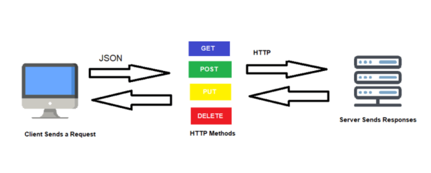

- Go to Help > Install New Software > Work with , in this section add this link and install the new software by accepting the terms and conditions.

```
http://www.thymeleaf.org/eclipse-plugin-update-site/
```

- Lets create a controller

```
package com.springboot.thymeleaf;

import java.util.Date;

import org.springframework.stereotype.Controller;
import org.springframework.web.bind.annotation.RequestMapping;
import org.springframework.web.servlet.ModelAndView;

@Controller
public class MainController {

	@RequestMapping("/welcome")
	public ModelAndView welcomePage() {
		ModelAndView mav=new ModelAndView();
		mav.setViewName("welcome");
		mav.addObject("name","Harsh");
		return mav;
	}
}
```

- Here we have used ModelAndView to set the data in object and view name.
- Now we need to create a **welcome.html** file. This file needs to be created under folder `src/main/resources/template`.

```
<!DOCTYPE html>
<html lang="en" xmlns:th="http://www.thymeleaf.org">
<head>
<meta charset="UTF-8">
<title>Insert title here</title>
</head>
<body>
<h1 th:text="${todaysDate}"></h1>
<h1> Welcome <span th:text="${name}"></span></h1>

</body>
</html>
```

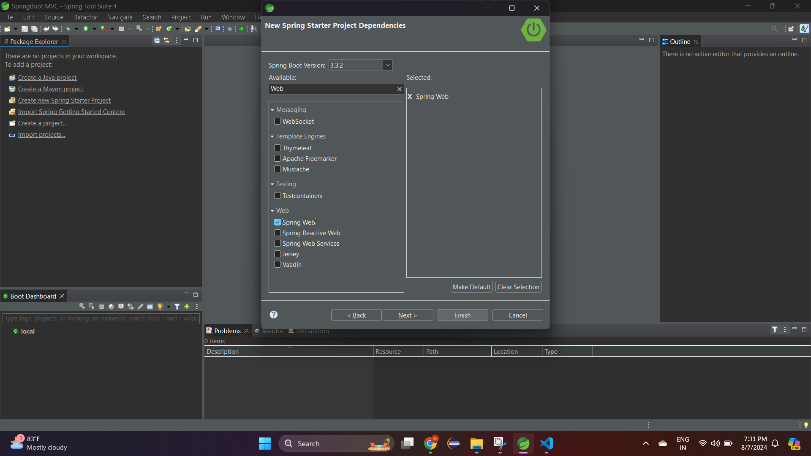

- Lets say you wanna make the string in upper/lower case, you could handle this in java, but thymeleaf provides expression to make it easier.

```
<!DOCTYPE html>
<html lang="en" xmlns:th="http://www.thymeleaf.org">
<head>
<meta charset="UTF-8">
<title>Insert title here</title>
</head>
<body>
<h1> Welcome <span th:text="${name}"></span></h1>
<h2> Uppercase <span th:text="${ #strings.toUpperCase(name)}"></span></h2>
</body>
</html>
```

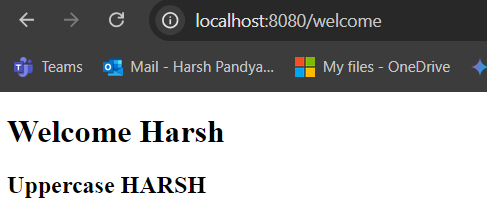

- Lets say you wanna create variables within the HTML and do some computations

```
<!DOCTYPE html>
<html lang="en" xmlns:th="http://www.thymeleaf.org">
<head>
<meta charset="UTF-8">
<title>Insert title here</title>
</head>
<body>
<h1> Welcome <span th:text="${name}"></span></h1>
<h2> Uppercase <span th:text="${ #strings.toUpperCase(name)}"></span></h2>

<!--  Scope of a,b and n is within the div block -->
<div th:with="a=10,b=20,n=${ name }">
	<h1> Value of a <span th:text="${a}"></span></h1>
	<h1> Value of b <span th:text="${b}"></span></h1>
	<h1 th:text="'Sum of a + b is '+${a+b}"> </h1>
	<h1 th:text="'length of string is '+${#strings.length(n)}"></h1>
	
</div>
<h1>Scope of a= <span th:text="${a}"></span> outside the div tag not valid</h1>

</body>
</html>
```

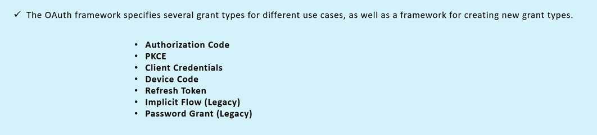

- `#strings.toUpperCase(name)`: This is a Thymeleaf utility object for string operations. It calls the toUpperCase method on the name variable, converting it to uppercase. This is a Thymeleaf utility object that provides various methods for string manipulation. It wraps Java's String class methods. Likewise strings there are arrays and various types of operations like #arrays,#collections,#dates,#objects etc..
- `th:with`: This attribute is used to declare local variables (a, b, and n) within the scope of the <div>. These variables are only available within this block.
- Lets say you wanna iterate over an items, in thymeleaf you can use `th:each`. So here we have created a list.

```
package com.springboot.thymeleaf;

import java.util.List;

import org.springframework.stereotype.Controller;
import org.springframework.web.bind.annotation.RequestMapping;
import org.springframework.web.servlet.ModelAndView;

@Controller
public class MainController {

	@RequestMapping("/welcome")
	public ModelAndView welcomePage() {
		ModelAndView mav=new ModelAndView();
		mav.setViewName("welcome");
		mav.addObject("name","Harsh");
		mav.addObject("listvalues",List.of("Item1","Item2","Item3"));
		return mav;
	}
}

```

- Below is the welcome page where we are iterating over the list values and printing those in an unordered list tag

```
<!DOCTYPE html>
<html lang="en" xmlns:th="http://www.thymeleaf.org">
<head>
<meta charset="UTF-8">
<title>Insert title here</title>
</head>
<body>
<h1> Welcome <span th:text="${name}"></span></h1>
<h2> Uppercase <span th:text="${ #strings.toUpperCase(name)}"></span></h2>

<!--  Scope of a,b and n is within the div block -->
<div th:with="a=10,b=20,n=${ name }">
	<h1> Value of a <span th:text="${a}"></span></h1>
	<h1> Value of b <span th:text="${b}"></span></h1>
	<h1 th:text="'Sum of a + b is '+${a+b}"> </h1>
	<h1 th:text="'length of string is '+${#strings.length(n)}"></h1>
	
</div>
<h1>Scope of a= <span th:text="${a}"></span> outside the div tag not valid</h1>

<ul>
	<li th:each="i,iteration : ${listvalues}">
		<h3> printing value of <span th:text="'index number '+${iteration.index}+' '+${i}"></span> </h3>
	</li>
	
</ul>

</body>
</html>
```

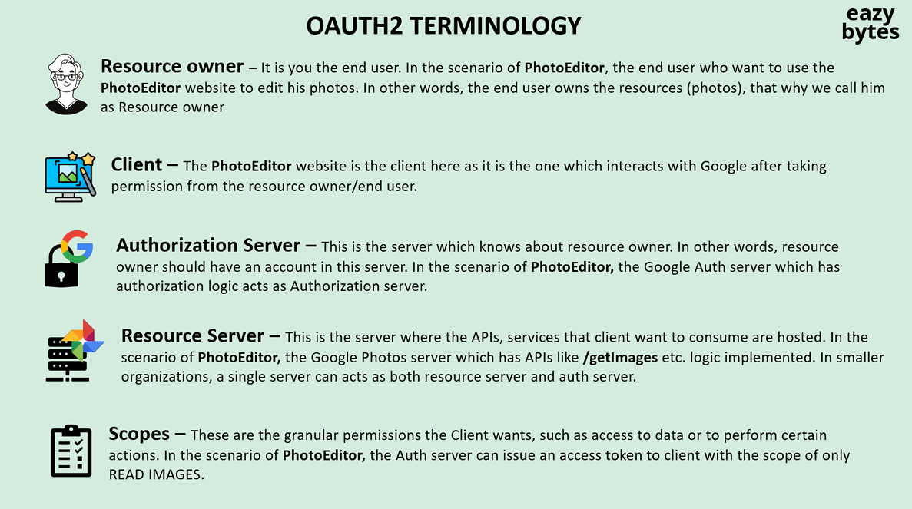

- The `th:each` attribute in Thymeleaf is used for iterating over collections (like lists, sets, Maps and arrays) within your templates. It allows you to render elements multiple times based on the contents of the collection.
- When using `th:each`, you can also access additional variables related to the iteration.
    - `iteration.index`: Current index (0-based).
    - `iteration.count`: Current count (1-based).
    - `iteration.size`: Total size of the collection.
    - `iteration.first`: Boolean indicating if the current item is the first.
    - `iteration.last`: Boolean indicating if the current item is the last.
    - `iteration.even` or `iteration.odd` : checks if the current iteration is odd or even.

```
<!DOCTYPE html>
<html lang="en" xmlns:th="http://www.thymeleaf.org">
<head>
<meta charset="UTF-8">
<title>Insert title here</title>
</head>
<body>
<h1> Welcome <span th:text="${name}"></span></h1>
<h2> Uppercase <span th:text="${ #strings.toUpperCase(name)}"></span></h2>

<!--  Scope of a,b and n is within the div block -->
<div th:with="a=10,b=20,n=${ name }">
	<h1> Value of a <span th:text="${a}"></span></h1>
	<h1> Value of b <span th:text="${b}"></span></h1>
	<h1 th:text="'Sum of a + b is '+${a+b}"> </h1>
	<h1 th:text="'length of string is '+${#strings.length(n)}"></h1>
	
</div>
<h1>Scope of a= <span th:text="${a}"></span> outside the div tag not valid</h1>

<ul>
	<li th:each="i,iteration: ${listvalues}">
		<h3> printing value of <span th:text="'index number '+${iteration.index}+' '+${i}"></span> </h3>
	</li>
	
</ul>

<h2> Coloring odd iterable to red</h2>

<ul>

	<li th:each="i, iterationforColor : ${listvalues}">
		<span th:style="${iterationforColor.odd} ? 'color:red;font-weight:bold'" th:text="${i}"></span> Count: <span th:text="${iterationforColor.count}"></span>
	</li>
	
</ul>
</body>
</html>
```

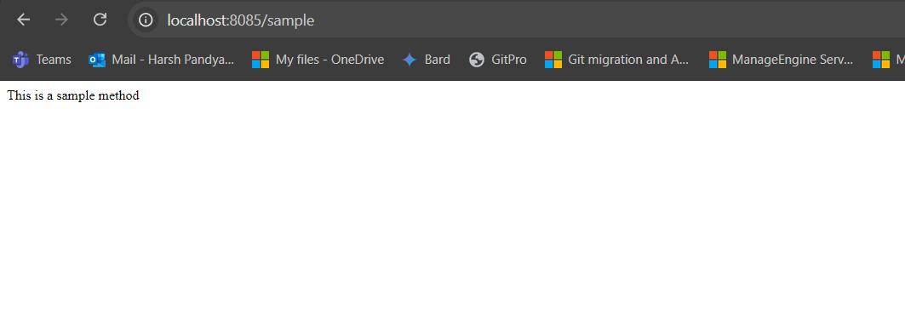

- What if you wanna add some conditional statements? is it possible in thymeleaf? , yes there are 3 approach to do with it. Lets create a page with name as conditions.html.

1. **Inline Conditional Expressions or Ternator Operator**

- Main Controller

```
package com.springboot.thymeleaf;

import java.util.List;

import org.springframework.stereotype.Controller;
import org.springframework.web.bind.annotation.GetMapping;
import org.springframework.web.bind.annotation.RequestMapping;
import org.springframework.web.servlet.ModelAndView;

@Controller
public class MainController {

	@RequestMapping("/welcome")
	public ModelAndView welcomePage() {
		ModelAndView mav=new ModelAndView();
		mav.setViewName("welcome");
		mav.addObject("name","Harsh");
		mav.addObject("listvalues",List.of("Item1","Item2","Item3"));
		return mav;
	}
	
	@GetMapping("/conditions")
	public ModelAndView conditionsPage() {
		ModelAndView mav=new ModelAndView();
		mav.setViewName("conditions");
		mav.addObject("userActive",true);
		return mav;
	}
}
```

- Conditions page

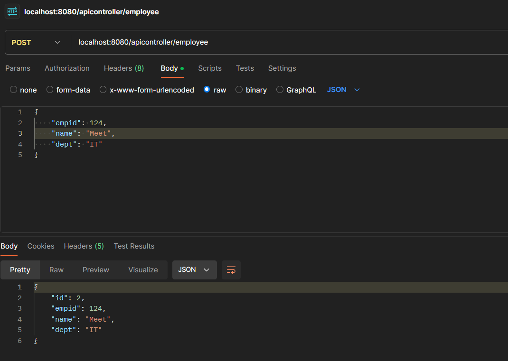

2. **Switch Case**

- Main Controller

```
package com.springboot.thymeleaf;

import java.util.List;

import org.springframework.stereotype.Controller;
import org.springframework.web.bind.annotation.GetMapping;
import org.springframework.web.bind.annotation.RequestMapping;
import org.springframework.web.servlet.ModelAndView;

@Controller
public class MainController {

	@RequestMapping("/welcome")
	public ModelAndView welcomePage() {
		ModelAndView mav=new ModelAndView();
		mav.setViewName("welcome");
		mav.addObject("name","Harsh");
		mav.addObject("listvalues",List.of("Item1","Item2","Item3"));
		return mav;
	}
	
	@GetMapping("/conditions")
	public ModelAndView conditionsPage() {
		ModelAndView mav=new ModelAndView();
		mav.setViewName("conditions");
		mav.addObject("userActive",false);
		mav.addObject("listsize",List.of(10,20,30));
		return mav;
	}
}
```

- Conditions page

```
<!DOCTYPE html>
<html lang="en" xmlns:th="http://www.thymeleaf.org">
<head>
<meta charset="UTF-8">
<title>Insert title here</title>
</head>
<body>

<h1>Inline Conditional Expressions or Ternator Operator</h1>
<h2> User is <span th:style="${ userActive } ? 'color:green' : 'color:red'" th:text=" ${ userActive } ? 'ACTIVE' : 'INACTIVE' "></span></h2>

<h1> Switch Case </h1>
<div th:switch="${ #lists.size(listsize) }">
	<h2 th:case="'0'"> List size is 0</h2>
	<h2 th:case="'3'"> List size is 3</h2>
	<h2 th:case="'*'"> List size is <span th:text="${ #lists.size(listsize) }"></span></h2>
</div>

</body>
</html>
```

 

3. **Using If**

- Main Controller

```
package com.springboot.thymeleaf;

import java.util.List;

import org.springframework.stereotype.Controller;
import org.springframework.web.bind.annotation.GetMapping;
import org.springframework.web.bind.annotation.RequestMapping;
import org.springframework.web.servlet.ModelAndView;

@Controller
public class MainController {

	@RequestMapping("/welcome")
	public ModelAndView welcomePage() {
		ModelAndView mav=new ModelAndView();
		mav.setViewName("welcome");
		mav.addObject("name","Harsh");
		mav.addObject("listvalues",List.of("Item1","Item2","Item3"));
		return mav;
	}
	
	@GetMapping("/conditions")
	public ModelAndView conditionsPage() {
		ModelAndView mav=new ModelAndView();
		mav.setViewName("conditions");
		mav.addObject("userActive",false);
		mav.addObject("listsize",List.of(10,20,30));
		mav.addObject("gender", "F");
		return mav;
	}
}
```
    
- Condition page

```
<!DOCTYPE html>
<html lang="en" xmlns:th="http://www.thymeleaf.org">
<head>
<meta charset="UTF-8">
<title>Insert title here</title>
</head>
<body>

<h1>Inline Conditional Expressions or Ternator Operator</h1>
<h2> User is <span th:style="${ userActive } ? 'color:green' : 'color:red'" th:text=" ${ userActive } ? 'ACTIVE' : 'INACTIVE' "></span></h2>

<h1> Switch Case </h1>
<div th:switch="${ #lists.size(listsize) }">
	<h2 th:case="'0'"> List size is 0</h2>
	<h2 th:case="'3'"> List size is 3</h2>
	<h2 th:case="'*'"> List size is <span th:text="${ #lists.size(listsize) }"></span></h2>
</div>

<h1> Using If</h1>
<h2 th:if="${gender} =='M'"> User is Male</h2>
<h2 th:if="${gender} !='M'"> User is Female</h2>

</body>
</html>
```

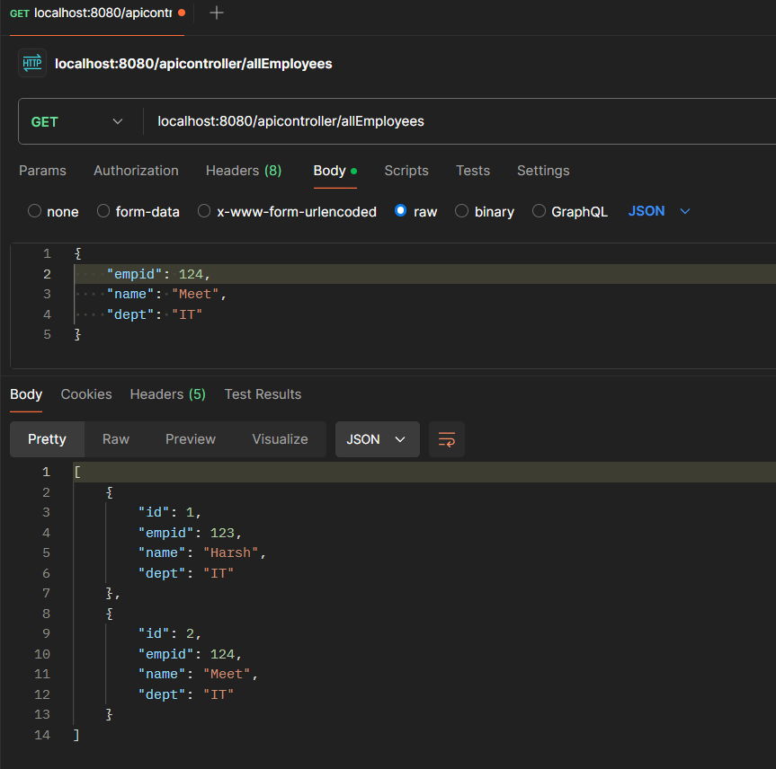

4. **Using If and Useless**

- The `th:unless` attribute is the opposite of th:if. It renders the element only if the expression evaluates to false. 
- In the below html it is specified that `<h2 th:usless="${age} <=20 "> Age is above 20 </h2>` stating that 100 is not less than 20 which evaluates to false.
- Main Controller

```
package com.springboot.thymeleaf;

import java.util.List;

import org.springframework.stereotype.Controller;
import org.springframework.web.bind.annotation.GetMapping;
import org.springframework.web.bind.annotation.RequestMapping;
import org.springframework.web.servlet.ModelAndView;

@Controller
public class MainController {

	@RequestMapping("/welcome")
	public ModelAndView welcomePage() {
		ModelAndView mav=new ModelAndView();
		mav.setViewName("welcome");
		mav.addObject("name","Harsh");
		mav.addObject("listvalues",List.of("Item1","Item2","Item3"));
		return mav;
	}
	
	@GetMapping("/conditions")
	public ModelAndView conditionsPage() {
		ModelAndView mav=new ModelAndView();
		mav.setViewName("conditions");
		mav.addObject("userActive",false);
		mav.addObject("listsize",List.of(10,20,30));
		mav.addObject("gender", "F");
		mav.addObject("age", 100);
		return mav;
	}
}
```

- Condition page


```
<!DOCTYPE html>
<html lang="en" xmlns:th="http://www.thymeleaf.org">
<head>
<meta charset="UTF-8">
<title>Insert title here</title>
</head>
<body>

<h1>Inline Conditional Expressions or Ternator Operator</h1>
<h2> User is <span th:style="${ userActive } ? 'color:green' : 'color:red'" th:text=" ${ userActive } ? 'ACTIVE' : 'INACTIVE' "></span></h2>

<h1> Switch Case </h1>
<div th:switch="${ #lists.size(listsize) }">
	<h2 th:case="'0'"> List size is 0</h2>
	<h2 th:case="'3'"> List size is 3</h2>
	<h2 th:case="'*'"> List size is <span th:text="${ #lists.size(listsize) }"></span></h2>
</div>

<h1> Using If</h1>
<h2 th:if="${gender} =='M'"> User is Male</h2>
<h2 th:if="${gender} !='M'"> User is Female</h2>

<h1> Using If and Useless</h1>
<h2 th:if="${age} <= 10 "> Age is less than 10</h2>
<h2 th:if="${age} > 10 and ${age} <=20 "> Age is less than 20 but greater than 10</h2>
<h2 th:usless="${age} <=20 "> Age is above 20 </h2>

</body>
</html>
```

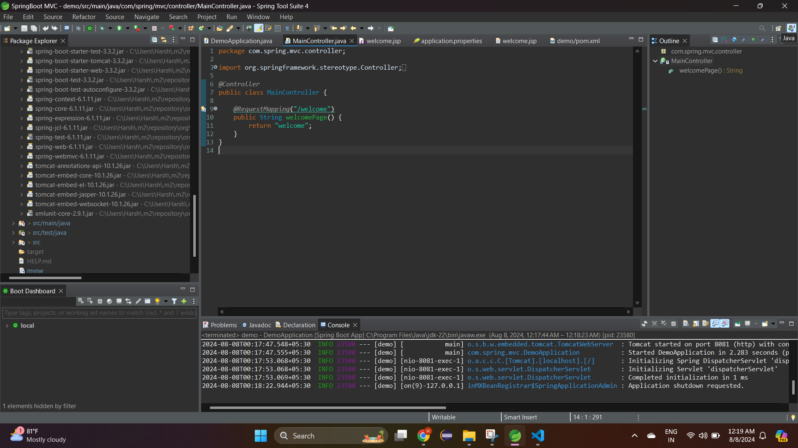

## Fragments

- In Thymeleaf, fragments are reusable pieces of templates that can be included in other templates. They help you avoid code duplication and make your templates more modular and maintainable.
- A fragment is a section of an HTML file that you can define and then reuse in other places. You can think of it as a "partial" or a "template snippet" that can be included in other pages.
- Fragments help you break down complex templates into smaller, more manageable pieces.
- **Fragment Tag** : Defines what content can be reused (e.g., a header, footer, or any UI component). The element that contains the reusable content, defined by `th:fragment`.
- **Host Tag**: Specifies where and how the fragment's content should be used in another template. The element in your main template where the fragment's content will be placed, using attributes like `th:insert` or `th:replace`. 

- Lets declare a fragment tag under `templates\commons` folder with name as template.html

```
<!DOCTYPE html>
<html lang="en" xmlns:th="http://www.thymeleaf.org">
<head>
<meta charset="UTF-8">
<title>Insert title here</title>
</head>
<body>

<!-- Define a header which will be common for all the pages -->
<header id="fragmentHeaderTag" th:fragment="template-header-fragment">
    <h1>My Website</h1>
    <nav>
        <ul>
            <li><a href="/">Home</a></li>
            <li><a href="/about">About</a></li>
            <li><a href="/contact">Contact</a></li>
        </ul>
    </nav>
</header>

<!-- Define a div tag -->
<div id="fragmentDivTag" th:fragment="template=-div-fragment">
	<p>This is a block coming from template.html</p>
</div>


<!-- Display user name and country , this piece of code could be repetitive so we created a fragment of it -->
<div id="fragmentIterativeTag" th:fragment="userInfo(user)"> 
    <div th:text="${user.name}"></div> 
    <div th:text="${user.country}"></div> 
</div>

</body>
</html>
```

- Here we have define 3 fragments under template.html
- There are 2 main ways to use these fragments `th:insert` or `th:replace`.

#### 1. Include

- Lets create a host tag in fragments.html.

```
<!DOCTYPE html>
<html lang="en" xmlns:th="http://www.thymeleaf.org">
<head>
<meta charset="UTF-8">
<title>Insert title here</title>
</head>
<body>

<h1> Insert Fragment Tag </h1>
<!-- Insert the fragment tag below the host tag-->
<!-- th:insert="path/filename :: fragment name" -->
<header id="headerHostTag" th:insert="commons/template :: template-header-fragment"></header>


</body>
</html>
```

- Here we took fragment tag with name **fragmentHeaderTag**. To insert the fragment into the fragment.html we need to give `th:insert` two things, path of the file (without .html extension) and fragment tag name.

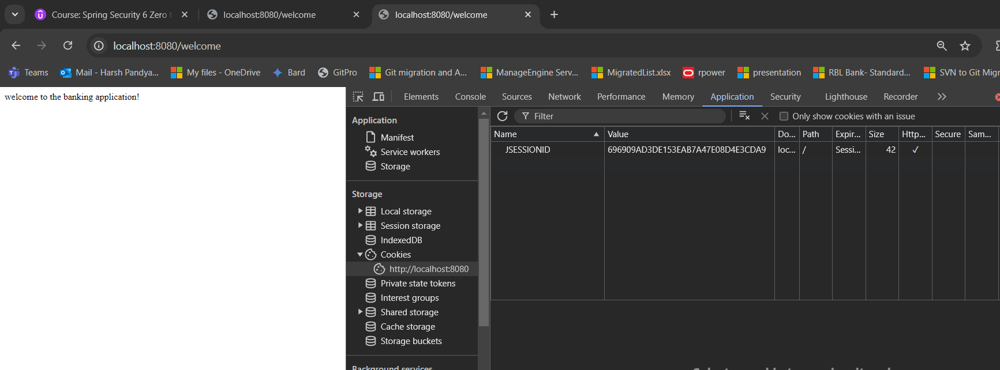

- Lets view page content, left click -> View page source 


- If you see, **fragmentHeaderTag** is inserted below **headerHostTag** like a new piece of block.

#### 2. Replace

- Lets perform host tag replacement

```
<!DOCTYPE html>
<html lang="en" xmlns:th="http://www.thymeleaf.org">
<head>
<meta charset="UTF-8">
<title>Insert title here</title>
</head>
<body>

<h1> Insert Fragment Tag </h1>
<!-- Insert the fragment tag below the host tag-->
<!-- th:insert="path/filename :: fragment name" -->
<header id="headerHostTag" th:insert="commons/template :: template-header-fragment"></header>


<h1> Replace Host Tag by Fragment Tag </h1>
<!-- Replacing the host tag by the fragment tag -->
<!-- th:replace="path/filename :: fragment name" -->
<header id="headerHostTag1" th:replace="commons/template :: template-header-fragment"></header>


</body>
</html>
```

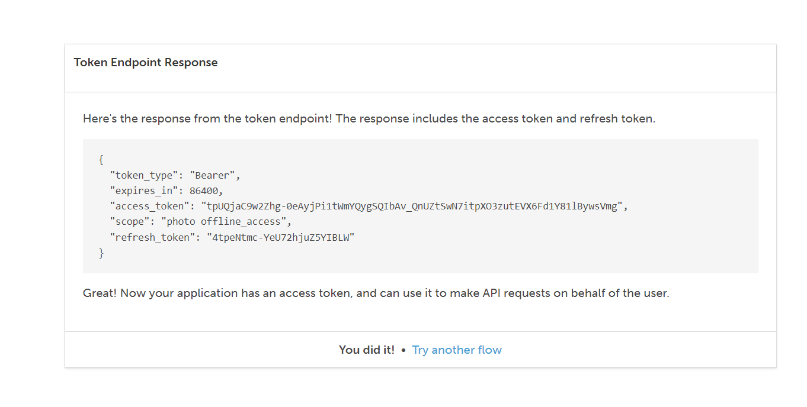


- Lets view page source

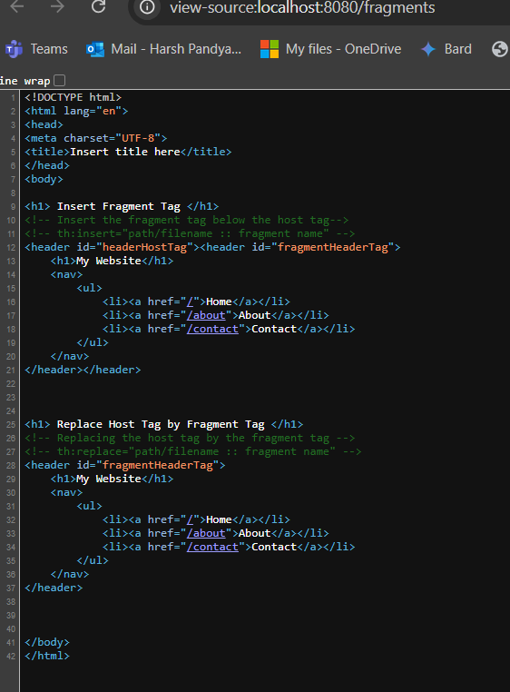

- If you see,**headerHostTag** is replaced by **fragmentHeaderTag** . The whole piece of `<div>` block is being replaced

>[!NOTE]
> - `th:include` attribute is no longer recommended in Thymeleaf versions 3.0 and above. It used to behave similarly to insert, but with potential performance and nesting issues. It's best to avoid include and use insert instead for consistency and future-proofing your code.


