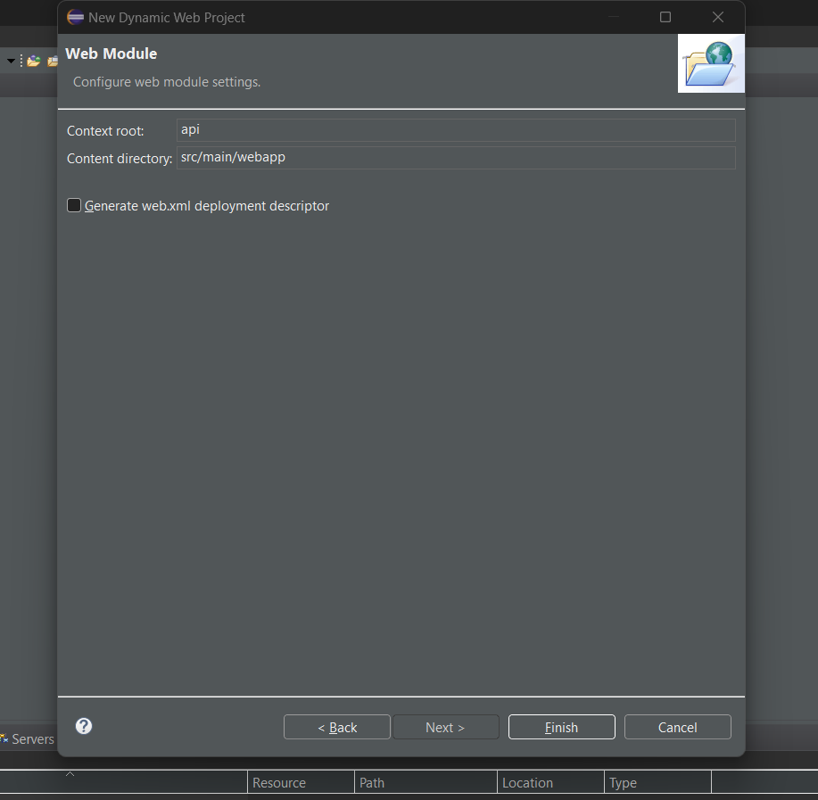
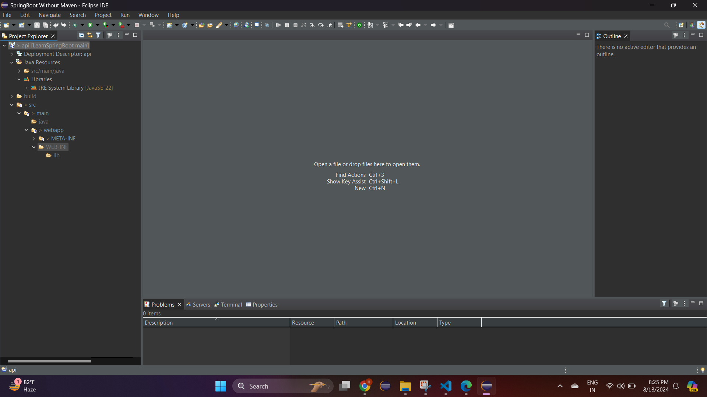
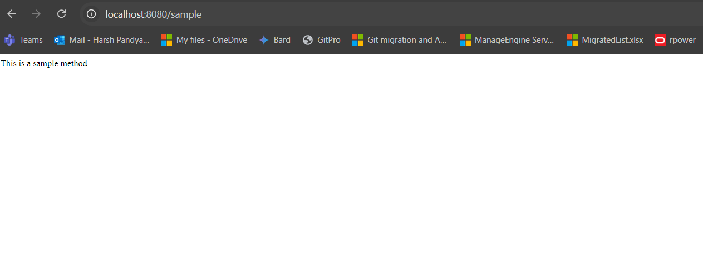
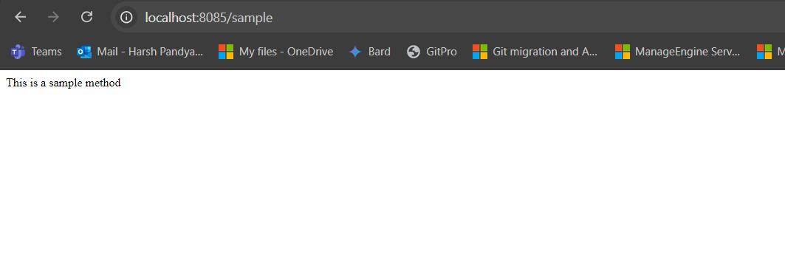
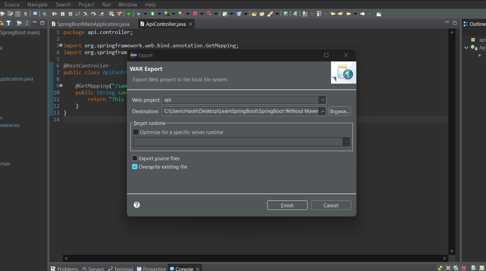
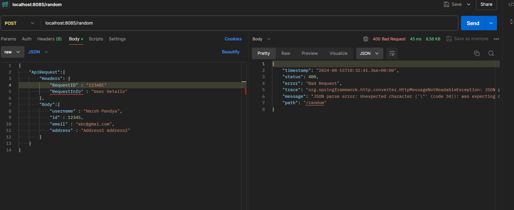
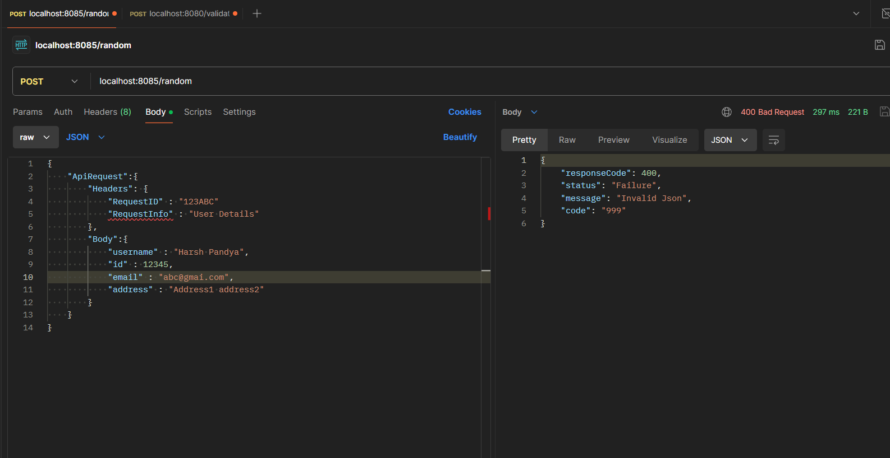
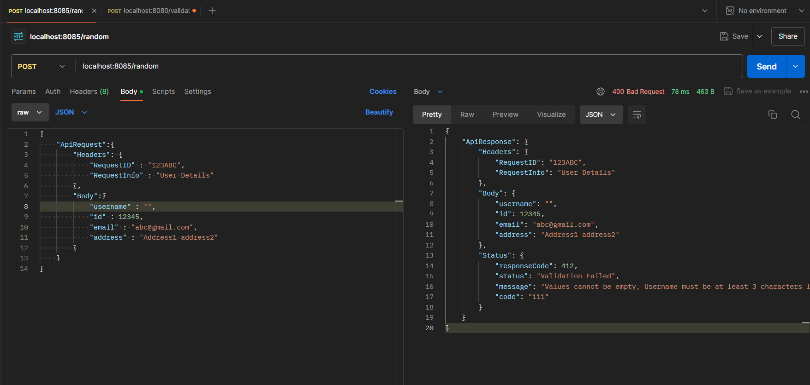

# SpringBoot Without Maven
- Lets create a project in SpringBoot without using Maven build automation tool and deploy it on the external tomcat server.
- Lets create a new dynamic web project in eclipse. During new project creation we won't generate **web.xml** file , as SpringBoot will perform all the autoconfigurations.





- Since we are not using maven we need to download the dependencies manually, so lets first create a folder with name **SpringBoot Dependencies**, okay what all dependencies needs to be added? well , you can follow the below steps to get your dependencies.

1. Create a temporary workspace of SpringBoot project using maven
2. In pom.xml add your require dependencies
3. Run and test your temporary project
4. Export the dependencies but using maven command `dependency:copy-dependencies`. The dependencies will get copied under a folder `/target`

<video controls src="Images/springbootwithoutmaven/20240813-1638-24.9055760.mp4" title="Title"></video>

- Now you can copy these dependencies into your main workspace and delete the temporary workspace.

>[!NOTE]
> - There could be multiple jar files which are not used by SpringBoot. Since it is an opinionated tool it defines a standard structure and downloads all the jars.
> - On the basis of trail and error by excluding jar/jars we can check if our SpringBoot is working correct or not.

- So i have copy the required dependencies used by springboot under folder **springboot dependencies** and unused dependencies to folder **springboot unused dependencies**.

>[!NOTE]
> - In this project we won't be using any operations wrto database, so those jars are excluded and added into **springboot unused dependencies**.

- Add this **springboot dependencies** in classpath as well as in the deployment assembly.

<video controls src="Images/springbootwithoutmaven/20240813-1700-07.5911933.mp4" title="Title"></video>

- Now under `src/main/java` folder create a main method and annotate it with `@SpringBootApplication`.

```
package api;

import org.springframework.boot.SpringApplication;
import org.springframework.boot.autoconfigure.SpringBootApplication;
import org.springframework.boot.builder.SpringApplicationBuilder;
import org.springframework.boot.web.servlet.support.SpringBootServletInitializer;

@SpringBootApplication
public class SpringBootMainApplication extends SpringBootServletInitializer {

	protected SpringApplicationBuilder configure(SpringApplicationBuilder builder) {
		return builder.sources(SpringBootMainApplication.class);
		
	}
	
	public static void main(String[] args) {
		SpringApplication.run(SpringBootMainApplication.class, args);

	}

}
```

- `@SpringBootApplication` is a convenience annotation that combines three annotations, `@EnableAutoConfiguration`, `@ComponentScan`, and `@Configuration`. It tells Spring Boot to start adding beans based on the classpath settings, other beans, and various property settings.
- **SpringBootServletInitializer** class is required when you're deploying your Spring Boot application to an external servlet container (like Tomcat) instead of using the embedded one. By extending **SpringBootServletInitializer**, you're telling Spring Boot that your application will be deployed as a traditional WAR file to a servlet container.

```
	protected SpringApplicationBuilder configure(SpringApplicationBuilder builder) {
		return builder.sources(SpringBootMainApplication.class);
	}
```

- It is specifically needed when you are deploying the application as a WAR file. **SpringApplicationBuilder** is used to build the Spring application context. By specifying `builder.sources(SpringBootMainApplication.class);`, you're telling Spring Boot to use the **SpringBootMainApplication** class as the main configuration class for the application.

- Lets create a ApiController which will be our `@RestController`, under package `src/main/java/api`.

```
package api.controller;

import org.springframework.web.bind.annotation.GetMapping;
import org.springframework.web.bind.annotation.RestController;

@RestController
public class ApiController {

	@GetMapping("/sample")
	public String sampleMethod() {
		return "This is a sample method";
	}
}
```

- Lets run this project with **Spring Boot App**, Run As -> Spring Boot App



- Wait where is **application.properties**? , you need to add that manually, lets create a folder with name **resources** under `src/main` Create manually **application.properties**. Post creation , lets configure our server port to 8085. When we create any property , we need to add that in the classpath.

<video controls src="Images/springbootwithoutmaven/20240813-1733-09.0005941.mp4" title="Title"></video>

- Now lets run again our application



>[!IMPORTANT]
> - Here we are still using embedded tomcat over here. When we are working on our dev , we can use embedded tomcat, suppose we wanted to deploy it on any external web server, we can export the war file of it and deploy that on the external web server.

- Lets export the war file and deploy that on tomcat server.
- In eclipse , right click on your project -> export -> WAR file.



- There are two ways to deploy a war file on tomcat.

#### Using CLI

- Copy war file to `apache-tomcat-version/webapps`.
- Start **start.bat** file under folder `/bin`.

<video controls src="Images/springbootwithoutmaven/20240813-1800-59.5465388.mp4" title="Title"></video>

#### Using Frontend

- To deploy war file using frontend, first you need to configure user name and password under **tomcat-user.xml** file in `apache-tomcat-version/conf`.

```
<user username="root" password="root" roles="manager-gui,manager-script" />
```

- When you want to manage Tomcat, including deploying applications through the Tomcat Manager web interface (the frontend screen), you need to configure users with the appropriate roles in the **tomcat-users.xml** file. This role allows you to access the Tomcat Manager web interface through the browser, where you can deploy, undeploy, start, stop, and manage applications.

<video controls src="Images/springbootwithoutmaven/20240813-1806-34.9063792.mp4" title="Title"></video>

- If you see in our **application.properties** the port number used was 8085, but when we deploy on tomcat the port number is 8080 because when you deploy your Spring Boot application as a WAR file on an external Tomcat server, the port number is determined by the Tomcat server itself, not by your Spring Boot application’s configuration.
- Spring-specific configurations will still apply when deploying on an external Tomcat server. However, server-specific configurations, like the port, will be managed by the Tomcat server itself.
- When we deploy war file on external server, the war file gets extracted. We can see the contents like classes, libraries, properties etc.. 

<video controls src="Images/springbootwithoutmaven/20240813-1813-23.9669885.mp4" title="Title"></video>


- Uptil now we have successfully create a simple springboot rest api project and deployed that into external web server. Lets create a simple REST Api which will perform validation on the request and provide response. The api will accept user details request, it will validate the request and will return random greetings as its response.
- Lets create Request structure

```
{
    "ApiRequest":{
        "Headers":{
            "RequestID" : "123ABC", 
            "RequestInfo" : "User Details"
        },
        "Body":{
            "username" : "Harsh Pandya",
            "id" : 123456,
            "email" : "abc@gmai.com",
            "address" : "abcdefghijklmnop"
        }
    }
}
```

-Below is sample response

```
{
    "ApiResponse":{
        "Headers": {
            "RequestID" : "123ABC",
            "RequestInfo" : "User Details"
        },
        "Body":{
            "username" : "Harsh Pandya",
            "id" : 123456,
            "email" : "abc@gmai.com",
            "address" : "abcdefghijklmnop"
        },
        "Status" : {
            "msg" : "Request is valid",
            "code" : "000"
        }
    }
}
```

- Lets construct these request and response as entities, also lets us add validations constraint on each of these instance variables
- Each nest Json request represents a new class.

```
Json Request:
{
	ApiRequest:{...}
}

Java class Representation:
package entities.request;

import com.fasterxml.jackson.annotation.JsonProperty;

import jakarta.validation.Valid;
import jakarta.validation.constraints.NotNull;

public class ApiRequestWrapper {

	/**
	 * If instance variable name is not exactly same as request key name, jackson library won't bind it
	 * So jackson library provides @JsonProperty which binds the Request Key name with the instance variables name
	 * even if both are not exactly same
	 */
	@Valid
    @NotNull(message = "ApiRequest cannot be null")
    @JsonProperty("ApiRequest")
    private ApiRequest apiRequest;

    // Getters and Setters
    public ApiRequest getApiRequest() {
        return apiRequest;
    }

    public void setApiRequest(ApiRequest apiRequest) {
        this.apiRequest = apiRequest;
    }
}


Json Request:
{
	ApiRequest:{
		Headers:{..},
		Body:{..}
	}
}

Java Class representation:
package entities.request;

import com.fasterxml.jackson.annotation.JsonProperty;

import jakarta.validation.Valid;
import jakarta.validation.constraints.NotNull;

public class ApiRequest {
	/**
	 * If instance variable name is not exactly same as request key name, jackson library won't bind it
	 * So jackson library provides @JsonProperty which binds the Request Key name with the instance variables name
	 * even if both are not exactly same
	 */
	@Valid
    @NotNull(message = "Headers cannot be null")
    @JsonProperty("Headers")
    private Headers headers;

	@Valid
    @NotNull(message = "Body cannot be null")
    @JsonProperty("Body")
    private Body body;

    // Getters and Setters
    public Headers getHeaders() {
        return headers;
    }

    public void setHeaders(Headers headers) {
        this.headers = headers;
    }

    public Body getBody() {
        return body;
    }

    public void setBody(Body body) {
        this.body = body;
    }
}


Json Request:
{
	ApiRequest:{
		Headers:{
			RequestID : "123ABC",
            RequestInfo : "User Details"
		}
		..
	}
}

Java Class Representation:
package entities.request;

import com.fasterxml.jackson.annotation.JsonProperty;

import jakarta.validation.Valid;
import jakarta.validation.constraints.NotNull;
import jakarta.validation.constraints.Pattern;

public class Headers {
	@Valid
    @NotNull(message = "RequestID cannot be null")
    @Pattern(regexp = "^[a-zA-Z0-9]*$", message = "RequestID must be alphanumeric")
    @JsonProperty("RequestID")
    private String requestID;
    
	@Valid
    @NotNull(message = "RequestInfo cannot be null")
    @Pattern(regexp = "^User Details$", message = "RequestInfo must be 'User Details'")
    @JsonProperty("RequestInfo")
    private String requestInfo;

    // Getters and Setters
    public String getRequestID() {
        return requestID;
    }

    public void setRequestID(String requestID) {
        this.requestID = requestID;
    }

    public String getRequestInfo() {
        return requestInfo;
    }

    public void setRequestInfo(String requestInfo) {
        this.requestInfo = requestInfo;
    }
}


Json Request:
{
	ApiRequest:{
		...
		Body:{
			username : "Harsh Pandya",
            id : 1234
			..
		}
	}
}

Java class representation:
package entities.request;

import jakarta.validation.Valid;
import jakarta.validation.constraints.Email;
import jakarta.validation.constraints.Max;
import jakarta.validation.constraints.NotNull;
import jakarta.validation.constraints.Size;

public class Body {

	/**
	 * Here we have not used @JsonProperty because variable name is same as json keys 
	 */
	@Valid
    @NotNull(message = "Username cannot be null")
    @Size(min = 3, message = "Username must be at least 3 characters long")
    private String username;

	@Valid
    @NotNull(message = "ID cannot be null")
    @Max(value = 99999, message = "ID must be less than or equal to 5 digits")
    private Integer id;
	
	@Valid
    @NotNull(message = "Email cannot be null")
    @Email(message = "Email should be valid")
    private String email;

	@Valid
    @NotNull(message = "Address cannot be null")
    @Size(min = 10, message = "Address must be at least 10 characters long")
    private String address;

    // Getters and Setters
    public String getUsername() {
        return username;
    }

    public void setUsername(String username) {
        this.username = username;
    }

    public Integer getId() {
        return id;
    }

    public void setId(Integer id) {
        this.id = id;
    }

    public String getEmail() {
        return email;
    }

    public void setEmail(String email) {
        this.email = email;
    }

    public String getAddress() {
        return address;
    }

    public void setAddress(String address) {
        this.address = address;
    }
}
```

- Using `jakarta.validation` library we can define validation on each property of json.
- Using `jackson` library `@JsonProperty` we can bind the json request key name with instance variables if the variables name and request json key names aren't same.
- Lets create Response structure

```
Json Request:
{
    "ApiResponse": {..}
}

Java class representation:
package entities.response;

import com.fasterxml.jackson.annotation.JsonProperty;

public class ApiResponseWrapper {

	@JsonProperty("ApiResponse")
	private ApiResponse apiResponse;

	public ApiResponse getApiResponse() {
		return apiResponse;
	}

	public void setApiResponse(ApiResponse apiResponse) {
		this.apiResponse = apiResponse;
	}
	
	
}

Json Request:
{
	ApiResponse:{
		Headers:{...},
		Body:{...},
		Status:{...}
	}
}

Java Class representation:
package entities.response;

import com.fasterxml.jackson.annotation.JsonProperty;

import entities.request.Body;
import entities.request.Headers;

public class ApiResponse {

	@JsonProperty("Headers")
	private Headers headers;
	
	@JsonProperty("Body")
	private Body body;
	
	@JsonProperty("Status")
	private Status status;

	public Headers getHeaders() {
		return headers;
	}

	public void setHeaders(Headers headers) {
		this.headers = headers;
	}

	public Body getBody() {
		return body;
	}

	public void setBody(Body body) {
		this.body = body;
	}

	public Status getStatus() {
		return status;
	}

	public void setStatus(Status status) {
		this.status = status;
	}
	
	
}

--- Header and body are same of Request ---

Json Request:
{
	ApiResponse:{
		Status:{
			responseCode:..
			status:..
			..
		}
	}
}
package entities.response;

public class Status {
	
	private int responseCode;
	
	private String status;
	
	private String message;
	
	private String code;

	public int getResponseCode() {
		return responseCode;
	}

	public void setResponseCode(int responseCode) {
		this.responseCode = responseCode;
	}

	public String getStatus() {
		return status;
	}

	public void setStatus(String status) {
		this.status = status;
	}

	public String getMessage() {
		return message;
	}

	public void setMessage(String message) {
		this.message = message;
	}

	public String getCode() {
		return code;
	}

	public void setCode(String code) {
		this.code = code;
	}

	
	
	
}
```

- Lets define **POST** mapping in ApiController

```
package api.controller;

import java.util.Random;
import java.util.stream.Collectors;

import org.springframework.http.HttpStatus;
import org.springframework.http.ResponseEntity;
import org.springframework.validation.BindingResult;
import org.springframework.web.bind.annotation.GetMapping;
import org.springframework.web.bind.annotation.PostMapping;
import org.springframework.web.bind.annotation.RequestBody;
import org.springframework.web.bind.annotation.RestController;

import entities.request.ApiRequestWrapper;
import entities.response.ApiResponse;
import entities.response.ApiResponseWrapper;
import entities.response.Status;
import jakarta.validation.Valid;

@RestController
public class ApiController {

	@GetMapping("/sample")
	public String sampleMethod() {
		return "This is a sample method";
	}
	
	@PostMapping("/random")
	public ResponseEntity<ApiResponseWrapper> apiRequest(@Valid @RequestBody ApiRequestWrapper request, BindingResult bindingResult) {
		ApiResponseWrapper response = new ApiResponseWrapper();
        ApiResponse apiResponse= new ApiResponse();
        apiResponse.setHeaders(request.getApiRequest().getHeaders());
        apiResponse.setBody(request.getApiRequest().getBody());
    	Status st= new Status();
    	System.out.println(bindingResult);
    	
    	/**
    	 * If any validation fails
    	 */
        if (bindingResult.hasErrors()) {
        	st.setCode("111");
            st.setMessage(bindingResult.getAllErrors().stream()
                    .map(error -> error.getDefaultMessage())
                    .collect(Collectors.joining(", "))); 
            st.setStatus("Validation Failed");
            st.setResponseCode(HttpStatus.PRECONDITION_FAILED.value());
            apiResponse.setStatus(st);
        	response.setApiResponse(apiResponse);
            return ResponseEntity.badRequest().body(response);
        }
        
        /**
         * Validations are success
         */
        /**
         * Generating random message
         */
        String[] messages = {
                "Hello, world!",
                "Have a great day!",
                "Keep smiling!",
                "You got this!",
                "Stay positive!"
            };

        Random random = new Random();
        int index = random.nextInt(messages.length);
        String randomMessage = messages[index];

        st.setMessage(randomMessage);
        st.setResponseCode(HttpStatus.OK.value());
        st.setCode("000");
        st.setStatus("Validation Passed");
    	apiResponse.setStatus(st);
    	response.setApiResponse(apiResponse);
        return ResponseEntity.ok(response);
    }
}
```

- Lets test our api

<video controls src="Images/springbootwithoutmaven/20240815-1027-21.2124274.mp4" title="Title"></video>

- The `@Valid` annotation is used to trigger validation on the request body. When you use `@Valid` on a parameter (e.g., `@RequestBody` ApiRequestWrapper request), Spring Boot performs validation based on the constraints defined in your classes (like `@NotNull`, `@Size`, etc.).
- `@BindingResult` is used to capture validation errors and provides detailed information about them. It works in conjunction with `@Valid` or `@Validated` annotations to handle validation of request bodies. It holds errors found during validation. This allows you to check for validation issues and respond accordingly. It provides methods to access error details, such as the type of error and the field that caused it.

- What if json is invalid?




- It does not seems as per our format. To so do we need to define `@ExceptionHandler`

```
package exceptionhandler;

import org.springframework.http.HttpStatus;
import org.springframework.http.ResponseEntity;
import org.springframework.web.bind.annotation.RestControllerAdvice;
import org.springframework.web.bind.annotation.ExceptionHandler;
import org.springframework.web.context.request.WebRequest;


import entities.response.Status;

import org.springframework.http.converter.HttpMessageNotReadableException;

@RestControllerAdvice
public class GlobalExceptionHandler {
	
	/**
	 * @ControllerAdvice or @RestControllerAdvice
	 *  - This allows you to handle exceptions globally across all your controllers.
		- When an exception is thrown from a controller, Spring Boot looks for a method annotated with @ExceptionHandler inside classes annotated with @ControllerAdvice.
		- @ExceptionHandler(HttpMessageNotReadableException.class) catches errors related to invalid JSON.
	 */

    @ExceptionHandler(HttpMessageNotReadableException.class)
    public ResponseEntity<Object> handleInvalidJsonException(HttpMessageNotReadableException ex) {
        Status st= new Status();
        st.setResponseCode(HttpStatus.BAD_REQUEST.value());
        st.setMessage("Invalid Json");
        st.setCode("999");
        st.setStatus("Failure");
        return new ResponseEntity<>(st, HttpStatus.BAD_REQUEST);
    }

    // Add more handlers if needed
}
```

- `@ControllerAdvice` or `@RestControllerAdvice` allows you to handle exceptions globally across all your controllers.
- When an exception is thrown from a controller, Spring Boot looks for a method annotated with @ExceptionHandler inside classes annotated with `@ControllerAdvice`.
- `@ExceptionHandler(HttpMessageNotReadableException.class)` catches errors related to invalid JSON.

>[!IMPORTANT]
> - Where the class for `@ControllerAdvice` or `@RestControllerAdvice` is declare, it should be in same package of SpringBootApplication or the Main method.
> - If it is mentioned out of Main method package, then it should be added as`@ComponentScan` of main method

```
package api;

import org.springframework.boot.SpringApplication;
import org.springframework.boot.autoconfigure.SpringBootApplication;
import org.springframework.boot.builder.SpringApplicationBuilder;
import org.springframework.boot.web.servlet.support.SpringBootServletInitializer;
import org.springframework.context.annotation.ComponentScan;

@SpringBootApplication
@ComponentScan(basePackages = {"exceptionhandler","api.controller"})
public class SpringBootMainApplication extends SpringBootServletInitializer {

	protected SpringApplicationBuilder configure(SpringApplicationBuilder builder) {
		return builder.sources(SpringBootMainApplication.class);
		
	}
	
	public static void main(String[] args) {
		SpringApplication.run(SpringBootMainApplication.class, args);

	}

}
```



- Lets say , if your message starting phrase would be generic like for example 'Greetings !!!, have a good day' or 'Greetings !!!, Hi' , you could append the prefix `Greetings !!!` to all your phrases. What if you could have a generic key and this `Greeting !!!` as its value in your **application.properties** and using it you could have just contenated in your string?
- This can be done using `@Value` annotation.

```
application.properties
server.port=8085
greetings=Greetings !!!
```

- Below is update ApiController

```
package api.controller;

import java.util.Random;
import java.util.stream.Collectors;

import org.springframework.beans.factory.annotation.Value;
import org.springframework.http.HttpStatus;
import org.springframework.http.ResponseEntity;
import org.springframework.validation.BindingResult;
import org.springframework.web.bind.annotation.GetMapping;
import org.springframework.web.bind.annotation.PostMapping;
import org.springframework.web.bind.annotation.RequestBody;
import org.springframework.web.bind.annotation.RestController;

import entities.request.ApiRequestWrapper;
import entities.response.ApiResponse;
import entities.response.ApiResponseWrapper;
import entities.response.Status;
import jakarta.validation.Valid;

@RestController
public class ApiController {
	
	@Value("${greetings}")
	private String customMsg;
	
	public String getCustomMsg() {
		return customMsg;
	}

	public void setCustomMsg(String customMsg) {
		this.customMsg = customMsg;
	}

	@GetMapping("/sample")
	public String sampleMethod() {
		return "This is a sample method";
	}
	
	@PostMapping("/random")
	public ResponseEntity<ApiResponseWrapper> apiRequest(@Valid @RequestBody ApiRequestWrapper request, BindingResult bindingResult) {
		ApiResponseWrapper response = new ApiResponseWrapper();
        ApiResponse apiResponse= new ApiResponse();
        apiResponse.setHeaders(request.getApiRequest().getHeaders());
        apiResponse.setBody(request.getApiRequest().getBody());
    	Status st= new Status();
    	System.out.println(bindingResult);
    	
    	/**
    	 * If any validation fails
    	 */
        if (bindingResult.hasErrors()) {
        	st.setCode("111");
            st.setMessage(bindingResult.getAllErrors().stream()
                    .map(error -> error.getDefaultMessage())
                    .collect(Collectors.joining(", "))); 
            st.setStatus("Validation Failed");
            st.setResponseCode(HttpStatus.PRECONDITION_FAILED.value());
            apiResponse.setStatus(st);
        	response.setApiResponse(apiResponse);
            return ResponseEntity.badRequest().body(response);
        }
        
        /**
         * Validations are success
         */
        /**
         * Generating random message
         */
        String[] messages = {
                "Hello, world!",
                "Have a great day!",
                "Keep smiling!",
                "You got this!",
                "Stay positive!"
            };

        Random random = new Random();
        int index = random.nextInt(messages.length);
        String randomMessage = messages[index];

        st.setMessage(getCustomMsg()+" "+randomMessage);
        st.setResponseCode(HttpStatus.OK.value());
        st.setCode("000");
        st.setStatus("Validation Passed");
    	apiResponse.setStatus(st);
    	response.setApiResponse(apiResponse);
        return ResponseEntity.ok(response);
    }
}
```

- Spring `@Value` annotation is used to assign or inject default values to variables and method arguments. We can read spring environment variables as well as system variables using @Value annotation. Spring `@Value` annotation also supports SpEL.
- Some more examples of it `@Value` annotation

```
Assiging Data type values
@Value("true")
private boolean defaultBoolean;

@Value("10")
private int defaultInt;

Assiging System Enviroment variables
@Value("true")
private boolean defaultBoolean;

@Value("10")
private int defaultInt;

Assiging on methods
@Value("Test")
public void printValues(String s, String v){} //both 's' and 'v' values will be 'Test' 

@Value("Test")
public void printValues(String s, @Value("Data") String v){}
// s=Test, v=Data
```

- Lets say you wanna create a generic message for a validations for an example, for empty values of a particular key in request you wanna display `Values cannot be empty` , to do so you need to create **message.properties** file which will store all your messages and that can be access by Spring during execution.

```
emptyMsg=Values cannot be empty
```

- But how will Spring knows? for that you need to do some configurations using **MessageSource** and **LocalValidatorFactoryBean**.

```
package api;

import org.springframework.boot.SpringApplication;
import org.springframework.boot.autoconfigure.SpringBootApplication;
import org.springframework.boot.builder.SpringApplicationBuilder;
import org.springframework.boot.web.servlet.support.SpringBootServletInitializer;
import org.springframework.context.MessageSource;
import org.springframework.context.annotation.Bean;
import org.springframework.context.annotation.ComponentScan;
import org.springframework.context.support.ReloadableResourceBundleMessageSource;
import org.springframework.validation.beanvalidation.LocalValidatorFactoryBean;

@SpringBootApplication
@ComponentScan(basePackages = {"exceptionhandler","api.controller"})
public class SpringBootMainApplication extends SpringBootServletInitializer {

	protected SpringApplicationBuilder configure(SpringApplicationBuilder builder) {
		return builder.sources(SpringBootMainApplication.class);
		
	}
	
	public static void main(String[] args) {
		SpringApplication.run(SpringBootMainApplication.class, args);

	}
	
	@Bean
	public MessageSource messageSource() {
	    ReloadableResourceBundleMessageSource messageSource = new ReloadableResourceBundleMessageSource();
	    messageSource.setBasename("classpath:message");
	    messageSource.setDefaultEncoding("UTF-8");
	    return messageSource;
	}
	
	@Bean
	public LocalValidatorFactoryBean getValidator() {
	    LocalValidatorFactoryBean bean = new LocalValidatorFactoryBean();
	    bean.setValidationMessageSource(messageSource());
	    return bean;
	}
}
```

- A locale represents the combination of language and region settings for a user. It includes information like the language (e.g., English, French) and sometimes the region or country (e.g., US, France). Example: en_US is the locale for English as spoken in the United States, while fr_FR is for French as spoken in France.
- **Language Internationalization (i18n)** is the process of designing your application so that it can be adapted to different languages and regions without requiring changes to the code. It’s about making your app flexible enough to support multiple languages and formats.
Example: If your app is in English and you want to support French, you need to provide French translations for all user-facing text.
- Your application might display various messages to users, such as error messages, instructions, or alerts. For example, an error message might say "Username must not be empty." When users submit forms with invalid data, your application will show validation messages like "Email is required" or "Password must be at least 8 characters."
- To support different languages, you need to provide translations for all these messages. This is where the MessageSource comes in.
- You create separate properties files for each language you want to support. For example, you might have `messages_en.properties` for English `messages_fr.properties` for French.

```
messages_en.properties:
error.username.empty=Username must not be empty
error.email.invalid=Email format is invalid

messages_fr.properties:
error.username.empty=Le nom d'utilisateur ne doit pas être vide
error.email.invalid=Le format de l'email est invalide
```

- MessageSource helps manage and retrieve these messages based on the user’s locale, so they see text in their language.
- When a validation error occurs, the LocalValidatorFactoryBean uses the MessageSource to fetch the appropriate error message from properties files. This allows error messages to be localized based on the user’s locale. It uses ReloadableResourceBundleMessageSource that accesses resource bundles using specified base names `messageSource.setBasename("classpath:message")`.
- By configuring LocalValidatorFactoryBean, you ensure that Spring’s validation framework works smoothly with your message sources, providing a consistent and localized user experience.
- By default, Spring Boot uses the system’s default locale. If your system or application isn’t configured with a specific locale, it typically defaults to English (US) or the locale set in the system properties.

- Ensure that `/resources` folder is added in your classpath so that spring can access **message.properties**  and run the application.



- Above learnings are implemented [here](https://github.com/codophilic/LearnSpringBoot/tree/main/SpringBoot%20Without%20Maven/api)


