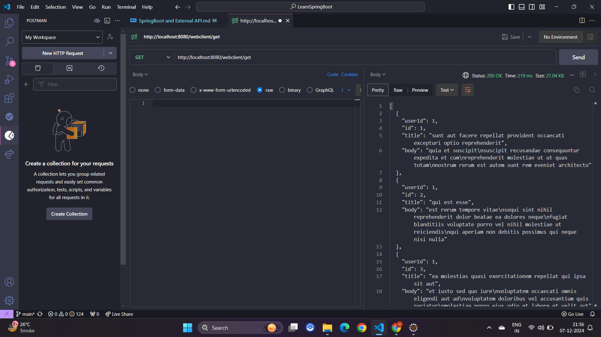
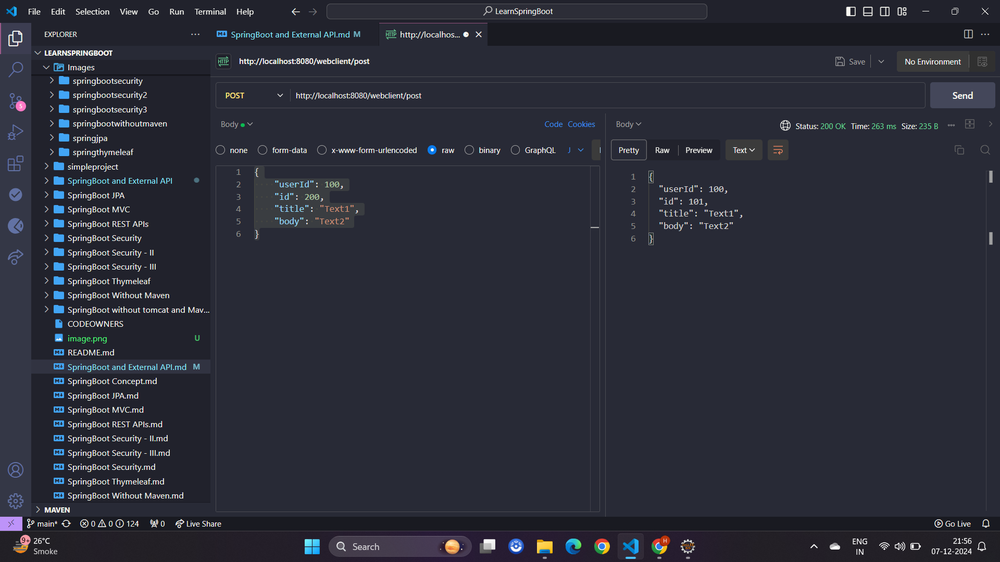

# SpringBoot and External API

- In Spring Boot, you can call external APIs using the `RestTemplate` (for older versions) or `WebClient` (a newer alternative). 

## `RestTemplate`

- `RestTemplate` is a class provided by the Spring Framework that simplifies the process of making HTTP requests and handling responses. It abstracts away much of the boilerplate code typically associated with making HTTP calls, making it easier to interact with RESTful web services.
- So here we will be calling external API, by calling our api end points. Here as an external API we will be using [JSON Placeholder](https://jsonplaceholder.typicode.com/) which provides fake data by consuming its API.
- Lets see when we hit [`https://jsonplaceholder.typicode.com/posts`](https://jsonplaceholder.typicode.com/posts) what we get in response?


- We get list of post in a JSON format. Now to call this external api via spring boot first we need to download its dependencies

```
		<dependency>
			<groupId>org.springframework.boot</groupId>
			<artifactId>spring-boot-starter-web</artifactId>
		</dependency>
```

- After that we need to configure `RestTemplate` in our Java Configuration.

```
package com.api.api;
import org.springframework.context.annotation.Bean;
import org.springframework.context.annotation.Configuration;
import org.springframework.web.client.RestTemplate;

@Configuration
public class ApiConfiguration {
    @Bean
    public RestTemplate restTemplate() {
        return new RestTemplate();
    }
}
```

- Now we need to create a simple rest controller which will be calling the external api json placeholder.

```
package com.api.api;

import org.springframework.beans.factory.annotation.Autowired;
import org.springframework.web.bind.annotation.GetMapping;
import org.springframework.web.bind.annotation.RestController;
import org.springframework.web.client.RestTemplate;

@RestController
public class ExternalApiCall {

    @Autowired
    private RestTemplate restTemplate;

    @GetMapping("/restTemplate/get")
    public String getJsonData() {
        String url = "https://jsonplaceholder.typicode.com/posts/";
        return restTemplate.getForObject(url, String.class);
    }
}
```

- Here we will be calling the segment path `/restTemplate/get` which will be calling `https://jsonplaceholder.typicode.com/posts/`. Lets run the application. When we hit `http://localhost:8080/restTemplate/get` end point we can see list of post as the json response.


-  `getForEntity()` or `getForObject()` sends a **GET** request to uri `https://jsonplaceholder.typicode.com/posts/` to fetch data from the server. Retrieves the response, either as a `ResponseEntity` or as the response body directly.
- The above was an example to retrieve data or get data, now lets see an example of post request. To send **POST** request we need to first form the required data which will be accepted by the server, so json placeholder opens an endpoint where we can **POST** below kind of data on its end point `https://jsonplaceholder.typicode.com/posts`


```
{
  id: 1,
  title: 'foo',
  body: 'bar',
  userId: 1
}
```

- So below is the implementation using `RestTemplate`.

```
    @PostMapping("/restTemplate/post")
    public String postJsonData(@RequestBody String requestBody) {
        HttpHeaders headers = new HttpHeaders();
        headers.setContentType(MediaType.APPLICATION_JSON);

        HttpEntity<String> request = new HttpEntity<>(requestBody, headers);

        ResponseEntity<String> response = restTemplate.postForEntity("https://jsonplaceholder.typicode.com/posts", request, String.class);
        return response.getBody();
    }
```

- When we run the application and hit the `/restTemplate/post` it will post the data in the `https://jsonplaceholder.typicode.com/posts` server.


- `postForEntity()` or `postForObject()` sends a POST request to the specified URL. Submits a request body (typically JSON or form data) to the server. Returns the response, either as a `ResponseEntity` (with status, headers, body) or as the response body directly.
- `HttpHeaders` represents the HTTP headers to be included in the request. Allows you to set headers like Content-Type, Authorization, and custom headers. Here we have set content type as 

```
 headers.setContentType(MediaType.APPLICATION_JSON);
```

- Alternatively we can add more content headers like below

```
HttpHeaders headers = new HttpHeaders();
headers.set("Content-Type", "application/json");
headers.set("Authorization", "Bearer your_token");
```

- `HttpEntity` represents the entire HTTP request body, including
    - Headers: Metadata about the request (e.g., content type, authentication).
    - Body: The actual data to send (e.g., JSON, form data).
- It combines headers and body into a single object for easier handling in methods like `postForEntity`. The `HttpEntity` encapsulates the `requestBody` and `headers` into one object to pass to the RestTemplate method.
- Whats the difference between `postForEntity()` and `postForObject()` ? `postForEntity` gives you more information (headers, status), while `postForObject` gives only the body.
- Now lets see an example of `DELETE`.

```
    @DeleteMapping("/restTemplate/delete/{id}")
    public String deleteJsonData(@PathVariable String id) {
        String url = "https://jsonplaceholder.typicode.com/posts/"+id;
        restTemplate.delete(url);
        return id+" is delete";
    }
```

- Output


- `delete(url)` sends a DELETE request without returning any response body

## `WebClient`

- `WebClient` is a modern, **non-blocking HTTP client** introduced in the Spring `WebFlux` module. It is designed to handle reactive and asynchronous programming models. Unlike the **older `RestTemplate`, which operates synchronously**, `WebClient` is **fully asynchronous and leverages reactive streams**, making it suitable for high-concurrency, low-latency applications
- Lets first download the dependency

```
   <dependency>
       <groupId>org.springframework.boot</groupId>
       <artifactId>spring-boot-starter-webflux</artifactId>
   </dependency>
```

- Lets configure webflux

```
package com.api.api;
import org.springframework.context.annotation.Bean;
import org.springframework.context.annotation.Configuration;
import org.springframework.web.client.RestTemplate;
import org.springframework.web.reactive.function.client.WebClient;

@Configuration
public class ApiConfiguration {
    @Bean
    public RestTemplate restTemplate() {
        return new RestTemplate();
    }
    
    @Bean
    public WebClient webClient() {
      return WebClient.builder().baseUrl("https://jsonplaceholder.typicode.com/").build();
    }
}
```

- Lets set up `GET` and `POST` method

```
package com.api.api;

import org.springframework.beans.factory.annotation.Autowired;
import org.springframework.http.HttpEntity;
import org.springframework.http.HttpHeaders;
import org.springframework.http.MediaType;
import org.springframework.http.ResponseEntity;
import org.springframework.web.bind.annotation.DeleteMapping;
import org.springframework.web.bind.annotation.GetMapping;
import org.springframework.web.bind.annotation.PathVariable;
import org.springframework.web.bind.annotation.PostMapping;
import org.springframework.web.bind.annotation.RequestBody;
import org.springframework.web.bind.annotation.RestController;
import org.springframework.web.client.RestTemplate;
import org.springframework.web.reactive.function.client.WebClient;

import reactor.core.publisher.Mono;

@RestController
public class ExternalApiCall {

    @Autowired
    private WebClient webClient;

    @GetMapping("/webclient/get")
    public Mono<String> getJsonDataViaWebFlux() {
    	return webClient.get()
    			.uri("/posts")
                .retrieve()
                .bodyToMono(String.class);
    }
    
    @PostMapping("/webclient/post")
    public Mono<String> postJsonDataViaWebFlux(@RequestBody String requestBody) {

        return webClient.post()
                .uri("/posts")
                .header("Content-Type", "application/json")
                .bodyValue(requestBody)
                .retrieve()
                .bodyToMono(String.class);
    }
    
}
```

- So when we hit the endpoint we get the response






| **Feature**               | **RestTemplate**                      | **WebClient**                           |
|---------------------------|---------------------------------------|-----------------------------------------|
| **Blocking/Non-blocking** | Blocking (synchronous).               | Non-blocking (asynchronous).            |
| **Programming Paradigm**  | Imperative programming.               | Reactive programming.                   |
| **Performance**           | Better for low-concurrency scenarios. | Scales well for high-concurrency.       |
| **Thread Usage**          | Blocks threads while waiting for IO.  | Frees up threads, better resource use.  |
| **Scalability**           | Limited by thread pool size.          | Highly scalable for large workloads.    |
| **Return Type**           | Direct objects (e.g., String).        | Reactive types (Mono, Flux).            |
| **Complexity**            | Simple to use.                        | Requires knowledge of reactive streams. |
| **Spring Framework**      | Part of Spring MVC.                   | Part of Spring WebFlux.                 |


- Lets learn about [SpringBoot without Maven](https://github.com/codophilic/LearnSpringBoot/blob/main/SpringBoot%20Without%20Maven.md)


